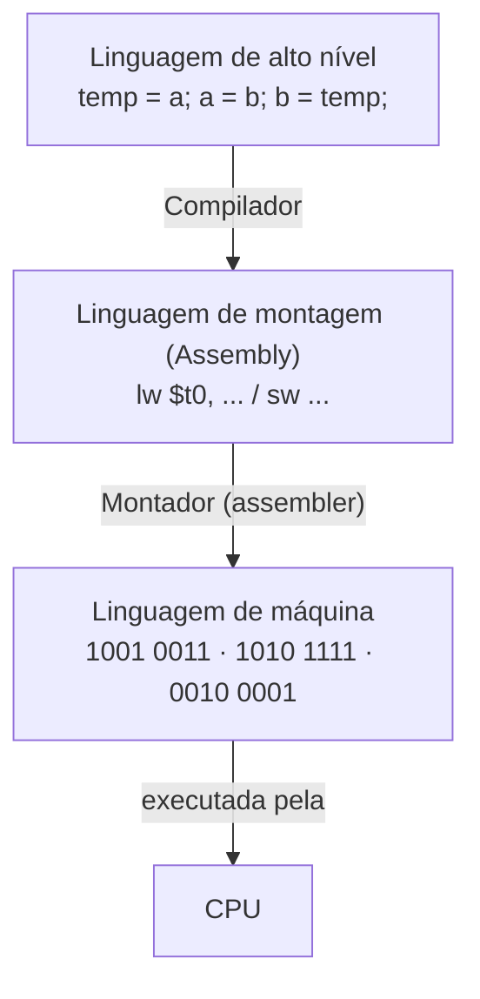
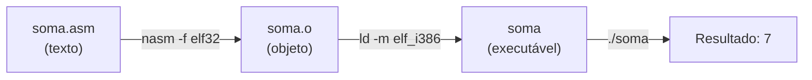
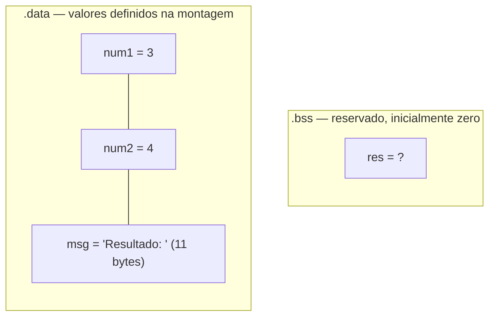
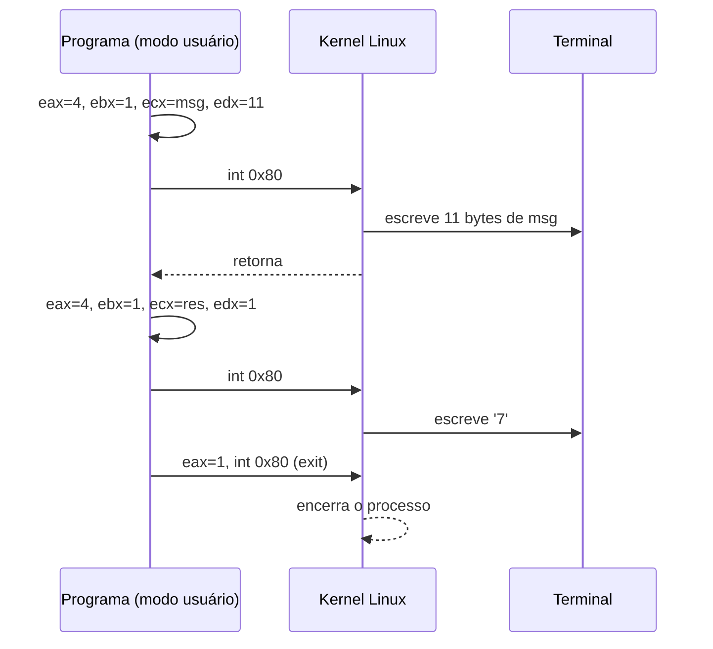

<!--META
{
  "title": "Funcionamento de um Computador e Linguagem Assembly",
  "header": "Assembly: Soma e Subtração",
  "tema": "Níveis de linguagem (alto nível, montagem e máquina), montador e compilador, estrutura de um programa NASM e chamadas de sistema para exibir resultados.",
  "typing": ["Compilador traduz, montador monta", "section .data, .bss e .text", "mov al, [num1] / add al, [num2]", "add al, 48 converte para ASCII", "int 0x80 chama o kernel"],
  "tecnologias": "Assembly x86 (sintaxe Intel), NASM, Linux (chamadas de sistema via <code>int 0x80</code>), OnlineGDB",
  "tipo": "Teoria e prática de programação em baixo nível",
  "professor": "Prof. Dr. Marcus Grilo",
  "badges": [["Linguagem", "Assembly x86", "FF781F"], ["Montador", "NASM", "FF4500"], ["SO", "Linux", "E60000", "linux"]],
  "icons": "linux",
  "icons_alt": "Linux",
  "files": {
    "Aula 03 -Assembly(2).pdf": "Slides “Funcionamento de um computador”: compilador, montador, linguagem de máquina, hierarquia de linguagens, estrutura de um programa NASM, explicação linha a linha do exemplo de soma e exercícios.",
    "Soma.txt": "Código-fonte NASM que soma 3 + 4 e imprime “Resultado: 7”.",
    "Subtração.txt": "Código-fonte NASM que calcula 9 − 5 e imprime “Resultado: 4”."
  }
}
META-->

<br />

<h2 id="visao-geral">Visão geral</h2>

Na [aula anterior](../aula01-13-03-26/README.md), um processador fictício executou instruções como `MOV` e `ADD` sobre registradores `R1`, `R2` e `R3`. Esta aula faz a mesma coisa em um **processador real** da família **x86**, usando o montador **NASM** em Linux.

O conteúdo tem duas partes:

1. **Teoria:** como um programa escrito por humanos chega a ser executado pelo hardware. Os temas são os níveis de linguagem (alto nível → montagem → máquina) e as ferramentas que fazem a tradução (compilador, montador e interpretador).
2. **Prática:** a anatomia completa de um programa Assembly que soma dois números e mostra o resultado na tela. Isso inclui a definição de dados na memória, o uso de registradores, a conversão para ASCII e as **chamadas de sistema** ao kernel do Linux.

Assembly raramente é a linguagem principal de um projeto hoje. Mesmo assim, entendê-lo esclarece o que realmente acontece quando escrevemos `x = a + b`: quais dados vão para registradores, por que o computador precisa de ASCII para exibir texto e como um programa pede ao sistema operacional para escrever na tela.

<br />

<h2 id="objetivos">Objetivos de aprendizagem</h2>

- Explicar a diferença entre **linguagem de alto nível**, **linguagem de montagem** e **linguagem de máquina**.
- Diferenciar **compilador**, **montador** (*assembler*) e **interpretador**.
- Descrever a função das seções `.data`, `.bss` e `.text` de um programa NASM.
- Distinguir **valor** (`[num1]`) de **endereço** (`num1`) em uma instrução.
- Converter um dígito numérico em seu caractere ASCII somando 48.
- Usar as chamadas de sistema `write` (4) e `exit` (1) por meio de `int 0x80`.
- Modificar o programa de exemplo para calcular novas expressões.

<br />

<h2 id="pre-requisitos">Pré-requisitos</h2>

- **Registradores e instruções** como `MOV` e `ADD`, vistos na mini linguagem da [aula 01](../aula01-13-03-26/README.md#5-mini-linguagem-assembly-educacional).
- **Noção de memória como sequência de posições endereçáveis.** Cada byte tem um endereço numérico, e uma variável é apenas um nome para um endereço.
- **Números binários.** O hardware só distingue dois estados, como discutido na aula 01.

<br />

<h2 id="fundamentacao-teorica">Fundamentação teórica</h2>

### 1. O computador como sistema de camadas

O material define o computador como **uma máquina digital que resolve problemas executando um programa**, com o apoio de um sistema operacional.

| Elemento | Papel |
| :--- | :--- |
| **Software** | Conjunto de instruções que descrevem como realizar uma tarefa |
| **Hardware** | Reconhece e executa esse conjunto de instruções |
| **Sistema operacional** | Administra os recursos (hardware, arquivos, programas) e faz a interface entre computador e usuário |

O hardware só entende **sinais elétricos de dois níveis**, ou seja, números binários. Programar diretamente em binário é impraticável. A solução adotada é um **sistema hierárquico de abstrações**: cada nível depende apenas de uma descrição simplificada do nível imediatamente inferior.



*Figura 1 — Hierarquia de linguagens apresentada no material. O exemplo de alto nível troca os valores de `a` e `b` usando uma variável temporária.*

### 2. Tradutores: compilador, montador e interpretador

| Ferramenta | Entrada | Saída | Característica principal |
| :--- | :--- | :--- | :--- |
| **Compilador** | Código de alto nível (C, Java...) | Código executável ou de montagem | Lógica complexa; aplica otimizações para acelerar o programa e reduzir requisitos |
| **Montador** (*assembler*) | Código Assembly | Arquivo objeto (código de máquina) | Tradução **um para um**: cada instrução Assembly vira uma instrução de máquina |
| **Interpretador** | Código de alto nível | Execução direta | Converte e executa durante a execução, sem gerar um executável prévio |

O ponto central é a relação **um para um** do montador. `MOV AX, 1` corresponde a exatamente uma instrução binária. Já uma única linha de C, como `x = a * b + c`, pode gerar várias instruções.

O resultado da montagem é um **arquivo objeto**. Ele ainda precisa ser **ligado** (*linked*) a outras bibliotecas para formar o executável. No Linux, essa etapa é feita pelo `ld`.



*Figura 2 — Pipeline de montagem e ligação de um programa NASM de 32 bits no Linux.*

### 3. Linguagem de máquina

É a linguagem de **nível mais baixo**: sequências de bits interpretadas diretamente pela CPU. O material lista vantagens e desvantagens:

- **Vantagens:** controle máximo do hardware e execução eficiente.
- **Desvantagens:** difícil de escrever, entender e modificar.

Cada família de processadores (x86, ARM, MIPS) tem sua **própria** linguagem de máquina e, por consequência, seu próprio "dialeto" de Assembly. Um programa Assembly escrito para x86 não roda em um processador ARM.

### 4. Assembly e registradores

**Assembly** é uma linguagem de baixo nível composta por **mnemônicos**: palavras curtas e legíveis que correspondem diretamente a instruções de máquina. `MOV AX, 1` significa "mova o valor 1 para o registrador AX".

Os registradores x86 usados nesta aula têm nomes que indicam o tamanho:

| 32 bits | 16 bits | 8 bits (parte baixa) | Uso no exemplo |
| :---: | :---: | :---: | :--- |
| `EAX` | `AX` | `AL` | `AL` guarda a soma; `EAX` recebe o número da chamada de sistema |
| `EBX` | `BX` | `BL` | 1º argumento da chamada (descritor de arquivo) |
| `ECX` | `CX` | `CL` | 2º argumento (endereço do texto) |
| `EDX` | `DX` | `DL` | 3º argumento (tamanho em bytes) |

`AL` é a parte mais baixa de `EAX`. Escrever em `AL` altera apenas os 8 bits menos significativos de `EAX`.

### 5. Estrutura de um programa NASM

Todo programa da aula tem **três seções**:

| Seção | Conteúdo | Exemplo |
| :--- | :--- | :--- |
| `.data` | Dados **inicializados** (já têm valor) | `num1 db 3` |
| `.bss` | Espaço **reservado** sem valor inicial | `res resb 1` |
| `.text` | **Instruções** executáveis | `mov al, [num1]` |

#### 5.1 Diretivas de dados

- `num1 db 3` — *define byte*: cria 1 byte com valor 3 e chama seu endereço de `num1`.
- `msg db "Resultado: "` — cria uma sequência de bytes, um por caractere, em **ASCII**.
- `tam equ $-msg` — `$` é a posição atual do montador. Logo depois da string, `$ − msg` é o número de bytes da mensagem: **11** (`R e s u l t a d o :` mais o espaço). `equ` cria uma **constante de montagem**, que não ocupa memória.
- `res resb 1` — *reserve byte*: reserva 1 byte em `.bss` para o resultado.



*Figura 3 — Organização da memória do programa de soma.*

#### 5.2 Ponto de entrada

```nasm
global _start      ; torna o rótulo visível ao ligador
_start:            ; a execução começa aqui
```

`global _start` informa ao ligador e ao sistema operacional onde o programa começa.

#### 5.3 Valor ou endereço: o papel dos colchetes

| Instrução | Significado |
| :--- | :--- |
| `mov al, [num1]` | Copia para `AL` o **valor** armazenado no endereço `num1` (3) |
| `mov ecx, num1` | Copia para `ECX` o **endereço** de `num1` (por exemplo, 1000) |

Os colchetes indicam **acesso à memória**: "o conteúdo do endereço". Essa distinção é a mesma que existe entre um ponteiro e o valor apontado em C.

#### 5.4 Conversão para ASCII

Depois de `add al, [num2]`, `AL` contém o **número** 7 (`00000111`). Mas o terminal exibe **caracteres**, e o caractere `'7'` tem código ASCII **55**. Os dígitos `'0'` a `'9'` ocupam os códigos 48 a 57, em sequência. Por isso:

$$\text{caractere} = \text{dígito} + 48 \qquad 7 + 48 = 55 = \texttt{'7'}$$

> [!WARNING]
> Essa conversão só funciona para **um único dígito (0 a 9)**. Para 12, `12 + 48 = 60`, que é o caractere `<`. Números de dois dígitos exigem separar dezena e unidade, técnica vista na [aula 03](../aula03-27-03-26/README.md).

#### 5.5 Chamadas de sistema (*syscalls*)

Um programa comum não acessa a tela diretamente: ele **pede ao kernel**. No Linux 32 bits, isso é feito com a interrupção `int 0x80`, depois de colocar os parâmetros nos registradores:

| Registrador | `write` | `exit` |
| :--- | :--- | :--- |
| `EAX` | `4` (número da syscall) | `1` |
| `EBX` | `1` = saída padrão (*stdout*) | código de saída |
| `ECX` | endereço do texto | — |
| `EDX` | número de bytes | — |



*Figura 4 — Fluxo `programa → kernel → hardware` das três chamadas de sistema do exemplo.*

<br />

<h2 id="exemplos-praticos">Exemplos práticos</h2>

### Exemplo básico — o programa de soma do material

O arquivo [`Soma.txt`](Soma.txt) contém o programa completo. A tabela rastreia as instruções de cálculo:

| Instrução | `AL` depois | Comentário |
| :--- | :---: | :--- |
| `mov al, [num1]` | 3 | carrega o valor de `num1` |
| `add al, [num2]` | 7 | `AL ← AL + num2` |
| `add al, 48` | 55 | 55 é o código de `'7'` |
| `mov [res], al` | 55 | grava o caractere na memória |

Saída obtida ao montar e executar o arquivo original com `nasm -f elf32` e `ld -m elf_i386`:

```text
Resultado: 7
```

O programa de [`Subtração.txt`](Subtra%C3%A7%C3%A3o.txt) é idêntico, com duas mudanças: os valores (`num1 db 9`, `num2 db 5`) e a instrução `sub al, [num2]`. A saída obtida é `Resultado: 4`.

> [!NOTE]
> **Observação de execução.** Os dois programas originais terminam com `mov eax,1` e `int 0x80` sem definir `EBX`. Como `EBX` ainda vale 1 da última chamada `write`, o processo termina com **código de saída 1**, que por convenção indica erro. Isso foi confirmado ao executar os arquivos (`echo $?` retorna 1). A saída na tela não é afetada. Para indicar sucesso, basta incluir `mov ebx, 0` antes do `int 0x80` final, como nas soluções abaixo.

### Exemplo intermediário — conferindo os números do programa em Python

Duas contas do programa podem ser verificadas em Python: o tamanho calculado por `$-msg` e a conversão ASCII.

```python
msg = "Resultado: "
print("tam =", len(msg.encode("ascii")))      # equivalente a: tam equ $-msg

for digito in (3, 4, 7):
    codigo = digito + 48                       # equivalente a: add al, 48
    print(digito, "->", codigo, "->", repr(chr(codigo)))

print("12 + 48 =", 12 + 48, "->", repr(chr(12 + 48)))
```

Saída esperada:

```text
tam = 11
3 -> 51 -> '3'
4 -> 52 -> '4'
7 -> 55 -> '7'
12 + 48 = 60 -> '<'
```

A última linha mostra concretamente o limite da técnica: um valor de dois dígitos produz um símbolo, e não o número.

### Exemplo aplicado — subtração com resultado validado

Em um sistema real, um resultado negativo exibido como um único caractere seria um problema sério. Se `num1 = 3` e `num2 = 5`, `AL` passa a valer `−2`, que em 8 bits é `11111110` (254). Somar 48 resulta em 302, que excede 8 bits e fica 46: o caractere `.`.

Em Python, o mesmo efeito aparece ao limitar o valor a 8 bits com a máscara `& 0xFF`:

```python
al = (3 - 5) & 0xFF            # registrador de 8 bits
print("AL =", al, "=", format(al, "08b"))
al = (al + 48) & 0xFF
print("AL + 48 =", al, "->", repr(chr(al)))
```

Saída esperada:

```text
AL = 254 = 11111110
AL + 48 = 46 -> '.'
```

**Lição:** o processador não "sabe" que o resultado deveria ser negativo. Ele opera sobre bits, e a interpretação (com sinal, sem sinal ou caractere) é responsabilidade do programador. A representação de negativos em complemento de dois aparece nas aulas de representação de dados.

<br />

<h2 id="exercicios-resolvidos">Exercícios e resoluções comentadas</h2>

O material propõe modificar o programa de soma para calcular:

- **Exercício 1:** `2 + 6`
- **Exercício 2:** `(4 + 3) − 2`

**Conhecimento avaliado:** estrutura das seções, uso de `[ ]` para ler valores da memória, instruções `add` e `sub` e conversão para ASCII.

> [!NOTE]
> As soluções abaixo são **propostas para estudo**, e não o gabarito oficial. Ambas foram montadas com NASM e executadas em Linux, e a saída mostrada é a obtida na execução.

### Exercício 1 — `2 + 6`

**Raciocínio:** basta trocar os valores de `num1` e `num2`. Como 2 + 6 = 8 tem um único dígito, a conversão `+ 48` continua válida.

```nasm
section .data
    num1 db 2
    num2 db 6
    msg  db "Resultado: "
    tam  equ $-msg

section .bss
    res resb 1

section .text
    global _start

_start:
    mov al, [num1]      ; AL = 2
    add al, [num2]      ; AL = 8
    add al, 48          ; AL = '8' (56 em ASCII)
    mov [res], al

    mov eax, 4          ; write(1, msg, tam)
    mov ebx, 1
    mov ecx, msg
    mov edx, tam
    int 0x80

    mov eax, 4          ; write(1, res, 1)
    mov ebx, 1
    mov ecx, res
    mov edx, 1
    int 0x80

    mov eax, 1          ; exit(0)
    mov ebx, 0
    int 0x80
```

Saída esperada:

```text
Resultado: 8
```

### Exercício 2 — `(4 + 3) − 2`

**Raciocínio:** são necessários três valores. Cria-se `num3` e encadeiam-se as operações sobre `AL`, respeitando o parêntese: primeiro a soma, depois a subtração.

```nasm
section .data
    num1 db 4
    num2 db 3
    num3 db 2
    msg  db "Resultado: "
    tam  equ $-msg

section .bss
    res resb 1

section .text
    global _start

_start:
    mov al, [num1]      ; AL = 4
    add al, [num2]      ; AL = 7   (parêntese primeiro)
    sub al, [num3]      ; AL = 5
    add al, 48          ; AL = '5'
    mov [res], al

    mov eax, 4
    mov ebx, 1
    mov ecx, msg
    mov edx, tam
    int 0x80

    mov eax, 4
    mov ebx, 1
    mov ecx, res
    mov edx, 1
    int 0x80

    mov eax, 1
    mov ebx, 0
    int 0x80
```

Saída esperada:

```text
Resultado: 5
```

**Como verificar:** no OnlineGDB, recomendado pelo material, selecione a linguagem *Assembly* com o montador NASM e execute. Em um Linux x86-64 com NASM instalado, use:

```bash
nasm -f elf32 exercicio.asm -o exercicio.o
ld -m elf_i386 exercicio.o -o exercicio
./exercicio; echo " (código de saída: $?)"
```

**Erros comuns:**

- Escrever `mov al, num1`, sem colchetes. `AL` recebe parte do **endereço**, e o resultado sai incorreto.
- Esquecer `add al, 48`. O terminal recebe o byte 8, um caractere de controle invisível, em vez de `'8'`.
- Calcular um resultado com dois dígitos ou negativo e esperar que a conversão de um caractere funcione.
- Alterar `msg` sem perceber que `tam` é recalculado automaticamente. Isso é uma vantagem de `equ $-msg` sobre escrever `11` manualmente.

<br />

<h2 id="aplicacoes">Aplicações no mercado de trabalho</h2>

- **Sistemas operacionais e drivers:** o mecanismo de *syscall* visto aqui é a fronteira entre programas de usuário e kernel. Toda função `print` de alto nível termina em uma chamada como `write`.
- **Segurança da informação:** análise de *malware*, exploração de vulnerabilidades e engenharia reversa exigem ler Assembly gerado por compiladores.
- **Sistemas embarcados:** rotinas de inicialização (*boot*) e trechos críticos de tempo ainda são escritos em Assembly.
- **Otimização de desempenho:** ferramentas como o *Compiler Explorer* mostram o Assembly gerado por um compilador, permitindo avaliar se um trecho crítico foi bem otimizado.

<br />

<h2 id="boas-praticas">Boas práticas e erros comuns</h2>

| Problema | Alternativa | Motivo |
| :--- | :--- | :--- |
| Tamanho da string escrito à mão (`mov edx, 11`) | `tam equ $-msg` | O montador recalcula se a mensagem mudar |
| `exit` sem definir `EBX` | `mov ebx, 0` antes de `int 0x80` | Código de saída 0 indica sucesso a *scripts* e outros programas |
| Falta de comentários | Comentar o efeito de cada linha (`; AL = 7`) | Assembly não tem nomes descritivos de alto nível |
| Usar `+ 48` para qualquer número | Separar os dígitos antes de converter | A conversão direta só vale para 0 a 9 |

<br />

<h2 id="resumo">Resumo para revisão</h2>

- **Compilador:** alto nível → máquina, com otimizações. **Montador:** Assembly → máquina, **um para um**. **Interpretador:** traduz e executa durante a execução.
- **Assembly:** mnemônicos ligados a uma arquitetura específica (x86, ARM, MIPS).
- **Seções:** `.data` guarda dados inicializados, `.bss` guarda espaço reservado e `.text` guarda o código. **Entrada:** `global _start` e `_start:`.
- **Diretivas:** `db` define bytes; `resb` reserva bytes; `equ` cria uma constante; `$-msg` calcula o tamanho da string.
- **`[x]` = valor na memória**; **`x` = endereço**.
- **ASCII:** dígitos de `'0'` a `'9'` correspondem aos códigos 48 a 57, então caractere = dígito + 48.
- **Syscall:** `EAX` = número (4 para `write`, 1 para `exit`); `EBX`, `ECX` e `EDX` = argumentos; `int 0x80` chama o kernel.

<br />

<h2 id="questoes">Questões de fixação</h2>

1. Por que se diz que a tradução feita por um montador é "um para um", enquanto a de um compilador não é?
2. Qual é a diferença entre `mov al, [num1]` e `mov ecx, num1`? Por que a chamada `write` usa a segunda forma?
3. Se a mensagem fosse alterada para `"Soma = "`, quanto valeria `tam`? Seria preciso alterar alguma outra linha?
4. O que seria exibido se a instrução `add al, 48` fosse removida do programa de soma?
5. Por que um programa não escreve diretamente na tela, e sim por meio de `int 0x80`?

<details>
<summary><strong>Respostas comentadas</strong></summary>

1. Cada mnemônico Assembly corresponde a exatamente uma instrução de máquina, então o montador apenas codifica. Uma linha de alto nível, como `x = a * b + c`, exige várias instruções, e o compilador ainda decide a ordem, os registradores e as otimizações.
2. A primeira lê o **conteúdo** da memória (o número 3). A segunda carrega o **endereço** onde o dado está. `write` precisa saber **onde** estão os bytes a escrever, por isso recebe o endereço em `ECX`.
3. `"Soma = "` tem 7 caracteres, então `tam = 7`. Nenhuma outra linha muda, porque `tam` é recalculado pela expressão `$-msg`.
4. Seria enviado o byte 7, que em ASCII é o caractere de controle BEL (sinal sonoro), e não o dígito `'7'`. Na prática, nada visível apareceria depois de "Resultado: ".
5. Porque o acesso a dispositivos é privilégio do **sistema operacional**: ele isola os processos e controla o hardware. A interrupção transfere o controle ao kernel, que executa a operação em nome do programa.

</details>

<br />

<h2 id="referencias">Referências e materiais complementares</h2>

- [NASM — The Netwide Assembler: documentação oficial](https://www.nasm.us/docs.php)
- [Linux man-pages: `write(2)`](https://man7.org/linux/man-pages/man2/write.2.html) e [`_exit(2)`](https://man7.org/linux/man-pages/man2/_exit.2.html)
- [OnlineGDB](https://www.onlinegdb.com), ferramenta recomendada no material
- Bibliografia da disciplina: STALLINGS, *Organização e Arquitetura de Computadores*; PATTERSON e HENNESSY, *Organização e Projeto de Computadores*; TANENBAUM, *Arquitetura de Computadores*. Veja a [aula 01](../aula01-13-03-26/README.md#referencias).

**Materiais da pasta:** [slides](Aula%2003%20-Assembly%282%29.pdf) · [`Soma.txt`](Soma.txt) · [`Subtração.txt`](Subtra%C3%A7%C3%A3o.txt)
