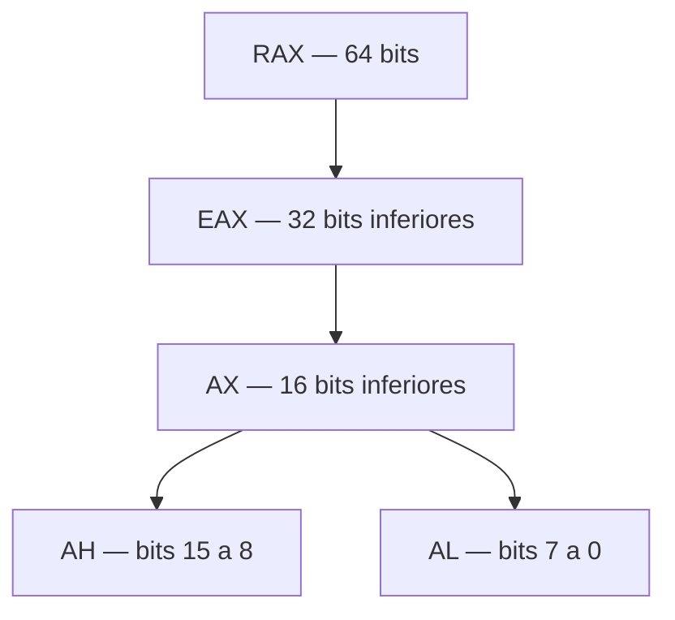
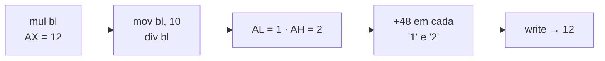

<!--META
{
  "title": "Arquitetura x86-64, CPU e as instruções MUL e DIV",
  "header": "Assembly: MUL e DIV",
  "tema": "O que uma arquitetura de processador define, registradores x86-64, componentes da CPU (unidade de controle, ULA e registradores) e o uso implícito de AX nas instruções MUL e DIV.",
  "typing": ["x86-64: família 8086 com registradores de 64 bits", "CPU = Controle + ULA + Registradores", "mul bl calcula AX = AL x BL", "div bl: AL = quociente, AH = resto"],
  "tecnologias": "Assembly x86 (sintaxe Intel), NASM, Linux",
  "tipo": "Teoria de arquitetura e prática em Assembly",
  "professor": "Prof. Dr. Marcus Grilo",
  "badges": [["Linguagem", "Assembly x86", "FF781F"], ["Montador", "NASM", "FF4500"], ["Tópico", "MUL · DIV", "E60000"]],
  "icons": "linux",
  "icons_alt": "Linux",
  "files": {
    "Aula 04 -Multi_e_DiV_Assembly.pdf": "Slides “Código Assembly”: arquitetura x86-64, registradores, componentes da CPU, funcionamento das instruções DIV e MUL, comparação entre operações e atividades.",
    "Divisão.txt": "Código-fonte NASM que calcula 9 ÷ 2 e imprime quociente e resto.",
    "Multiplicação.txt": "Código-fonte NASM que calcula 4 × 3 = 12 e imprime os dois dígitos separados com DIV por 10."
  }
}
META-->

<br />

<h2 id="visao-geral">Visão geral</h2>

As aulas anteriores trabalharam com `MOV`, `ADD` e `SUB`. Essas instruções têm uma propriedade simples: o resultado cabe no mesmo tamanho dos operandos e vai para o registrador indicado.

**Multiplicação e divisão quebram essa simetria:**

- O produto de dois números de 8 bits pode ter até **16 bits**: 255 × 255 = 65 025.
- A divisão produz **dois resultados**: quociente e resto.

A arquitetura x86 resolve isso usando registradores **implícitos**. `MUL` e `DIV` sempre trabalham com `AX`, mesmo que `AX` não apareça no código.

A aula também amplia a visão de arquitetura. Ela mostra o que significa **x86-64**, o que uma arquitetura define (registradores, instruções, formatos e endereçamento) e como a CPU se organiza internamente em **unidade de controle**, **ULA** e **registradores**.

<br />

<h2 id="objetivos">Objetivos de aprendizagem</h2>

- Explicar a origem do nome **x86-64** e o que muda com registradores de 64 bits.
- Listar os elementos que uma **arquitetura de processador** define.
- Descrever o papel da **unidade de controle**, da **ULA** e dos **registradores**.
- Prever o conteúdo de `AL`, `AH` e `AX` depois de `MUL` e `DIV` com operandos de 8 bits.
- Separar um número de dois dígitos em dezena e unidade usando `DIV` por 10.
- Escrever programas que multiplicam, dividem e exibem resultados de até dois dígitos.

<br />

<h2 id="pre-requisitos">Pré-requisitos</h2>

- Estrutura de um programa NASM, conversão ASCII (+48) e chamadas `write` e `exit`, da [aula 02](../aula02-20-03-26/README.md).
- Noção de **bit, byte e potência de 2**: 8 bits representam de 0 a 255; 16 bits, de 0 a 65 535.
- **Divisão inteira** com quociente e resto: 17 = 10 × 1 + 7.

<br />

<h2 id="fundamentacao-teorica">Fundamentação teórica</h2>

### 1. O que significa x86-64

- **x86** é a família de processadores que começou com o **Intel 8086 (1978)** e continuou com o 80286, 80386, 80486 e Pentium. Como os primeiros nomes terminavam em "86", a família herdou o nome.
- **64** indica **registradores de 64 bits**. Isso permite manipular números maiores, endereçar muito mais memória RAM e executar programas mais complexos.

Segundo o material, a extensão de 64 bits foi criada pela **AMD** no início dos anos 2000, com o nome AMD64, e depois adotada pela Intel. Hoje os dois fabricantes usam essencialmente a mesma arquitetura.

A família manteve **compatibilidade retroativa**. Por isso um processador x86-64 ainda executa os programas de 32 bits (`int 0x80`, registradores `E*`) usados nesta disciplina.

### 2. O que uma arquitetura define

| Elemento | Descrição |
| :--- | :--- |
| Registradores | Pequenas memórias dentro da CPU |
| Instruções | Operações que o processador executa |
| Formato de dados | Como os números são armazenados |
| Endereçamento de memória | Como a memória é acessada |
| Modos de operação | Como o processador executa programas |

A arquitetura é o **contrato** entre hardware e software. Qualquer processador que o cumpra executa os mesmos programas, mesmo com circuitos internos diferentes. A forma como o contrato é implementado internamente é chamada de **organização** ou microarquitetura.

### 3. Registradores x86-64

| Registrador | Função tradicional |
| :--- | :--- |
| `RAX` | Acumulador |
| `RBX` | Base |
| `RCX` | Contador |
| `RDX` | Dados auxiliares |
| `RSP` | Ponteiro da pilha (*stack pointer*) |
| `RBP` | Base da pilha |
| `RIP` | Ponteiro de instrução (endereço da próxima instrução) |

Cada registrador de uso geral pode ser acessado em tamanhos menores. A sobreposição é fundamental para entender `MUL` e `DIV`:



*Figura 1 — Subdivisões de `RAX`. `AX` é formado pela concatenação `AH:AL`, e alterar `AL` ou `AH` altera `AX`.*

$$AX = AH \times 256 + AL$$

### 4. Componentes da CPU

O material resume a CPU como **Unidade de Controle + ULA + Registradores**.

| Componente | Responsabilidade |
| :--- | :--- |
| **Registradores** | Guardam operandos, resultados e dados temporários dentro da CPU, com acesso ultrarrápido |
| **ULA** (Unidade Lógica e Aritmética) | Realiza cálculos (soma, subtração, multiplicação) e operações lógicas (AND, OR) |
| **Unidade de Controle** | Lê a instrução, decodifica (entende se é `mov` ou `add`), manda a ULA executar e decide qual é a próxima instrução |

Para `mov eax, 5` · `mov ebx, 3` · `add eax, ebx`, o material descreve a sequência:

1. O controle lê a instrução.
2. Os registradores recebem os valores.
3. A ULA faz a soma.
4. O resultado volta para `EAX`.


*Figura 2 — Fluxo completo: memória → CPU → registradores → ULA → registradores → saída.*

### 5. A instrução `MUL` (8 bits)

```nasm
mul bl        ; AX = AL × BL
```

- `mul bl` **não** significa `BL × BL`. O outro fator é sempre `AL`, implícito.
- O resultado vai para `AX` (16 bits), porque o produto pode passar de 255.

| Exemplo | `AL` | `BL` | `AX` depois | `AH` | `AL` |
| :--- | :---: | :---: | :---: | :---: | :---: |
| 4 × 3 | 4 | 3 | 12 | 0 | 12 |
| 5 × 4 | 5 | 4 | 20 | 0 | 20 |
| 20 × 20 | 20 | 20 | 400 | 1 | 144 |

No último caso, $400 = 1 \times 256 + 144$, então `AH = 1` e `AL = 144`. Quem lesse apenas `AL` obteria 144, um resultado errado.

### 6. A instrução `DIV` (divisor de 8 bits)

```nasm
div bl        ; AL = AX ÷ BL (quociente) ; AH = AX mod BL (resto)
```

- O **dividendo é sempre `AX`**, os 16 bits inteiros.
- O quociente vai para `AL` e o resto vai para `AH`.

| Exemplo | `AX` antes | `BL` | `AL` (quociente) | `AH` (resto) |
| :--- | :---: | :---: | :---: | :---: |
| 17 ÷ 10 | 17 | 10 | 1 | 7 |
| 9 ÷ 2 | 9 | 2 | 4 | 1 |
| 20 ÷ 3 | 20 | 3 | 6 | 2 |

> [!IMPORTANT]
> **`AH` precisa estar correto antes do `DIV`.** O material destaca que o programador "só colocou valor em `AL`". A CPU, porém, divide `AX` inteiro. Se `AH` contiver lixo, o dividendo será outro número.
>
> Pior: se o quociente não couber em 8 bits, o processador gera uma **exceção de divisão** e o programa é encerrado. Isso acontece, por exemplo, com `AH = 5`, `AL = 0` e `BL = 2`, porque 1280 ÷ 2 = 640. Por isso, use `mov ah, 0` ou `mov ax, valor` antes de dividir.

### 7. Comparação

| Operação | Entrada | Saída |
| :--- | :--- | :--- |
| Soma (`add al, bl`) | `AL`, `BL` | `AL` |
| Multiplicação (`mul bl`) | `AL`, `BL` | `AX` |
| Divisão (`div bl`) | `AX`, `BL` | `AL` (quociente) + `AH` (resto) |

### 8. Técnica: imprimir dois dígitos com `DIV` por 10

Como a conversão `+ 48` só funciona para um dígito, um número entre 10 e 99 precisa ser **separado**:

$$n = 10 \times \text{dezena} + \text{unidade} \;\Rightarrow\; n \div 10 \to AL = \text{dezena},\; AH = \text{unidade}$$

É exatamente o que faz [`Multiplicação.txt`](Multiplica%C3%A7%C3%A3o.txt): calcula `AX = 12`, divide por 10 e imprime `'1'` e `'2'`.



*Figura 3 — Pipeline de exibição de um resultado de dois dígitos.*

<br />

<h2 id="exemplos-praticos">Exemplos práticos</h2>

### Exemplo básico — simulando `MUL` e `DIV` em Python

O simulador abaixo reproduz as regras de 8 e 16 bits e confere todas as tabelas da seção teórica.

```python
def mul8(al, bl):
    ax = (al * bl) & 0xFFFF
    return ax, ax >> 8, ax & 0xFF            # AX, AH, AL

def div8(ax, bl):
    q, r = divmod(ax, bl)
    if q > 0xFF:
        raise OverflowError("quociente não cabe em AL: exceção de divisão")
    return q, r                              # AL, AH

for al, bl in [(4, 3), (5, 4), (20, 20)]:
    ax, ah, al_ = mul8(al, bl)
    print(f"mul: {al} x {bl} -> AX={ax}  AH={ah}  AL={al_}")

for ax, bl in [(17, 10), (9, 2), (20, 3)]:
    q, r = div8(ax, bl)
    print(f"div: {ax} / {bl} -> AL={q}  AH={r}")

try:
    div8((5 << 8) | 0, 2)                    # AH = 5 por descuido, AL = 0
except OverflowError as e:
    print("div: AX=1280 / 2 ->", e)
```

Saída esperada:

```text
mul: 4 x 3 -> AX=12  AH=0  AL=12
mul: 5 x 4 -> AX=20  AH=0  AL=20
mul: 20 x 20 -> AX=400  AH=1  AL=144
div: 17 / 10 -> AL=1  AH=7
div: 9 / 2 -> AL=4  AH=1
div: 20 / 3 -> AL=6  AH=2
div: AX=1280 / 2 -> quociente não cabe em AL: exceção de divisão
```

**Leitura do código.** `ax >> 8` extrai o byte alto (`AH`) e `ax & 0xFF` extrai o byte baixo (`AL`). `divmod` devolve quociente e resto, exatamente como `DIV`. O último caso mostra o efeito de um `AH` esquecido.

### Exemplo intermediário — os programas do material

Saídas obtidas ao montar e executar os arquivos originais (`nasm -f elf32` e `ld -m elf_i386`):

| Arquivo | Saída obtida |
| :--- | :--- |
| [`Multiplicação.txt`](Multiplica%C3%A7%C3%A3o.txt) | `Multiplicacao: 12` |
| [`Divisão.txt`](Divis%C3%A3o.txt) | `Divisao: 4`, seguido de um byte de controle (0x01) e `1` |

> [!NOTE]
> **Observações de execução sobre `Divisão.txt`.** Elas não alteram o arquivo original e servem para estudo:
>
> 1. O trecho comentado como `; espaço` usa `mov ecx, esp`. Mas `esp` é o **registrador ponteiro de pilha**, e não um rótulo com o caractere espaço. O programa imprime o primeiro byte do topo da pilha, que no início do processo é o contador de argumentos (`argc = 1`). Por isso aparece o byte 0x01 entre o quociente e o resto. A correção é declarar `esp_ db " "` em `.data` e usar `mov ecx, esp_`.
> 2. O programa faz `mov al, 9` sem zerar `AH`. Ele funciona porque o Linux inicia o processo com os registradores zerados, mas `mov ax, 9` deixa a intenção explícita e segura.
> 3. Como em `Soma.txt`, o `exit` final não define `EBX`, e o código de saída é 1.

### Exemplo aplicado — divisão com quociente e resto rotulados

Em um sistema que calcula, por exemplo, quantas caixas completas cabem em um lote e quantos itens sobram, quociente e resto têm significados distintos e precisam ser exibidos com rótulos. O programa abaixo é a solução do item (b) das atividades e segue esse formato.

```nasm
section .data
    msg  db "8 / 3 = "
    tam  equ $-msg
    msg2 db " resto "
    tam2 equ $-msg2

section .bss
    quo resb 1
    res resb 1

section .text
    global _start

_start:
    mov ax, 8               ; AX = 8 (AH = 0, AL = 8)
    mov bl, 3
    div bl                  ; AL = 2 (quociente), AH = 2 (resto)
    add al, 48
    add ah, 48
    mov [quo], al
    mov [res], ah

    mov eax, 4
    mov ebx, 1
    mov ecx, msg
    mov edx, tam
    int 0x80

    mov eax, 4
    mov ebx, 1
    mov ecx, quo
    mov edx, 1
    int 0x80

    mov eax, 4
    mov ebx, 1
    mov ecx, msg2
    mov edx, tam2
    int 0x80

    mov eax, 4
    mov ebx, 1
    mov ecx, res
    mov edx, 1
    int 0x80

    mov eax, 1
    mov ebx, 0
    int 0x80
```

Saída esperada:

```text
8 / 3 = 2 resto 2
```

<br />

<h2 id="exercicios-resolvidos">Exercícios e resoluções comentadas</h2>

> [!NOTE]
> As soluções são **propostas para estudo**, e não o gabarito oficial. Todos os programas completos foram montados com NASM e executados em Linux, e as saídas mostradas são as obtidas.

### Perguntas feitas nos slides

| Pergunta | Resposta | Raciocínio |
| :--- | :--- | :--- |
| `mov al, 20` · `mov bl, 3` · `div bl`: o que está em `AX` antes? | `AX = 20` | `AH = 0` (supondo registrador zerado) e `AL = 20` |
| Quanto dá 20 ÷ 3? | `AL = 6`, `AH = 2` | 20 = 3 × 6 + 2 |
| `mov al, 5` · `mov bl, 4` · `mul bl`: qual é o resultado e onde fica? | 20, em `AX` | `AH = 0`, `AL = 20` (cabe em 8 bits) |

### Atividade 1 — incremento duplo a partir de 4

**Conhecimento avaliado:** a instrução `INC`, que soma 1 ao operando.

```nasm
section .data
    msg db "Resultado: "
    tam equ $-msg

section .bss
    res resb 1

section .text
    global _start

_start:
    mov al, 4           ; valor inicial
    inc al              ; AL = 5
    inc al              ; AL = 6
    add al, 48          ; '6'
    mov [res], al

    mov eax, 4
    mov ebx, 1
    mov ecx, msg
    mov edx, tam
    int 0x80

    mov eax, 4
    mov ebx, 1
    mov ecx, res
    mov edx, 1
    int 0x80

    mov eax, 1
    mov ebx, 0
    int 0x80
```

Saída esperada:

```text
Resultado: 6
```

### Atividade 2 — cálculos em Assembly

**(a) 5 × 6 = 30.** O produto tem dois dígitos, então é preciso aplicar a técnica da seção 8. Os dois dígitos são gravados em bytes consecutivos (`dig` e `dig+1`) e impressos com uma única chamada `write` de 2 bytes.

```nasm
section .data
    msg db "5 x 6 = "
    tam equ $-msg

section .bss
    dig resb 2              ; dezena e unidade

section .text
    global _start

_start:
    mov al, 5
    mov bl, 6
    mul bl                  ; AX = AL * BL = 30

    mov bl, 10
    div bl                  ; AL = 3 (dezena), AH = 0 (unidade)
    add al, 48
    add ah, 48
    mov [dig], al
    mov [dig+1], ah

    mov eax, 4
    mov ebx, 1
    mov ecx, msg
    mov edx, tam
    int 0x80

    mov eax, 4
    mov ebx, 1
    mov ecx, dig
    mov edx, 2              ; imprime os dois dígitos de uma vez
    int 0x80

    mov eax, 1
    mov ebx, 0
    int 0x80
```

Saída esperada:

```text
5 x 6 = 30
```

**(b) 8 ÷ 3.** É o programa do [exemplo aplicado](#exemplo-aplicado--divisão-com-quociente-e-resto-rotulados). Saída: `8 / 3 = 2 resto 2`.

**(c) 7 × 8 = 56.** Mesmo programa do item (a), trocando a mensagem para `"7 x 8 = "` e os valores para `mov al, 7` e `mov bl, 8`. Depois de `div bl`, `AL = 5` e `AH = 6`. Saída obtida: `7 x 8 = 56`.

**(d) 12 + 7 = 19.** A soma deixa o resultado em `AL`. Antes do `DIV`, é preciso **zerar `AH`**, porque o dividendo é `AX`:

```nasm
section .data
    msg db "12 + 7 = "
    tam equ $-msg

section .bss
    dig resb 2

section .text
    global _start

_start:
    mov al, 12
    add al, 7               ; AL = 19
    mov ah, 0               ; AX = 19 (zera a parte alta antes do DIV)
    mov bl, 10
    div bl                  ; AL = 1 (dezena), AH = 9 (unidade)
    add al, 48
    add ah, 48
    mov [dig], al
    mov [dig+1], ah

    mov eax, 4
    mov ebx, 1
    mov ecx, msg
    mov edx, tam
    int 0x80

    mov eax, 4
    mov ebx, 1
    mov ecx, dig
    mov edx, 2
    int 0x80

    mov eax, 1
    mov ebx, 0
    int 0x80
```

Saída esperada:

```text
12 + 7 = 19
```

**Erros comuns nas atividades:**

- Imprimir `AL + 48` diretamente para 30, 56 ou 19. Para 30, o resultado é o caractere `N` (78).
- Esquecer que `div bl` sobrescreve `AL` e `AH`. Valores ali guardados se perdem.
- Reutilizar `BL` como divisor (10) sem perceber que o valor anterior (o fator da multiplicação) foi descartado. Isso não é problema aqui, mas seria se o fator ainda fosse necessário.

<br />

<h2 id="aplicacoes">Aplicações no mercado de trabalho</h2>

- **Conversão de números em texto:** funções como `printf` e `str()` usam divisões sucessivas por 10, como a técnica da seção 8. Entender isso ajuda a perceber por que formatar números em laços críticos tem custo.
- **Sistemas embarcados:** em microcontroladores sem instrução de divisão, dividir por 10 é caro. Por isso surgem truques como multiplicar por constantes "mágicas".
- **Segurança:** a exceção de divisão e o *overflow* de multiplicação são fontes clássicas de falhas. Validar se um resultado cabe no tipo de destino é uma prática básica de programação segura.
- **Compiladores:** o uso implícito de `AX` em `MUL` e `DIV` restringe a alocação de registradores, e compiladores precisam reservar esses registradores ao gerar código.

<br />

<h2 id="boas-praticas">Boas práticas e erros comuns</h2>

| Problema | Alternativa | Motivo |
| :--- | :--- | :--- |
| `mov al, x` seguido de `div bl` | `mov ax, x` ou `mov ah, 0` antes | O dividendo é `AX` inteiro |
| Ler apenas `AL` depois de `mul` | Considerar `AX` (ou testar `AH`) | O produto pode passar de 255 |
| Usar nomes de registradores como rótulos (`mov ecx, esp`) | Declarar um rótulo próprio (`esp_ db " "`) | `esp` é o ponteiro de pilha, e não uma variável |
| Dividir sem checar o divisor | Garantir divisor ≠ 0 e quociente ≤ 255 | Os dois casos geram exceção de divisão |

<br />

<h2 id="resumo">Resumo para revisão</h2>

- **x86-64:** família do 8086 (1978) com registradores de 64 bits, introduzida como AMD64.
- **A arquitetura define:** registradores, instruções, formato de dados, endereçamento e modos de operação.
- **CPU:** a unidade de controle busca, decodifica e comanda; a ULA calcula; os registradores guardam.
- **`RAX ⊃ EAX ⊃ AX = AH:AL`**, com $AX = 256 \cdot AH + AL$.
- **`mul bl`** calcula `AX = AL × BL`, com resultado de 16 bits.
- **`div bl`** divide `AX` por `BL`: `AL` recebe o quociente e `AH` recebe o resto. Zere `AH` antes.
- **Dois dígitos:** divida por 10, some 48 em `AL` e `AH` e imprima os 2 bytes.

<br />

<h2 id="questoes">Questões de fixação</h2>

1. Por que a instrução `mul bl` grava o resultado em `AX`, e não em `AL`?
2. Depois de `mov al, 200` · `mov bl, 2` · `mul bl`, quais são os valores de `AX`, `AH` e `AL`?
3. Um colega escreveu `mov ah, 3` · `mov al, 0` · `mov bl, 2` · `div bl`. O que acontece?
4. Qual a diferença entre arquitetura e organização (microarquitetura) de um processador?
5. Como você imprimiria um resultado de três dígitos, como 400?

<details>
<summary><strong>Respostas comentadas</strong></summary>

1. O produto de dois números de 8 bits pode ter até 16 bits (255 × 255 = 65 025). Se o resultado fosse para `AL`, os bits altos se perderiam.
2. 200 × 2 = 400 = 1 × 256 + 144, então `AX = 400`, `AH = 1` e `AL = 144`.
3. O dividendo é `AX = 3 × 256 + 0 = 768`. O quociente 768 ÷ 2 = 384 não cabe em `AL`, e o processador gera uma **exceção de divisão**, que encerra o programa.
4. A **arquitetura** é o contrato visível ao programador: instruções, registradores e endereçamento. A **organização** é como esse contrato é implementado em circuitos (pipeline, caches, unidades de execução). Processadores AMD e Intel diferentes têm organizações distintas e a mesma arquitetura x86-64.
5. Com divisões sucessivas por 10. Como 400 não cabe em `AL`, é preciso trabalhar com `AX` e um divisor de 16 bits (`div bx` divide `DX:AX`). 400 ÷ 10 dá quociente 40 e resto 0 (unidade); 40 ÷ 10 dá quociente 4 e resto 0 (dezena); o último quociente, 4, é a centena. Os dígitos saem do menos para o mais significativo e precisam ser impressos na ordem inversa.

</details>

<br />

<h2 id="referencias">Referências e materiais complementares</h2>

- [NASM — documentação oficial](https://www.nasm.us/docs.php)
- [Intel® 64 and IA-32 Architectures Software Developer Manuals](https://www.intel.com/content/www/us/en/developer/articles/technical/intel-sdm.html), referência oficial das instruções `MUL` e `DIV`
- Bibliografia da disciplina: STALLINGS (2019); PATTERSON e HENNESSY (2014); TANENBAUM (2016). Veja a [aula 01](../aula01-13-03-26/README.md#referencias).

**Materiais da pasta:** [slides](Aula%2004%20-Multi_e_DiV_Assembly.pdf) · [`Multiplicação.txt`](Multiplica%C3%A7%C3%A3o.txt) · [`Divisão.txt`](Divis%C3%A3o.txt)
