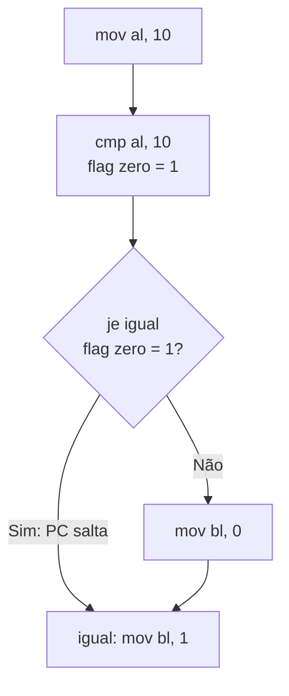

<!--META
{
  "title": "Aspectos Básicos do Projeto de uma CPU Simples",
  "header": "Projeto de uma CPU Simples",
  "tema": "Componentes de uma CPU (barramentos, unidade de controle, banco de registradores, ULA, PC e IR) e operações lógicas AND e OR em Assembly e Python.",
  "typing": ["Barramentos: dados, endereços e controle", "UC: busca, decodifica e executa", "PC aponta a próxima instrução", "AND: 1010 & 1100 = 1000", "OR: 1010 | 1100 = 1110"],
  "tecnologias": "Assembly x86 (NASM), Python 3",
  "tipo": "Teoria de arquitetura e atividade prática em Python",
  "professor": "Prof. Dr. Marcus Grilo",
  "badges": [["Linguagem", "Python", "FF781F", "python"], ["Linguagem", "Assembly x86", "FF4500"], ["Tópico", "CPU · ULA · AND/OR", "E60000"]],
  "icons": "py,linux",
  "icons_alt": "Python, Linux",
  "files": {
    "Atividade em Python OR e AND.pdf": "Enunciados das atividades 1 e 2: programas Python que calculam AND e OR bit a bit e exibem os resultados em binário.",
    "Aula 06 -Aspecto Básico(1).pdf": "Slides “Aspecto básico do projeto de uma CPU simples e linguagem de montagem”: barramentos, unidade de controle, banco de registradores, ULA, contador de programa, arquitetura abstrata e atividade AND/OR.",
    "assets/cpu-simples.svg": "Diagrama original desta documentação: visão abstrata de uma CPU simples e seus barramentos."
  }
}
META-->

<br />

<h2 id="visao-geral">Visão geral</h2>

As aulas de Assembly mostraram **o que** o processador faz: mover, somar, multiplicar e dividir. Esta aula olha **para dentro** da CPU e pergunta quais componentes tornam isso possível.

O material apresenta os componentes básicos de uma CPU:

- **barramentos**, as vias de comunicação;
- **unidade de controle (UC)**, o coordenador;
- **banco de registradores**, o armazenamento ultrarrápido;
- **unidade lógica e aritmética (ULA)**, o executor de cálculos;
- **contador de programa (PC)** e **registrador de instrução (IR)**, que controlam a sequência de execução;
- **memória**, onde ficam instruções e dados.

A parte prática foca em uma família de operações da ULA que costuma passar despercebida: as **operações lógicas bit a bit** `AND` e `OR`. Elas são implementadas em Assembly e em Python. Essas operações são a base de máscaras de bits, permissões de arquivos, sub-redes IP e *flags* de configuração.

<br />

<h2 id="objetivos">Objetivos de aprendizagem</h2>

- Identificar os componentes básicos de uma CPU e a função de cada um.
- Diferenciar barramento de **dados**, de **endereços** e de **controle**, e relacionar a largura de cada um com a capacidade do sistema.
- Descrever as etapas executadas pela unidade de controle: busca, decodificação, execução e armazenamento.
- Explicar o papel do **PC** e como instruções de salto alteram o fluxo do programa.
- Listar as categorias de operações da ULA e o papel das *flags* de status.
- Calcular `AND` e `OR` bit a bit e implementá-los em Assembly e em Python.

<br />

<h2 id="pre-requisitos">Pré-requisitos</h2>

- Registradores x86, ULA e unidade de controle em visão geral, da [aula 03](../aula03-27-03-26/README.md#4-componentes-da-cpu).
- Estrutura de programas NASM e chamada `exit`, da [aula 02](../aula02-20-03-26/README.md).
- **Conversão decimal ↔ binário** para números pequenos: 10 = `1010`, 12 = `1100`.
- Em Python: `input()`, `int()`, `print()` e f-strings.

<br />

<h2 id="fundamentacao-teorica">Fundamentação teórica</h2>

<p align="center">
  
</p>

*Figura 1 — Visão abstrata de uma CPU simples, elaborada para esta documentação a partir dos componentes listados no material.*

### 1. Barramentos

O **barramento** (*bus*) é o sistema de comunicação que permite a troca de informações entre CPU, memória e periféricos. Fisicamente, é um conjunto de trilhas ou linhas elétricas.

O material descreve três **funções**: transportar dados, transmitir endereços e transportar sinais de controle. Cada uma corresponde a um **tipo** de barramento:

| Barramento | Transporta | O que sua largura determina |
| :--- | :--- | :--- |
| **Dados** | Os valores lidos ou gravados | Quantos bits são transferidos de uma só vez (8, 16, 32, 64) |
| **Endereços** | A posição de memória ou o dispositivo acessado | A quantidade máxima de memória endereçável |
| **Controle** | Sinais de leitura, escrita, interrupção e sincronização | Quais operações podem ser coordenadas |

#### Por que 32 bits de endereço equivalem a 4 GB

Cada combinação de bits no barramento de endereços identifica **um byte**. Com $n$ linhas, existem $2^n$ combinações:

$$2^{32} = 4\,294\,967\,296 \text{ bytes} = 4 \text{ GiB}$$

Por isso sistemas de 32 bits ficavam limitados a cerca de 4 GB de RAM endereçável diretamente, um dos motivos da migração para 64 bits, vista na [aula 03](../aula03-27-03-26/README.md).

**Barramentos internos e externos.** O barramento interno (de sistema) liga a CPU à memória; exemplos são o *front-side bus* (FSB) e o barramento de memória. Os externos conectam periféricos; exemplos são PCI, PCI Express e USB.

### 2. Unidade de controle (UC)

A UC **coordena** o processador. Ela não faz cálculos, mas diz a cada componente o que fazer e quando.

| Função | Descrição |
| :--- | :--- |
| Interpretar instruções | Traduz o *opcode* em sinais de controle |
| Gerar sinais de controle | Orienta a ULA, os registradores e a memória |
| Sequenciar operações | Garante que busca, decodificação e execução ocorram na ordem e no momento certos |
| Gerenciar o fluxo de dados | Garante que os operandos estejam disponíveis quando a ULA precisar |

Durante o ciclo de execução, a UC realiza quatro etapas:


*Figura 2 — Etapas do ciclo de instrução coordenadas pela unidade de controle.*

### 3. Banco de registradores

É o conjunto de registradores da CPU. O material destaca três vantagens:

1. **Velocidade**: o acesso é muito mais rápido que o da memória principal.
2. **Redução de latência**: estão dentro da CPU, sem passar pelo barramento.
3. **Eficiência**: operações aritméticas e lógicas trabalham diretamente sobre eles.

Na prática, é por isso que compiladores tentam manter as variáveis mais usadas em registradores, e não na memória.

### 4. Unidade lógica e aritmética (ULA)

| Categoria | Operações |
| :--- | :--- |
| Aritméticas | adição, subtração, multiplicação, divisão, incremento, decremento |
| Lógicas | AND, OR, XOR, NOT |
| Comparação | igualdade, desigualdade, maior que, menor que |
| Deslocamento e rotação | deslocamento lógico, deslocamento aritmético (preserva o sinal), rotação (sem perda de bits) |

**Funcionamento:** a ULA recebe da UC a operação e os operandos (vindos dos registradores), executa a operação, **atualiza as *flags* de status** e o resultado é armazenado em um registrador ou na memória.

As **flags** são bits que descrevem o resultado. Por exemplo, a *flag* zero indica se o resultado foi zero e a *flag* de sinal indica se foi negativo. É assim que a ULA participa das decisões: uma comparação é uma subtração cujo resultado é descartado, e só as *flags* são mantidas.

### 5. Contador de programa (PC) e registrador de instrução (IR)

> "O PC é um registrador que guarda o endereço da próxima instrução que a CPU vai executar." — material da aula

**Analogia do material:** a memória é um livro, as instruções são as linhas e o PC é o **dedo** apontando a próxima linha. O IR guarda a instrução que acabou de ser buscada, enquanto ela é decodificada e executada.

O PC é atualizado automaticamente para a instrução seguinte, mas **nem sempre segue em sequência**:

```nasm
    mov al, 10
    cmp al, 10       ; compara: ULA calcula 10 − 10 e liga a flag zero
    je  igual        ; "jump if equal": se zero, PC ← endereço de 'igual'
    mov bl, 0        ; não executa
igual:
    mov bl, 1
```



*Figura 3 — O salto condicional altera o PC. É esse mecanismo que implementa `if`, `while` e `for` nas linguagens de alto nível.*

### 6. Operações lógicas bit a bit

| A | B | A AND B | A OR B |
| :---: | :---: | :---: | :---: |
| 0 | 0 | 0 | 0 |
| 0 | 1 | 0 | 1 |
| 1 | 0 | 0 | 1 |
| 1 | 1 | 1 | 1 |

- **AND**: o resultado só é 1 se **todos** os bits forem 1.
- **OR**: o resultado é 1 se **pelo menos um** bit for 1.

"Bit a bit" significa que a operação é aplicada **independentemente a cada posição**:

```text
  A = 1010   (10)          A = 1010   (10)
  B = 1100   (12)          B = 1100   (12)
  ----------- AND          ----------- OR
      1000   ( 8)              1110   (14)
```

**No Assembly do material**, `and al, bl` e `or al, bl` fazem a operação bit a bit e o resultado fica **no primeiro operando** (`AL`). **Em Python**, os operadores são `&` (AND) e `|` (OR).

> [!WARNING]
> Não confunda `&` e `|` com `and` e `or` de Python. `10 & 12` vale **8**, porque a operação é feita bit a bit. Já `10 and 12` vale **12**: o operador lógico avalia a veracidade e devolve o último operando avaliado.

<br />

<h2 id="exemplos-praticos">Exemplos práticos</h2>

### Exemplo básico — AND e OR em Python

```python
a, b = 10, 12
print("a      =", format(a, "04b"), a)
print("b      =", format(b, "04b"), b)
print("a & b  =", format(a & b, "04b"), a & b)
print("a | b  =", format(a | b, "04b"), a | b)
print("a and b =", a and b, "(operador lógico, não bit a bit)")
```

Saída esperada:

```text
a      = 1010 10
b      = 1100 12
a & b  = 1000 8
a | b  = 1110 14
a and b = 12 (operador lógico, não bit a bit)
```

`format(x, "04b")` produz a representação binária com pelo menos 4 dígitos, completando com zeros à esquerda.

### Exemplo intermediário — observando o resultado do Assembly

Os programas AND e OR do material terminam com `mov eax, 1` e `int 0x80`. Ao executar `mov eax, 1`, o valor 1 sobrescreve `AL`, que é parte de `EAX`, e **o resultado se perde sem ser exibido**. Uma forma simples de observá-lo é devolvê-lo como **código de saída** do processo:

```nasm
section .text
    global _start

_start:
    mov al, 10          ; 00001010
    mov bl, 12          ; 00001100
    and al, bl          ; resultado em AL

    movzx ebx, al       ; copia AL para EBX (código de saída)
    mov eax, 1          ; syscall exit
    int 0x80
```

Ao montar e executar esse programa, `echo $?` mostrou **8**. Trocando `and` por `or`, mostrou **14**. `movzx` copia um valor de 8 bits para um registrador de 32 bits, preenchendo o restante com zeros.

### Exemplo aplicado — máscaras de bits para permissões

Sistemas reais usam AND e OR para guardar várias opções em um único número. As permissões de arquivos do Linux (`rwx` = 4, 2, 1) funcionam assim:

```python
LER, ESCREVER, EXECUTAR = 0b100, 0b010, 0b001

permissao = LER | ESCREVER                 # OR liga bits
print("permissão:", format(permissao, "03b"))
print("pode ler?", bool(permissao & LER))         # AND testa bits
print("pode executar?", bool(permissao & EXECUTAR))

permissao = permissao | EXECUTAR
print("após conceder execução:", format(permissao, "03b"), "=", permissao)
```

Saída esperada:

```text
permissão: 110
pode ler? True
pode executar? False
após conceder execução: 111 = 7
```

**Padrão profissional:** **OR liga** bits, **AND testa** (ou limpa, com uma máscara invertida). O 7 final corresponde ao `rwx` completo, como em `chmod 755`.

<br />

<h2 id="exercicios-resolvidos">Exercícios e resoluções comentadas</h2>

Enunciados: [`Atividade em Python OR e AND.pdf`](Atividade%20em%20Python%20OR%20e%20AND.pdf).

> [!NOTE]
> As soluções são **propostas para estudo**, e não o gabarito oficial. Ambos os programas foram executados com as entradas mostradas.

### Atividade 1 — AND e OR com exibição em binário

**Enunciado (resumo):** ler dois inteiros, calcular `&` e `|` e exibir os valores digitados, os dois resultados e as representações binárias.

**Conhecimento avaliado:** leitura e conversão de entrada (`int(input())`), operadores bit a bit e formatação binária.

**Raciocínio:** para que as colunas binárias fiquem alinhadas, todas devem ter a mesma largura: a quantidade de bits do maior número, obtida com `int.bit_length()`.

<!-- norun -->
```python
a = int(input("Digite o primeiro número inteiro: "))
b = int(input("Digite o segundo número inteiro: "))

largura = max(a.bit_length(), b.bit_length(), 1)

print(f"\nValores digitados: a = {a}, b = {b}")
print(f"a       = {a:>4}  ->  {a:0{largura}b}")
print(f"b       = {b:>4}  ->  {b:0{largura}b}")
print(f"a AND b = {a & b:>4}  ->  {a & b:0{largura}b}")
print(f"a OR  b = {a | b:>4}  ->  {a | b:0{largura}b}")
```

Execução com as entradas `10` e `12`:

```text
Digite o primeiro número inteiro: 10
Digite o segundo número inteiro: 12

Valores digitados: a = 10, b = 12
a       =   10  ->  1010
b       =   12  ->  1100
a AND b =    8  ->  1000
a OR  b =   14  ->  1110
```

**Como verificar:** confira coluna a coluna com a tabela-verdade da seção 6.

### Atividade 2 — menu de operações

**Enunciado (resumo):** ler dois inteiros, apresentar um menu (`1 - AND`, `2 - OR`), executar a operação escolhida e exibir o resultado em binário.

**Conhecimento avaliado:** estrutura condicional (`if/elif/else`) e validação de entrada.

**Raciocínio:** separar a leitura validada em uma função evita repetir `try/except`. A opção inválida é tratada explicitamente.

<!-- norun -->
```python
def ler_inteiro(mensagem):
    while True:
        try:
            return int(input(mensagem))
        except ValueError:
            print("Entrada inválida. Digite um número inteiro.")


a = ler_inteiro("Primeiro número: ")
b = ler_inteiro("Segundo número: ")

print("\n1 - Operação AND")
print("2 - Operação OR")
opcao = input("Escolha a operação: ").strip()

if opcao == "1":
    nome, resultado = "AND", a & b
elif opcao == "2":
    nome, resultado = "OR", a | b
else:
    nome, resultado = None, None
    print("Opção inválida.")

if nome:
    largura = max(a.bit_length(), b.bit_length(), 1)
    print(f"\n  {a:0{largura}b}  ({a})")
    print(f"{'&' if nome == 'AND' else '|'} {b:0{largura}b}  ({b})")
    print("  " + "-" * largura)
    print(f"  {resultado:0{largura}b}  ({resultado})  <- resultado {nome} em binário")
```

Execução com as entradas `x` (inválida), `6`, `3` e a opção `2`:

```text
Primeiro número: x
Entrada inválida. Digite um número inteiro.
Primeiro número: 6
Segundo número: 3

1 - Operação AND
2 - Operação OR
Escolha a operação: 2

  110  (6)
| 011  (3)
  ---
  111  (7)  <- resultado OR em binário
```

**Erros comuns:**

- Usar `and` e `or` no lugar de `&` e `|`, o que dá resultados diferentes (veja o alerta da seção 6).
- Usar `bin(x)`, que inclui o prefixo `0b` e não alinha as colunas.
- Não tratar letras ou opções fora do menu, o que gera `ValueError` ou silêncio.

**Limitação e melhoria:** para números **negativos**, `format(-5, "b")` produz `-101`, e não a representação em complemento de dois usada pelo hardware. Para simular um registrador de 8 bits, use `format(x & 0xFF, "08b")`, que dá `11111011` para −5.

<br />

<h2 id="aplicacoes">Aplicações no mercado de trabalho</h2>

- **Redes:** o endereço de rede é obtido com `IP AND máscara`. Por exemplo, `192.168.1.77 AND 255.255.255.0` resulta em `192.168.1.0`.
- **Segurança e sistemas operacionais:** permissões Unix, *flags* de abertura de arquivos (`O_RDONLY | O_CREAT`) e *bitmaps* de capacidades.
- **Sistemas embarcados:** ligar e desligar pinos de um microcontrolador escrevendo em registradores com OR e AND, sem alterar os outros bits.
- **Desempenho e dados:** estruturas como *Bloom filters* e *bitsets* armazenam milhões de valores booleanos com operações bit a bit.
- **Hardware e arquitetura:** a largura dos barramentos explica limites reais, como o teto de 4 GB em sistemas de 32 bits.

<br />

<h2 id="boas-praticas">Boas práticas e erros comuns</h2>

| Problemático | Recomendado | Motivo |
| :--- | :--- | :--- |
| `if permissao and LER:` | `if permissao & LER:` | `and` testa a veracidade dos números, e não os bits |
| Números mágicos (`x & 4`) | Constantes nomeadas (`x & LER`) | Legibilidade e manutenção |
| Descartar o resultado no Assembly (`mov eax, 1` logo após `and al, bl`) | Salvar o resultado antes (`movzx ebx, al`) | `AL` faz parte de `EAX` |
| Exibir binário sem largura fixa | `format(x, f"0{n}b")` | Facilita comparar bit a bit |

<br />

<h2 id="resumo">Resumo para revisão</h2>

- **CPU:** UC + banco de registradores + ULA + PC + IR, conectados à memória por barramentos.
- **Barramentos:** dados (largura = bits por transferência), endereços (largura $n$ ⇒ $2^n$ bytes endereçáveis) e controle (leitura, escrita, interrupção, sincronização).
- **UC:** interpreta, gera sinais, sequencia e gerencia o fluxo. Ciclo: busca → decodificação → execução → armazenamento.
- **ULA:** operações aritméticas, lógicas, de comparação e de deslocamento; atualiza as *flags*.
- **PC:** guarda o endereço da próxima instrução; saltos como `je` o alteram. **IR:** guarda a instrução em execução.
- **AND** = 1 só se ambos forem 1; **OR** = 1 se algum for 1. Em Python, `&` e `|`; em NASM, `and` e `or` com resultado no 1º operando.

<br />

<h2 id="questoes">Questões de fixação</h2>

1. Um processador hipotético tem barramento de endereços de 16 bits. Quantos bytes ele endereça diretamente?
2. Por que se diz que a UC "não calcula nada"? Que componente realiza os cálculos?
3. O que aconteceria com o fluxo de um programa se o PC não pudesse ser alterado por instruções de salto?
4. Calcule `13 & 7` e `13 | 7`, mostrando o raciocínio em binário.
5. Como usar AND para descobrir se um número inteiro é par?

<details>
<summary><strong>Respostas comentadas</strong></summary>

1. $2^{16} = 65\,536$ bytes (64 KiB). Cada combinação das 16 linhas identifica um byte.
2. A UC interpreta instruções e gera sinais que coordenam os demais componentes. Os cálculos aritméticos e lógicos são feitos pela **ULA**.
3. O programa só poderia executar instruções em sequência linear. Não haveria decisões (`if`) nem repetições (`while`, `for`), que dependem de saltos condicionais.
4. 13 = `1101` e 7 = `0111`. AND: `0101` = **5**. OR: `1111` = **15**.
5. O bit menos significativo de um número par é 0. Logo, `n & 1 == 0` indica par. Por exemplo, `6 & 1 = 0` (par) e `7 & 1 = 1` (ímpar).

</details>

<br />

<h2 id="referencias">Referências e materiais complementares</h2>

- [Python — Operações bit a bit em tipos inteiros (documentação oficial)](https://docs.python.org/pt-br/3/library/stdtypes.html#bitwise-operations-on-integer-types)
- [Python — `int.bit_length()`](https://docs.python.org/pt-br/3/library/stdtypes.html#int.bit_length)
- [NASM — documentação oficial](https://www.nasm.us/docs.php)
- Bibliografia da disciplina: STALLINGS (2019), capítulos sobre estrutura da CPU e barramentos; PATTERSON e HENNESSY (2014); TANENBAUM (2016). Veja a [aula 01](../aula01-13-03-26/README.md#referencias).

**Materiais da pasta:** [slides](Aula%2006%20-Aspecto%20B%C3%A1sico%281%29.pdf) · [enunciado das atividades](Atividade%20em%20Python%20OR%20e%20AND.pdf)
