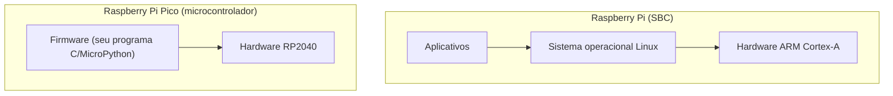
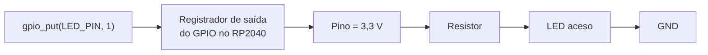
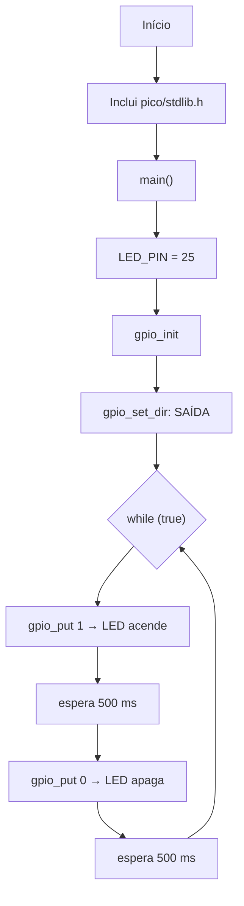
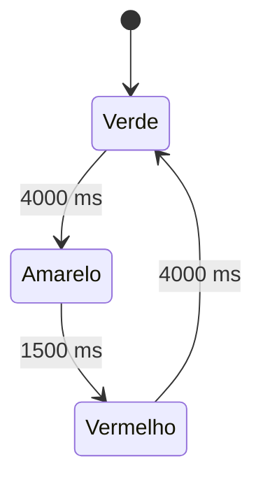

<!--META
{
  "title": "Introdução ao 2º Semestre: Raspberry Pi, Pico e Blink LED em C",
  "header": "Raspberry Pi e Blink LED",
  "tema": "Computadores de placa única (Raspberry Pi), microcontroladores (Raspberry Pi Pico / RP2040), arquitetura de hardware, GPIO e o primeiro programa embarcado em C: piscar um LED.",
  "typing": ["SBC roda Linux; o microcontrolador roda firmware", "RP2040: dual-core ARM Cortex-M0+", "264 KB de RAM e 2 MB de flash", "gpio_put(LED_PIN, 1) envia 3,3 V ao pino"],
  "tecnologias": "Raspberry Pi, Raspberry Pi Pico (RP2040), linguagem C, Pico SDK, simulador Wokwi",
  "tipo": "Apresentação do semestre, teoria de hardware embarcado e prática",
  "professor": "Prof. Dr. Marcus Grilo",
  "badges": [["Linguagem", "C", "FF781F", "c"], ["Placa", "Raspberry Pi Pico", "FF4500", "raspberrypi"], ["Simulador", "Wokwi", "E60000"]],
  "icons": "c,raspberrypi,arduino",
  "icons_alt": "C, Raspberry Pi, Arduino",
  "limitacoes": "Os programas em C foram verificados apenas quanto à sintaxe (compilados com <code>gcc -fsyntax-only</code> e cabeçalhos mínimos que imitam a API do Pico SDK). Eles não foram executados em uma placa nem no Wokwi. Vários slides são imagens; o conteúdo descrito aqui foi lido diretamente dessas imagens.",
  "files": {
    "Aula 00 - Introdu(2).pdf": "Slides de abertura do 2º semestre: avaliação (µChallenges GoodWe), metodologia PBL, arquitetura do Arduino, linhas e versões da Raspberry Pi, características de hardware, Raspberry Pi Pico (RP2040), programa Blink LED em C linha a linha e atividades."
  }
}
META-->

<br />

<h2 id="visao-geral">Visão geral</h2>

O segundo semestre da disciplina começa com uma mudança de ênfase: sai o computador "de mesa" e entra o **hardware embarcado**. A metodologia anunciada é baseada em projetos (*PBL*) e *hands-on*. A avaliação passa a ter **três µChallenges** alinhados ao *GoodWe Solar Intelligence Challenge*; a Global Solution estava "em definição" no material.

A aula responde a três perguntas:

1. **Um Arduino é um computador?** A resposta passa por comparar placas microcontroladoras com computadores completos.
2. **O que é a Raspberry Pi?** São computadores de placa única (*SBC*) e microcontroladores (linha Pico).
3. **Como o software controla o mundo físico?** O primeiro programa embarcado acende e apaga um LED por meio de um **pino GPIO**.

Esse conhecimento liga a teoria do primeiro semestre (registradores, barramentos, memória) a dispositivos reais, os mesmos usados em automação residencial, sensores industriais e inversores solares como os do desafio GoodWe.

<br />

<h2 id="objetivos">Objetivos de aprendizagem</h2>

- Diferenciar um **computador de placa única** (SBC) de um **microcontrolador**.
- Descrever as linhas da Raspberry Pi (principal, Zero, 400 e Pico) e suas finalidades.
- Identificar os componentes de hardware de uma Raspberry Pi: processador ARM, RAM, GPU, GPIO, portas de E/S e armazenamento.
- Citar as características do microcontrolador **RP2040**.
- Explicar, linha a linha, um programa C que pisca um LED, e o que ocorre eletricamente no pino.
- Estender o programa para um LED externo e para um semáforo de três LEDs.

<br />

<h2 id="pre-requisitos">Pré-requisitos</h2>

- Componentes de uma CPU, barramentos e registradores, da [aula 05](../aula05-17-04-26/README.md).
- Noção de **sistema operacional** como gerenciador de recursos, da [aula 02](../aula02-20-03-26/README.md#1-o-computador-como-sistema-de-camadas).
- Lógica de programação: variáveis, laço `while` e funções. A sintaxe de C é explicada ao longo da aula.
- Eletricidade básica: tensão (V) e corrente. Um LED precisa de um **resistor em série** para limitar a corrente.

<br />

<h2 id="fundamentacao-teorica">Fundamentação teórica</h2>

### 1. Arduino é um computador?

O slide de arquitetura do Arduino mostra uma placa organizada em torno de um **núcleo microcontrolador (ATmega)**. Em volta dele ficam a fonte de alimentação, as entradas e saídas digitais e analógicas (PWM), a porta serial e um conversor serial-USB para gravar o programa (*firmware*) a partir do PC.

Ele tem processador, memória e E/S, então é um computador no sentido amplo. Mas é um **sistema dedicado**: executa um único programa gravado na memória *flash*, **sem sistema operacional**. A mesma distinção separa a Raspberry Pi tradicional da Raspberry Pi Pico.

### 2. Computador de placa única × microcontrolador

| Característica | Raspberry Pi (linha principal) | Raspberry Pi Pico |
| :--- | :--- | :--- |
| Categoria | Computador de placa única (SBC) | Microcontrolador |
| Sistema operacional | Sim (Raspberry Pi OS, Ubuntu, Windows 10 IoT Core...) | Não; executa *firmware* diretamente |
| Processador | ARM Cortex-A (por exemplo, Cortex-A53 a 1,4 GHz no slide da Pi 3B) | ARM Cortex-M0+ dual-core até 133 MHz (RP2040) |
| Memória | 512 MB a 8 GB de RAM; armazenamento em cartão microSD | 264 KB de RAM; 2 MB de flash |
| Uso típico | Desktop educacional, servidor, multimídia | Controle de sensores, motores e LEDs em tempo real |



*Figura 1 — No SBC existe uma camada de sistema operacional entre o programa e o hardware. No microcontrolador, o programa controla o hardware diretamente.*

### 3. A família Raspberry Pi

Criada pela **Raspberry Pi Foundation** para popularizar o ensino de programação com computadores de baixo custo. O nome brinca com computadores "frutas" (Apple, Tangerine), e o "Pi" vem de Python.

| Linha | Proposta | Versões citadas no material |
| :--- | :--- | :--- |
| Principal (Model A/B) | Formato de cartão de crédito, com USB, Ethernet, HDMI e GPIO completos | 1 B, 1 B+, 2 B, 3 B, 3 B+, 4 B, 5 |
| Zero | Ultracompacta e de baixíssimo custo, para robótica e portáteis a bateria | 1 Zero, 1 Zero W, 2 Zero W |
| 400 / 500 | Raspberry Pi integrada a um teclado compacto | 400, 500 e 500+ |
| Pico | Placa microcontroladora, concorrente do Arduino | Pico, Pico W, Pico 2, Pico 2 W |

### 4. Arquitetura de hardware da Raspberry Pi

| Componente | Função |
| :--- | :--- |
| **Processador ARM** | O "cérebro", que executa as instruções do SO e dos aplicativos. ARM (*Advanced RISC Machine*) é conhecida pela eficiência energética. A Pi 4 tem quatro núcleos, o que permite executar tarefas em paralelo |
| **Memória RAM** | Memória de curto prazo para dados temporários; mais RAM melhora a multitarefa |
| **GPU** | Gráficos e vídeo: mídia, jogos e interfaces |
| **GPIO** | Pinos programáveis de entrada e saída para LEDs, sensores e motores, o grande diferencial da placa |
| **Portas de E/S** | USB, HDMI (micro HDMI nos modelos recentes, até 4K), Ethernet (até 1 Gbps na Pi 5), Wi-Fi e Bluetooth (a partir da Pi 3) |
| **Armazenamento** | Não há disco: o SO e os dados ficam em um **cartão microSD** |
| **Alimentação** | 5 V por micro-USB ou USB-C, com baixo consumo, adequado a IoT |

**Especificações da Raspberry Pi 3B, conforme o slide:** Broadcom BCM2837B0 (Cortex-A53, ARMv8, 64 bits, 1,4 GHz), 1 GB de SDRAM, slot microSD, alimentação micro USB de 5 V, HDMI, 4 portas USB, 40 pinos GPIO, conector de câmera, Bluetooth Low Energy e Wi-Fi 802.11n.

> [!NOTE]
> ARM é uma arquitetura **RISC** (*Reduced Instruction Set Computer*): instruções simples e de tamanho regular. O x86 estudado no primeiro semestre é uma arquitetura **CISC**. Por isso o Assembly x86 das [aulas 02](../aula02-20-03-26/README.md) e [03](../aula03-27-03-26/README.md) **não roda** em uma Raspberry Pi.

### 5. Raspberry Pi Pico e o microcontrolador RP2040

| Recurso do RP2040 | Valor |
| :--- | :--- |
| Núcleo | ARM Cortex-M0+ **dual-core** |
| Clock | 48 MHz típico; até 133 MHz |
| Memória | 264 KB de RAM; 2 MB de flash na placa |
| GPIO | Até 30 pinos multifuncionais |
| Periféricos | UART, I2C, SPI (comunicação serial), ADC (conversão analógico-digital), PWM, USB 1.1 |
| Programação | C/C++ (Pico SDK) ou MicroPython |

**GPIO multifuncional** significa que o mesmo pino pode servir de saída digital, entrada digital, linha de comunicação serial ou entrada analógica, dependendo de como é configurado por software. O diagrama de pinagem do slide mostra essas funções alternativas para cada pino.

### 6. GPIO: do software à tensão no pino

Um pino configurado como **saída** assume um de dois níveis:

| Valor escrito | Tensão no pino | Efeito no LED (com resistor) |
| :---: | :---: | :--- |
| `1` (alto) | 3,3 V | Passa corrente: o LED acende |
| `0` (baixo) | 0 V (GND) | Sem corrente: o LED apaga |

Segundo o material, cada chamada a `gpio_put()` faz o RP2040 **escrever em registradores internos** que controlam o estado do pino. É a mesma ideia de **E/S mapeada em registradores**: escrever um bit em um registrador muda o mundo físico.



*Figura 2 — Caminho de uma chamada de função até a corrente no LED.*

<br />

<h2 id="exemplos-praticos">Exemplos práticos</h2>

### Exemplo básico — o programa Blink LED do material

O código apresentado nos slides, testado pelo professor no simulador Wokwi:

```c
#include "pico/stdlib.h"   // Biblioteca padrão para GPIO e delay

int main() {
    const uint LED_PIN = 25;   // Define o pino onde o LED está conectado

    gpio_init(LED_PIN);              // Inicializa o pino
    gpio_set_dir(LED_PIN, GPIO_OUT); // Define como saída

    while (true) {               // Loop infinito
        gpio_put(LED_PIN, 1);    // Liga o LED (nível lógico alto = 3,3V)
        sleep_ms(500);           // Aguarda 500 ms
        gpio_put(LED_PIN, 0);    // Desliga o LED (nível lógico baixo = 0V)
        sleep_ms(500);           // Aguarda 500 ms
    }
}
```

| Linha | Elemento | Explicação |
| :--- | :--- | :--- |
| 1 | `#include "pico/stdlib.h"` | Biblioteca do **Pico SDK** com funções de GPIO, temporização e comunicação serial. Sem ela, `gpio_init()`, `gpio_put()` e `sleep_ms()` não existiriam |
| 3 | `int main()` | Ponto de entrada. Depois da inicialização (*boot*), o Pico executa `main()` automaticamente. O `int` indica retorno inteiro, mas aqui não há `return 0;` porque o programa nunca termina |
| 4 | `const uint LED_PIN = 25;` | `uint` é inteiro **sem sinal**, já que números de GPIO nunca são negativos. `const` impede alteração. O nome `LED_PIN` torna o código legível |
| 6 | `gpio_init(LED_PIN)` | Prepara o pino para uso: "vou utilizar este pino" |
| 7 | `gpio_set_dir(LED_PIN, GPIO_OUT)` | Define a direção: **saída**, então a placa fornece 0 V ou 3,3 V. Em `GPIO_IN`, o pino apenas leria um botão ou sensor |
| 9 | `while (true)` | Laço infinito. Como `true` nunca muda, o programa roda para sempre, comportamento típico de microcontroladores |
| 10 | `gpio_put(LED_PIN, 1)` | Escreve o nível lógico **alto** no pino |
| 11 | `sleep_ms(500)` | Pausa de 500 ms (0,5 s). Durante a pausa, o pino continua em nível alto e o LED permanece aceso |
| 12–13 | `gpio_put(..., 0)` e `sleep_ms(500)` | Nível **baixo** e nova pausa |

> [!NOTE]
> O código do slide usa `LED_PIN = 25`, pino ligado ao **LED da própria placa** na Pico original. A explicação seguinte do material usa o **GPIO 28**, típico de um LED externo. Os dois funcionam; o que muda é onde o LED está fisicamente conectado.

**Resultado:** o LED pisca com período de 1 s (frequência de 1 Hz) e ciclo de trabalho de 50%: 500 ms aceso e 500 ms apagado.



*Figura 3 — Fluxograma do programa, equivalente ao apresentado no material.*

### Exemplo intermediário — simulando a temporização em Python

Antes de gravar o *firmware*, é útil validar a lógica de tempo. O programa abaixo simula 3 segundos do Blink e lista os instantes de cada mudança de estado:

```python
PERIODO_MS = 500
eventos, t, estado = [], 0, 0
while t < 3000:
    estado = 1 - estado               # alterna entre 1 e 0, como os dois gpio_put
    eventos.append((t, "aceso" if estado else "apagado"))
    t += PERIODO_MS

for instante, descricao in eventos:
    print(f"t = {instante:4d} ms -> LED {descricao}")
print("frequência =", 1000 / (2 * PERIODO_MS), "Hz")
```

Saída esperada:

```text
t =    0 ms -> LED aceso
t =  500 ms -> LED apagado
t = 1000 ms -> LED aceso
t = 1500 ms -> LED apagado
t = 2000 ms -> LED aceso
t = 2500 ms -> LED apagado
frequência = 1.0 Hz
```

### Exemplo aplicado — LED de status em um dispositivo IoT

Em produtos reais, um LED piscando indica o estado do equipamento: piscar lento significa operando, rápido significa erro. Basta parametrizar o período. É a mesma técnica, aplicada a um inversor solar ou a um roteador. A versão com LED externo no GP28 corresponde à primeira atividade, resolvida abaixo.

<br />

<h2 id="exercicios-resolvidos">Exercícios e resoluções comentadas</h2>

O slide "Agora é com você" propõe duas atividades.

> [!NOTE]
> As soluções são **propostas para estudo**, e não o gabarito oficial. Os códigos C passaram por verificação de sintaxe com `gcc`, mas **não foram executados** em placa ou simulador. Teste no [Wokwi](https://wokwi.com) ou em uma Pico real.

### Atividade 1 — LED externo

**Conhecimento avaliado:** escolha de pino, configuração de GPIO e montagem elétrica.

**Montagem:** GP28 → resistor de 220 Ω a 330 Ω → perna longa do LED (ânodo); perna curta (cátodo) → GND.

```c
#include "pico/stdlib.h"

int main() {
    const uint LED_PIN = 28;          // LED externo no GP28 (com resistor em série)

    gpio_init(LED_PIN);
    gpio_set_dir(LED_PIN, GPIO_OUT);

    while (true) {
        gpio_put(LED_PIN, 1);         // 3,3 V: LED aceso
        sleep_ms(500);
        gpio_put(LED_PIN, 0);         // 0 V: LED apagado
        sleep_ms(500);
    }
}
```

**Como verificar:** no Wokwi, adicione um LED e um resistor ao diagrama, ligue-os ao GP28 e ao GND e execute. O LED deve piscar uma vez por segundo.

### Atividade 2 — semáforo de carro com 3 LEDs

**Raciocínio:** um semáforo é uma **máquina de estados** com a sequência verde → amarelo → vermelho → verde. Em cada estado, **apenas um** LED fica aceso. Uma função `acender_somente()` garante essa regra e evita esquecer um LED aceso.

```c
#include "pico/stdlib.h"

#define LED_VERDE    13
#define LED_AMARELO  14
#define LED_VERMELHO 15

#define TEMPO_VERDE_MS    4000
#define TEMPO_AMARELO_MS  1500
#define TEMPO_VERMELHO_MS 4000

static void configurar_saida(uint pino) {
    gpio_init(pino);
    gpio_set_dir(pino, GPIO_OUT);
    gpio_put(pino, 0);
}

static void acender_somente(uint pino) {
    gpio_put(LED_VERDE, pino == LED_VERDE);
    gpio_put(LED_AMARELO, pino == LED_AMARELO);
    gpio_put(LED_VERMELHO, pino == LED_VERMELHO);
}

int main() {
    configurar_saida(LED_VERDE);
    configurar_saida(LED_AMARELO);
    configurar_saida(LED_VERMELHO);

    while (true) {
        acender_somente(LED_VERDE);
        sleep_ms(TEMPO_VERDE_MS);

        acender_somente(LED_AMARELO);
        sleep_ms(TEMPO_AMARELO_MS);

        acender_somente(LED_VERMELHO);
        sleep_ms(TEMPO_VERMELHO_MS);
    }
}
```



*Figura 4 — Máquina de estados do semáforo proposto.*

**Detalhes da solução:**

- `pino == LED_VERDE` vale 1 ou 0, então cada `gpio_put` liga somente o LED do estado atual.
- Os tempos ficam em constantes nomeadas (`#define`), e ajustá-los não exige procurar números no código.
- Os pinos GP13, GP14 e GP15 foram escolhidos arbitrariamente; qualquer GPIO livre serve, sempre com um resistor por LED.

**Erros comuns:** ligar o LED sem resistor (corrente excessiva pode danificar o LED ou o pino); inverter ânodo e cátodo; esquecer `gpio_set_dir(..., GPIO_OUT)`, deixando o pino como entrada.

**Melhoria:** adicionar um botão de pedestre em um pino `GPIO_IN`. Isso exige substituir os `sleep_ms` longos por verificações periódicas, o primeiro passo em direção a programas **não bloqueantes**.

<br />

<h2 id="aplicacoes">Aplicações no mercado de trabalho</h2>

- **IoT e automação residencial ou industrial:** microcontroladores como o RP2040 leem sensores e acionam relés, motores e LEDs.
- **Energia solar:** o desafio GoodWe do semestre envolve inversores e monitoramento, sistemas embarcados que medem tensão e corrente e comunicam dados.
- **Prototipagem:** SBCs como a Raspberry Pi servem de *gateways* que coletam dados de microcontroladores e os enviam à nuvem.
- **Engenharia de software embarcado:** escrever *firmware* exige pensar em tempo real, consumo de energia e memória de poucos KB, restrições raras no desenvolvimento web.

<br />

<h2 id="boas-praticas">Boas práticas e erros comuns</h2>

| Problemático | Recomendado | Motivo |
| :--- | :--- | :--- |
| `gpio_put(25, 1)` com números soltos | `const uint LED_PIN = 25;` | Legibilidade e alteração em um só lugar |
| LED ligado direto ao pino | Resistor em série (220 Ω a 330 Ω) | Limita a corrente e protege o LED e o pino |
| Esperar `return 0;` em `main()` do firmware | Laço infinito controlado | O firmware não tem para onde "retornar" |
| `sleep_ms` longo quando há entradas a ler | Temporização não bloqueante | Durante o `sleep`, o programa não reage a botões |

<br />

<h2 id="resumo">Resumo para revisão</h2>

- **SBC** (Raspberry Pi) roda sistema operacional (Raspberry Pi OS, baseado em Linux), com armazenamento em microSD. **Microcontrolador** (Pico, Arduino) roda *firmware* dedicado, sem SO.
- **Linhas Raspberry Pi:** principal (Model A/B), Zero, 400/500 e Pico.
- **Hardware da Pi:** CPU ARM (RISC, eficiente), RAM de 512 MB a 8 GB, GPU, GPIO, USB, HDMI, Ethernet, Wi-Fi e Bluetooth, alimentação de 5 V.
- **RP2040:** dual-core Cortex-M0+, 133 MHz, 264 KB de RAM, 2 MB de flash, 30 GPIO, UART, I2C, SPI, ADC, PWM e USB 1.1.
- **Blink:** `gpio_init` → `gpio_set_dir(GPIO_OUT)` → laço com `gpio_put(1)`, `sleep_ms`, `gpio_put(0)`, `sleep_ms`.
- **GPIO alto = 3,3 V; baixo = 0 V.** Escrever no pino significa escrever em um registrador interno.

<br />

<h2 id="questoes">Questões de fixação</h2>

1. Por que a Raspberry Pi Pico não executa o Raspberry Pi OS, mas a Raspberry Pi 4 sim?
2. No programa Blink, o que acontece eletricamente com o pino durante `sleep_ms(500)` após `gpio_put(LED_PIN, 1)`?
3. Por que `uint` é um tipo adequado para `LED_PIN`?
4. Como alterar o Blink para que o LED fique aceso 200 ms e apagado 800 ms? Qual a frequência resultante?
5. O código Assembly x86 da aula 02 pode ser executado na Raspberry Pi? Justifique.

<details>
<summary><strong>Respostas comentadas</strong></summary>

1. A Pico é um microcontrolador com 264 KB de RAM, sem unidade de gerenciamento de memória e sem armazenamento para um SO completo. Ela executa um único programa diretamente. A Pi 4 é um computador completo, com gigabytes de RAM, cartão microSD e processador Cortex-A capaz de rodar Linux.
2. O pino permanece em **3,3 V**, porque o registrador do GPIO mantém o valor escrito. A corrente continua passando e o LED fica aceso. A pausa apenas impede que a próxima instrução seja executada.
3. Números de GPIO nunca são negativos. Um inteiro sem sinal comunica essa intenção e aproveita toda a faixa positiva.
4. Trocar o primeiro `sleep_ms(500)` por `sleep_ms(200)` e o segundo por `sleep_ms(800)`. O período continua 1000 ms, então a frequência permanece **1 Hz**, mas o ciclo de trabalho passa a ser 20%.
5. Não. A Raspberry Pi usa arquitetura **ARM**, com conjunto de instruções e registradores diferentes. Instruções como `mov al, [num1]` e `int 0x80` são específicas do x86.

</details>

<br />

<h2 id="referencias">Referências e materiais complementares</h2>

- [Raspberry Pi — documentação oficial](https://www.raspberrypi.com/documentation/)
- [Raspberry Pi Pico e microcontroladores — documentação oficial](https://www.raspberrypi.com/documentation/microcontrollers/)
- [Pico SDK — documentação da API C](https://www.raspberrypi.com/documentation/pico-sdk/)
- [Wokwi — simulador online de eletrônica](https://wokwi.com)
- [Arduino — documentação oficial](https://docs.arduino.cc/)

**Material da pasta:** [slides da aula](Aula%2000%20-%20Introdu%282%29.pdf)
