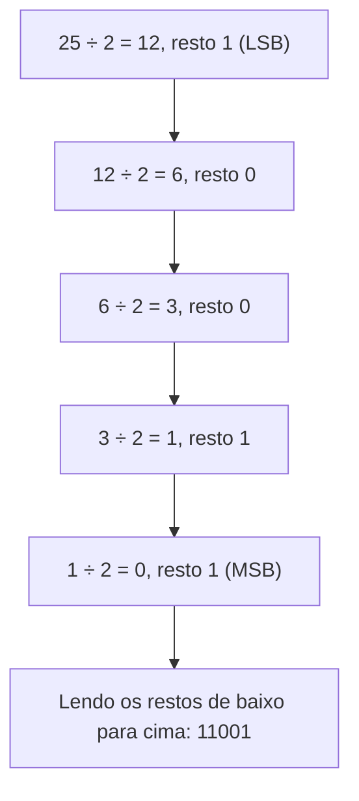

<!--META
{
  "title": "Sistemas de Numeração e Contador Binário com Raspberry Pi Pico",
  "header": "Sistemas de Numeração",
  "tema": "Bases binária, octal, decimal e hexadecimal; conversões por notação posicional e por divisões sucessivas; representação de bits com LEDs em MicroPython.",
  "typing": ["Binário, octal, decimal e hexadecimal", "11011 na base 2 vale 27", "266 = 412 na base 8; 423 = 1A7 na base 16", "13 = 1101 = 0xD em quatro LEDs"],
  "tecnologias": "MicroPython, Raspberry Pi Pico, simulador Wokwi, Python 3",
  "tipo": "Teoria matemática e prática com hardware simulado",
  "professor": "Prof. Dr. Marcus Grilo",
  "badges": [["Linguagem", "MicroPython", "FF781F", "micropython"], ["Placa", "Raspberry Pi Pico", "FF4500", "raspberrypi"], ["Tópico", "Bases numéricas", "E60000"]],
  "icons": "py,raspberrypi",
  "icons_alt": "Python, Raspberry Pi",
  "limitacoes": "O código MicroPython do material e a solução proposta não foram executados em uma Pico real nem no Wokwi. A lógica foi testada em Python 3 com um módulo <code>machine</code> simulado, que apenas registra os valores escritos nos pinos. Os exemplos numéricos dos slides são imagens e foram transcritos e conferidos por cálculo.",
  "files": {
    "Aula 01 - Sistema de numeração(2).pdf": "Slides de sistemas de numeração (tabela de bases, conversões com exemplos resolvidos) e prática com Raspberry Pi Pico e LEDs em MicroPython.",
    "Aula 01 - Código Contador 0 a 15.txt": "Programa MicroPython que conta de 0 a 15, exibe decimal, binário e hexadecimal e acende 4 LEDs (GPIO 2 a 5) conforme os bits."
  }
}
META-->

<br />

<h2 id="visao-geral">Visão geral</h2>

"Para o computador, tudo é representado através de números". Esta é a ideia que abre a aula. Textos, imagens e instruções são codificados internamente como números, e os circuitos digitais trabalham com o **sistema binário**.

O problema é que nós pensamos em **decimal** e que números binários longos são difíceis de ler. Por isso existem os sistemas **octal** e **hexadecimal**, que funcionam como "abreviações" do binário.

A aula tem duas partes:

1. **Teoria:** como funcionam os sistemas posicionais e como converter números entre as bases 2, 8, 10 e 16.
2. **Prática:** cada bit de um número é representado por um LED ligado a uma Raspberry Pi Pico, programada em **MicroPython** no simulador Wokwi. O número 13 vira, literalmente, quatro luzes: aceso, aceso, apagado, aceso.

Conversão de bases aparece em todo lugar na computação: endereços de memória e cores (`#FF781F`) em hexadecimal, permissões Unix em octal (`chmod 755`), máscaras de rede em binário.

<br />

<h2 id="objetivos">Objetivos de aprendizagem</h2>

- Explicar o conceito de **sistema posicional** e de **base**.
- Converter números das bases 2, 8 e 16 para a base 10 usando valores posicionais, inclusive com parte fracionária.
- Converter da base 10 para as bases 2, 8 e 16 pelo método das **divisões sucessivas**.
- Ler a tabela de equivalência de 0 a 15 nas quatro bases.
- Usar `bin()`, `hex()`, `int(texto, base)` e `format()` em Python.
- Mapear os bits de um número em LEDs controlados por GPIO.

<br />

<h2 id="pre-requisitos">Pré-requisitos</h2>

- **Potenciação** ($2^3 = 8$, $16^2 = 256$, $8^{-1} = 0{,}125$) e **divisão inteira com resto**.
- GPIO, LEDs com resistor e a Raspberry Pi Pico, da [aula 07](../aula07-07-08-26/README.md).
- Python básico: variáveis, `print`, `for` e listas.

<br />

<h2 id="fundamentacao-teorica">Fundamentação teórica</h2>

### 1. Sistemas posicionais

Em um sistema **posicional de base $b$**, cada algarismo é multiplicado por uma **potência da base** que depende da sua posição. Para um número com dígitos $d_{n-1} \dots d_1 d_0$:

$$N = \sum_{i=0}^{n-1} d_i \cdot b^i = d_{n-1} \cdot b^{n-1} + \dots + d_1 \cdot b^1 + d_0 \cdot b^0$$

No decimal, que usamos sem perceber: $372 = 3 \cdot 10^2 + 7 \cdot 10^1 + 2 \cdot 10^0$.

| Sistema | Base | Algarismos |
| :--- | :---: | :--- |
| Binário | 2 | 0 e 1 |
| Octal | 8 | 0 a 7 |
| Decimal | 10 | 0 a 9 |
| Hexadecimal | 16 | 0 a 9, A, B, C, D, E, F |

No hexadecimal, as letras representam os valores de 10 a 15: A = 10, B = 11, C = 12, D = 13, E = 14, F = 15.

**Por que o computador precisa converter?** Em uma calculadora, digitamos `10 × 5` em decimal. Internamente, a operação é `1010 × 101 = 110010`, e o resultado é convertido de volta para `50` antes de aparecer no visor.

### 2. Conversão de qualquer base para decimal

**Método:** multiplicar cada dígito pelo seu valor posicional e somar.

**Binário → decimal** (somam-se as potências dos bits iguais a 1):

$$11011_2 = 1 \cdot 2^4 + 1 \cdot 2^3 + 0 \cdot 2^2 + 1 \cdot 2^1 + 1 \cdot 2^0 = 16 + 8 + 0 + 2 + 1 = 27_{10}$$

**Octal → decimal:**

$$372_8 = 3 \cdot 8^2 + 7 \cdot 8^1 + 2 \cdot 8^0 = 192 + 56 + 2 = 250_{10}$$

**Com parte fracionária**, as posições depois da vírgula usam **expoentes negativos**:

$$24{,}6_8 = 2 \cdot 8^1 + 4 \cdot 8^0 + 6 \cdot 8^{-1} = 16 + 4 + 0{,}75 = 20{,}75_{10}$$

**Hexadecimal → decimal:**

$$356_{16} = 3 \cdot 16^2 + 5 \cdot 16^1 + 6 \cdot 16^0 = 768 + 80 + 6 = 854_{10}$$

$$2AF_{16} = 2 \cdot 16^2 + 10 \cdot 16^1 + 15 \cdot 16^0 = 512 + 160 + 15 = 687_{10}$$

### 3. Conversão de decimal para outra base: divisões sucessivas

**Método:** dividir repetidamente pela base de destino até o quociente ser 0. Os **restos, lidos de baixo para cima**, formam o número. O primeiro resto é o dígito **menos** significativo (LSD); o último é o **mais** significativo (MSD).



*Figura 1 — Divisões sucessivas para converter 25₁₀ em binário.*

Exemplos resolvidos no material:

| Conversão | Divisões (quociente, resto) | Resultado |
| :--- | :--- | :--- |
| 25₁₀ → base 2 | 12 r1 · 6 r0 · 3 r0 · 1 r1 · 0 r1 | **11001₂** |
| 37₁₀ → base 2 | 18 r1 · 9 r0 · 4 r1 · 2 r0 · 1 r0 · 0 r1 | **100101₂** |
| 266₁₀ → base 8 | 33 r2 · 4 r1 · 0 r4 | **412₈** |
| 214₁₀ → base 16 | 13 r6 · 0 r13 (D) | **D6₁₆** |
| 423₁₀ → base 16 | 26 r7 · 1 r10 (A) · 0 r1 | **1A7₁₆** |

**Por que funciona?** Dividir por $b$ "remove" o último dígito na base $b$: o resto é exatamente $d_0$ e o quociente é o número formado pelos dígitos restantes. Repetir o processo extrai $d_1$, $d_2$ e assim por diante. É a mesma técnica usada em Assembly, na [aula 03](../aula03-27-03-26/README.md#8-técnica-imprimir-dois-dígitos-com-div-por-10), para separar dezena e unidade dividindo por 10.

### 4. Tabela de equivalência de 0 a 15

| Binário | Octal | Decimal | Hexadecimal |
| :---: | :---: | :---: | :---: |
| 0000 | 0 | 0 | 0 |
| 0001 | 1 | 1 | 1 |
| 0010 | 2 | 2 | 2 |
| 0011 | 3 | 3 | 3 |
| 0100 | 4 | 4 | 4 |
| 0101 | 5 | 5 | 5 |
| 0110 | 6 | 6 | 6 |
| 0111 | 7 | 7 | 7 |
| 1000 | 10 | 8 | 8 |
| 1001 | 11 | 9 | 9 |
| 1010 | 12 | 10 | A |
| 1011 | 13 | 11 | B |
| 1100 | 14 | 12 | C |
| 1101 | 15 | 13 | D |
| 1110 | 16 | 14 | E |
| 1111 | 17 | 15 | F |

> [!TIP]
> **Atalho binário ↔ hexadecimal:** como $16 = 2^4$, **cada dígito hexadecimal corresponde a exatamente 4 bits**. Para converter `1101 0110₂`, basta trocar cada grupo de 4 bits pelo seu símbolo: `1101` = D e `0110` = 6, então o resultado é **D6₁₆** (= 214₁₀, como na tabela da seção 3). No octal ($8 = 2^3$), os grupos são de 3 bits. É por isso que o hexadecimal é usado para escrever binários grandes.

### 5. Bits como LEDs

Na prática da aula, cada LED representa um bit, e o seu "peso" é uma potência de 2:

| GPIO 5 | GPIO 4 | GPIO 3 | GPIO 2 |
| :---: | :---: | :---: | :---: |
| bit 3 | bit 2 | bit 1 | bit 0 |
| peso 8 | peso 4 | peso 2 | peso 1 |

O número 13 = 8 + 4 + 1 = `1101₂`. Ficam acesos os LEDs dos GPIO 5, 4 e 2, e o GPIO 3 fica apagado. Com 4 LEDs é possível representar $2^4 = 16$ valores, de 0 a 15.

**Montagem no Wokwi (conforme material):** 1 Raspberry Pi Pico, 4 LEDs e 4 resistores de 220 Ω.

<br />

<h2 id="exemplos-praticos">Exemplos práticos</h2>

### Exemplo básico — funções de conversão do Python

O material apresenta `bin()`, `hex()` e `int()`, inclusive para o caminho inverso:

```python
numero = 13
print("Decimal:", numero)
print("Binário:", bin(numero))          # prefixo 0b
print("Hexadecimal:", hex(numero))      # prefixo 0x
print("Octal:", oct(numero))            # prefixo 0o
print("Sem prefixo, 4 bits:", format(numero, "04b"))

print(int("D", 16))       # caminho inverso: texto em base 16 -> inteiro
print(int("1101", 2))     # texto em base 2 -> inteiro
```

Saída esperada:

```text
Decimal: 13
Binário: 0b1101
Hexadecimal: 0xd
Octal: 0o15
Sem prefixo, 4 bits: 1101
13
13
```

Os prefixos `0b`, `0x` e `0o` identificam a base do texto. `format(n, "04b")` (ou `"{:04b}".format(n)`, como no material) completa com zeros até 4 dígitos, o formato ideal para mapear em 4 LEDs.

### Exemplo intermediário — implementando as divisões sucessivas

Implementar o algoritmo à mão confirma o entendimento e confere todos os exemplos dos slides:

```python
DIGITOS = "0123456789ABCDEF"

def decimal_para_base(n, base):
    if n == 0:
        return "0"
    restos = []
    while n > 0:
        n, r = divmod(n, base)          # quociente e resto
        restos.append(DIGITOS[r])
    return "".join(reversed(restos))    # lê os restos de baixo para cima

def base_para_decimal(texto, base):
    inteira, _, frac = texto.partition(",")
    valor = sum(DIGITOS.index(d) * base**i for i, d in enumerate(reversed(inteira)))
    valor += sum(DIGITOS.index(d) * base**-(i + 1) for i, d in enumerate(frac))
    return valor

for n, b in [(25, 2), (37, 2), (266, 8), (214, 16), (423, 16)]:
    print(f"{n} -> base {b}: {decimal_para_base(n, b)}")

for t, b in [("11011", 2), ("372", 8), ("24,6", 8), ("356", 16), ("2AF", 16)]:
    print(f"{t} (base {b}) -> {base_para_decimal(t, b)}")
```

Saída esperada:

```text
25 -> base 2: 11001
37 -> base 2: 100101
266 -> base 8: 412
214 -> base 16: D6
423 -> base 16: 1A7
11011 (base 2) -> 27
372 (base 8) -> 250
24,6 (base 8) -> 20.75
356 (base 16) -> 854
2AF (base 16) -> 687
```

**Pontos-chave:** `divmod` devolve quociente e resto de uma só vez; `reversed` implementa a leitura de baixo para cima; a parte fracionária usa expoentes negativos (`base**-(i + 1)`).

### Exemplo aplicado — o contador do material

[`Aula 01 - Código Contador 0 a 15.txt`](Aula%2001%20-%20C%C3%B3digo%20Contador%200%20a%2015.txt) percorre os números de 0 a 15. Para cada um, exibe o decimal, o binário e o hexadecimal e acende os LEDs:

<!-- norun -->
```python
from machine import Pin
from time import sleep

# LEDs
led1 = Pin(2, Pin.OUT)
led2 = Pin(3, Pin.OUT)
led3 = Pin(4, Pin.OUT)
led4 = Pin(5, Pin.OUT)

# Binários de 0 até 15
binarios = [
    "0000", "0001", "0010", "0011",
    "0100", "0101", "0110", "0111",
    "1000", "1001", "1010", "1011",
    "1100", "1101", "1110", "1111"
]

while True:

    for numero in range(16):

        binario = binarios[numero]

        print("Decimal:", numero)
        print("Binário:", binario)
        print("Hexadecimal:", hex(numero))
        print("LEDs:", binario)
        print("----------------")

        led1.value(int(binario[3]))
        led2.value(int(binario[2]))
        led3.value(int(binario[1]))
        led4.value(int(binario[0]))

        sleep(1)
```

**Leitura do código:**

- `Pin(2, Pin.OUT)` é o equivalente MicroPython de `gpio_init` + `gpio_set_dir` da aula anterior.
- A string `binario` tem o bit **mais** significativo no índice 0. Por isso `led1` (GPIO 2, bit 0) recebe `binario[3]`, o último caractere.
- `int("1")` converte o caractere em 1, que `value()` transforma em 3,3 V no pino.

> [!NOTE]
> O slide chama o programa de "Contador até 16", mas `range(16)` produz de **0 a 15**: são 16 valores, e 15 é o maior número que cabe em 4 bits. A lista `binarios` também pode ser substituída por `format(numero, "04b")`, o que elimina 16 linhas digitadas à mão e o risco de erro de digitação.

<br />

<h2 id="exercicios-resolvidos">Exercícios e resoluções comentadas</h2>

O slide "Agora é com você — Mini computador binário" propõe:

1. Um programa em que o usuário digita um número; o programa converte para binário e mostra o valor nos LEDs. O material sugere `int(input("Digite um número de 0 a 15: "))` e `"{:04b}".format(numero)`.
2. Uma modificação que valida a entrada: o número deve estar **entre 0 e 15**. Para 17, deve aparecer "Número inválido! Digite um número entre 0 e 15."

**Conhecimento avaliado:** conversão para binário, extração de bits e validação de entrada.

> [!NOTE]
> A solução é **proposta para estudo**, e não o gabarito oficial. A lógica foi executada em Python 3 com um módulo `machine` simulado. A execução em uma Pico real não foi verificada.

**Raciocínio:** em vez de indexar uma string, pode-se extrair cada bit com operações bit a bit, vistas na [aula 05](../aula05-17-04-26/README.md#6-operações-lógicas-bit-a-bit). `(numero >> bit) & 1` desloca o número `bit` posições para a direita e isola o bit menos significativo.

<!-- norun -->
```python
from machine import Pin

# bit 0 no GPIO 2 ... bit 3 no GPIO 5 (mesma ligação do material)
leds = [Pin(2, Pin.OUT), Pin(3, Pin.OUT), Pin(4, Pin.OUT), Pin(5, Pin.OUT)]


def mostrar_nos_leds(numero):
    for bit, led in enumerate(leds):
        led.value((numero >> bit) & 1)      # extrai o bit de posição 'bit'


while True:
    entrada = input("Digite um número de 0 a 15: ")
    try:
        numero = int(entrada)
    except ValueError:
        print("Número inválido! Digite um número inteiro entre 0 e 15.")
        continue
    if not 0 <= numero <= 15:
        print("Número inválido! Digite um número entre 0 e 15.")
        continue

    binario = "{:04b}".format(numero)
    print("Decimal:", numero, "| Binário:", binario, "| Hexadecimal:", hex(numero))
    mostrar_nos_leds(numero)
```

Execução simulada com as entradas `13`, `17` e `abc`. As linhas entre colchetes vêm do módulo `machine` simulado e mostram o valor escrito em cada pino:

```text
Digite um número de 0 a 15: 13
Decimal: 13 | Binário: 1101 | Hexadecimal: 0xd
  [GPIO 2 = 1]
  [GPIO 3 = 0]
  [GPIO 4 = 1]
  [GPIO 5 = 1]
Digite um número de 0 a 15: 17
Número inválido! Digite um número entre 0 e 15.
Digite um número de 0 a 15: abc
Número inválido! Digite um número inteiro entre 0 e 15.
```

**Por que validar o intervalo?** Com 17 = `10001₂`, `"{:04b}"` produziria **5** dígitos. Na versão que indexa a string, os LEDs mostrariam bits errados; na versão com `>>`, o bit 4 seria simplesmente ignorado e os LEDs mostrariam 1. Nos dois casos o usuário veria um valor falso.

**Erros comuns:** inverter a ordem dos LEDs (o bit 0 é o mais à direita na escrita, mas está no GPIO 2); esquecer que `input()` devolve texto; aceitar números negativos.

<br />

<h2 id="aplicacoes">Aplicações no mercado de trabalho</h2>

- **Desenvolvimento web e design:** cores em hexadecimal (`#FF781F` = vermelho 255, verde 120, azul 31).
- **Depuração e segurança:** endereços de memória, *dumps* e *hashes* são exibidos em hexadecimal. Ler `0x7FFF...` com fluência é básico em análise de *malware* e engenharia reversa.
- **Sistemas operacionais:** permissões Unix em octal (`chmod 644`), em que cada dígito octal resume 3 bits `rwx`.
- **Redes:** máscaras de sub-rede e endereços IPv6 (hexadecimal).
- **Sistemas embarcados:** escrever valores em registradores de periféricos exige montar máscaras binárias e lê-las em hexadecimal na documentação do fabricante.

<br />

<h2 id="boas-praticas">Boas práticas e erros comuns</h2>

| Problemático | Recomendado | Motivo |
| :--- | :--- | :--- |
| Ler os restos de cima para baixo | Ler do último resto para o primeiro | O primeiro resto é o dígito menos significativo |
| Lista com os 16 binários digitada à mão | `format(n, "04b")` | Menos código e nenhum erro de digitação |
| `int("1A7")` | `int("1A7", 16)` | Sem a base, o Python assume 10 e gera `ValueError` |
| Comparar `bin(5) == "101"` | `format(5, "b") == "101"` | `bin()` inclui o prefixo `0b` |
| Escrever "1010" sem indicar a base | Usar índice (`1010₂`) ou prefixo (`0b1010`) | O mesmo texto vale 10, 520, 1010 ou 4112 conforme a base |

<br />

<h2 id="resumo">Resumo para revisão</h2>

- **Sistema posicional:** $N = \sum d_i \cdot b^i$; à direita da vírgula, os expoentes são negativos.
- **Base → decimal:** soma dos dígitos multiplicados pelas potências da base.
- **Decimal → base:** divisões sucessivas, lendo os restos de baixo para cima (do MSD ao LSD).
- **Hex ↔ binário:** 1 dígito hex = 4 bits; **octal ↔ binário:** 1 dígito octal = 3 bits.
- **Python:** `bin`, `oct`, `hex`, `int(texto, base)`, `format(n, "04b")`.
- **LEDs:** cada LED é um bit de peso $2^i$; 4 LEDs representam de 0 a 15.

<br />

<h2 id="questoes">Questões de fixação</h2>

1. Converta 100₁₀ para binário, octal e hexadecimal.
2. Converta `B4₁₆` para decimal e para binário sem passar pelo decimal.
3. Quantos LEDs seriam necessários para mostrar números de 0 a 100? Justifique.
4. Por que `0,1₁₀` não tem representação binária finita, mas `0,75₁₀` tem?
5. No contador do material, o que aconteceria se os índices fossem invertidos, ou seja, `led1` recebesse `binario[0]`, `led2` recebesse `binario[1]` e assim por diante?

<details>
<summary><strong>Respostas comentadas</strong></summary>

1. **Binário:** 100 → 50 r0 → 25 r0 → 12 r1 → 6 r0 → 3 r0 → 1 r1 → 0 r1; lendo de baixo para cima, **1100100₂**. **Octal:** agrupando de 3 em 3 a partir da direita (1 100 100), **144₈**. **Hex:** agrupando de 4 em 4 (0110 0100), **64₁₆**.
2. **Decimal:** $11 \cdot 16 + 4 = 180$. **Binário:** B = `1011` e 4 = `0100`, então **10110100₂**.
3. **7 LEDs.** Com 6 bits, o máximo é $2^6 - 1 = 63 < 100$; com 7 bits, é $2^7 - 1 = 127 \geq 100$.
4. Uma fração tem representação binária finita somente se for uma soma finita de potências de $2^{-k}$. $0{,}75 = 2^{-1} + 2^{-2} = 0{,}11_2$. Já $0{,}1 = 1/10$ tem o fator 5 no denominador, que nenhuma potência de 2 elimina, e gera a dízima periódica $0{,}0\overline{0011}_2$. É a origem dos erros de arredondamento em `float`, como `0.1 + 0.2 != 0.3`.
5. O GPIO 2, de peso 1, passaria a mostrar o bit **mais** significativo. A ordem dos LEDs ficaria espelhada: 13 (`1101`) apareceria como `1011` (11).

</details>

<br />

<h2 id="referencias">Referências e materiais complementares</h2>

- [Python — funções embutidas `bin`, `hex`, `oct`, `int`, `format`](https://docs.python.org/pt-br/3/library/functions.html)
- [MicroPython — referência da classe `machine.Pin`](https://docs.micropython.org/en/latest/library/machine.Pin.html)
- [MicroPython na Raspberry Pi Pico — documentação oficial](https://www.raspberrypi.com/documentation/microcontrollers/micropython.html)
- [Wokwi — simulador online](https://wokwi.com)
- Bibliografia da disciplina: STALLINGS (2019), capítulo sobre sistemas numéricos. Veja a [aula 01](../aula01-13-03-26/README.md#referencias).

**Materiais da pasta:** [slides](Aula%2001%20-%20Sistema%20de%20numera%C3%A7%C3%A3o%282%29.pdf) · [código do contador](Aula%2001%20-%20C%C3%B3digo%20Contador%200%20a%2015.txt)
