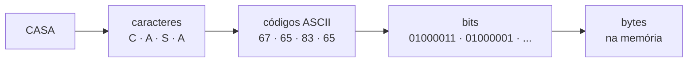

<!--META
{
  "title": "Representação de Dados: Bits, Bytes e ASCII",
  "header": "Representação de Dados",
  "tema": "Como textos e valores são armazenados na memória: bits, bytes, tipos de dados, tabela ASCII e a conversão entre caracteres, códigos e binário em Python.",
  "typing": ["CASA → códigos → bits → bytes", "8 bits = 1 byte = 256 valores", "ord('A') = 65 = 01000001", "Decifre a mensagem secreta"],
  "tecnologias": "Python 3 (<code>ord</code>, <code>chr</code>, <code>int(x, 2)</code>, <code>format</code>, <code>str.split</code>)",
  "tipo": "Teoria e prática de programação",
  "professor": "Prof. Dr. Marcus Grilo",
  "badges": [["Linguagem", "Python", "FF781F", "python"], ["Tópico", "Bits · Bytes · ASCII", "FF4500"]],
  "icons": "py",
  "icons_alt": "Python",
  "limitacoes": "O título dos slides menciona “comunicação serial”, mas o material disponível não desenvolve esse tema. Por isso ele não é tratado aqui. Os trechos de código dos slides são imagens e foram transcritos.",
  "files": {
    "Aula 02 - Representação de Dados. Bits, bytes, tipos de dados, caracteres ASCII, representação de informações na memória e comunicação Serial.(3).pdf": "Slides sobre bits, bytes, tipos de dados, tabela ASCII, conversões em Python e duas atividades.",
    "Aula 02 - Mensagem Secreta(1).txt": "Mensagem da atividade 1: 49 grupos de 8 bits, cada um representando um caractere ASCII."
  }
}
META-->

<br />

<h2 id="visao-geral">Visão geral</h2>

A aula parte de uma pergunta simples: **"Quando eu escrevo a palavra CASA no computador, como ele armazena essa informação?"**

O computador não "entende" palavras. Ele guarda **números**, e números são guardados como **bits**. A resposta é uma cadeia de codificações:



*Figura 1 — Da palavra à memória, conforme o resumo do material.*

Esse é o mesmo princípio que vale para tudo o que um programa manipula: inteiros, números reais, valores lógicos, imagens e instruções. A aula usa o padrão **ASCII** para mostrar concretamente como uma convenção (letra ↔ número) permite que máquinas troquem textos. A atividade final transforma isso em um desafio: **decifrar uma mensagem interceptada em binário**.

<br />

<h2 id="objetivos">Objetivos de aprendizagem</h2>

- Definir **bit** e **byte** e calcular quantos valores $n$ bits representam.
- Explicar por que tipos diferentes (`int`, `float`, `str`, `bool`) são, na memória, apenas sequências de bits.
- Descrever o padrão **ASCII** e consultar a tabela de códigos.
- Converter caracteres em códigos e códigos em binário (e vice-versa) com `ord`, `chr`, `format` e `int(texto, 2)`.
- Calcular o espaço ocupado por uma mensagem em caracteres, bytes e bits.

<br />

<h2 id="pre-requisitos">Pré-requisitos</h2>

- Conversão entre decimal e binário e o formato `"{:08b}"`, da [aula 08](../aula08-14-08-26/README.md).
- Python básico: `input`, `print`, laço `for` sobre uma string e listas.
- A ideia de que o hardware só distingue dois estados, da [aula 01](../aula01-13-03-26/README.md#3-por-que-o-computador-pensa-em-binário).

<br />

<h2 id="fundamentacao-teorica">Fundamentação teórica</h2>

### 1. O bit

O **bit** (*binary digit*) é a menor unidade de informação e assume apenas dois valores: **0 ou 1**. O material o compara a um **interruptor**: desligado = 0 e ligado = 1.

### 2. O byte e a quantidade de valores representáveis

Um conjunto de **8 bits** forma um **byte**, por exemplo `01001010`.

Cada bit dobra a quantidade de combinações possíveis, então $n$ bits representam $2^n$ valores:

| Bits | Combinações | Faixa sem sinal |
| :---: | :---: | :--- |
| 1 | 2 | 0 a 1 |
| 4 | 16 | 0 a 15 (um dígito hexadecimal) |
| 8 | **256** | `00000000` = 0 até `11111111` = 255 |
| 16 | 65 536 | 0 a 65 535 |

$$2^8 = 256 \text{ valores} \qquad \text{maior valor} = 2^8 - 1 = 255$$

Exemplos de bytes apresentados no material:

| Decimal | Byte |
| :---: | :---: |
| 1 | `00000001` |
| 10 | `00001010` |
| 25 | `00011001` |
| 42 | `00101010` |
| 100 | `01100100` |
| 128 | `10000000` |
| 255 | `11111111` |

### 3. Tipos de dados e memória

Para o programador, os dados têm **tipos diferentes**. Na memória, **tudo** é representado por bits. O exemplo do material:

| Variável | Valor | Tipo em Python |
| :--- | :--- | :--- |
| `idade` | `20` | `int` |
| `altura` | `1.75` | `float` |
| `nome` | `"Maria"` | `str` |
| `aprovado` | `True` | `bool` |

O **tipo** diz ao programa **como interpretar** os bits. Ele define a regra de codificação: inteiros em binário, reais em ponto flutuante (IEEE 754) e textos como sequências de códigos de caractere. A mesma sequência `01000001` pode ser o número 65 ou a letra `A`. Só o tipo distingue um do outro.

### 4. O padrão ASCII

> **ASCII** — *American Standard Code for Information Interchange* (pronuncia-se "áski") — é um sistema de representação de letras, algarismos, sinais de pontuação e caracteres de controle por meio de códigos binários.

O ASCII original usa **7 bits**, ou seja, 128 códigos (de 0 a 127). Na prática, cada caractere ocupa **1 byte**.

| Faixa | Conteúdo | Exemplos |
| :--- | :--- | :--- |
| 0–31 e 127 | Controle (não imprimíveis) | 10 = nova linha, 7 = sinal sonoro |
| 32 | Espaço | `' '` = `00100000` |
| 48–57 | Algarismos | `'0'` = 48 … `'9'` = 57 |
| 65–90 | Letras maiúsculas | `A` = 65, `B` = 66, `C` = 67 … `Z` = 90 |
| 97–122 | Letras minúsculas | `a` = 97 … `z` = 122 |

> [!TIP]
> **Regularidades úteis:**
> - Maiúscula e minúscula diferem em exatamente **32**, que é um único bit: `A` = `01000001` e `a` = `01100001`.
> - Algarismo = valor + 48, a conversão usada em Assembly na [aula 02](../aula02-20-03-26/README.md#54-conversão-para-ascii).

**A palavra CASA na memória:**

| Caractere | Código | Byte |
| :---: | :---: | :---: |
| C | 67 | `01000011` |
| A | 65 | `01000001` |
| S | 83 | `01010011` |
| A | 65 | `01000001` |

Considerando ASCII, "CASA" ocupa **4 bytes = 32 bits**.

### 5. Além do ASCII: acentos e UTF-8

O ASCII não tem `é`, `ç` ou `ã`. Por isso a mensagem secreta da atividade usa "FIAP **e** a melhor" sem acento.

Hoje o padrão dominante é o **Unicode**, codificado em **UTF-8**. Nele, os 128 caracteres ASCII mantêm os mesmos códigos e ocupam 1 byte, enquanto caracteres acentuados ocupam 2 bytes ou mais. Consequência prática: em UTF-8, **número de caracteres ≠ número de bytes** sempre que houver acentos. Isso importa no exercício 2.

<br />

<h2 id="exemplos-praticos">Exemplos práticos</h2>

### Exemplo básico — um byte e uma letra em Python

Os dois trechos do material, reunidos:

```python
byte = 42
print("Decimal:", byte)
print("Binário:", "{:08b}".format(byte))

letra = "A"
codigo = ord(letra)
print("Letra:", letra)
print("Código ASCII:", codigo)
print("Binário:", "{:08b}".format(codigo))
```

Saída esperada:

```text
Decimal: 42
Binário: 00101010
Letra: A
Código ASCII: 65
Binário: 01000001
```

`"{:08b}"` formata o número em binário (`b`) com **8** posições, completando com zeros (`0`). Ou seja, mostra o byte completo. `ord()` devolve o código numérico de um caractere.

### Exemplo intermediário — analisar uma palavra

```python
texto = "CASA"
for letra in texto:
    codigo = ord(letra)
    print(letra, "->", codigo, "->", "{:08b}".format(codigo))
print("Bytes (ASCII):", len(texto.encode("ascii")))
```

Saída esperada:

```text
C -> 67 -> 01000011
A -> 65 -> 01000001
S -> 83 -> 01010011
A -> 65 -> 01000001
Bytes (ASCII): 4
```

O laço percorre a string caractere a caractere. `encode("ascii")` produz os **bytes** reais, cujo tamanho responde à pergunta do slide: "Quantos bytes são necessários para armazenar CASA?" A resposta é **4**.

### Exemplo aplicado — o caminho inverso e uma verificação de integridade

Protocolos reais transmitem bytes e o receptor reconstrói o texto. O trecho abaixo decodifica a dica do material (`01001000 01001111 01001100 01000001`) e acrescenta uma verificação simples: um *checksum* com a soma dos bytes módulo 256, técnica antiga usada para detectar erros de transmissão.

```python
recebido = "01001000 01001111 01001100 01000001"
grupos = recebido.split()                 # divide a string em partes
print(grupos)

codigos = [int(g, 2) for g in grupos]     # binário -> inteiro
texto = "".join(chr(c) for c in codigos)  # inteiro -> caractere
print(codigos, "->", texto)
print("checksum:", sum(codigos) % 256)
```

Saída esperada:

```text
['01001000', '01001111', '01001100', '01000001']
[72, 79, 76, 65] -> HOLA
checksum: 36
```

`int(g, 2)` interpreta o texto como base 2 e `chr()` é o inverso de `ord()`. Se o transmissor enviar também o *checksum* (36), o receptor pode recalculá-lo e detectar se algum bit foi alterado no caminho.

<br />

<h2 id="exercicios-resolvidos">Exercícios e resoluções comentadas</h2>

> [!NOTE]
> As soluções são **propostas para estudo**, e não o gabarito oficial. Ambas foram executadas em Python 3.

### Atividade 1 — Decifre a mensagem

**Enunciado (resumo):** uma mensagem interceptada está em binário, em grupos de 8 bits. Cada grupo é um caractere ASCII. Escreva um programa em Python que descubra o texto. O arquivo [`Aula 02 - Mensagem Secreta(1).txt`](Aula%2002%20-%20Mensagem%20Secreta%281%29.txt) contém a mensagem.

**Conhecimento avaliado:** `split()`, conversão de base com `int(x, 2)` e `chr()`.

**Raciocínio:** separar os grupos pelos espaços, converter cada um em inteiro e cada inteiro em caractere, e juntar os caracteres.

<!-- norun -->
```python
with open("Aula 02 - Mensagem Secreta(1).txt", encoding="ascii") as arquivo:
    grupos = arquivo.read().split()

mensagem = "".join(chr(int(grupo, 2)) for grupo in grupos)
print(f"{len(grupos)} bytes decifrados:")
print(mensagem)
```

Para quem quiser tentar sozinho antes de ver o resultado:

<details>
<summary><strong>Mensagem decifrada</strong> (resultado da execução sobre o arquivo da pasta)</summary>

```text
49 bytes decifrados:
FIAP e a melhor faculdade de tecnologia do Brasil
```

</details>

**Como verificar:** confira manualmente o primeiro grupo: `01000110` = 64 + 4 + 2 = 70, que é `F` na tabela ASCII.

**Erros comuns:** usar `int(grupo)` sem a base 2 (resulta em 1 000 110, e `chr()` gera um caractere sem sentido); esquecer o `split()` e iterar sobre os caracteres `'0'` e `'1'` individualmente.

### Atividade 2 — Mensagem em bytes e bits

**Enunciado (resumo):** solicitar uma mensagem; converter cada caractere em código e em binário; mostrar os resultados; informar a quantidade de caracteres, de bytes e o total de bits. O exemplo do slide usa `HELLO`: 5 caracteres, 5 bytes e 40 bits.

**Raciocínio:** com texto ASCII, bytes = caracteres. A solução abaixo mede os bytes pela codificação **UTF-8** real, para que o resultado continue correto com acentos.

<!-- norun -->
```python
mensagem = input("Digite sua mensagem: ")

for caractere in mensagem:
    codigo = ord(caractere)
    print(caractere, "->", codigo, "->", "{:08b}".format(codigo))

dados = mensagem.encode("utf-8")      # bytes realmente armazenados
print()
print("Caracteres:", len(mensagem))
print("Bytes:", len(dados))
print("Bits:", len(dados) * 8)
```

Execução com `HELLO`:

```text
Digite sua mensagem: HELLO
H -> 72 -> 01001000
E -> 69 -> 01000101
L -> 76 -> 01001100
L -> 76 -> 01001100
O -> 79 -> 01001111

Caracteres: 5
Bytes: 5
Bits: 40
```

Execução com `Olá`, que mostra a diferença entre caracteres e bytes:

```text
Digite sua mensagem: Olá
O -> 79 -> 01001111
l -> 108 -> 01101100
á -> 225 -> 11100001

Caracteres: 3
Bytes: 4
Bits: 32
```

O `á` tem código 225 (fora do ASCII, que vai até 127) e, em UTF-8, ocupa **2 bytes**. Uma solução que calculasse `bytes = len(mensagem)` informaria 3 bytes, um valor incorreto.

<br />

<h2 id="aplicacoes">Aplicações no mercado de trabalho</h2>

- **Desenvolvimento backend e APIs:** limites de tamanho de campos em bancos de dados (`VARCHAR(50)` em bytes ou em caracteres?) e cabeçalhos `Content-Length` exigem saber quantos bytes um texto ocupa.
- **Integração de sistemas:** arquivos com acentos "quebrados" (`Ação`) resultam de ler UTF-8 como outra codificação, um problema clássico em importação de CSV.
- **Redes e IoT:** protocolos seriais e de rede transmitem bytes; *checksums* e CRCs detectam erros de transmissão.
- **Segurança:** codificações como Base64 e a inspeção de dados em hexadecimal dependem de entender bytes.

<br />

<h2 id="boas-praticas">Boas práticas e erros comuns</h2>

| Problemático | Recomendado | Motivo |
| :--- | :--- | :--- |
| `open(arquivo)` sem codificação | `open(arquivo, encoding="utf-8")` | A codificação padrão varia por sistema operacional |
| Assumir 1 caractere = 1 byte | `len(texto.encode("utf-8"))` | Acentos ocupam mais de um byte em UTF-8 |
| `bin(65)` para exibir um byte | `format(65, "08b")` | Garante 8 dígitos e remove o prefixo `0b` |
| `int("01000001")` | `int("01000001", 2)` | Sem a base, o texto é lido como decimal |

<br />

<h2 id="resumo">Resumo para revisão</h2>

- **Bit:** 0 ou 1. **Byte:** 8 bits, com $2^8 = 256$ valores (0 a 255).
- **Tipos** (`int`, `float`, `str`, `bool`) são regras de interpretação de bits.
- **ASCII:** 128 códigos; `A` = 65, `a` = 97, `'0'` = 48, espaço = 32. Um caractere ASCII ocupa 1 byte.
- **Python:** `ord(c)` dá o código; `chr(n)` dá o caractere; `"{:08b}".format(n)` dá o byte em binário; `int(t, 2)` converte binário em inteiro; `split()` separa grupos.
- **"CASA"** = 4 bytes = 32 bits. Em **UTF-8**, caracteres acentuados ocupam 2 bytes ou mais.

<br />

<h2 id="questoes">Questões de fixação</h2>

1. Quantos valores diferentes podem ser representados com 12 bits? Qual é o maior?
2. Qual é o código ASCII de `D` e sua representação em binário? Como obtê-lo sem a tabela, sabendo que `A` = 65?
3. Por que a mesma sequência `01000001` pode significar `65` ou `A`?
4. Quantos bits são necessários para armazenar "FIAP 2026" em ASCII?
5. Como transformar uma letra minúscula em maiúscula manipulando apenas um bit?

<details>
<summary><strong>Respostas comentadas</strong></summary>

1. $2^{12} = 4096$ valores; o maior é $4095$.
2. As letras são consecutivas, então `D` = 65 + 3 = **68** = `01000100`.
3. Porque os bits não carregam significado próprio: quem define a interpretação é o **tipo** ou a **codificação** usada pelo programa. Como inteiro, a sequência vale 65; como caractere ASCII, é `A`.
4. São 9 caracteres (`F I A P`, espaço, `2 0 2 6`), ou seja, 9 bytes = **72 bits**.
5. Maiúsculas e minúsculas diferem em 32 = `00100000`, o bit 5. Para obter a maiúscula, desliga-se esse bit com AND: `chr(ord("a") & ~32)` resulta em `"A"`. Isso funciona apenas para letras ASCII.

</details>

<br />

<h2 id="referencias">Referências e materiais complementares</h2>

- [Python — `ord()`, `chr()`, `int()`, `format()` (funções embutidas)](https://docs.python.org/pt-br/3/library/functions.html)
- [Python — Unicode HOWTO](https://docs.python.org/pt-br/3/howto/unicode.html)
- [Python — métodos de `str`, incluindo `split` e `encode`](https://docs.python.org/pt-br/3/library/stdtypes.html#string-methods)
- Bibliografia da disciplina: STALLINGS (2019); TANENBAUM (2016). Veja a [aula 01](../aula01-13-03-26/README.md#referencias).

**Materiais da pasta:** [slides](Aula%2002%20-%20Representa%C3%A7%C3%A3o%20de%20Dados.%20Bits%2C%20bytes%2C%20tipos%20de%20dados%2C%20caracteres%20ASCII%2C%20representa%C3%A7%C3%A3o%20de%20informa%C3%A7%C3%B5es%20na%20mem%C3%B3ria%20e%20comunica%C3%A7%C3%A3o%20Serial.%283%29.pdf) · [mensagem secreta](Aula%2002%20-%20Mensagem%20Secreta%281%29.txt)
