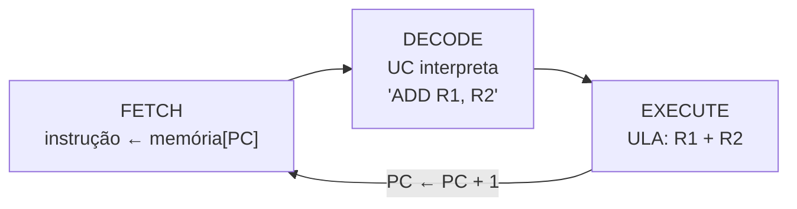
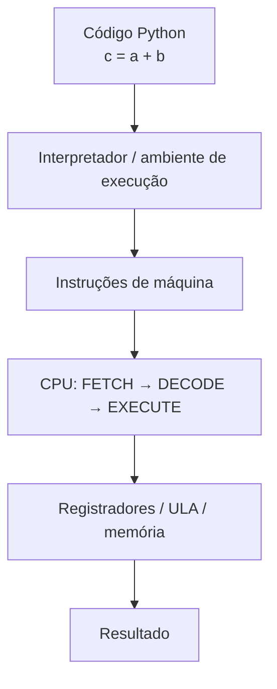

<!--META
{
  "title": "Processadores e Ciclo de Execução",
  "header": "Ciclo Fetch-Decode-Execute",
  "tema": "Componentes da CPU (unidade de controle, registradores, ULA e clock), o ciclo FETCH → DECODE → EXECUTE, o papel do Program Counter e um simulador didático de CPU em Python/MicroPython.",
  "typing": ["FETCH: busca a instrução no endereço do PC", "DECODE: a UC interpreta a instrução", "EXECUTE: a ULA realiza a operação", "c = a + b vira LOAD, ADD, STORE"],
  "tecnologias": "Python 3 / MicroPython, Raspberry Pi Pico (proposta com LEDs)",
  "tipo": "Teoria de arquitetura e simulação em código",
  "professor": "Prof. Dr. Marcus Grilo",
  "badges": [["Linguagem", "Python", "FF781F", "python"], ["Tópico", "Fetch-Decode-Execute", "FF4500"], ["Placa", "Raspberry Pi Pico", "E60000", "raspberrypi"]],
  "icons": "py,raspberrypi",
  "icons_alt": "Python, Raspberry Pi",
  "limitacoes": "O simulador original foi executado em Python 3, e as saídas mostradas são reais. A versão com LEDs foi testada com um módulo <code>machine</code> simulado, sem placa real e sem Wokwi.",
  "files": {
    "Aula 03 - Processadores e Ciclo de Execução 1(2).pdf": "Slides: objetivos, arquitetura simplificada da CPU, ciclo fetch-decode-execute, simulador em Python, clock, Program Counter, resumo e atividade.",
    "Aula 03 - Processadores e Ciclo de Execução 1 - Código Python(2).txt": "Simulador didático de CPU em Python, com memória de instruções, registradores R0 a R2, PC e instruções LOAD, ADD e STORE."
  }
}
META-->

<br />

<h2 id="visao-geral">Visão geral</h2>

A pergunta central da aula é: **quando o Python executa `c = a + b`, o que realmente acontece dentro do computador?**

O processador **não entende Python**. Ele executa **instruções** simples, uma após a outra, em um ciclo repetitivo:

1. **busca** a instrução na memória;
2. **decodifica** a instrução;
3. **executa** a instrução.

Esse **ciclo de instrução** (*fetch-decode-execute*) é o "coração" de qualquer CPU, do RP2040 da Raspberry Pi Pico aos processadores de servidores.

Em vez de apenas descrever o ciclo, a aula o **constrói**: um programa em Python simula uma CPU com memória de instruções, registradores e Program Counter. Fica evidente que o "processador" é um laço que busca, interpreta e executa. A atividade estende o simulador com novas instruções e com LEDs que mostram em qual etapa a CPU está.

<br />

<h2 id="objetivos">Objetivos de aprendizagem</h2>

Conforme os objetivos declarados no material, ao final da aula você deve ser capaz de:

- Identificar os principais componentes de uma CPU.
- Entender o ciclo **Fetch → Decode → Execute**.
- Relacionar o **clock** com a execução de instruções.
- Compreender a função dos **registradores** e do **Program Counter**.
- Perceber a diferença entre uma instrução de alto nível em Python e as operações realizadas pelo processador.
- Usar a Raspberry Pi Pico para criar uma simulação didática do ciclo de execução.

<br />

<h2 id="pre-requisitos">Pré-requisitos</h2>

- Componentes da CPU, PC e IR, da [aula 05](../aula05-17-04-26/README.md#5-contador-de-programa-pc-e-registrador-de-instrução-ir).
- Mini linguagem de registradores da [aula 01](../aula01-13-03-26/README.md#5-mini-linguagem-assembly-educacional): o simulador desta aula é a versão programada daquela atividade.
- Python: listas, dicionários, `split()`, `while` e `if/elif`.
- GPIO e LEDs em MicroPython, da [aula 08](../aula08-14-08-26/README.md).

<br />

<h2 id="fundamentacao-teorica">Fundamentação teórica</h2>

### 1. Arquitetura simplificada da CPU

| Componente | Função |
| :--- | :--- |
| **Unidade de controle** | Coordena a execução; busca e interpreta instruções |
| **Registradores** | Pequenas áreas de armazenamento dentro da CPU com valores temporários |
| **ULA** | Realiza operações aritméticas e lógicas |
| **Clock** | Fornece uma referência temporal para sincronizar as operações |

### 2. O ciclo de instrução



*Figura 1 — O ciclo se repete enquanto houver instruções.*

| Etapa | O que acontece | Exemplo com `ADD R1, R2` |
| :--- | :--- | :--- |
| **FETCH** (busca) | A CPU lê da memória a instrução no endereço indicado pelo PC | A instrução chega à CPU |
| **DECODE** (decodificação) | A unidade de controle identifica a operação e os operandos | "Some o conteúdo de R1 com R2" |
| **EXECUTE** (execução) | A ULA realiza a operação e o resultado vai para o destino | R1 ← R1 + R2 |

### 3. O Program Counter

O PC indica **qual instrução deve ser buscada em seguida**. Com o programa abaixo na memória:

```text
0 → LOAD R0, 5
1 → LOAD R1, 3
2 → ADD R0, R1
3 → STORE R2
```

Quando `pc = 0`, a CPU busca `LOAD R0, 5`. Depois, `pc = 1` e ela busca `LOAD R1, 3`, e assim por diante. Saltos condicionais, vistos na [aula 05](../aula05-17-04-26/README.md#5-contador-de-programa-pc-e-registrador-de-instrução-ir), funcionam alterando o PC para outro valor em vez de incrementá-lo.

### 4. O clock

O clock é um sinal periódico que **marca o ritmo** das operações internas. Em cada pulso, os circuitos avançam um passo. O slide representa cada pulso com uma etapa: F, D, E, F, D...

$$\text{período} = \frac{1}{\text{frequência}} \qquad 133\ \text{MHz} \Rightarrow \frac{1}{133 \times 10^{6}} \approx 7{,}5\ \text{ns por ciclo}$$

> [!NOTE]
> No simulador, `time.sleep(1)` é uma **analogia**, como alerta o próprio material: não é o clock real do processador. É apenas uma forma de tornar o processo visível. Processadores reais executam milhões ou bilhões de ciclos por segundo, e uma instrução pode exigir mais de um ciclo.

### 5. De Python até o processador

O resumo do material mostra o caminho:



*Figura 2 — Uma linha de Python passa por várias camadas até virar operações da ULA.*

O próprio Python mostra uma etapa intermediária: o **bytecode**, as instruções da máquina virtual do interpretador. Com o módulo `dis`:

<!-- norun -->
```python
import dis
dis.dis(compile("c = a + b", "<exemplo>", "exec"))
```

Saída obtida em Python 3.13 (o bytecode muda entre versões):

```text
  0           RESUME                   0

  1           LOAD_NAME                0 (a)
              LOAD_NAME                1 (b)
              BINARY_OP                0 (+)
              STORE_NAME               2 (c)
              RETURN_CONST             0 (None)
```

As instruções `LOAD`, `BINARY_OP (+)` e `STORE` correspondem exatamente ao padrão do simulador da aula: **carregar, operar, armazenar**.

### 6. Correspondência simulador ↔ CPU

| No simulador (Python) | Na CPU |
| :--- | :--- |
| lista `programa` | Memória de instruções |
| variável `pc` | Program Counter |
| `instrucao = programa[pc]` | Instrução buscada (FETCH) |
| dicionário `registradores` | Banco de registradores |
| `instrucao.split()` | Decodificação (DECODE) |
| operador `+` | Operação da ULA (EXECUTE) |
| laço `while` | Repetição do ciclo |

<br />

<h2 id="exemplos-praticos">Exemplos práticos</h2>

### Exemplo básico — o simulador do material

O arquivo [`Aula 03 - Processadores e Ciclo de Execução 1 - Código Python(2).txt`](Aula%2003%20-%20Processadores%20e%20Ciclo%20de%20Execu%C3%A7%C3%A3o%201%20-%20C%C3%B3digo%20Python%282%29.txt) executa o programa `LOAD R0 5`, `LOAD R1 3`, `ADD R0 R1`, `STORE R0 R2`. A estrutura essencial, sem os `print` e `sleep`:

<!-- norun -->
```python
while pc < len(programa):
    instrucao = programa[pc]          # FETCH
    partes = instrucao.split()        # DECODE
    comando = partes[0]
    if comando == "LOAD":             # EXECUTE
        registradores[partes[1]] = int(partes[2])
    elif comando == "ADD":
        registradores[partes[1]] = registradores[partes[1]] + registradores[partes[2]]
    elif comando == "STORE":
        registradores[partes[2]] = registradores[partes[1]]
    pc += 1                           # próxima instrução
```

Final da saída obtida ao executar o arquivo original:

```text
FETCH
PC = 3
Instrucao: STORE R0 R2

DECODE
Comando: STORE

EXECUTE
Copiando R0 para R2

REGISTRADORES
R0 = 8
R1 = 3
R2 = 8
==============================
```

| PC | Instrução | R0 | R1 | R2 |
| :---: | :--- | :---: | :---: | :---: |
| 0 | `LOAD R0 5` | 5 | 0 | 0 |
| 1 | `LOAD R1 3` | 5 | 3 | 0 |
| 2 | `ADD R0 R1` | 8 | 3 | 0 |
| 3 | `STORE R0 R2` | 8 | 3 | 8 |

> [!NOTE]
> No simulador, `STORE R0 R2` copia o valor **entre registradores**. Em arquiteturas reais, *store* normalmente significa gravar um registrador **na memória principal**. A cópia entre registradores corresponde ao `MOV` do x86.

### Exemplo intermediário — instruções desconhecidas

O simulador original não tem `else`: uma instrução não prevista é ignorada sem aviso, e o PC simplesmente avança. Processadores reais geram uma exceção de **instrução inválida**. Uma versão compacta que imita esse comportamento:

```python
def executar(programa):
    reg, pc = {"R0": 0, "R1": 0, "R2": 0}, 0
    while pc < len(programa):
        op, *args = programa[pc].split()
        if op == "LOAD":
            reg[args[0]] = int(args[1])
        elif op == "ADD":
            reg[args[0]] += reg[args[1]]
        else:
            raise ValueError(f"instrução inválida no endereço {pc}: {op}")
        pc += 1
    return reg

print(executar(["LOAD R0 5", "LOAD R1 3", "ADD R0 R1"]))
try:
    executar(["LOAD R0 5", "DIV R0 R1"])
except ValueError as erro:
    print("Exceção:", erro)
```

Saída esperada:

```text
{'R0': 8, 'R1': 3, 'R2': 0}
Exceção: instrução inválida no endereço 1: DIV
```

`op, *args = ...split()` separa o **opcode** dos **operandos** em uma linha, exatamente o trabalho do DECODE.

### Exemplo aplicado — o ciclo visível em LEDs

A solução da atividade, abaixo, conecta o simulador ao hardware: três LEDs indicam a etapa atual. É uma técnica comum em depuração de sistemas embarcados.

<br />

<h2 id="exercicios-resolvidos">Exercícios e resoluções comentadas</h2>

**Enunciado (slide "Agora é com você"):** modificar o simulador para executar **SUB** e **MUL** e acrescentar **LEDs** que mostrem qual etapa está acontecendo: LED 1 para FETCH, LED 2 para DECODE e LED 3 para EXECUTE. Os exemplos dos slides são: `LOAD R0, 10` · `LOAD R1, 2` · `SUB R0, R1` (R0 = 8) e `LOAD R0, 4` · `LOAD R1, 3` · `MUL R0, R1` (R0 = 12).

**Conhecimento avaliado:** extensão da etapa EXECUTE e associação entre etapas do ciclo e saídas físicas.

> [!NOTE]
> Solução **proposta para estudo**, e não o gabarito oficial. Ela foi executada em Python 3 com `CLOCK = 0` e um módulo `machine` simulado; não foi testada em placa real.

**Raciocínio:** novas instruções exigem apenas novos ramos no EXECUTE, porque FETCH e DECODE já são genéricos. Para os LEDs, uma função `etapa(nome)` acende somente o LED da etapa atual e apaga os demais. O programa de teste combina os dois exemplos dos slides em sequência.

**Ligações sugeridas:** GP2 → LED 1 (FETCH), GP3 → LED 2 (DECODE), GP4 → LED 3 (EXECUTE), cada um com resistor de 220 Ω para o GND. No slide, as cores são verde, amarelo e vermelho.

<!-- norun -->
```python
{{include:mpy/ciclo.py}}
```

Final da execução simulada (sem as linhas do módulo `machine` simulado):

```text
FETCH
PC = 4 | Instrucao: MUL R0 R1

DECODE
Comando: MUL

EXECUTE
R0 * R1
R0 = 24 | R1 = 3 | R2 = 0
==============================

FETCH
PC = 5 | Instrucao: STORE R0 R2

DECODE
Comando: STORE

EXECUTE
Copiando R0 para R2
R0 = 24 | R1 = 3 | R2 = 24

FIM
```

**Como verificar:** rastreie a tabela de registradores. Depois de `SUB`, R0 = 10 − 2 = 8; depois de `LOAD R1 3` e `MUL`, R0 = 8 × 3 = 24. Para reproduzir exatamente os exemplos dos slides, use `programa = ["LOAD R0 10", "LOAD R1 2", "SUB R0 R1"]`, com resultado R0 = 8, ou `["LOAD R0 4", "LOAD R1 3", "MUL R0 R1"]`, com resultado R0 = 12.

**Erros comuns:** inverter a ordem dos operandos do SUB (`R1 - R0`); acender um LED novo sem apagar o anterior; esquecer de converter o operando de LOAD com `int()`.

<br />

<h2 id="aplicacoes">Aplicações no mercado de trabalho</h2>

- **Máquinas virtuais e interpretadores:** a JVM, o CPython e os motores JavaScript são laços de *fetch-decode-execute* sobre bytecode, exatamente como o simulador da aula.
- **Emuladores:** emuladores de consoles e o QEMU implementam o ciclo de instrução de outra arquitetura em software.
- **Desempenho:** entender o ciclo explica conceitos como *pipeline* (sobrepor etapas de instruções diferentes) e por que desvios mal previstos custam ciclos.
- **Sistemas embarcados:** a frequência de clock define consumo de energia e capacidade de resposta. Microcontroladores reduzem o clock para economizar bateria.

<br />

<h2 id="boas-praticas">Boas práticas e erros comuns</h2>

| Problemático | Recomendado | Motivo |
| :--- | :--- | :--- |
| `if/elif` sem `else` no EXECUTE | Tratar instrução desconhecida | Erros silenciosos são difíceis de depurar |
| Confundir `time.sleep` com o clock | Tratar como analogia visual | O clock real opera em nanossegundos |
| Copiar e colar blocos para cada LED | Função `etapa(nome)` | Um único ponto de controle, sem LEDs esquecidos acesos |
| Chamar de "store" uma cópia entre registradores | Nomear como `MOV` | Mantém a terminologia de arquitetura correta |

<br />

<h2 id="resumo">Resumo para revisão</h2>

- **CPU** = unidade de controle + registradores + ULA, sincronizados pelo **clock**.
- **Ciclo:** FETCH (instrução ← memória[PC]) → DECODE (a UC interpreta) → EXECUTE (a ULA opera) → PC avança.
- **PC:** endereço da próxima instrução; saltos o alteram.
- **Clock:** referência temporal; período = 1/frequência. `sleep` no simulador é só uma analogia.
- **Python → CPU:** código → interpretador → bytecode e instruções → ciclo de execução → resultado.
- **Simulador:** lista = memória, `pc` = PC, `split()` = DECODE, `+` = ULA, `while` = repetição do ciclo.

<br />

<h2 id="questoes">Questões de fixação</h2>

1. Em qual etapa do ciclo o valor do PC é usado? Em qual ele normalmente é alterado?
2. Por que o processador precisa de um clock?
3. No simulador, qual linha de código corresponde à etapa DECODE? Por que ela é tão simples comparada a uma CPU real?
4. Quantas iterações do `while` são necessárias para executar o programa original do material?
5. Uma CPU de 1 GHz executa uma instrução a cada ciclo. Quanto tempo leva para executar 3 bilhões de instruções?

<details>
<summary><strong>Respostas comentadas</strong></summary>

1. O PC é **usado** no FETCH, para saber de onde buscar. Ele é **atualizado** ao final do ciclo (incremento) ou durante o EXECUTE de uma instrução de salto.
2. Para sincronizar as etapas e os componentes, garantindo que cada circuito leia dados estáveis e que as operações aconteçam em ordem e no momento certo.
3. `partes = instrucao.split()`. Ela é simples porque as instruções do simulador são texto legível separado por espaços. Em uma CPU real, a decodificação extrai campos de bits (*opcode*, registradores, imediatos) de uma palavra binária usando circuitos lógicos.
4. **Quatro**, uma por instrução (`LOAD`, `LOAD`, `ADD`, `STORE`). O laço termina quando `pc == len(programa)`.
5. 1 GHz = $10^9$ ciclos por segundo. $3 \times 10^9 / 10^9 = 3$ segundos.

</details>

<br />

<h2 id="referencias">Referências e materiais complementares</h2>

- [Python — módulo `dis` (desmontador de bytecode)](https://docs.python.org/pt-br/3/library/dis.html)
- [MicroPython — `machine.Pin`](https://docs.micropython.org/en/latest/library/machine.Pin.html)
- Bibliografia da disciplina: STALLINGS (2019), capítulo sobre estrutura e função da CPU e ciclo de instrução; PATTERSON e HENNESSY (2014). Veja a [aula 01](../aula01-13-03-26/README.md#referencias).

**Materiais da pasta:** [slides](Aula%2003%20-%20Processadores%20e%20Ciclo%20de%20Execu%C3%A7%C3%A3o%201%282%29.pdf) · [código do simulador](Aula%2003%20-%20Processadores%20e%20Ciclo%20de%20Execu%C3%A7%C3%A3o%201%20-%20C%C3%B3digo%20Python%282%29.txt)
