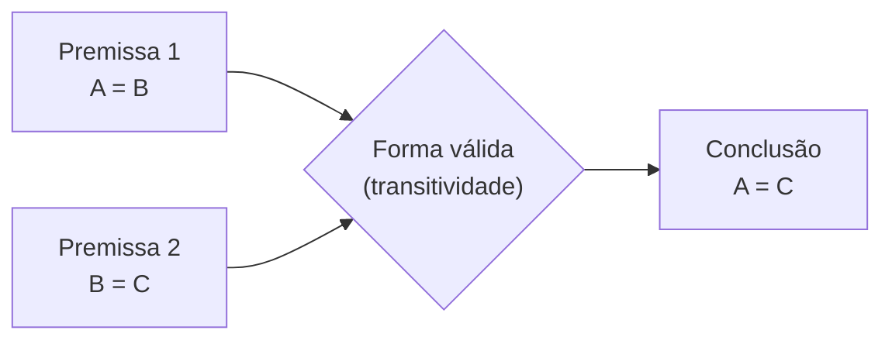

<!--META
{
  "title": "Welcome: Lógica e o Papel da Computação",
  "header": "Welcome to Computer Science",
  "tema": "Apresentação da disciplina, definição de lógica, propriedade transitiva da igualdade, a dependência do mundo moderno em relação à computação e a linguagem binária dos computadores.",
  "typing": ["Lógica: as regras do raciocínio correto", "Se A = B e B = C, então A = C", "O mundo moderno depende de computação", "Computadores falam em 0 e 1"],
  "tipo": "Aula inaugural (apresentação e motivação)",
  "professor": "Prof. Lucas Gomes Moreira",
  "badges": [["Conteúdo", "Apresentação", "FF781F"], ["Nível", "Introdutório", "FF4500"]],
  "files": {
    "Aula 00 - Welcome.pdf": "Slides de boas-vindas: apresentação do professor, regras de convivência, formas de avaliação, definição de lógica, propriedade transitiva, impacto da computação e assuntos da disciplina."
  }
}
META-->

<br />

<h2 id="visao-geral">Visão geral</h2>

A aula inaugural de **Computer Science** apresenta a disciplina e motiva o estudo da **lógica**, a base de tudo o que virá depois: álgebra booleana, portas lógicas, simplificação de expressões e programação.

O material começa definindo lógica, atribuindo a definição a Aristóteles, e ilustra o raciocínio dedutivo com a **propriedade transitiva da igualdade**. Em seguida, provoca uma reflexão: **como seria o mundo sem computação?** Por fim, retoma uma ideia central da área: computadores não entendem o mundo como nós, apenas sequências de 0 e 1.

<br />

<h2 id="objetivos">Objetivos de aprendizagem</h2>

- Conhecer a organização da disciplina: avaliação por *checkpoints*, *sprints* e *Global Solutions*.
- Definir **lógica** como o estudo das regras do raciocínio correto.
- Aplicar a **propriedade transitiva** como exemplo de dedução válida.
- Reconhecer a presença da computação em setores que vão muito além da TI.
- Conhecer os assuntos previstos para a disciplina.

<br />

<h2 id="pre-requisitos">Pré-requisitos</h2>

Nenhum conhecimento técnico prévio é exigido. Ajuda ter familiaridade com igualdades matemáticas simples, como $A = B$.

<br />

<h2 id="fundamentacao-teorica">Fundamentação teórica</h2>

### 1. Organização da disciplina

| Aspecto | Conforme o material |
| :--- | :--- |
| Avaliação | *Check Points*, *Sprints* e *Global Solutions* |
| Chamada | Feita pelo professor em todas as aulas, no momento que ele considerar oportuno |
| Convivência | Celular no modo silencioso; respeito entre colegas e professor |

**Assuntos previstos:** como a computação realmente funciona; lógica booleana; a linguagem C; níveis de programação (baixo, médio e alto); Python; programação procedural e modular.

### 2. O que é lógica?

> "Lógica é a área do conhecimento que estuda as regras do raciocínio correto." — atribuída a Aristóteles (384 a.C.–322 a.C.) no material

A lógica não trata do **conteúdo** de uma afirmação, mas da **forma** do raciocínio: se as premissas forem verdadeiras e a forma for válida, a conclusão também será verdadeira.

### 3. Propriedade transitiva da igualdade

> "Se dois elementos são iguais a um terceiro, então eles são iguais entre si."

$$A = B \quad \text{e} \quad B = C \quad \Longrightarrow \quad A = C$$



*Figura 1 — Estrutura de um raciocínio dedutivo: premissas, regra de inferência e conclusão.*

**Exemplo:** se o preço do produto A é igual ao do produto B, e o preço de B é igual ao de C, então A e C têm o mesmo preço, sem precisar comparar A e C diretamente.

**Cuidado:** nem toda relação é transitiva. "Ser amigo de" não é: se Ana é amiga de Bruno e Bruno é amigo de Carla, não se conclui que Ana seja amiga de Carla. Reconhecer quando uma regra se aplica é parte do raciocínio lógico.

### 4. Um mundo sem computação

O material propõe imaginar como seriam diversos setores sem tecnologia computacional:

| Setor | Sem computação... |
| :--- | :--- |
| Música e entretenimento | sem streaming, Spotify ou Netflix |
| Comunicação | sem WhatsApp, e-mails ou redes sociais |
| Trabalho e indústria | bancos fechariam e mercados não registrariam vendas |
| Ciência e medicina | sem exames por imagem, simulações ou IA para diagnóstico |
| Transporte | sem semáforos inteligentes, Uber ou controle de tráfego aéreo |
| Segurança | sem criptografia, sem proteção digital e com caos em sistemas financeiros |

A mensagem é que computação "não se trata apenas de escrever códigos": ela vai além dos profissionais de TI, e qualquer setor do mundo depende dela.

### 5. Computadores e o binário

Os slides mostram sequências como `0100110101100110`. Computadores representam tudo com **dois símbolos**, 0 e 1. Por isso a lógica de dois valores (verdadeiro/falso), estudada nas próximas aulas, casa perfeitamente com o funcionamento do hardware.

<br />

<h2 id="exemplos-praticos">Exemplos práticos</h2>

### Exemplo básico — verificando a transitividade em Python

```python
a, b, c = 7, 7, 7
print("A = B?", a == b)
print("B = C?", b == c)
print("Então A = C?", a == c)
```

Saída esperada:

```text
A = B? True
B = C? True
Então A = C? True
```

### Exemplo intermediário — quando a premissa falha

Se uma das premissas é falsa, a transitividade **não garante nada** sobre a conclusão:

```python
casos = [(5, 5, 5), (5, 6, 5), (5, 6, 7)]
for a, b, c in casos:
    premissas = (a == b) and (b == c)
    print(f"A={a}, B={b}, C={c}: premissas válidas? {premissas}; A = C? {a == c}")
```

Saída esperada:

```text
A=5, B=5, C=5: premissas válidas? True; A = C? True
A=5, B=6, C=5: premissas válidas? False; A = C? True
A=5, B=6, C=7: premissas válidas? False; A = C? False
```

O segundo caso mostra que, com uma premissa falsa, a conclusão pode até ser verdadeira, mas **por acaso**, não por dedução.

<br />

<h2 id="aplicacoes">Aplicações no mercado de trabalho</h2>

- **Desenvolvimento de software:** toda regra de negócio ("se o cliente é VIP e a compra passa de R$ 100, aplicar desconto") é um raciocínio lógico codificado.
- **Bancos de dados:** consultas SQL combinam condições com `AND`, `OR` e `NOT`.
- **Segurança e finanças:** criptografia e sistemas de pagamento, citados no material, dependem de lógica e matemática discreta.
- **Qualquer setor:** saúde, transporte, indústria e entretenimento empregam profissionais que traduzem regras do mundo real em lógica executável.

<br />

<h2 id="boas-praticas">Boas práticas e erros comuns</h2>

| Erro de raciocínio | Correção |
| :--- | :--- |
| Aplicar a transitividade a qualquer relação | Verificar se a relação é de fato transitiva (igualdade, "maior que") |
| Concluir algo verdadeiro a partir de premissas falsas e chamar isso de dedução | Uma dedução só garante a conclusão quando as premissas são verdadeiras |
| Achar que lógica é só "para programadores" | A lógica estrutura decisões em qualquer área |

<br />

<h2 id="resumo">Resumo para revisão</h2>

- **Lógica:** estudo das regras do raciocínio correto (Aristóteles).
- **Transitividade:** $A = B$ e $B = C \Rightarrow A = C$.
- A computação está presente em praticamente todos os setores da sociedade.
- Computadores trabalham com **0 e 1**, uma base natural para a lógica de dois valores.
- **Avaliação:** *checkpoints*, *sprints* e *Global Solutions*.

<br />

<h2 id="questoes">Questões de fixação</h2>

1. Dê um exemplo de relação transitiva diferente da igualdade.
2. A relação "é pai de" é transitiva? Justifique.
3. Escolha um setor da tabela da seção 4 e descreva uma decisão lógica que um sistema desse setor toma automaticamente.

<details>
<summary><strong>Respostas comentadas</strong></summary>

1. "É maior que": se $A > B$ e $B > C$, então $A > C$. "Está contido em", para conjuntos, também é transitiva.
2. Não. Se A é pai de B e B é pai de C, A é **avô** de C, e não pai. A conclusão "A é pai de C" não segue das premissas.
3. Exemplo em transporte: um semáforo inteligente decide "se há fila na via principal **e** não há pedestres aguardando, estender o tempo de verde". É uma decisão que combina duas condições com o operador E.

</details>

<br />

<h2 id="referencias">Referências e materiais complementares</h2>

- [Python — operadores de comparação (documentação oficial)](https://docs.python.org/pt-br/3/library/stdtypes.html#comparisons)
- Material da pasta: [slides de boas-vindas](Aula%2000%20-%20Welcome.pdf)
