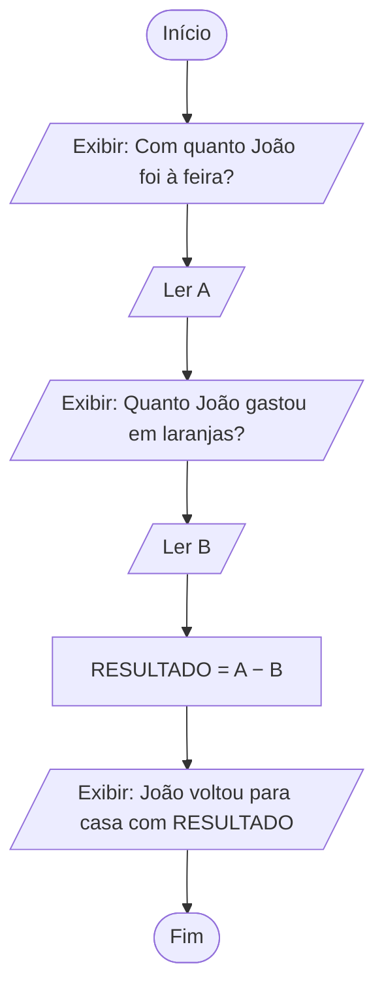
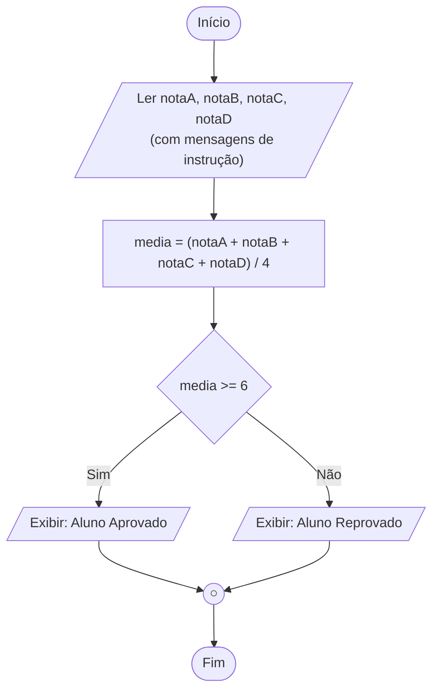

<!--META
{
  "title": "Introdução à Lógica: Algoritmos, Proposições e Diagramas de Blocos",
  "header": "Introdução à Lógica",
  "tema": "Algoritmos e programas, proposições simples e compostas, operadores E, OU e NÃO, estruturas condicionais e representação de algoritmos com fluxogramas e diagramas de blocos.",
  "typing": ["Algoritmo: sequência finita e bem definida", "Proposição: verdadeira ou falsa", "C = A E B só é V se ambas forem V", "Diagrama de blocos: início, entrada, processo, decisão"],
  "tecnologias": "Pseudocódigo, diagramas de blocos; Python nos exemplos desta documentação",
  "tipo": "Teoria com exercícios resolvidos em diagrama",
  "professor": "Prof. Lucas Gomes Moreira",
  "badges": [["Tópico", "Lógica proposicional", "FF781F"], ["Ferramenta", "Diagrama de blocos", "FF4500"]],
  "icons": "py",
  "icons_alt": "Python",
  "files": {
    "Aula 01 - Introdução a Lógica.pdf": "Slides: algoritmo, software e programa; proposições simples e compostas; operadores lógicos; estruturas condicionais; fluxograma e diagrama de blocos com dois exercícios resolvidos."
  }
}
META-->

<br />

<h2 id="visao-geral">Visão geral</h2>

"No final das contas, um programa é composto por **cálculos** e **decisões lógicas**." Esta aula trata da segunda parte dessa frase.

Perguntas do dia a dia como "o funcionário merece aumento?", "o cliente vai ganhar desconto?" ou "o aluno deve ser aprovado?" parecem subjetivas. Para que um computador as responda, elas precisam ser transformadas em **expressões objetivas**, cujo resultado é verdadeiro ou falso. Por exemplo: o que define o aumento? O número de faltas? O número de tarefas resolvidas?

A ferramenta matemática para isso é a **lógica proposicional**. A aula mostra:

- o que é uma **proposição**;
- como combinar proposições com **E**, **OU** e **NÃO**;
- como usar o resultado em uma **decisão** (`se ... então ... caso contrário`);
- como desenhar o algoritmo antes de programá-lo, com **diagramas de blocos**.

<br />

<h2 id="objetivos">Objetivos de aprendizagem</h2>

- Definir **algoritmo**, **software** e **programa de computador**.
- Identificar **proposições** e classificá-las em simples ou compostas.
- Aplicar os operadores **E**, **OU** e **NÃO** e prever o valor da proposição resultante.
- Escrever estruturas condicionais em pseudocódigo.
- Ler e construir **diagramas de blocos** com os símbolos padrão.
- Entender a diferença entre **igualdade** (matemática) e **atribuição** (programação).

<br />

<h2 id="pre-requisitos">Pré-requisitos</h2>

- A noção de lógica como estudo do raciocínio correto, da [aula 01](../aula01-09-03-26/README.md).
- Operações aritméticas e comparações ($\geq$, $>$, $=$).

<br />

<h2 id="fundamentacao-teorica">Fundamentação teórica</h2>

### 1. Algoritmo, software e programa

| Conceito | Definição (conforme material) |
| :--- | :--- |
| **Algoritmo** | Sequência **finita** de instruções lógicas, **claras e bem definidas**, para resolver um problema, realizar um cálculo ou executar uma tarefa |
| **Computador** | Máquina eletrônica que realiza tarefas com base em um software |
| **Software** | Conjunto de instruções de trabalho sequenciais apropriadas a um computador |
| **Programa** | Software desenvolvido para que o computador realize tarefas específicas, normalmente escrito em um arquivo de texto em linguagem de alto nível |

As três propriedades de um algoritmo são essenciais: **finito** (termina), **claro** (sem ambiguidade) e **bem definido** (cada passo é executável).

### 2. Proposições

> Uma **proposição** é uma frase declarativa que pode ser classificada como **verdadeira (V)** ou **falsa (F)**. Ela só pode tomar um desses dois valores, sem terceira hipótese.

| Exemplo | Valor | Tipo |
| :--- | :---: | :--- |
| A: $2 + 3 = 5$ | V | Simples |
| B: $2 + 2 > 5$ | F | Simples |
| "Que horas são?" | — | **Não** é proposição (pergunta) |
| "Feche a porta." | — | **Não** é proposição (ordem) |

Uma proposição **simples** tem uma única comparação. Isso basta para casos fáceis, mas não para regras reais.

### 3. Proposições compostas e operadores lógicos

O critério de aprovação do material combina duas condições:

- A: média ≥ 6,0
- B: frequência ≥ 75%

O aluno é aprovado se **ambas** forem verdadeiras. Cria-se uma terceira proposição, **C = A E B**.

> [!NOTE]
> No slide, a proposição B aparece como "Falta ≥ 75%". O pseudocódigo do próprio material usa `freq ≥ 0.75`, ou seja, a condição se refere à **frequência** (presença), que é o critério usual de aprovação.

| Operador | Notação | C é verdadeira quando... |
| :--- | :--- | :--- |
| **E** (conjunção) | A ∧ B | A **e** B forem verdadeiras ao mesmo tempo |
| **OU** (disjunção) | A ∨ B | **pelo menos uma** for verdadeira; só é falsa se ambas forem falsas |
| **NÃO** (negação) | ¬A | A for falsa (e vice-versa) |

**Tabela-verdade** com todas as combinações:

| A | B | A E B | A OU B | NÃO A |
| :---: | :---: | :---: | :---: | :---: |
| V | V | **V** | V | F |
| V | F | F | V | F |
| F | V | F | V | V |
| F | F | F | **F** | V |

Com duas proposições há $2^2 = 4$ combinações. Com $n$ proposições, $2^n$.

### 4. Estruturas condicionais

A decisão em pseudocódigo:

```text
Se condição então
    bloco executado se a condição for verdadeira
caso contrário
    bloco executado se a condição for falsa
```

Aplicada ao critério de aprovação:

```text
Se media ≥ 6.0 E freq ≥ 0.75 então
    Imprima "aluno aprovado"
caso contrário
    Imprima "aluno reprovado"
```

### 5. Fluxograma e diagrama de blocos

- **Fluxograma:** representa um algoritmo como um fluxo de atividades, com símbolos geométricos para entrada, processamento e saída. É muito usado em **análise de sistemas**.
- **Diagrama de blocos:** aprimora o fluxograma para descrever **o método e a sequência** de um algoritmo de programação, em qualquer nível de detalhe. É muito usado por **programadores**.

| Símbolo | Significado |
| :--- | :--- |
| Retângulo de cantos arredondados (terminal) | Início ou término |
| Forma de "tela" (exibição) | Mostrar informações ou mensagens ao usuário |
| Trapézio com topo inclinado (entrada manual) | Entrada de dados pelo teclado |
| Retângulo | Processamento |
| Losango | Decisão (condicional) |
| Círculo (conector) | Desvio para outro ponto do diagrama ou finalização da decisão |

### 6. Atribuição não é igualdade

> Diferentemente da matemática, o sinal `=` em programação **não** é lido como igualdade, e sim como **atribuição**.

Na matemática, $A = 7$ afirma que A **é** 7. Na programação, `A = 7` significa **"coloque 7 em A"**. O material usa a imagem de A como uma **gaveta**. Assim, `RESULTADO = A - B` calcula a diferença e guarda o valor na gaveta `RESULTADO`. É por isso que `x = x + 1` faz sentido em programação, embora seja uma contradição em matemática.

<br />

<h2 id="exemplos-praticos">Exemplos práticos</h2>

### Exemplo básico — gerando a tabela-verdade

```python
print("A     B     A e B  A ou B  não A")
for a in (True, False):
    for b in (True, False):
        print(f"{a!s:5} {b!s:5} {(a and b)!s:6} {(a or b)!s:7} {(not a)!s}")
```

Saída esperada:

```text
A     B     A e B  A ou B  não A
True  True  True   True    False
True  False False  True    False
False True  False  True    True
False False False  False   True
```

Os dois laços aninhados percorrem as $2^2 = 4$ combinações. `!s` converte o booleano em texto para alinhar as colunas.

### Exemplo intermediário — a regra de aprovação

```python
def situacao(media, freq):
    a = media >= 6.0          # proposição A
    b = freq >= 0.75          # proposição B
    return "aluno aprovado" if a and b else "aluno reprovado"

for media, freq in [(7.5, 0.90), (7.5, 0.60), (5.0, 0.95), (6.0, 0.75)]:
    print(f"media={media}, freq={freq:.0%}: {situacao(media, freq)}")
```

Saída esperada:

```text
media=7.5, freq=90%: aluno aprovado
media=7.5, freq=60%: aluno reprovado
media=5.0, freq=95%: aluno reprovado
media=6.0, freq=75%: aluno aprovado
```

O último caso testa os **valores-limite**: como o critério usa `≥`, exatamente 6,0 e 75% aprovam. Testar os limites é uma prática essencial.

### Exemplo aplicado — política de aumento salarial

Retomando a pergunta subjetiva "o funcionário merece aumento?": uma empresa poderia defini-la objetivamente, com uma regra criada aqui apenas para ilustração:

```python
def merece_aumento(faltas, tarefas, advertencia):
    return faltas <= 3 and tarefas >= 40 and not advertencia

print(merece_aumento(faltas=2, tarefas=45, advertencia=False))
print(merece_aumento(faltas=2, tarefas=45, advertencia=True))
print(merece_aumento(faltas=5, tarefas=60, advertencia=False))
```

Saída esperada:

```text
True
False
False
```

A pergunta subjetiva virou uma **proposição composta** com E e NÃO. Esse é exatamente o trabalho de traduzir regras de negócio em lógica.

<br />

<h2 id="exercicios-resolvidos">Exercícios e resoluções comentadas</h2>

O material apresenta dois exercícios **com resolução em diagrama de blocos**. Os diagramas abaixo reproduzem a **solução do material original** em Mermaid; os programas em Python são **propostas para estudo**.

### Exercício 1 — João na feira

**Enunciado:** João foi à feira com R$ 20,00 e comprou uma dúzia de laranjas por R$ 5,00. Com quanto João voltou para casa? O software deve aceitar **quaisquer valores**, processar e exibir o resultado.

**Conhecimento avaliado:** entrada, processamento e saída, além do uso de **variáveis** no lugar de valores fixos.



*Figura 1 — Reprodução do diagrama do material. Os círculos numerados do original, que apenas conectam colunas do desenho, foram omitidos.*

**Pontos destacados pelo material:**

- Use uma **letra ou palavra** (A, `valorInicial`) para capturar valores, e não o número 20. A ideia é um programa que funcione com **quaisquer valores**.
- `RESULTADO = A − B` é uma **atribuição**: a diferença é guardada na "gaveta" `RESULTADO`.

<!-- norun -->
```python
a = float(input("Com quanto João foi à feira? "))
b = float(input("Quanto João gastou em laranjas? "))
resultado = a - b
print(f"João voltou para casa com R$ {resultado:.2f}")
```

Com as entradas 20 e 5, a saída é `João voltou para casa com R$ 15.00`.

### Exercício 2 — média de 4 notas

**Enunciado:** criar o diagrama de blocos de um sistema que calcula a média aritmética de 4 notas. Se a média for maior ou igual a 6, o aluno está aprovado; caso contrário, reprovado.

**Conhecimento avaliado:** processamento aritmético seguido de **decisão** (losango).



*Figura 2 — Reprodução do diagrama do material. O círculo final encerra o processo de decisão, reunindo os dois caminhos.*

**Explicação do material:** a decisão começa no **losango**, que contém a condição avaliada (`media >= 6`). Se for verdadeira, segue pelo lado **Sim**; caso contrário, pelo lado **Não**. Ao final da decisão, usa-se o **círculo** para finalizar.

<!-- norun -->
```python
notas = [float(input(f"Insira a {i}ª nota: ")) for i in range(1, 5)]
media = sum(notas) / 4
if media >= 6:
    print("Aluno Aprovado")
else:
    print("Aluno Reprovado")
```

**Como verificar:** teste com notas cuja média seja exatamente 6 (por exemplo 6, 6, 6, 6), com média 5,75 (5, 6, 6, 6) e com uma nota muito alta compensando outras baixas (10, 10, 2, 2, média 6).

**Erro comum:** esquecer os parênteses e escrever `notaA + notaB + notaC + notaD / 4`. Pela precedência, só `notaD` seria dividida por 4.

<br />

<h2 id="aplicacoes">Aplicações no mercado de trabalho</h2>

- **Regras de negócio:** descontos, aprovações de crédito e políticas de RH são proposições compostas implementadas em código.
- **Bancos de dados:** `WHERE media >= 6 AND freq >= 0.75` é lógica proposicional em SQL.
- **Análise de sistemas:** fluxogramas e diagramas documentam processos antes da implementação e facilitam a comunicação com quem não programa.
- **Testes de software:** a tabela-verdade orienta quais combinações de entradas precisam ser testadas.

<br />

<h2 id="boas-praticas">Boas práticas e erros comuns</h2>

| Problemático | Recomendado | Motivo |
| :--- | :--- | :--- |
| Usar valores fixos no algoritmo (`20 - 5`) | Usar variáveis lidas na entrada | O programa deve funcionar com quaisquer valores |
| Ler `=` como "é igual" | Ler como "recebe" | Evita confusão entre atribuição e comparação (`==`) |
| Testar só casos "do meio" | Testar valores-limite (média 6,0; frequência 75%) | Erros de `>` em vez de `>=` aparecem nos limites |
| Confundir OU lógico com "ou exclusivo" do português | Lembrar que A OU B é V também quando ambas são V | No dia a dia, "ou" costuma excluir uma das opções |

<br />

<h2 id="resumo">Resumo para revisão</h2>

- **Algoritmo:** sequência finita, clara e bem definida de instruções.
- **Programa:** cálculos + decisões lógicas.
- **Proposição:** declaração V ou F (sem terceira hipótese). Pode ser simples ou composta.
- **E:** V só se ambas forem V. **OU:** F só se ambas forem F. **NÃO:** inverte.
- **Condicional:** `Se ... então ... caso contrário`.
- **Diagrama de blocos:** terminal, exibição, entrada, processamento (retângulo), decisão (losango) e conector (círculo).
- **`=` em programação é atribuição** (a "gaveta").

<br />

<h2 id="questoes">Questões de fixação</h2>

1. "x + 2 = 7" é uma proposição? E "5 + 2 = 7"?
2. Uma loja dá desconto se o cliente for VIP **ou** a compra passar de R$ 200. Um cliente VIP comprou R$ 300. Ele tem desconto?
3. Qual é o valor de NÃO (A E B) quando A = V e B = F?
4. Quantas linhas tem a tabela-verdade de uma proposição com 3 variáveis?
5. Por que o símbolo de entrada de dados é diferente do símbolo de exibição no diagrama de blocos?

<details>
<summary><strong>Respostas comentadas</strong></summary>

1. "x + 2 = 7" **não** é proposição enquanto x não tiver valor: não dá para dizer se é V ou F (é uma *sentença aberta*). "5 + 2 = 7" é uma proposição verdadeira.
2. Sim. Com OU, basta uma condição verdadeira, e aqui as duas são. O OU lógico **inclui** o caso em que ambas são verdadeiras.
3. A E B = V E F = F, então NÃO(F) = **V**.
4. $2^3 = 8$ linhas.
5. Porque representam sentidos opostos do fluxo de dados: a **entrada** traz dados do usuário para o programa (teclado), e a **exibição** leva resultados do programa ao usuário (tela). Distinguir os símbolos torna o diagrama legível.

</details>

<br />

<h2 id="referencias">Referências e materiais complementares</h2>

- [Python — operações booleanas `and`, `or`, `not`](https://docs.python.org/pt-br/3/library/stdtypes.html#boolean-operations-and-or-not)
- [Python — instrução `if`](https://docs.python.org/pt-br/3/tutorial/controlflow.html#if-statements)
- [Mermaid — sintaxe de fluxogramas](https://mermaid.js.org/syntax/flowchart.html)
- Material da pasta: [slides de introdução à lógica](Aula%2001%20-%20Introdu%C3%A7%C3%A3o%20a%20L%C3%B3gica.pdf)
