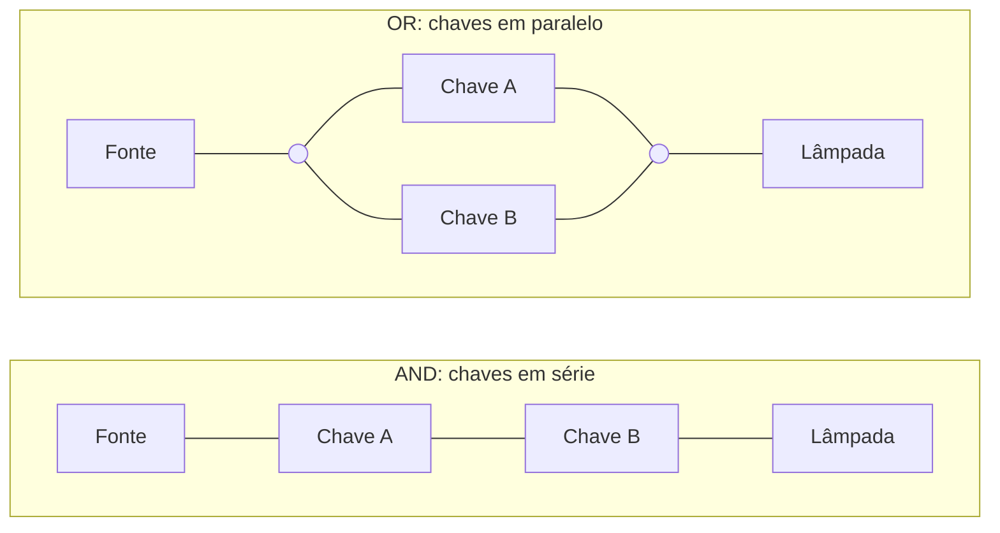
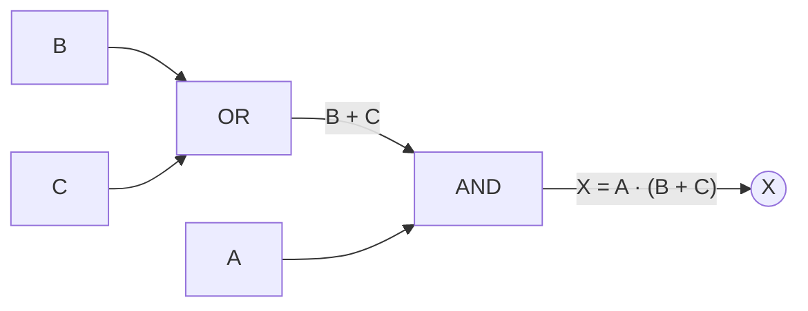

<!--META
{
  "title": "Portas Lógicas e Funções",
  "header": "Portas Lógicas e Funções",
  "tema": "Da lógica formal à eletrônica digital: conectivos lógicos (E, OU, condicional, bicondicional, OU exclusivo), portas AND, OR e NOT, notação booleana, tabelas-verdade, circuitos integrados TTL e análise de circuitos combinacionais.",
  "typing": ["George Boole e a lógica matemática", "AND: Y = A·B; OR: Y = A+B; NOT: Y = A'", "CIs TTL 7408, 7432 e 7404", "Analise o circuito e preencha a tabela-verdade"],
  "tecnologias": "Álgebra booleana, circuitos TTL; Python nos exemplos desta documentação",
  "tipo": "Teoria com exercícios de análise de circuitos",
  "professor": "Prof. Lucas Gomes Moreira",
  "badges": [["Tópico", "Portas lógicas", "FF781F"], ["Conteúdo", "Teoria + Circuitos", "FF4500"]],
  "icons": "py",
  "icons_alt": "Python",
  "limitacoes": "Os circuitos dos exercícios são imagens; as expressões foram lidas dos diagramas e das tabelas do próprio material, e todas as tabelas-verdade foram recalculadas em Python.",
  "files": {
    "Aula 03 - Portas Lógicas e Funções.pdf": "Slides: origem da lógica booleana, conectivos lógicos com exemplos do cotidiano, portas AND, OR e NOT (símbolo, tabela, analogia elétrica, diagrama de tempo e CI) e exercícios de análise de circuitos com tabelas-verdade.",
    "assets/portas-basicas.svg": "Diagrama original desta documentação: símbolos ANSI das portas AND, OR e NOT com expressão e tabela-verdade."
  }
}
META-->

<br />

<h2 id="visao-geral">Visão geral</h2>

A [aula 02](../aula02-16-03-26/README.md) tratou da lógica como raciocínio: proposições verdadeiras ou falsas combinadas com E, OU e NÃO. Esta aula mostra que essas mesmas operações podem ser **construídas fisicamente** com transistores, na forma de **portas lógicas**.

A **eletrônica digital** tem base na teoria da lógica, que deriva da filosofia. Um ramo específico, a **lógica matemática** ou **lógica booleana**, nome dado em homenagem a George Boole (1815–1864), estuda estruturas algébricas para operadores lógicos. Na eletrônica, ela define a função de um circuito: dadas as entradas, qual deve ser a saída.

Todo sistema digital, do microcontrolador ao processador de um servidor, é feito de portas lógicas. Entender as três portas básicas e saber **analisar um circuito** a partir de sua tabela-verdade é o primeiro passo para projetar circuitos, o que será aprofundado nas aulas de álgebra booleana, De Morgan e mapas de Karnaugh.

<br />

<h2 id="objetivos">Objetivos de aprendizagem</h2>

- Relacionar lógica formal, lógica booleana e eletrônica digital.
- Montar tabelas-verdade dos conectivos **E**, **OU**, **condicional**, **bicondicional** e **OU exclusivo**.
- Reconhecer o símbolo, a expressão e a tabela-verdade das portas **AND**, **OR** e **NOT**.
- Explicar as analogias elétricas: chaves em série (AND) e em paralelo (OR).
- Ler diagramas de tempo e identificar os CIs TTL 7408, 7432 e 7404.
- Analisar um circuito combinacional: obter a expressão booleana e preencher a tabela-verdade.

<br />

<h2 id="pre-requisitos">Pré-requisitos</h2>

- Proposições, operadores E, OU, NÃO e tabelas-verdade, da [aula 02](../aula02-16-03-26/README.md#3-proposições-compostas-e-operadores-lógicos).
- Sistema binário (0 e 1) e a contagem de combinações $2^n$, da [aula 03](../aula03-17-03-26/README.md#4-o-sistema-binário).

<br />

<h2 id="fundamentacao-teorica">Fundamentação teórica</h2>

### 1. Da lógica à eletrônica

Cada circuito lógico elementar pode ser visto como uma **caixa-preta**: aplicam-se entradas e espera-se uma saída. Entradas e saídas são sempre binárias (verdadeiro/falso, sim/não, 1/0). A relação entre elas, a **função lógica**, pode ser escrita como **equação booleana** ou como **tabela-verdade**.

Essas funções são implementadas por arranjos de transistores chamados **portas lógicas** (*logic gates*) e vendidas em **circuitos integrados (CIs)**.

### 2. Conectivos lógicos no cotidiano

O material traduz cada conectivo em uma situação do dia a dia:

| Conectivo | Frase | Quando é falsa |
| :--- | :--- | :--- |
| **Conjunção** (p ∧ q) | "Estudei **e** entreguei o trabalho." | Sempre que uma das partes falha |
| **Disjunção** (p ∨ q) | "Vou ao cinema **ou** vou estudar." | Só quando nenhuma acontece ("ficou no TikTok o dia todo") |
| **Condicional** (p → q) | "**Se** chover, **então** levo guarda-chuva." | Só quando chove **e** não levou |
| **Bicondicional** (p ↔ q) | "Levo guarda-chuva **se e somente se** estiver chovendo." | Quando as partes diferem |
| **Disjunção exclusiva** (p ⊻ q) | "**Ou** levo guarda-chuva **ou** uso capa de chuva." | Quando as partes são iguais (as duas ou nenhuma) |

**Tabela-verdade completa** (1 = V, 0 = F):

| p | q | p ∧ q | p ∨ q | p → q | p ↔ q | p ⊻ q |
| :---: | :---: | :---: | :---: | :---: | :---: | :---: |
| 0 | 0 | 0 | 0 | 1 | 1 | 0 |
| 0 | 1 | 0 | 1 | 1 | 0 | 1 |
| 1 | 0 | 0 | 1 | 0 | 0 | 1 |
| 1 | 1 | 1 | 1 | 1 | 1 | 0 |

> [!TIP]
> **Por que a condicional é verdadeira quando não chove?** "Se chover, levo guarda-chuva" é uma **promessa** sobre o que acontece quando chove. Se não chove, a promessa não foi quebrada, quer você tenha levado o guarda-chuva ou não. Ela só é falsa quando chove e você não leva. Por isso $p \to q \equiv \lnot p \lor q$.

### 3. As portas básicas

<p align="center">
  
</p>

*Figura 1 — As três portas básicas. Diagrama elaborado para esta documentação.*

As portas AND, OR e NOT são chamadas de **básicas** porque praticamente todas as outras são combinações delas.

| Porta | Regra | Notação | CI TTL (conforme material) |
| :--- | :--- | :--- | :--- |
| **AND (E)** | Saída 1 **somente se todas** as entradas forem 1 | $Y = A \cdot B$ (multiplicação) | 7408: quatro portas AND de 2 entradas |
| **OR (OU)** | Saída 1 se **pelo menos uma** entrada for 1 | $Y = A + B$ (soma) | 7432: quatro portas OR de 2 entradas |
| **NOT (inversora)** | Inverte a entrada | $Y = \overline{A}$ ou $Y = A'$ | 7404: seis inversoras |

**Por que "multiplicação" e "soma"?** Com valores 0 e 1, $A \cdot B$ só vale 1 quando ambos são 1, como o AND. $A + B$ vale 1 quando algum é 1, desde que se adote a regra booleana $1 + 1 = 1$. É isso que torna possível manipular circuitos com regras parecidas com as da álgebra.

As portas AND e OR podem ter **mais de duas entradas**: $Y = A \cdot B \cdot C$ só vale 1 se as três forem 1.

### 4. Analogia elétrica



*Figura 2 — Chave fechada = 1; lâmpada acesa = 1.*

- **AND (série):** a corrente precisa atravessar **todas** as chaves, e a lâmpada só acende se todas estiverem fechadas.
- **OR (paralelo):** basta **um** caminho fechado para a lâmpada acender.

> [!NOTE]
> No slide de conclusão da analogia da porta **OU**, o texto repete a frase da porta E ("só acende se todas as chaves estiverem fechadas"), e o rótulo da pinagem do 7432 aparece como "E (AND)". Pela definição apresentada no próprio material, na porta OU a lâmpada acende se **pelo menos uma** chave estiver fechada, e o 7432 contém portas **OR**.

### 5. Comportamento no tempo

Em um **diagrama de tempo**, cada entrada é desenhada como uma onda que alterna entre 0 e 1 ao longo do tempo, e a saída é obtida instante a instante:

- **AND:** a saída fica em 1 apenas nos intervalos em que **A e B** estão em 1 simultaneamente.
- **OR:** a saída fica em 1 sempre que **A ou B** estiver em 1.
- **NOT:** a saída é a imagem "invertida" da entrada.

### 6. Analisando circuitos

Para analisar um circuito com várias portas:

1. Identifique as portas da **entrada para a saída**.
2. Escreva a expressão de cada saída intermediária, como $B + C$.
3. Combine até obter a expressão final $X$.
4. Monte a tabela com $2^n$ linhas e, se ajudar, colunas para os termos intermediários.



*Figura 3 — Primeiro circuito dos exercícios: a OR combina B e C, e a AND combina o resultado com A.*

<br />

<h2 id="exemplos-praticos">Exemplos práticos</h2>

### Exemplo básico — portas como funções Python

```python
def AND(*entradas):
    return int(all(entradas))

def OR(*entradas):
    return int(any(entradas))

def NOT(a):
    return 1 - a

print("AND(1, 1, 0) =", AND(1, 1, 0))
print("OR(0, 0, 1)  =", OR(0, 0, 1))
print("NOT(0)       =", NOT(0))
```

Saída esperada:

```text
AND(1, 1, 0) = 0
OR(0, 0, 1)  = 1
NOT(0)       = 1
```

`*entradas` permite qualquer número de entradas, como portas de 3 ou mais entradas. `all()` e `any()` implementam exatamente "todas são 1" e "pelo menos uma é 1".

### Exemplo intermediário — os conectivos da seção 2

```python
from itertools import product

print("p q | e ou -> <-> xou")
for p, q in product((0, 1), repeat=2):
    e, ou = p & q, p | q
    condicional = int((not p) or q)
    bicondicional = int(p == q)
    xou = p ^ q
    print(f"{p} {q} | {e}  {ou}  {condicional}  {bicondicional}   {xou}")
```

Saída esperada:

```text
p q | e ou -> <-> xou
0 0 | 0  0  1  1   0
0 1 | 0  1  1  0   1
1 0 | 0  1  0  0   1
1 1 | 1  1  1  1   0
```

`product((0, 1), repeat=2)` gera as 4 combinações de entrada sem laços aninhados. O resultado confere com a tabela da seção 2.

### Exemplo aplicado — simulador de tabela-verdade para qualquer circuito

Ferramentas de projeto digital fazem exatamente isto: recebem a descrição de um circuito e geram sua tabela-verdade para conferência.

```python
from itertools import product

def tabela(nome, funcao):
    print(nome)
    print("A B C | X")
    for a, b, c in product((0, 1), repeat=3):
        print(f"{a} {b} {c} | {funcao(a, b, c)}")

tabela("X = A·(B+C)", lambda a, b, c: a & (b | c))
```

Saída esperada:

```text
X = A·(B+C)
A B C | X
0 0 0 | 0
0 0 1 | 0
0 1 0 | 0
0 1 1 | 0
1 0 0 | 0
1 0 1 | 1
1 1 0 | 1
1 1 1 | 1
```

A tabela coincide com a do material para o primeiro circuito.

<br />

<h2 id="exercicios-resolvidos">Exercícios e resoluções comentadas</h2>

O material propõe, primeiro, completar as tabelas das portas NOT, AND e OR, já resumidas na Figura 1. Depois, propõe **analisar seis circuitos** de três entradas. Para cada circuito, os slides mostram a expressão e a tabela-verdade: são **soluções do material original**. A coluna de cada circuito na tabela abaixo foi recalculada em Python e coincide com os slides.

| # | Estrutura do circuito | Expressão (material) |
| :---: | :--- | :--- |
| 1 | OR(B, C) entra em uma AND com A | $X = A \cdot (B + C)$ |
| 2 | OR(A, B) entra em outra OR com C | $X = A + B + C$ |
| 3 | AND de 3 entradas | $X = A \cdot B \cdot C$ |
| 4 | AND(A, B) e OR(B, C) entram em uma AND | $X = (A \cdot B) \cdot (B + C)$ |
| 5 | AND(A, B) e NOT(C) entram em uma OR | $X = (A \cdot B) + \overline{C}$ |
| 6 | AND(NOT A, B) e AND(A, NOT C) entram em uma OR | $X = (\overline{A} \cdot B) + (A \cdot \overline{C})$ |

**Tabela-verdade dos seis circuitos:**

| A | B | C | 1 | 2 | 3 | 4 | 5 | 6 |
| :---: | :---: | :---: | :---: | :---: | :---: | :---: | :---: | :---: |
| 0 | 0 | 0 | 0 | 0 | 0 | 0 | 1 | 0 |
| 0 | 0 | 1 | 0 | 1 | 0 | 0 | 0 | 0 |
| 0 | 1 | 0 | 0 | 1 | 0 | 0 | 1 | 1 |
| 0 | 1 | 1 | 0 | 1 | 0 | 0 | 0 | 1 |
| 1 | 0 | 0 | 0 | 1 | 0 | 0 | 1 | 1 |
| 1 | 0 | 1 | 1 | 1 | 0 | 0 | 0 | 0 |
| 1 | 1 | 0 | 1 | 1 | 0 | 1 | 1 | 1 |
| 1 | 1 | 1 | 1 | 1 | 1 | 1 | 1 | 0 |

**Raciocínio de um caso (circuito 6, linha A = 1, B = 1, C = 0):** $\overline{A} = 0$, então $\overline{A} \cdot B = 0$. $\overline{C} = 1$, então $A \cdot \overline{C} = 1$. A saída é $0 + 1 = 1$.

**Observação para as próximas aulas:** a coluna 4 é **idêntica** à de $A \cdot B$. Isso acontece porque, se $A \cdot B = 1$, então $B = 1$ e $B + C$ também vale 1. Logo, a porta OR é **redundante** nesse circuito. Descobrir simplificações como essa é o objetivo da álgebra booleana e dos mapas de Karnaugh.

**Erros comuns:** esquecer de aplicar o NOT antes da porta seguinte; montar a tabela com menos de $2^3 = 8$ linhas; confundir a ordem das combinações. Contar em binário de 000 a 111 evita esquecer linhas.

<br />

<h2 id="aplicacoes">Aplicações no mercado de trabalho</h2>

- **Projeto de hardware:** processadores, controladores e FPGAs são milhões ou bilhões de portas lógicas; engenheiros descrevem circuitos em linguagens como VHDL e Verilog.
- **Sistemas embarcados e automação:** intertravamentos de segurança, como "a máquina só liga se a porta estiver fechada **e** o botão for pressionado", são funções AND implementadas em CLPs.
- **Software:** expressões condicionais (`if a and not b`) seguem exatamente as mesmas regras, e testes de software usam tabelas-verdade para cobrir todos os casos.
- **Manutenção eletrônica:** reconhecer CIs como 7408, 7432 e 7404 e ler suas pinagens é tarefa básica em bancada.

<br />

<h2 id="boas-praticas">Boas práticas e erros comuns</h2>

| Problemático | Recomendado | Motivo |
| :--- | :--- | :--- |
| Montar a tabela "de cabeça" | Contar as entradas em binário (000 a 111) | Garante as $2^n$ combinações |
| Calcular a saída final direto | Criar colunas para termos intermediários | Facilita conferir e achar erros |
| Ler $A + B$ como soma aritmética | Lembrar que $1 + 1 = 1$ na álgebra booleana | Evita resultados "2" sem sentido |
| Ignorar portas redundantes | Simplificar a expressão antes de montar o circuito | Menos portas: menor custo e menor consumo |

<br />

<h2 id="resumo">Resumo para revisão</h2>

- **Lógica booleana** (George Boole) é a base da eletrônica digital; funções lógicas viram **portas lógicas** em CIs.
- **AND:** $Y = A \cdot B$, vale 1 só se todas as entradas forem 1 (chaves em série; CI 7408).
- **OR:** $Y = A + B$, vale 1 se alguma entrada for 1 (chaves em paralelo; CI 7432).
- **NOT:** $Y = \overline{A}$, inverte a entrada (CI 7404, seis inversoras).
- **Condicional:** falsa só em V→F. **Bicondicional:** verdadeira quando as partes são iguais. **OU exclusivo:** verdadeiro quando são diferentes.
- **Análise de circuitos:** da entrada para a saída, com termos intermediários, em uma tabela de $2^n$ linhas.

<br />

<h2 id="questoes">Questões de fixação</h2>

1. Uma porta AND de 4 entradas tem quantas linhas na tabela-verdade? Em quantas a saída é 1?
2. Escreva a expressão de um circuito em que A e B entram em uma OR e a saída dessa OR passa por uma NOT.
3. Por que "Ou levo guarda-chuva ou uso capa" é falsa quando as duas coisas acontecem?
4. Mostre que $p \to q$ tem a mesma tabela-verdade que $\overline{p} + q$.

<details>
<summary><strong>Respostas comentadas</strong></summary>

1. $2^4 = 16$ linhas. A saída é 1 em **apenas uma**, a linha 1111.
2. $X = \overline{A + B}$. Essa combinação é a porta **NOR**.
3. Porque a frase usa o **OU exclusivo**: ela afirma que exatamente uma das alternativas ocorre. Se as duas ocorrem, a afirmação é falsa.
4. $\overline{p} + q$: para (0,0), $1 + 0 = 1$; para (0,1), $1 + 1 = 1$; para (1,0), $0 + 0 = 0$; para (1,1), $0 + 1 = 1$. É exatamente a coluna $p \to q$ (1, 1, 0, 1).

</details>

<br />

<h2 id="referencias">Referências e materiais complementares</h2>

- [Python — `itertools.product`](https://docs.python.org/pt-br/3/library/itertools.html#itertools.product)
- [Python — operadores bit a bit `&`, `|`, `^`](https://docs.python.org/pt-br/3/library/stdtypes.html#bitwise-operations-on-integer-types)
- Folhas de dados dos CIs 7408, 7432 e 7404, publicadas pelos fabricantes (por exemplo, a Texas Instruments), para a pinagem completa.
- Material da pasta: [slides de portas lógicas e funções](Aula%2003%20-%20Portas%20L%C3%B3gicas%20e%20Fun%C3%A7%C3%B5es.pdf)
