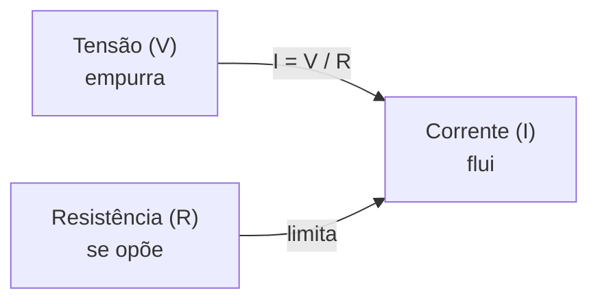

<!--META
{
  "title": "Portas Lógicas na Prática: Fundamentos de Eletricidade",
  "header": "Eletricidade para Portas Lógicas",
  "tema": "Grandezas elétricas necessárias para montar circuitos digitais: corrente, tensão, resistência, potência, corrente contínua e alternada, lei de Ohm, multímetro e o transistor bipolar.",
  "typing": ["Corrente: fluxo ordenado de elétrons (A)", "Tensão: diferença de potencial (V)", "Lei de Ohm: R = V / I", "Transistor: a chave que forma as portas lógicas"],
  "tecnologias": "Eletricidade básica, multímetro, transistor bipolar NPN (BD135); Python nos exemplos desta documentação",
  "tipo": "Teoria de base para a montagem de circuitos",
  "professor": "Prof. Lucas Gomes Moreira",
  "badges": [["Tópico", "Eletricidade básica", "FF781F"], ["Componente", "Transistor BD135", "FF4500"]],
  "icons": "py",
  "icons_alt": "Python",
  "limitacoes": "Boa parte dos slides é composta de ilustrações animadas (átomos, cargas, eletroscópio) sem texto; elas foram interpretadas visualmente. O material não traz exercícios. A relação entre o transistor e as portas lógicas (seção 6) é uma ponte explicativa desta documentação, pois o slide do transistor mostra apenas sua pinagem.",
  "files": {
    "Aula 04 - Portas Lógicas na prática.pdf": "Slides ilustrados: corrente elétrica, tensão (com animação de cargas em um eletroscópio), resistência e lei de Ohm, resumo das grandezas, corrente contínua e alternada, multímetro e pinagem do transistor bipolar BD135."
  }
}
META-->

<br />

<h2 id="visao-geral">Visão geral</h2>

Na [aula 04](../aula04-30-03-26/README.md), as portas lógicas foram tratadas como caixas-pretas que transformam 0 e 1. Para montá-las **na prática**, em uma *protoboard* com CIs, LEDs e resistores, é preciso entender o que esses 0 e 1 são fisicamente: **níveis de tensão** que fazem ou não circular **corrente**.

Esta aula apresenta as grandezas elétricas fundamentais:

- **corrente**, **tensão**, **resistência** e **potência**;
- a **lei de Ohm**, que relaciona as três primeiras;
- a diferença entre corrente **contínua (DC)** e **alternada (AC)**;
- o **multímetro**, instrumento usado para medir essas grandezas;
- o **transistor bipolar**, o componente com que as portas lógicas são construídas.

<br />

<h2 id="objetivos">Objetivos de aprendizagem</h2>

- Definir corrente, tensão, resistência e potência e suas unidades (A, V, Ω, W).
- Aplicar a **lei de Ohm** ($V = R \cdot I$) e a relação de potência ($P = V \cdot I$).
- Diferenciar corrente contínua e alternada.
- Descrever o que um multímetro mede.
- Identificar os terminais de um transistor bipolar NPN e explicar seu uso como chave.

<br />

<h2 id="pre-requisitos">Pré-requisitos</h2>

- Portas AND, OR e NOT e a analogia com chaves e lâmpadas, da [aula 04](../aula04-30-03-26/README.md#4-analogia-elétrica).
- Notação científica: $6{,}242 \times 10^{18}$.

<br />

<h2 id="fundamentacao-teorica">Fundamentação teórica</h2>

### 1. Corrente elétrica (I)

> **Corrente elétrica** é o fluxo ordenado de elétrons. Unidade: **ampère (A)**.

Em um fio metálico, os elétrons livres se movem desordenadamente. Ligado a uma pilha, o fio passa a ter um **campo elétrico**, e os elétrons se organizam em um movimento de sentido contrário ao do campo. Esse movimento ordenado é a corrente.

$$1\ \text{A} = 1\ \frac{\text{C}}{\text{s}} \qquad 1\ \text{C} \approx 6{,}242 \times 10^{18}\ \text{elétrons}$$

Uma corrente de 1 A significa que cerca de 6,242 quintilhões de elétrons passam por um ponto do circuito a cada segundo.

### 2. Tensão elétrica (V)

> **Tensão** é a diferença de potencial entre dois pontos. Unidade: **volt (V)**.

1 volt significa que 1 joule de energia é transferido para cada coulomb de carga. O material usa a analogia da **pressão** em um sistema hidráulico: a tensão é a "força" que empurra a corrente pelo circuito.

As animações dos slides mostram cargas positivas e negativas se separando e se acumulando, como em um eletroscópio. Onde existe acúmulo desigual de cargas, existe diferença de potencial. Ao ligar os dois pontos por um condutor, as cargas fluem: surge a corrente, ilustrada pela faísca do último quadro.

### 3. Resistência elétrica (R) e lei de Ohm

> **Resistência** é a capacidade de um material se opor à corrente, a "dificuldade de passagem dos elétrons". Unidade: **ohm (Ω)**.

$$R = \frac{V}{I} \qquad \Longleftrightarrow \qquad V = R \cdot I \qquad \Longleftrightarrow \qquad I = \frac{V}{R}$$

Um resistor de 1 Ω permite a passagem de 1 A quando submetido a 1 V.



*Figura 1 — As três grandezas da lei de Ohm, ilustradas no slide pela figura de "Volt", "Amp" e "Ohm".*

### 4. Potência elétrica (P)

> **Potência** é a quantidade de energia elétrica fornecida a um circuito a cada segundo, ou seja, a energia convertida em trabalho. Unidade: **watt (W)**.

$$P = V \cdot I = R \cdot I^2 = \frac{V^2}{R}$$

As duas últimas formas vêm de substituir a lei de Ohm na primeira.

### 5. Corrente contínua (DC) e alternada (AC)

| Tipo | Comportamento | Exemplos |
| :--- | :--- | :--- |
| **DC** (*Direct Current*) | Sentido constante | Pilhas, baterias, fontes de 5 V de circuitos digitais |
| **AC** (*Alternating Current*) | Inverte o sentido periodicamente | Rede elétrica residencial |

Circuitos digitais funcionam com **DC**: a fonte fornece os níveis estáveis que representam 0 e 1.

### 6. Do transistor às portas lógicas

O último slide mostra a pinagem do **transistor bipolar NPN BD135**: **1 = emissor**, **2 = coletor**, **3 = base**.

Em circuitos digitais, o transistor funciona como uma **chave controlada eletricamente**:

| Corrente na base | Estado | Corrente coletor → emissor |
| :--- | :--- | :--- |
| Sem corrente | Corte (chave aberta) | Não passa |
| Com corrente suficiente | Saturação (chave fechada) | Passa |

Essa é a ponte com a aula anterior: **dois transistores em série** funcionam como as chaves em série da porta AND, e **dois em paralelo** como as chaves em paralelo da porta OR. Um transistor que, ao conduzir, "puxa" a saída para 0 V funciona como uma porta NOT. Os CIs 7408, 7432 e 7404 da [aula 04](../aula04-30-03-26/README.md#3-as-portas-básicas) são, internamente, arranjos desse tipo.

### 7. O multímetro

Instrumento essencial de bancada. Mede **tensão**, **corrente** e **resistência** e, em muitos modelos, também frequência, capacitância, continuidade e diodos.

| Medida | Como ligar | Cuidado |
| :--- | :--- | :--- |
| Tensão | Em **paralelo** com o componente | Escolher DC ou AC e uma escala adequada |
| Corrente | Em **série**, abrindo o circuito | Nunca ligar em paralelo com a fonte no modo corrente |
| Resistência | Com o circuito **desligado** | A tensão do circuito falseia a leitura e pode danificar o aparelho |

<br />

<h2 id="exemplos-praticos">Exemplos práticos</h2>

### Exemplo básico — aplicando a lei de Ohm

```python
def corrente(tensao, resistencia):
    return tensao / resistencia

for v, r in [(5, 1000), (5, 220), (12, 100)]:
    i = corrente(v, r)
    print(f"V = {v:>2} V, R = {r:>4} Ω -> I = {i * 1000:.2f} mA, P = {v * i:.3f} W")
```

Saída esperada:

```text
V =  5 V, R = 1000 Ω -> I = 5.00 mA, P = 0.025 W
V =  5 V, R =  220 Ω -> I = 22.73 mA, P = 0.114 W
V = 12 V, R =  100 Ω -> I = 120.00 mA, P = 1.440 W
```

Quanto **menor** a resistência, **maior** a corrente para a mesma tensão. A potência cresce junto, e um resistor pequeno demais pode aquecer além do que suporta.

### Exemplo intermediário — o resistor de um LED

Na prática de portas lógicas, a saída de cada porta costuma acender um LED. O resistor em série limita a corrente. A tensão sobre ele é a da fonte **menos** a queda no LED:

$$R = \frac{V_{fonte} - V_{LED}}{I_{LED}}$$

```python
v_fonte = 5.0      # saída em nível alto de uma porta TTL alimentada com 5 V (aproximação)
v_led = 2.0        # queda típica de um LED vermelho (valor de referência)
i_led = 0.015      # 15 mA, corrente de trabalho escolhida

r = (v_fonte - v_led) / i_led
print(f"Resistor calculado: {r:.0f} Ω")
print(f"Potência no resistor: {(v_fonte - v_led) * i_led * 1000:.0f} mW")
```

Saída esperada:

```text
Resistor calculado: 200 Ω
Potência no resistor: 45 mW
```

Como 200 Ω não é um valor comercial, escolhe-se o valor **acima** mais próximo (220 Ω), que reduz levemente a corrente. Os valores de queda e corrente usados aqui são referências típicas; consulte a folha de dados do LED usado.

### Exemplo aplicado — consumo de um circuito digital

Estimar a potência de um protótipo ajuda a dimensionar a fonte ou a bateria:

```python
leds_acesos = 4
i_por_led = 0.0136                # 13,6 mA com 220 Ω (valor do exemplo anterior)
v = 5.0
p_total = leds_acesos * v * i_por_led
print(f"Potência dos LEDs: {p_total:.3f} W")
print(f"Energia em 1 h: {p_total:.3f} Wh")
```

Saída esperada:

```text
Potência dos LEDs: 0.272 W
Energia em 1 h: 0.272 Wh
```

A corrente de 13,6 mA vem de $(5 - 2) / 220 \approx 0{,}0136$ A. Energia é potência × tempo: 0,272 W durante 1 h corresponde a 0,272 Wh.

<br />

<h2 id="aplicacoes">Aplicações no mercado de trabalho</h2>

- **Eletrônica e IoT:** dimensionar resistores, verificar consumo e medir com multímetro são tarefas diárias em prototipagem.
- **Energia:** potência e energia (W, Wh, kWh) são a base de projetos de eficiência energética e de energia solar.
- **Hardware de computadores:** o consumo de processadores (TDP) e a dissipação de calor seguem $P = V \cdot I$; reduzir a tensão de operação é uma estratégia central para economizar energia.
- **Manutenção:** diagnosticar placas exige medir tensões e continuidade com segurança.

<br />

<h2 id="boas-praticas">Boas práticas e erros comuns</h2>

| Problemático | Recomendado | Motivo |
| :--- | :--- | :--- |
| Ligar o LED direto na saída da porta | Usar resistor em série | Corrente excessiva queima o LED ou danifica o CI |
| Medir resistência com o circuito ligado | Desligar a alimentação antes | A leitura sai errada e o multímetro pode ser danificado |
| Usar o multímetro em modo corrente para medir tensão | Conferir modo e borne antes de medir | Em modo corrente, o multímetro é quase um curto-circuito |
| Confundir os terminais do transistor | Consultar a pinagem (BD135: E, C, B) | Os encapsulamentos variam entre modelos |

<br />

<h2 id="resumo">Resumo para revisão</h2>

| Grandeza | Definição | Unidade |
| :--- | :--- | :---: |
| Tensão | Diferença de potencial | V |
| Corrente | Fluxo ordenado de elétrons | A |
| Resistência | Oposição à passagem de corrente | Ω |
| Potência | Energia fornecida por segundo | W |

- **Lei de Ohm:** $V = R \cdot I$. **Potência:** $P = V \cdot I$.
- **DC:** sentido constante (circuitos digitais). **AC:** alterna (rede elétrica).
- **Transistor NPN** (BD135: 1-E, 2-C, 3-B) funciona como chave: é o tijolo das portas lógicas.
- **Multímetro:** tensão em paralelo, corrente em série, resistência com o circuito desligado.

<br />

<h2 id="questoes">Questões de fixação</h2>

1. Um resistor de 330 Ω está ligado a 5 V. Qual a corrente? E a potência dissipada?
2. Se a tensão sobre um resistor dobrar, o que acontece com a corrente? E com a potência?
3. Por que o multímetro é ligado em série para medir corrente?
4. Como dois transistores podem formar uma porta AND?

<details>
<summary><strong>Respostas comentadas</strong></summary>

1. $I = 5/330 \approx 0{,}0152$ A = 15,2 mA. $P = V \cdot I \approx 5 \times 0{,}0152 \approx 0{,}076$ W (76 mW).
2. Pela lei de Ohm, a corrente **dobra**. Como $P = V^2 / R$, a potência fica **4 vezes** maior.
3. Porque a corrente que se quer medir precisa **passar pelo instrumento**. Em série, toda a corrente do ramo atravessa o multímetro.
4. Ligando-os em **série**: a corrente só chega à saída se os dois conduzirem ao mesmo tempo, ou seja, se as duas bases receberem nível alto. É o mesmo raciocínio das chaves em série.

</details>

<br />

<h2 id="referencias">Referências e materiais complementares</h2>

- BIPM — *O Sistema Internacional de Unidades (SI)*, documento de referência para as definições de ampère, volt, ohm e watt.
- Folha de dados do transistor BD135, publicada pelos fabricantes, para os limites de tensão, corrente e potência.
- Material da pasta: [slides da aula](Aula%2004%20-%20Portas%20L%C3%B3gicas%20na%20pr%C3%A1tica.pdf)
