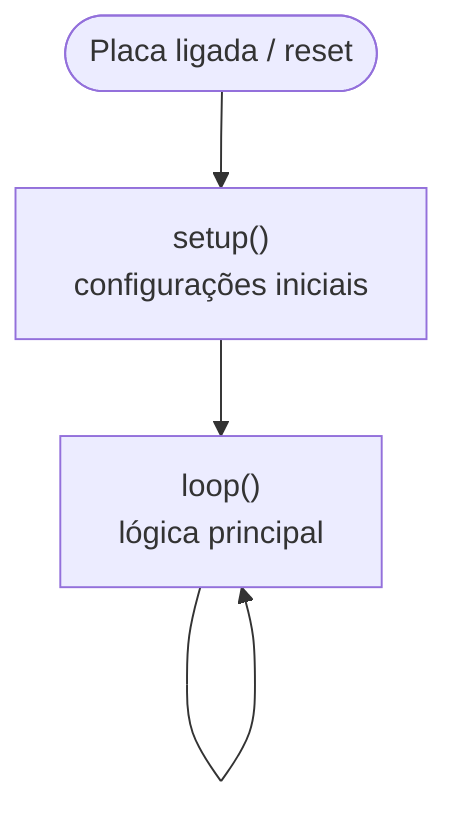

<!--META
{
  "title": "Microcontroladores: Programando o Arduino",
  "header": "Microcontroladores e Arduino",
  "tema": "Estrutura de um programa Arduino (setup e loop), comunicação serial, pinos digitais de saída, constantes, operadores aritméticos, lógicos, relacionais e de atribuição e a anatomia da placa Arduino UNO.",
  "typing": ["void setup() roda uma vez; void loop() para sempre", "pinMode, digitalWrite e delay", "Serial.begin(9600) e Serial.println", "&& || ! no lugar de E, OU, NÃO"],
  "tecnologias": "Arduino UNO (ATmega328P), linguagem Arduino (C/C++), monitor serial",
  "tipo": "Teoria e programação de microcontroladores",
  "professor": "Prof. Lucas Gomes Moreira",
  "badges": [["Linguagem", "Arduino C++", "FF781F", "arduino"], ["Placa", "Arduino UNO", "FF4500"]],
  "icons": "arduino,cpp",
  "icons_alt": "Arduino, C++",
  "limitacoes": "Os programas foram verificados apenas quanto à sintaxe (<code>g++ -fsyntax-only</code> com um cabeçalho mínimo que imita a API do Arduino). Eles não foram gravados em uma placa nem executados em simulador. Os slides da placa são fotos e ilustrações, interpretadas visualmente.",
  "files": {
    "Aula 05 - Microcontroladores.pdf": "Slides: revisão de algoritmo, construção incremental de um programa Arduino (setup/loop, Serial, pinMode, digitalWrite, delay, constante de pino), operadores e anatomia do Arduino UNO (microcontrolador, pinos analógicos, digitais/PWM, TX/RX e alimentação)."
  }
}
META-->

<br />

<h2 id="visao-geral">Visão geral</h2>

As aulas anteriores construíram a base física e lógica:

- portas lógicas ([aula 04](../aula04-30-03-26/README.md));
- eletricidade e transistores ([aula 05](../aula05-04-05-26/README.md)).

Esta aula sobe um nível. Em vez de ligar portas uma a uma, usa-se um **microcontrolador**: um computador completo em um único chip, com processador, memória e pinos de entrada e saída, que executa um **programa**.

A plataforma é o **Arduino UNO**. O material constrói um programa **passo a passo**:

1. a estrutura vazia `setup()`/`loop()`;
2. uma mensagem no monitor serial;
3. a configuração de um pino;
4. um LED piscando;
5. uma refatoração com constante nomeada.

Depois, apresenta os operadores da linguagem e "passeia" pela placa, explicando cada grupo de pinos.

<br />

<h2 id="objetivos">Objetivos de aprendizagem</h2>

- Explicar a função de `setup()` e de `loop()` em um programa Arduino.
- Usar `Serial.begin()` e `Serial.println()` para enviar mensagens ao computador.
- Configurar e acionar pinos digitais com `pinMode()` e `digitalWrite()`, controlando o tempo com `delay()`.
- Substituir números mágicos por **constantes nomeadas**.
- Usar operadores aritméticos, lógicos, relacionais e de atribuição em C/C++.
- Identificar as regiões da placa Arduino UNO: microcontrolador, pinos digitais e PWM, analógicos, TX/RX e alimentação.

<br />

<h2 id="pre-requisitos">Pré-requisitos</h2>

- Algoritmo e estruturas condicionais, da [aula 02](../aula02-16-03-26/README.md).
- Operadores E, OU e NÃO, da [aula 04](../aula04-30-03-26/README.md).
- Tensão, corrente e resistor em série com LED, da [aula 05](../aula05-04-05-26/README.md#exemplo-intermediário--o-resistor-de-um-led).

<br />

<h2 id="fundamentacao-teorica">Fundamentação teórica</h2>

### 1. Estrutura de um programa Arduino

Todo programa Arduino (*sketch*) tem duas funções obrigatórias:

```cpp
void setup() {
  // executada UMA vez, ao ligar ou reiniciar a placa
}

void loop() {
  // executada repetidamente, para sempre
}
```



*Figura 1 — Ciclo de vida de um sketch. O programa nunca "termina": o microcontrolador fica preso em `loop()` enquanto houver energia.*

`void` indica que as funções **não retornam valor**. Esse modelo (configurar uma vez e repetir para sempre) é o padrão de praticamente todo *firmware* embarcado.

### 2. Construção incremental do programa

O material evolui o mesmo programa em cinco passos:

| Passo | O que foi acrescentado | Para quê |
| :---: | :--- | :--- |
| 1 | `setup()` e `loop()` vazios | Estrutura mínima |
| 2 | `Serial.begin(9600)` e `Serial.println(...)` em `setup()` | Mensagem de boas-vindas no monitor serial |
| 3 | `pinMode(12, OUTPUT)` | Pino 12 configurado como saída |
| 4 | `digitalWrite` + `delay` em `loop()` | LED pisca: 1 s aceso, 1 s apagado |
| 5 | `const int nome_pino = 12;` | Constante nomeada no lugar do número 12 |

A versão final do material, com aspas retas:

```cpp
const int nome_pino = 12;

void setup() {
  pinMode(nome_pino, OUTPUT);
  Serial.begin(9600);
  Serial.println("--- Seja Bem-vindo ---");
}

void loop() {
  digitalWrite(nome_pino, HIGH);
  delay(1000);
  digitalWrite(nome_pino, LOW);
  delay(1000);
}
```

| Função | Significado |
| :--- | :--- |
| `Serial.begin(9600)` | Inicia a comunicação serial a **9600 bauds** (bits por segundo); o monitor serial deve usar a mesma velocidade |
| `Serial.println(texto)` | Envia o texto seguido de quebra de linha |
| `pinMode(pino, OUTPUT)` | Configura o pino como saída |
| `digitalWrite(pino, HIGH)` | Coloca o pino em nível alto (5 V no UNO) |
| `digitalWrite(pino, LOW)` | Coloca o pino em nível baixo (0 V) |
| `delay(1000)` | Pausa o programa por 1000 ms = 1 s |

> [!WARNING]
> Nos slides, o texto de `Serial.println` aparece com **aspas tipográficas** (“ ”). Copiado assim para a IDE, o código **não compila**: o C++ só aceita aspas retas (`"`). Isso foi confirmado ao compilar um trecho com as aspas tipográficas, que gerou o erro `extended character “ is not valid in an identifier`.

**Observação sobre o passo 5:** no slide intermediário, a constante `nome_pino` já foi criada, mas o código ainda usa o número `12`. Só no passo seguinte todas as ocorrências passam a usar a constante. É exatamente esse o ganho da refatoração: para trocar o LED de pino, basta alterar **uma linha**.

### 3. Operadores

| Categoria | Operadores (conforme material) |
| :--- | :--- |
| **Aritméticos** | `+` adição, `-` subtração, `*` multiplicação, `/` divisão |
| **Lógicos** | `&&` conjunção (E), `\|\|` disjunção (OU), `!` negação (NÃO) |
| **Relacionais** | `==` igual a, `!=` diferente de, `>`, `<`, `>=`, `<=` |
| **Atribuição** | `=` atribui um valor a uma variável |

São os mesmos conceitos das aulas de lógica, agora com a sintaxe de C/C++:

| Lógica (aula 02) | Booleana (aula 04) | C/C++ |
| :--- | :--- | :--- |
| A E B | $A \cdot B$ | `a && b` |
| A OU B | $A + B$ | `a \|\| b` |
| NÃO A | $\overline{A}$ | `!a` |

> [!WARNING]
> `=` **atribui** e `==` **compara**. Escrever `if (x = 5)` não compara: atribui 5 a `x`, e a condição fica sempre verdadeira. É um dos erros mais comuns em C/C++.

Em C/C++, a divisão `/` entre inteiros é **inteira**: `7 / 2` vale `3`.

### 4. Anatomia do Arduino UNO

| Região da placa | Função |
| :--- | :--- |
| **Microcontrolador** (ATmega328P, em versão DIP ou SMD) | O "computador" da placa: CPU, memória flash, RAM e periféricos |
| **ANALOG IN** (A0 a A5) | Entradas analógicas: leem tensões variáveis, como as de sensores |
| **DIGITAL** (0 a 13) | Entradas e saídas digitais; os marcados com `~` também geram **PWM** |
| **TX / RX** (pinos 1 e 0) | Comunicação serial, a mesma usada pelo `Serial` e pela gravação via USB |
| **POWER** (3V3, 5V, GND, VIN) | Alimentação para circuitos externos e entrada de alimentação da placa |
| Conector USB | Gravação do programa e comunicação serial com o computador |

O último slide destaca o **pino 12** (usado no programa) e o **GND** (o retorno do circuito do LED).

> [!TIP]
> **Evite os pinos 0 e 1** para LEDs ou botões quando usar `Serial`: eles são o TX e o RX da comunicação com o computador.

<br />

<h2 id="exemplos-praticos">Exemplos práticos</h2>

### Exemplo básico — o programa do material

O código final da seção 2 faz o LED no pino 12 piscar com período de 2 s (frequência de 0,5 Hz) e imprime "--- Seja Bem-vindo ---" **uma única vez**, porque a mensagem está em `setup()`.

**Montagem:** pino 12 → resistor de 220 Ω → LED (perna longa) → GND.

### Exemplo intermediário — contando ciclos com atribuição e operadores

```cpp
const int pino_led = 12;
int piscadas = 0;

void setup() {
  pinMode(pino_led, OUTPUT);
  Serial.begin(9600);
  Serial.println("--- Seja Bem-vindo ---");
}

void loop() {
  digitalWrite(pino_led, HIGH);
  delay(500);
  digitalWrite(pino_led, LOW);
  delay(500);

  piscadas = piscadas + 1;          // atribuição: novo valor = valor antigo + 1
  Serial.print("Piscadas: ");
  Serial.println(piscadas);

  if (piscadas % 10 == 0) {
    Serial.println("Mais 10 ciclos concluidos");
  }
}
```

**Saída esperada no monitor serial** (uma linha por segundo):

```text
--- Seja Bem-vindo ---
Piscadas: 1
Piscadas: 2
...
Piscadas: 10
Mais 10 ciclos concluidos
Piscadas: 11
```

`piscadas` é declarada **fora** das funções (variável global) para manter o valor entre as chamadas de `loop()`. Uma variável declarada dentro de `loop()` seria recriada com 0 a cada repetição. `%` é o resto da divisão, e `piscadas % 10 == 0` é verdadeiro a cada 10 ciclos.

### Exemplo aplicado — uma porta AND em software

Um intertravamento de segurança: o LED (que poderia ser um motor) só liga se um **botão** estiver pressionado **e** uma **chave de segurança** estiver ativada. É a porta AND da aula 04, agora feita em código:

```cpp
const int pino_led = 12;
const int pino_botao = 7;
const int pino_chave = 8;

void setup() {
  pinMode(pino_led, OUTPUT);
  pinMode(pino_botao, INPUT);
  pinMode(pino_chave, INPUT);
  Serial.begin(9600);
}

void loop() {
  int botao = digitalRead(pino_botao);
  int chave = digitalRead(pino_chave);

  if (botao == HIGH && chave == HIGH) {     // porta AND em software
    digitalWrite(pino_led, HIGH);
  } else {
    digitalWrite(pino_led, LOW);
  }
}
```

Trocar `&&` por `||` transforma o circuito em uma porta OR, **sem mexer na fiação**. É a grande vantagem do microcontrolador sobre a lógica fixa em CIs.

> [!NOTE]
> Com `INPUT`, cada botão precisa de um resistor de *pull-down* para o GND. Sem ele, o pino fica "flutuando" e a leitura é aleatória. Outra opção é usar `INPUT_PULLUP`, com o botão ligado ao GND, e inverter a lógica (pressionado = `LOW`).

<br />

<h2 id="aplicacoes">Aplicações no mercado de trabalho</h2>

- **IoT e automação:** sensores residenciais, irrigação automática e estações meteorológicas usam microcontroladores com o mesmo modelo `setup`/`loop`.
- **Indústria:** CLPs (controladores lógicos programáveis) executam ciclos de varredura análogos ao `loop()`.
- **Prototipagem de produtos:** o Arduino valida ideias rapidamente antes de um projeto de placa dedicado.
- **Depuração:** o monitor serial é a ferramenta mais básica de *log* em sistemas embarcados.

<br />

<h2 id="boas-praticas">Boas práticas e erros comuns</h2>

| Problemático | Recomendado | Motivo |
| :--- | :--- | :--- |
| Números mágicos (`digitalWrite(12, HIGH)`) | `const int nome_pino = 12;` | Uma única alteração troca o pino |
| Aspas tipográficas copiadas de slides | Aspas retas `"` | O compilador rejeita “ ” |
| `if (x = 5)` | `if (x == 5)` | `=` atribui, `==` compara |
| Velocidade do monitor diferente de `Serial.begin` | Usar 9600 nos dois | Caracteres ilegíveis no monitor |
| `delay()` longo em programas que leem botões | Temporização com `millis()` | Durante o `delay`, o programa não reage a entradas |

<br />

<h2 id="resumo">Resumo para revisão</h2>

- **Microcontrolador:** CPU, memória e E/S em um chip; o Arduino UNO usa o ATmega328P.
- **`setup()`** roda uma vez; **`loop()`** repete para sempre.
- **Serial:** `Serial.begin(9600)` e `Serial.println("...")`.
- **Pinos digitais:** `pinMode(p, OUTPUT)`, `digitalWrite(p, HIGH/LOW)`, `delay(ms)`.
- **Constantes:** `const int nome = valor;`.
- **Operadores:** aritméticos `+ - * /`; lógicos `&& || !`; relacionais `== != > < >= <=`; atribuição `=`.
- **Placa:** ANALOG IN (A0–A5), DIGITAL (0–13, `~` = PWM), TX/RX (0 e 1), POWER (3V3, 5V, GND, VIN).

<br />

<h2 id="questoes">Questões de fixação</h2>

1. O que aconteceria se `Serial.println("--- Seja Bem-vindo ---")` fosse movido para dentro de `loop()`?
2. Como fazer o LED ficar aceso 200 ms e apagado 800 ms?
3. Qual a diferença entre `piscadas = piscadas + 1` e `piscadas == piscadas + 1`?
4. Por que `piscadas` precisa ser declarada fora de `loop()`?

<details>
<summary><strong>Respostas comentadas</strong></summary>

1. A mensagem seria enviada **a cada ciclo** (a cada 2 s no programa original), e não apenas ao ligar.
2. Trocar o primeiro `delay(1000)` por `delay(200)` e o segundo por `delay(800)`.
3. A primeira é uma **atribuição**: aumenta `piscadas` em 1. A segunda é uma **comparação** que sempre resulta em falso e não altera nada.
4. Variáveis declaradas dentro de uma função são recriadas a cada chamada. Como `loop()` é chamada repetidamente, a contagem voltaria a 0 toda vez.

</details>

<br />

<h2 id="referencias">Referências e materiais complementares</h2>

- [Arduino — documentação oficial](https://docs.arduino.cc/)
- [Arduino — referência da linguagem](https://docs.arduino.cc/language-reference/)
- Material da pasta: [slides de microcontroladores](Aula%2005%20-%20Microcontroladores.pdf)
