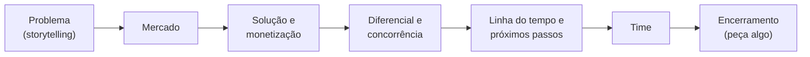

<!--META
{
  "title": "Como Está o Seu Pitch?",
  "header": "Como Está o Seu Pitch?",
  "tema": "Pitch como discurso de convencimento: tipos de pitch, estrutura (problema, mercado, solução, diferencial, próximos passos, time e encerramento) e boas práticas de design de apresentações.",
  "typing": ["Pitch: convencer a audiência de uma ideia", "Problema → mercado → solução → time", "Uma informação por slide", "Ataque o cérebro, depois o coração"],
  "tipo": "Competência de comunicação (preparação para apresentações de projetos)",
  "professor": "Prof. Lucas Gomes Moreira",
  "badges": [["Tópico", "Pitch e apresentação", "FF781F"], ["Competência", "Comunicação", "FF4500"]],
  "limitacoes": "Os slides de design são majoritariamente visuais (exemplos de “certo e errado”), interpretados a partir das imagens. A expressão “formato 3 / 30 / 3 / 30” aparece sem detalhamento no material; a interpretação apresentada aqui está identificada como tal.",
  "files": {
    "Aula 06 - Como está o seu Pitch.pdf": "Slides sobre pitch: definição, tipos, dicas gerais, estrutura macro, dicas de design de slides, dicas adicionais e sites de imagens gratuitas."
  }
}
META-->

 

<h2 id="visao-geral">Visão geral</h2>

Um projeto tecnicamente excelente pode fracassar se ninguém entender por que ele importa. Esta aula trata do **pitch**: um discurso feito para **convencer** uma audiência de uma ideia ou projeto.

A frase que abre o material resume o desafio:

> "Ninguém está interessado no seu negócio da mesma forma que você." — Andrea Barrica, *500 Startups pitch coach* (citada no material)

Em um curso com *sprints*, *challenges* e *Global Solutions*, apresentar o projeto faz parte da avaliação. Saber estruturar a narrativa e montar slides claros é uma competência tão profissional quanto programar.

 

<h2 id="objetivos">Objetivos de aprendizagem</h2>

- Definir pitch e identificar seus **tipos**.
- Planejar um pitch a partir do **objetivo** e da **audiência**.
- Organizar a **estrutura macro**: problema, mercado, solução e monetização, diferencial, próximos passos, time e encerramento.
- Aplicar princípios de **design de slides**: pouco texto, contraste, tipografia sem serifa, uma ideia por slide.
- Evitar armadilhas de apresentação ao vivo: vídeos, dependência de internet, excesso de dados.

 

<h2 id="pre-requisitos">Pré-requisitos</h2>

Nenhum pré-requisito técnico. Ajuda ter em mente um projeto real, como o *challenge* da disciplina, para aplicar cada recomendação.

 

<h2 id="fundamentacao-teorica">Fundamentação teórica</h2>

### 1. Tipos de pitch

| Tipo | Ênfase |
| :--- | :--- |
| **Vision pitch** | A visão: o futuro que o projeto quer criar |
| **Tech pitch** | A tecnologia, com o detalhe técnico como protagonista (mais raro) |
| **Traction pitch** | Os resultados já obtidos (usuários, vendas, métricas) |
| **Team pitch** | O time e sua capacidade de executar |

A pergunta-chave é: **o que é mais interessante sobre o seu projeto?** Tente enxergar o projeto como a provável audiência o enxerga.

### 2. Perguntas antes de montar o pitch

- Qual o **objetivo** deste pitch? O que você quer que aconteça ao final?
- Qual é a **plateia**? O que interessa a ela?
- Como deixá-la "de boca aberta"?
- Como manter todos engajados depois dos primeiros 30 segundos? Distrações são normais.
- Você está usando palavras técnicas demais?
- Seu time está bem representado?

O material resume a estratégia como **"atacar o cérebro, depois o coração"**: primeiro convencer com lógica (problema real, mercado, solução viável), depois criar conexão emocional.

### 3. Estrutura macro

*Figura 1 — Sequência recomendada pelo material.*

| Etapa | Orientações do material |
| :--- | :--- |
| **Problema** | O "famoso *storytelling*": uma história concreta que faça a plateia sentir o problema |
| **Mercado** | Do caso específico, para mais gente sofrendo, até o mercado completo |
| **Solução e monetização** | "Não seja marqueteiro, sem *slogan*"; diga quanto se ganha, por exemplo a média por trabalho ou produto |
| **Diferencial e concorrência** | Por que esta solução, e não as que já existem |
| **Linha do tempo e próximos passos** | O que já foi feito e o que vem a seguir |
| **Time** | Nome, sobrenome, função e foto |
| **Encerramento** | Contato e um pedido claro: "peça algo" |

### 4. Design de slides

| Evite | Prefira | Por quê |
| :--- | :--- | :--- |
| *Template* padrão | Identidade visual coerente com o projeto | O *template* padrão transmite falta de personalidade |
| Textos longos | Frases curtas | "Ou a pessoa presta atenção no que você diz ou ela lê" |
| Listas de *bullet points* | Uma informação por slide | "Menos é mais" |
| Fontes serifadas | Fontes *sans serif* | São mais confortáveis para leitura em tela |
| Pouco contraste e "arco-íris" de cores | Fundo claro com letra escura (em projetor) e paleta harmônica | Legibilidade e unidade visual |
| Slides lotados de imagens | Uma imagem como âncora da fala | A imagem ajuda a associar a fala ao slide |
| Dados "frios" | Dado + imagem com apelo emocional | Exemplo do material: "chuva no sertão 90% abaixo do esperado" exibido como **−90%** sobre uma imagem |

### 5. Dicas adicionais

- **Não use vídeos**, não dependa de internet nem de som. No máximo, um GIF, e sempre com uma versão sem GIF para salvar em PDF.
- **Cuidado com o formato do arquivo**: o arquivo precisa abrir no computador da apresentação.
- **Evite gráficos** complexos no pitch.
- **Uma só pessoa apresenta**, mas **todos** devem saber fazer o pitch.
- **Energia** ao apresentar: "não seja o nana neném".
- **Formato "3 / 30 / 3 / 30":** o material não detalha a expressão. Uma leitura possível é preparar o pitch em versões de durações diferentes (de segundos a minutos), para adaptá-lo ao tempo disponível. *Esta interpretação é desta documentação.*

**Bancos de imagens indicados no material:** pixabay.com, freepik.com, flaticon.com e unsplash.com. Verifique sempre a licença de uso e a exigência de atribuição de cada imagem.

 

<h2 id="exemplos-praticos">Exemplos práticos</h2>

### Exemplo básico — transformando um slide ruim

| Versão ruim | Versão melhor |
| :--- | :--- |
| Título: "Nosso Projeto"; cinco *bullets* com frases longas sobre funcionalidades | Uma frase grande: "**Uma em cada três** entregas atrasa por erro de rota" (dado ilustrativo) sobre uma foto de um caminhão parado |

A segunda versão apresenta **um problema**, com **um dado** e **uma imagem âncora**. A explicação fica na fala.

### Exemplo intermediário — roteiro de pitch de 3 minutos para um projeto acadêmico

Um projeto hipotético, um sistema que monitora o consumo de energia de uma casa, ilustra a estrutura:

| Tempo | Etapa | Fala resumida |
| :---: | :--- | :--- |
| 0:00–0:30 | Problema | História de uma família surpreendida pela conta de luz |
| 0:30–0:50 | Mercado | Quantas residências enfrentam o mesmo problema (dado com fonte) |
| 0:50–1:40 | Solução | Sensor + aplicativo que alerta picos de consumo; demonstração com uma imagem |
| 1:40–2:00 | Diferencial | O que as soluções existentes não fazem |
| 2:00–2:20 | Próximos passos | Protótipo atual e o que falta |
| 2:20–2:40 | Time | Quatro rostos, nomes e funções |
| 2:40–3:00 | Encerramento | Pedido claro ("queremos testar com 10 famílias") e contato |

### Exemplo aplicado — checklist antes de apresentar

- [ ] O objetivo do pitch cabe em uma frase?
- [ ] O primeiro slide desperta interesse em até 30 segundos?
- [ ] Cada slide tem **uma** ideia?
- [ ] A apresentação funciona sem internet, sem som e em PDF?
- [ ] Todos do time conseguem apresentar sozinhos?
- [ ] O encerramento termina com um pedido concreto?

 

<h2 id="aplicacoes">Aplicações no mercado de trabalho</h2>

- **Startups:** captar investimento em rodadas e programas de aceleração depende de um pitch curto e convincente.
- **Engenharia de software:** apresentar uma proposta de arquitetura ou pedir priorização de uma melhoria técnica é um pitch para a liderança.
- **Vendas técnicas e consultoria:** demonstrar valor ao cliente sem excesso de jargão.
- **Carreira:** entrevistas e apresentações pessoais ("fale sobre você") seguem a mesma lógica de problema, solução e resultado.

 

<h2 id="boas-praticas">Boas práticas e erros comuns</h2>

| Erro comum | Alternativa |
| :--- | :--- |
| Começar pela tecnologia | Começar pelo **problema** e por quem sofre com ele |
| Ler os slides | Usar o slide como apoio visual e a fala como conteúdo |
| *Slogans* e adjetivos vazios ("revolucionário") | Números, exemplos e resultados concretos |
| Terminar com "é isso, obrigado" | Terminar com um pedido e um contato |
| Depender de vídeo ou internet | Ter tudo localmente e uma versão em PDF |

 

<h2 id="resumo">Resumo para revisão</h2>

- **Pitch:** discurso para convencer uma audiência de uma ideia ou projeto.
- **Tipos:** visão, tecnologia, tração e time.
- **Planeje** a partir do objetivo e da plateia: cérebro primeiro, coração depois.
- **Estrutura:** problema → mercado → solução e monetização → diferencial → próximos passos → time → encerramento ("peça algo").
- **Design:** sem *template* padrão, pouco texto, uma ideia por slide, *sans serif*, contraste, cores harmônicas, imagens como âncora.
- **Ao vivo:** sem vídeo, internet ou som; uma pessoa apresenta, mas todos sabem apresentar; energia.

 

<h2 id="questoes">Questões de fixação</h2>

1. Qual tipo de pitch é mais adequado para um projeto que já tem 500 usuários ativos? Por quê?
2. Por que o material recomenda começar pelo problema, e não pela solução?
3. Reescreva o slide "Nosso app usa IA, nuvem e blockchain para otimizar processos" seguindo as dicas da aula.

<strong>Respostas comentadas</strong>

1. O **traction pitch**, porque resultados já obtidos são a evidência mais forte de que o problema existe e de que a solução funciona.
2. Porque a audiência não está tão interessada no projeto quanto o time. Sem perceber o problema, ela não tem motivo para se importar com a solução.
3. Um exemplo: "Pequenas empresas perdem **8 horas por semana** organizando notas fiscais", com uma imagem de uma mesa lotada de papéis. A explicação de como a solução resolve isso fica na fala. Jargões como "IA, nuvem e blockchain" não dizem qual problema é resolvido. *O número é ilustrativo: em um pitch real, use dados com fonte.*

 

<h2 id="referencias">Referências e materiais complementares</h2>

- Material da pasta: [slides "Como está o seu Pitch"](Aula%2006%20-%20Como%20est%C3%A1%20o%20seu%20Pitch.pdf)
- Bancos de imagens citados no material: pixabay.com, freepik.com, flaticon.com e unsplash.com
