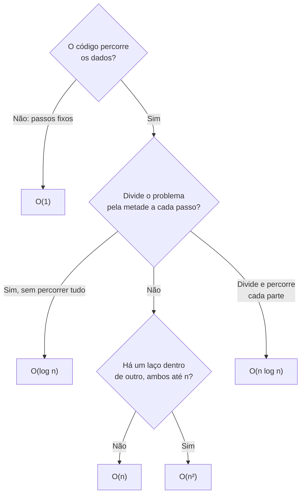

<!--META
{
  "title": "Notação Big-O Intuitiva",
  "header": "Notação Big-O",
  "tema": "Como medir o custo de operações pelo crescimento em função do tamanho da entrada: O(1), O(log n), O(n), O(n log n) e O(n²), e a complexidade das operações nas principais estruturas de dados.",
  "typing": ["ADT diz o que fazer; Big-O diz quanto custa", "O(1): não depende de n", "O(n): dobra n, dobra o trabalho", "O(n²): dobra n, quadruplica o trabalho"],
  "tecnologias": "Análise assintótica; JavaScript (Node.js) para contagem de operações",
  "tipo": "Teoria com exemplos",
  "professor": "Prof. Álvaro Gonçalves",
  "badges": [["Linguagem", "JavaScript", "FF781F", "javascript"], ["Tópico", "Complexidade", "FF4500"]],
  "icons": "js,nodejs",
  "icons_alt": "JavaScript, Node.js",
  "limitacoes": "Os slides trazem aviso de direitos autorais; as tabelas foram reproduzidas por serem dados técnicos de referência, e os textos explicativos são próprios desta documentação. O material não traz exercícios.",
  "files": {
    "DSA_E2_BigO_Aula_FIAP.pdf": "Slides: relação entre ADT e Big-O, classes O(1), O(n), O(n²) e O(n log n) com intuições e metáforas, tabela de crescimento e tabela de complexidade das operações em estruturas de dados."
  }
}
META-->

<br />

<h2 id="visao-geral">Visão geral</h2>

Na [aula anterior](../aula01-09-03-26/README.md), o ADT definiu **o que** uma estrutura faz. Esta aula pergunta **quanto custa** fazer: quantos passos uma operação exige à medida que os dados crescem.

O material resume a relação assim:

- **ADT = modelo lógico**: define o que pode ser feito.
- **Big-O = eficiência das operações**: mede o custo.
- O mesmo ADT pode ter custos diferentes conforme a implementação, porque **escolher a estrutura certa muda completamente o desempenho**.

A notação **Big-O** descreve como o tempo, ou a memória, **cresce** em função do tamanho da entrada $n$, ignorando detalhes como a velocidade do computador. O foco é o **comportamento para $n$ grande**.

<br />

<h2 id="objetivos">Objetivos de aprendizagem</h2>

- Explicar o que Big-O mede e por que ele ignora constantes.
- Reconhecer as classes O(1), O(log n), O(n), O(n log n) e O(n²) a partir do código.
- Prever o efeito de dobrar $n$ em cada classe.
- Ler a tabela de complexidade das operações (acesso, busca, inserção e remoção) nas principais estruturas.
- Justificar a escolha de uma estrutura pelo custo das operações mais frequentes.

<br />

<h2 id="pre-requisitos">Pré-requisitos</h2>

- ADT, fila e pilha, da [aula 01](../aula01-09-03-26/README.md).
- Laços `for` e laços aninhados.
- Noção de logaritmo: $\log_2 n$ é quantas vezes $n$ pode ser dividido por 2 até chegar a 1.

<br />

<h2 id="fundamentacao-teorica">Fundamentação teórica</h2>

### 1. A ideia central

Big-O conta **passos**, e não segundos, e observa como essa contagem cresce com $n$. Duas simplificações tornam a notação útil:

- **Ignorar constantes:** $3n + 5$ e $n$ crescem da mesma forma, então ambos são O(n).
- **Manter o termo dominante:** em $n^2 + 100n$, para $n$ grande, $n^2$ domina, então o custo é O(n²).

Salvo indicação, Big-O descreve o **pior caso**.

### 2. As classes da aula

| Classe | Nome | Se $n$ dobra... | Intuição | Metáfora do material |
| :--- | :--- | :--- | :--- | :--- |
| **O(1)** | Constante | o custo **não muda** | Sempre a mesma quantidade de passos | Pegar um livro em uma prateleira numerada |
| **O(log n)** | Logarítmica | o custo aumenta **um passo** | Divide o problema pela metade a cada passo | (busca binária, aula E7) |
| **O(n)** | Linear | o custo **dobra** | Percorre elemento por elemento | Procurar um nome em uma lista desordenada |
| **O(n log n)** | Quase linear | um pouco mais que o dobro | Percorre tudo ($n$) em divisões sucessivas ($\log n$) | Organizar livros dividindo em pilhas menores e juntando depois |
| **O(n²)** | Quadrática | o custo **quadruplica** | Dois laços aninhados | Cada pessoa cumprimenta todas as outras |



*Figura 1 — Roteiro prático para estimar a complexidade a partir da estrutura do código.*

### 3. Comparação de crescimento

Valores do material (com $\log$ na base 2, arredondados):

| $n$ | O(1) | O(log n) | O(n) | O(n log n) | O(n²) |
| ---: | ---: | ---: | ---: | ---: | ---: |
| 10 | 1 | 3 | 10 | 33 | 100 |
| 100 | 1 | 7 | 100 | 664 | 10 000 |
| 1 000 | 1 | 10 | 1 000 | 9 966 | 1 000 000 |

> **Regra de ouro do material:** quanto mais "n" aparece, mais lento o algoritmo fica em grandes volumes.

Com $n = 1000$, um algoritmo O(n²) faz **cem mil vezes** mais passos do que um O(log n). Nenhum computador mais rápido compensa essa diferença quando $n$ cresce.


### 4. Complexidade das operações nas estruturas

Tabela do material (tempo médio / pior caso):

| Estrutura | Acesso | Busca | Inserção | Remoção | Pior caso (acesso / busca / inserção / remoção) |
| :--- | :---: | :---: | :---: | :---: | :--- |
| Pilha (Stack) | O(n) | O(n) | O(1) | O(1) | O(n) / O(n) / O(1) / O(1) |
| Fila (Queue) | O(n) | O(n) | O(1) | O(1) | O(n) / O(n) / O(1) / O(1) |
| Vetor (Array) | O(1) | O(n) | O(n) | O(n) | O(1) / O(n) / O(n) / O(n) |
| Lista duplamente ligada | O(n) | O(n) | O(1) | O(1) | O(n) / O(n) / O(1) / O(1) |
| Skip List | O(log n) | O(log n) | O(log n) | O(log n) | O(n) / O(n) / O(n) / O(n) |
| Tabela Hash | — | O(1) | O(1) | O(1) | — / O(n) / O(n) / O(n) |
| Árvore de busca binária | O(log n) | O(log n) | O(log n) | O(log n) | O(n) / O(n) / O(n) / O(n) |
| Árvore B, Rubro-Negra, AVL | O(log n) | O(log n) | O(log n) | O(log n) | O(log n) em todas |

**Como ler a tabela:**

- **Array** tem **acesso** O(1) (vai direto à posição $i$), mas **inserção** no meio é O(n), porque é preciso deslocar os elementos.
- **Pilha, fila e lista ligada** inserem e removem nas pontas em O(1), mas **buscar** um valor exige percorrer tudo: O(n).
- **Tabela hash** busca em O(1) na média. No pior caso, com muitas colisões, degrada para O(n).
- **Árvores balanceadas** (AVL, Rubro-Negra, B) garantem O(log n) **mesmo no pior caso**. A árvore de busca binária simples não garante: se degenera em uma "lista", vira O(n).

<br />

<h2 id="exemplos-praticos">Exemplos práticos</h2>

### Exemplo básico — reconhecendo a classe pelo código

```javascript
function primeiro(v) {                 // O(1): um passo, qualquer que seja n
  return v[0];
}

function soma(v) {                     // O(n): um passo por elemento
  let total = 0;
  for (let i = 0; i < v.length; i++) total += v[i];
  return total;
}

function paresIguais(v) {              // O(n²): laços aninhados
  let pares = 0;
  for (let i = 0; i < v.length; i++)
    for (let j = i + 1; j < v.length; j++)
      if (v[i] === v[j]) pares++;
  return pares;
}

const v = [3, 1, 3, 2, 1, 3];
console.log(primeiro(v), soma(v), paresIguais(v));
```

Saída esperada:

```text
3 13 4
```

Os pares iguais são (3, 3) três vezes e (1, 1) uma vez, totalizando 4. O laço interno começa em `i + 1` para não comparar um elemento com ele mesmo nem repetir pares. Ainda assim, faz cerca de $n^2/2$ comparações, o que continua sendo O(n²).

### Exemplo intermediário — contando passos ao dobrar n

```javascript
function passosLinear(n) { let c = 0; for (let i = 0; i < n; i++) c++; return c; }
function passosQuadratico(n) { let c = 0; for (let i = 0; i < n; i++) for (let j = 0; j < n; j++) c++; return c; }
function passosLog(n) { let c = 0; while (n > 1) { n = Math.floor(n / 2); c++; } return c; }

for (const n of [1000, 2000]) {
  console.log(`n=${n}: log=${passosLog(n)} linear=${passosLinear(n)} quadrático=${passosQuadratico(n)}`);
}
```

Saída esperada:

```text
n=1000: log=9 linear=1000 quadrático=1000000
n=2000: log=10 linear=2000 quadrático=4000000
```

Ao dobrar $n$: o logarítmico ganha **1** passo, o linear **dobra** e o quadrático **quadruplica**, exatamente como descrito na seção 2. A contagem logarítmica, que divide até chegar a 1, dá $\lfloor \log_2 n \rfloor$; a tabela do material arredonda $\log_2 1000 \approx 9{,}97$ para 10.

### Exemplo aplicado — escolher a estrutura pelo uso

Um sistema precisa verificar milhares de vezes se um CPF já está cadastrado. Comparando um array (busca O(n)) com um `Set` (tabela hash, busca O(1) em média):

```javascript
const n = 100000;
const cpfs = Array.from({ length: n }, (_, i) => String(i).padStart(11, '0'));
const conjunto = new Set(cpfs);

let comparacoesArray = 0;
function existeNoArray(cpf) {
  for (const c of cpfs) { comparacoesArray++; if (c === cpf) return true; }
  return false;
}

const alvo = '00000099999';                // último elemento: pior caso do array
console.log('array:', existeNoArray(alvo), '| comparações:', comparacoesArray);
console.log('set  :', conjunto.has(alvo), '| comparações: ~1 (acesso por hash)');
```

Saída esperada:

```text
array: true | comparações: 100000
set  : true | comparações: ~1 (acesso por hash)
```

Mesmo ADT ("conjunto de CPFs com consulta de existência"), implementações diferentes, custos completamente diferentes: é a frase do material, "escolher a estrutura certa muda completamente o desempenho".

<br />

<h2 id="aplicacoes">Aplicações no mercado de trabalho</h2>

- **Backend e bancos de dados:** índices (árvores B) transformam consultas O(n) em O(log n), e é por isso que uma consulta sem índice "trava" com milhões de linhas.
- **Entrevistas técnicas:** analisar a complexidade de uma solução é pergunta obrigatória em processos seletivos de grandes empresas.
- **Ciência de dados:** um algoritmo O(n²) que roda em segundos com 1 000 linhas pode levar horas com 1 milhão. Estimar o crescimento evita surpresas.
- **Revisão de código:** identificar um laço aninhado desnecessário (O(n²)) que pode virar O(n) com um `Set` ou `Map` é uma otimização clássica.

<br />

<h2 id="boas-praticas">Boas práticas e erros comuns</h2>

| Problemático | Recomendado | Motivo |
| :--- | :--- | :--- |
| Medir eficiência só com cronômetro em dados pequenos | Analisar o crescimento (Big-O) e testar com $n$ grande | Com $n$ pequeno, tudo parece rápido |
| `array.includes(x)` dentro de um laço | Converter para `Set` antes do laço | Evita O(n²) |
| Achar que O(1) é sempre "rápido" | Lembrar que O(1) pode ter constante alta | Big-O descreve crescimento, e não tempo absoluto |
| Ignorar o pior caso da tabela hash e da BST | Conhecer quando degeneram para O(n) | Dados adversos ou mal distribuídos acontecem |

<br />

<h2 id="resumo">Resumo para revisão</h2>

- **Big-O:** crescimento do custo em função de $n$; ignora constantes e termos menores; normalmente descreve o pior caso.
- **O(1)** constante · **O(log n)** divide pela metade · **O(n)** percorre · **O(n log n)** divide e percorre · **O(n²)** laços aninhados.
- **Dobrar n:** O(1) não muda; O(log n) soma 1; O(n) dobra; O(n²) quadruplica.
- **Array:** acesso O(1), inserção e busca O(n). **Pilha e fila:** inserção e remoção O(1). **Hash:** busca O(1) média. **Árvores balanceadas:** O(log n) garantido.

<br />

<h2 id="questoes">Questões de fixação</h2>

1. Qual a complexidade de um algoritmo que executa $5n + 20$ passos? E $n^2 + 3n$?
2. Um algoritmo O(n²) leva 1 s com $n = 1000$. Quanto leva, aproximadamente, com $n = 4000$?
3. Por que inserir no início de um array é O(n), mas inserir no topo de uma pilha é O(1)?
4. Em que situação uma árvore de busca binária tem busca O(n)?

<details>
<summary><strong>Respostas comentadas</strong></summary>

1. O(n): a constante 5 e o termo 20 são ignorados. O(n²): o termo $3n$ é dominado por $n^2$.
2. $n$ quadruplicou ($\times 4$), então o tempo cresce $4^2 = 16$ vezes: cerca de **16 s**.
3. No array, inserir no início exige deslocar todos os $n$ elementos uma posição. Na pilha, o topo é o final da estrutura, e basta acrescentar sem mexer nos outros.
4. Quando ela fica **desbalanceada**, por exemplo ao inserir valores já ordenados (1, 2, 3, 4...). Cada nó só tem filho à direita, e a árvore vira uma lista.

</details>

<br />

<h2 id="referencias">Referências e materiais complementares</h2>

- [MDN Web Docs — `Set`](https://developer.mozilla.org/pt-BR/docs/Web/JavaScript/Reference/Global_Objects/Set)
- Material da pasta: [slides de Big-O](DSA_E2_BigO_Aula_FIAP.pdf)
