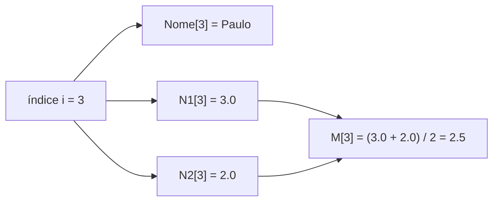

<!--META
{
  "title": "Vetores (Arrays) — Parte 2: Vetores Paralelos, Filtragem e Ordenação por Troca",
  "header": "Vetores (Arrays) — Parte 2",
  "tema": "Percorrer vetores várias vezes, vetores paralelos com índice compartilhado, filtragem com contador independente, ordenação por comparação com laços aninhados e troca com variável auxiliar.",
  "typing": ["Vetores paralelos: um índice, vários dados", "M[i] ← (N1[i] + N2[i]) / 2", "Filtrar: contador que só avança se...", "Aux ← Vet[i]; Vet[i] ← Vet[j]; Vet[j] ← Aux"],
  "tecnologias": "Pseudocódigo; JavaScript (Node.js) nos exemplos",
  "tipo": "Teoria com exemplos (continuação de vetores)",
  "professor": "Prof. Álvaro Gonçalves",
  "badges": [["Linguagem", "JavaScript", "FF781F", "javascript"], ["Tópico", "Vetores · Ordenação", "FF4500"]],
  "icons": "js,nodejs",
  "icons_alt": "JavaScript, Node.js",
  "limitacoes": "Apesar do nome do arquivo (<code>ListasEncadeadas</code>) e do destaque do encontro E4 (listas encadeadas) no cronograma, o PDF contém a <strong>continuação dos slides de vetores</strong>: o rodapé de todas as páginas é “Vetores (Arrays)”, e não há conteúdo sobre listas encadeadas. Esta documentação segue o conteúdo real do arquivo. Os slides são ilustrações, lidas visualmente.",
  "files": {
    "DSA_E4_ListasEncadeadas_FIAP.pdf": "Slides ilustrados (continuação de vetores): cursor i, preenchimento com laço, “máquina do tempo”, vetores paralelos, alinhamento relacional, filtragem dinâmica, desafio da ordenação, laços aninhados e troca com variável auxiliar."
  }
}
META-->

<br />

<h2 id="visao-geral">Visão geral</h2>

Esta aula continua a [parte 1 sobre vetores](../aula03-21-03-26/README.md) e mostra o que eles tornam possível:

1. **Voltar no tempo.** Como os dados antigos não são apagados, é possível percorrer o vetor até o fim e iniciar **outro** laço para varrer tudo de novo. É a base de análises sobre o histórico de entradas.
2. **Vetores paralelos.** Para um boletim (nome, nota 1, nota 2), um único vetor não basta, porque os dados são **heterogêneos**. A solução é criar **vários vetores do mesmo tamanho** que compartilham o mesmo índice.
3. **Filtragem.** Copiar para outro vetor apenas os dados que atendem a uma condição, usando um **contador independente**.
4. **Ordenação.** Organizar os números do menor para o maior comparando posições com **dois cursores** (`i` e `j`) e **trocando** valores com uma variável auxiliar.

<br />

<h2 id="objetivos">Objetivos de aprendizagem</h2>

- Explicar por que vetores permitem múltiplas passagens sobre os mesmos dados.
- Modelar registros com **vetores paralelos** e acessá-los pelo índice compartilhado.
- Filtrar dados para um novo vetor com um contador que só avança quando a condição é atendida.
- Implementar a ordenação por comparação com laços aninhados.
- Realizar a **troca** de dois valores com variável auxiliar e explicar por que ela é necessária.

<br />

<h2 id="pre-requisitos">Pré-requisitos</h2>

- Vetor, índice e percurso com laço, da [aula 03](../aula03-21-03-26/README.md).
- Big-O, especialmente O(n²) com laços aninhados, da [aula 02](../aula02-21-03-26/README.md#2-as-classes-da-aula).

<br />

<h2 id="fundamentacao-teorica">Fundamentação teórica</h2>

### 1. A "máquina do tempo"

Com variáveis simples, cada leitura apaga a anterior. Com vetores, **todo o histórico fica disponível**. Depois de ler `[8, 15, 22, 9, 11, 4, 30]`, é possível voltar à posição 2, comparar a última leitura com a primeira ou calcular a média e, **em um segundo laço**, contar quantos valores ficaram acima dela. Essa última tarefa é impossível sem guardar os dados.

### 2. Vetores paralelos

Um vetor é **homogêneo**: um tipo por vetor. Um boletim mistura texto (nome) e números (notas). A solução do material é criar **múltiplos vetores do mesmo tamanho que operam em sincronia**.

> **Regra de ouro (material):** cada vetor armazena um tipo de dado, mas **todos compartilham o mesmo índice controlador**.

| Índice | [1] | [2] | [3] | [4] |
| :--- | :---: | :---: | :---: | :---: |
| **Nome** | Maria | Carlos | **Paulo** | Ana |
| **N1** | 8.5 | 6.0 | **3.0** | 9.5 |
| **N2** | 9.0 | 7.5 | **2.0** | 10.0 |

A "mágica acontece na vertical": o índice [3] não é apenas um número, ele se torna o **perfil completo do aluno 3** (Paulo, 3.0, 2.0). O cálculo da média cruza as notas exatamente na mesma "fatia" vertical:

```text
M[i] <- (N1[i] + N2[i]) / 2
```



*Figura 1 — O mesmo índice acessa os três vetores, garantindo que a média pertença ao aluno correto.*

### 3. Filtragem dinâmica ("memória seletiva")

Nem todo dado lido precisa ser guardado. O exemplo do material copia para o vetor `SoC` apenas os nomes que começam com "C":

```text
se copia(nome, 1, 1) = 'C' entao
    k <- k + 1
    SoC[k] <- nome
fimse
```

O ponto-chave é o **contador independente** `k`: ele **só avança quando a condição é atendida**. O índice `i` percorre todos os nomes; o `k` aponta a próxima posição livre do vetor de destino. O resultado ocupa só o espaço necessário (Carlos e Catarina), e Maria e Gustavo são descartados.

### 4. O desafio da ordenação

**Estado inicial:** `[5, 9, 0, 6]`. **Desafio:** como ensinar um computador "cego" a organizar esses números do menor para o maior, analisando apenas **dois espaços por vez**?

**Estratégia do material:** comparar cada posição com **todas as posições à sua direita**.

- O cursor `i` **fixa** uma posição.
- O cursor `j`, que sempre começa em `i + 1`, **varre** o resto do vetor procurando um valor menor.
- Se `Vet[i] > Vet[j]`, os valores estão fora de ordem e **precisam ser trocados**.

```text
para i de 1 ate n-1 faca
    para j de i+1 ate n faca
        se Vet[i] > Vet[j] entao
            Aux    <- Vet[i]
            Vet[i] <- Vet[j]
            Vet[j] <- Aux
        fimse
    fimpara
fimpara
```

Ao final de cada valor de `i`, a posição `i` contém o menor valor dentre as posições de `i` até `n`. Por isso o vetor fica ordenado da esquerda para a direita.

### 5. O mecanismo de troca

| Passo | Operação | Vet[i] | Vet[j] | Aux |
| :---: | :--- | :---: | :---: | :---: |
| 1 | `Aux ← Vet[i]` | 5 | 0 | 5 |
| 2 | `Vet[i] ← Vet[j]` | 0 | 0 | 5 |
| 3 | `Vet[j] ← Aux` | 0 | 5 | 5 |

> [!WARNING]
> **A armadilha (material):** fazer `Vet[i] ← Vet[j]` e depois `Vet[j] ← Vet[i]` **destrói** o primeiro valor imediatamente. Os dois ficariam com 0. A variável `Aux` funciona como uma "prateleira temporária de segurança".

**Custo:** os dois laços aninhados fazem $\frac{n(n-1)}{2}$ comparações, ou seja, **O(n²)**. É o tema do encontro E8 (ordenação O(n²)).

<br />

<h2 id="exemplos-praticos">Exemplos práticos</h2>

### Exemplo básico — vetores paralelos e a média por aluno

```javascript
const nome = ['Maria', 'Carlos', 'Paulo', 'Ana'];
const n1 = [8.5, 6.0, 3.0, 9.5];
const n2 = [9.0, 7.5, 2.0, 10.0];
const m = [];

for (let i = 0; i < nome.length; i++) {
  m[i] = (n1[i] + n2[i]) / 2;           // mesma "fatia" vertical
  console.log(`${nome[i].padEnd(6)} média ${m[i].toFixed(2)}`);
}
```

Saída esperada:

```text
Maria  média 8.75
Carlos média 6.75
Paulo  média 2.50
Ana    média 9.75
```

### Exemplo intermediário — "máquina do tempo" e filtragem

```javascript
const leituras = [8, 15, 22, 9, 11, 4, 30];

// 1ª passagem: média
let soma = 0;
for (let i = 0; i < leituras.length; i++) soma += leituras[i];
const media = soma / leituras.length;

// 2ª passagem: só é possível porque os dados foram preservados
const acima = [];
let k = 0;                              // contador independente
for (let i = 0; i < leituras.length; i++) {
  if (leituras[i] > media) {
    acima[k] = leituras[i];
    k++;
  }
}
console.log('média:', media.toFixed(2));
console.log('acima da média:', acima, '| quantidade:', k);

// Filtragem de nomes que começam com "C" (exemplo do material)
const nomes = ['Maria', 'Carlos', 'Gustavo', 'Catarina'];
const soC = [];
for (let i = 0; i < nomes.length; i++) {
  if (nomes[i][0] === 'C') soC[soC.length] = nomes[i];
}
console.log('SoC:', soC);
```

Saída esperada:

```text
média: 14.14
acima da média: [ 15, 22, 30 ] | quantidade: 3
SoC: [ 'Carlos', 'Catarina' ]
```

### Exemplo aplicado — ordenação por troca com rastreamento

```javascript
const vet = [5, 9, 0, 6];
let comparacoes = 0;

for (let i = 0; i < vet.length - 1; i++) {
  for (let j = i + 1; j < vet.length; j++) {
    comparacoes++;
    if (vet[i] > vet[j]) {
      const aux = vet[i];               // prateleira temporária
      vet[i] = vet[j];
      vet[j] = aux;
      console.log(`troca i=${i}, j=${j}:`, vet.join(' '));
    }
  }
}
console.log('ordenado:', vet.join(' '), '| comparações:', comparacoes);
```

Saída esperada:

```text
troca i=0, j=2: 0 9 5 6
troca i=1, j=2: 0 5 9 6
troca i=2, j=3: 0 5 6 9
ordenado: 0 5 6 9 | comparações: 6
```

Com $n = 4$, foram $\frac{4 \cdot 3}{2} = 6$ comparações, como prevê a fórmula da seção 5. Para manter vetores paralelos ordenados (por exemplo, por média), **cada troca deve ser aplicada a todos os vetores** com os mesmos índices. Caso contrário, os nomes se separam das notas.

<br />

<h2 id="aplicacoes">Aplicações no mercado de trabalho</h2>

- **Dados tabulares:** vetores paralelos são a ideia por trás do armazenamento **colunar** (pandas, Apache Parquet e bancos analíticos): cada coluna é um vetor e o índice da linha une os dados.
- **Filtros:** `WHERE` em SQL e `filter()` em JavaScript e Python implementam a filtragem com destino separado.
- **Ordenação:** relatórios, *rankings* e buscas eficientes dependem de dados ordenados. Algoritmos O(n²) são didáticos; na prática usam-se algoritmos O(n log n), estudados no 2º semestre.

<br />

<h2 id="boas-praticas">Boas práticas e erros comuns</h2>

| Problemático | Recomendado | Motivo |
| :--- | :--- | :--- |
| Ordenar só um dos vetores paralelos | Trocar em **todos** os vetores, ou usar um vetor de objetos | Evita desalinhar os registros |
| Usar o índice `i` também para gravar o filtro | Contador independente `k` | Evita "buracos" no vetor de destino |
| Trocar sem `Aux` | Usar a variável auxiliar ou desestruturação (`[a, b] = [b, a]`) | Não perde o valor original |
| `j` começando em 0 no laço interno | `j = i + 1` | Evita comparações repetidas e trocas indevidas |

<br />

<h2 id="resumo">Resumo para revisão</h2>

- Vetores preservam o histórico: **várias passagens** sobre os mesmos dados.
- **Vetores paralelos:** um vetor por tipo de dado, **mesmo índice** para o mesmo registro.
- **Filtragem:** o índice `i` percorre tudo e o contador `k` só avança quando a condição é atendida.
- **Ordenação por troca:** `i` fixa, `j = i + 1` varre; se `Vet[i] > Vet[j]`, troca. Custo O(n²), com $n(n-1)/2$ comparações.
- **Troca:** `Aux ← Vet[i]; Vet[i] ← Vet[j]; Vet[j] ← Aux`.

<br />

<h2 id="questoes">Questões de fixação</h2>

1. Quantas comparações o algoritmo de ordenação por troca faz com 10 elementos?
2. Por que o resultado da filtragem usa um contador diferente do índice do laço?
3. Ao ordenar o vetor de médias de um boletim com vetores paralelos, o que mais precisa ser trocado?
4. Qual seria o resultado de trocar `Vet[i]` e `Vet[j]` sem variável auxiliar, com `Vet[i] = 5` e `Vet[j] = 0`?

<details>
<summary><strong>Respostas comentadas</strong></summary>

1. $\frac{10 \cdot 9}{2} = 45$ comparações.
2. Porque nem todo elemento é copiado. Usando `i`, o vetor de destino teria posições vazias (por exemplo, `SoC[1]` vazio e `SoC[2] = 'Carlos'`). O contador independente mantém o destino compacto.
3. As posições correspondentes em **todos** os vetores paralelos (nome, N1, N2), para que cada nome continue junto de suas notas.
4. Depois de `Vet[i] ← Vet[j]`, ambos valem 0. Em seguida, `Vet[j] ← Vet[i]` copia 0 de novo. O 5 se perde e o vetor fica com dois zeros.

</details>

<br />

<h2 id="referencias">Referências e materiais complementares</h2>

- [MDN Web Docs — `Array.prototype.filter`](https://developer.mozilla.org/pt-BR/docs/Web/JavaScript/Reference/Global_Objects/Array/filter)
- [MDN Web Docs — atribuição via desestruturação](https://developer.mozilla.org/pt-BR/docs/Web/JavaScript/Reference/Operators/Destructuring_assignment)
- Material da pasta: [slides de vetores, parte 2](DSA_E4_ListasEncadeadas_FIAP.pdf)
