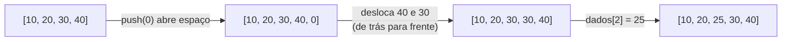
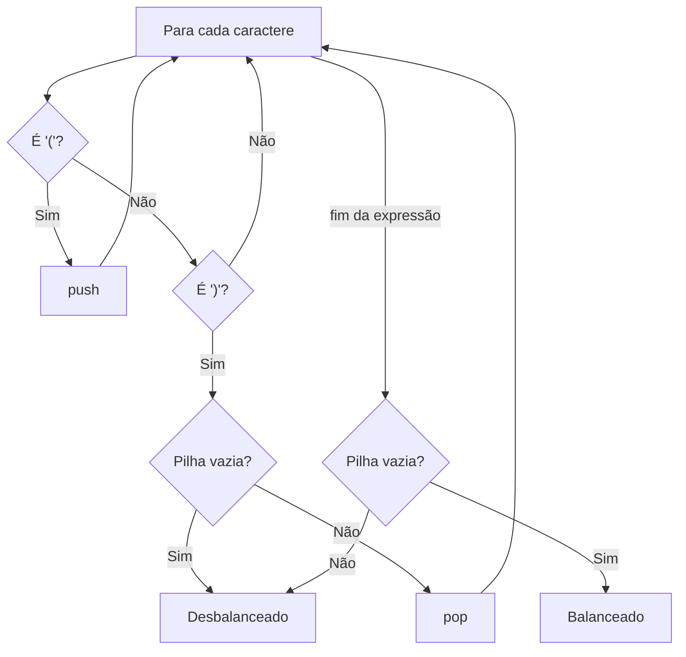

<!--META
{
  "title": "Revisão para o CP1: Vetores, Listas e Pilhas em JavaScript",
  "header": "Revisão CP1",
  "tema": "Lista incremental de 15 exercícios resolvidos em JavaScript puro: percursos em vetores, operações de lista (inserção e remoção com deslocamento) e aplicações de pilha (histórico, inversão, parênteses balanceados, gerenciador de tarefas).",
  "typing": ["Bloco 1: vetores e percursos", "Bloco 2: inserir e remover deslocando", "Bloco 3: pilhas na prática", "Parênteses balanceados com push e pop"],
  "tecnologias": "JavaScript puro, Node.js",
  "tipo": "Lista de exercícios resolvidos (revisão para avaliação)",
  "badges": [["Linguagem", "JavaScript", "FF781F", "javascript"], ["Tipo", "Revisão CP1", "FF4500"], ["Exercícios", "15", "E60000"]],
  "icons": "js,nodejs",
  "icons_alt": "JavaScript, Node.js",
  "files": {
    "DSA_E6_Revisão_CP1_FIAP(2).pdf": "Lista “DSA — Vetores, Listas e Pilhas — versão em JavaScript puro para iniciantes”: 15 exercícios incrementais com código de solução, em três blocos (vetores, listas e manipulação, pilhas)."
  }
}
META-->

<br />

<h2 id="visao-geral">Visão geral</h2>

Esta aula é uma **revisão prática** para o Checkpoint 1 (ADTs lineares). O material é uma lista de **15 exercícios incrementais**, com o código de solução de cada um, organizados em três blocos:

| Bloco | Exercícios | Foco |
| :--- | :---: | :--- |
| 1 — Vetores | 1 a 5 | Percursos, acumuladores, máximo, busca e contagem |
| 2 — Listas e manipulação | 6 a 10 | Inserção e remoção (nas pontas e no meio), verificação de ordem |
| 3 — Pilhas | 11 a 15 | Interface push/pop/peek e aplicações LIFO |

O objetivo declarado é **praticar estruturas lineares básicas** com foco em lógica, manipulação de índices, varredura, comportamento de lista e as regras LIFO (pilha) e FIFO (fila). A sugestão do material é que cada aluno **implemente cada script**, porque os blocos são incrementais, como foi feito em sala.

<br />

<h2 id="objetivos">Objetivos de aprendizagem</h2>

- Dominar os padrões de percurso: exibir, acumular, encontrar máximo, buscar e contar.
- Implementar inserção e remoção **manuais** em vetores e entender por que custam O(n).
- Verificar propriedades de um vetor, como estar ordenado.
- Implementar e aplicar o ADT Pilha em problemas reais.
- Associar cada exercício à sua complexidade.

<br />

<h2 id="pre-requisitos">Pré-requisitos</h2>

- Vetores, índices e laços, das [aulas 03](../aula03-21-03-26/README.md) e [04](../aula04-30-03-26/README.md).
- Pilhas e filas em JavaScript, da [aula 05](../aula05-07-04-26/README.md).
- Big-O, da [aula 02](../aula02-21-03-26/README.md).

<br />

<h2 id="fundamentacao-teorica">Fundamentação teórica</h2>

### 1. Padrões de percurso em vetores

Quase todo algoritmo sobre vetores combina poucos padrões:

| Padrão | Ideia | Exercícios |
| :--- | :--- | :---: |
| **Visitar** | Fazer algo com cada elemento | 1 |
| **Acumular** | Variável iniciada antes do laço e atualizada dentro | 2 |
| **Melhor até agora** | Guardar o maior ou menor visto e comparar | 3 |
| **Buscar e parar** | Encontrar e sair com `break` | 4, 10 |
| **Contar** | Contador condicional, sem parar | 5 |
| **Deslocar** | Mover elementos para abrir ou fechar espaço | 8, 9 |

### 2. Por que inserir e remover no meio custa O(n)



*Figura 1 — Inserção manual na posição 2 (exercício 8). Cada elemento depois da posição precisa se mover: no pior caso (inserir no início), são $n$ movimentos.*

A remoção (exercício 9) é o espelho: os elementos se deslocam **para a esquerda** e a última posição, agora duplicada, é descartada com `pop()`.

### 3. Pilhas como ferramenta

Os exercícios do bloco 3 mostram que a pilha é útil sempre que o **mais recente** deve ser tratado **primeiro**:

| Problema | Por que a pilha resolve |
| :--- | :--- |
| Histórico de navegação | "Voltar" desfaz a visita mais recente |
| Inverter palavra | Empilhar e desempilhar inverte a ordem |
| Parênteses balanceados | Cada `)` deve fechar o `(` aberto **mais recentemente** |
| Gerenciador de tarefas | A tarefa concluída é a última adicionada (decisão de projeto do exercício) |



*Figura 2 — Algoritmo dos parênteses balanceados (exercício 14).*

<br />

<h2 id="exemplos-praticos">Exemplos práticos</h2>

### Exemplo básico — os padrões combinados em uma função

```javascript
function resumo(v) {
  let soma = 0, maior = v[0], pares = 0;
  for (let i = 0; i < v.length; i++) {
    soma += v[i];                         // acumular
    if (v[i] > maior) maior = v[i];       // melhor até agora
    if (v[i] % 2 === 0) pares++;          // contar
  }
  return { soma, maior, pares };
}
console.log(resumo([8, 15, 3, 27, 12]));
```

Saída esperada:

```text
{ soma: 65, maior: 27, pares: 2 }
```

Um único percurso O(n) calcula três resultados: combinar padrões evita percorrer o vetor várias vezes.

### Exemplo intermediário — parênteses, colchetes e chaves

Generalizando o exercício 14, a pilha guarda **qual** símbolo foi aberto para conferir o fechamento correspondente:

```javascript
function balanceado(expr) {
  const pares = { ')': '(', ']': '[', '}': '{' };
  const pilha = [];
  for (const c of expr) {
    if ('([{'.includes(c)) pilha.push(c);
    else if (c in pares) {
      if (pilha.length === 0 || pilha.pop() !== pares[c]) return false;
    }
  }
  return pilha.length === 0;
}

for (const e of ['(a+b) * [c-d]', '{[(x)]}', '(a+b]', ')(']) {
  console.log(e.padEnd(14), balanceado(e));
}
```

Saída esperada:

```text
(a+b) * [c-d]  true
{[(x)]}        true
(a+b]          false
)(             false
```

`(a+b]` tem a mesma quantidade de aberturas e fechamentos, mas o tipo não corresponde. Só uma pilha detecta isso.

### Exemplo aplicado — verificador de ordenação com relatório

Útil para validar dados antes de uma busca binária, que exige vetor ordenado:

```javascript
function primeiraQuebra(v) {
  for (let i = 0; i < v.length - 1; i++) {
    if (v[i] > v[i + 1]) return i;      // índice onde a ordem quebra
  }
  return -1;
}

const leituras = [10, 20, 35, 30, 50];
const q = primeiraQuebra(leituras);
console.log(q === -1 ? 'ordenado' : `fora de ordem entre as posições ${q} e ${q + 1}: ${leituras[q]} > ${leituras[q + 1]}`);
```

Saída esperada:

```text
fora de ordem entre as posições 2 e 3: 35 > 30
```

<br />

<h2 id="exercicios-resolvidos">Exercícios e resoluções comentadas</h2>

> [!NOTE]
> Os códigos abaixo são as **soluções do material original**, transcritas do PDF. Cada uma foi executada em Node.js, e a saída mostrada é a obtida. Os comentários sobre conhecimento avaliado, complexidade e erros comuns são desta documentação.

{{include:rev/exercicios.md}}

<br />

<h2 id="aplicacoes">Aplicações no mercado de trabalho</h2>

- **Validação de dados:** verificar ordenação, contar ocorrências e localizar máximos são etapas de limpeza de dados (ETL) e de testes automatizados.
- **Editores e IDEs:** destacar parênteses e chaves correspondentes usa o algoritmo do exercício 14.
- **Navegadores e aplicativos:** histórico e desfazer são pilhas.
- **Entrevistas técnicas:** "parênteses balanceados", "inverter string" e "maior elemento" estão entre as perguntas introdutórias mais frequentes.

<br />

<h2 id="boas-praticas">Boas práticas e erros comuns</h2>

| Problemático | Recomendado | Motivo |
| :--- | :--- | :--- |
| Devolver textos como `'Pilha vazia'` em `pop()` | Lançar erro ou devolver `undefined` e documentar | Evita confundir mensagem com dado |
| Variáveis globais compartilhadas (`let pilha = []` fora das funções) | Encapsular em uma classe (como na [aula 05](../aula05-07-04-26/README.md#exemplo-aplicado--fila-eficiente-com-índice-de-início)) | Permite várias pilhas e protege o invariante |
| Reescrever manualmente o que a linguagem oferece, em código de produção | Usar `splice`, `includes`, `Math.max(...v)` | Menos *bugs*; a versão manual serve para **aprender** o custo |
| Esquecer o caso vazio | Testar `[]` e vetores de 1 elemento | Vetores vazios quebram `dados[0]` e `maior` |

<br />

<h2 id="resumo">Resumo para revisão</h2>

- **Percursos:** visitar, acumular, melhor até agora, buscar e parar, contar, todos O(n).
- **`push` e `pop`** no final: O(1). **Inserção e remoção no meio:** O(n), por causa do deslocamento.
- **Deslocar à direita:** de trás para frente. **Deslocar à esquerda:** da posição para o fim, depois `pop()`.
- **Pilha:** histórico, inversão, parênteses balanceados e tarefas (LIFO).
- **Proteção contra *underflow*:** verificar `length === 0` antes de remover.

<br />

<h2 id="questoes">Questões de fixação</h2>

1. Por que, no exercício 8, o laço de deslocamento precisa andar de trás para frente?
2. No exercício 5, o que aconteceria se fosse adicionado um `break` após `contador++`?
3. Qual estrutura seria mais adequada para o gerenciador de tarefas se a regra fosse "concluir na ordem de criação"? Que comando substituiria `pop()`?
4. Qual é a complexidade de verificar se um vetor está ordenado? E no melhor caso?

<details>
<summary><strong>Respostas comentadas</strong></summary>

1. Porque, andando da esquerda para a direita, `dados[3] = dados[2]` sobrescreveria o 40 antes de ele ser copiado para a posição 4. De trás para frente, cada valor é copiado antes de ser sobrescrito.
2. O laço pararia na primeira ocorrência, e o resultado seria no máximo 1 (no exemplo, 1 em vez de 3).
3. Uma **fila**: `shift()` no lugar de `pop()`, e `atual()` passaria a consultar `tarefas[0]`.
4. O(n) no pior caso, quando o vetor está ordenado e é preciso comparar todos os pares. No melhor caso, O(1): se os dois primeiros já estão fora de ordem, o `break` encerra imediatamente.

</details>

<br />

<h2 id="referencias">Referências e materiais complementares</h2>

- [MDN Web Docs — `Array.prototype.splice`](https://developer.mozilla.org/pt-BR/docs/Web/JavaScript/Reference/Global_Objects/Array/splice)
- [MDN Web Docs — igualdade estrita (`===`)](https://developer.mozilla.org/pt-BR/docs/Web/JavaScript/Reference/Operators/Strict_equality)
- Material da pasta: [lista de revisão para o CP1](DSA_E6_Revis%C3%A3o_CP1_FIAP%282%29.pdf)
