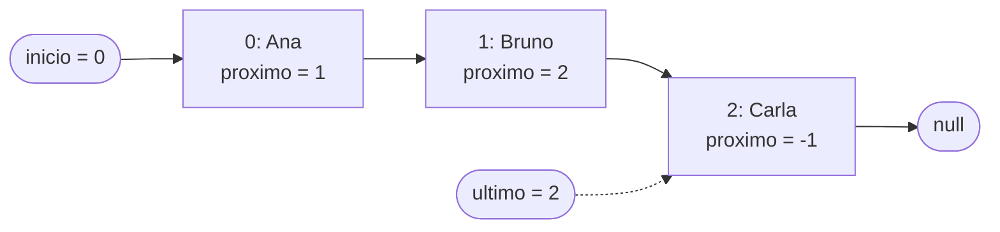
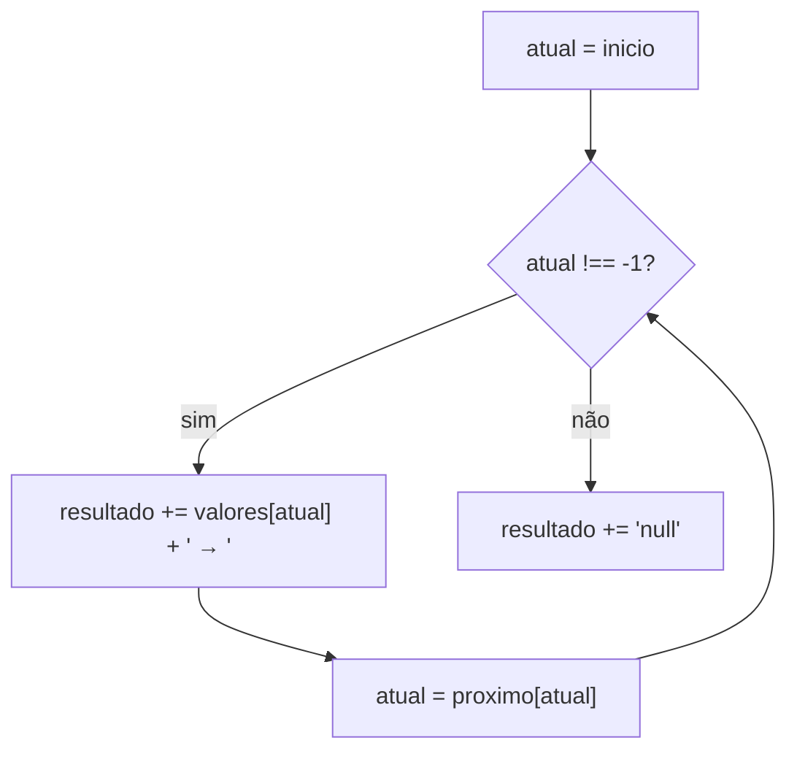

<!--META
{
  "title": "Lista Encadeada Simples em JavaScript (simulada com vetores)",
  "header": "Lista Encadeada Simples",
  "tema": "Lista encadeada simples simulada numa página HTML com dois vetores paralelos (valores e próximo) e dois marcadores (início e último): inserção no fim em O(1), percurso do início até o fim e comparação com a versão com nós e referências.",
  "typing": ["valores[i] = dado · proximo[i] = índice do próximo", "-1 marca o fim da lista", "Inserir no fim: O(1) com o marcador ultimo", "Ana → Bruno → Carla → null"],
  "tecnologias": "HTML, JavaScript (navegador); Node.js nos exemplos desta página",
  "tipo": "Aula prática (código de exemplo)",
  "badges": [["Linguagem", "JavaScript", "FF781F", "javascript"], ["Estrutura", "Lista encadeada", "FF4500"], ["Operação", "Inserção no fim", "E60000"]],
  "icons": "html,js,nodejs",
  "icons_alt": "HTML, JavaScript, Node.js",
  "limitacoes": "A pasta contém apenas a página listas2.html, sem slides nem enunciado; os objetivos e a teoria desta página foram escritos a partir do código. A página foi lida integralmente; sua lógica foi reproduzida em Node.js, sem a interface, para gerar as saídas verificadas. A interface no navegador não foi aberta nesta documentação.",
  "files": {
    "listas2.html": "Página “Lista Encadeada Simples”: campo de texto, botões “Adicionar no fim” e “Mostrar Lista” e script que simula a lista com os vetores valores e proximo e os marcadores inicio e ultimo."
  }
}
META-->

<br />

<h2 id="visao-geral">Visão geral</h2>

Depois de pilhas e filas implementadas com *arrays* (aulas [05](../aula05-07-04-26/README.md) e [06](../aula06-14-04-26/README.md)), a pasta traz uma nova estrutura linear: a **lista encadeada**. Nela, cada elemento sabe **quem vem depois dele**. A ordem da lista não depende da posição na memória, mas das ligações entre os elementos.

O arquivo `listas2.html` é uma página com um campo de texto e dois botões. O título interno diz "versão simples" e o comentário do código diz "lista encadeada simulada". Em vez de criar objetos-nó, o script usa **dois vetores paralelos**:

- `valores[i]` guarda o dado da posição `i`;
- `proximo[i]` guarda o **índice** do elemento seguinte, ou `-1` quando não há próximo.

Dois marcadores completam a estrutura: `inicio`, o índice do primeiro elemento, e `ultimo`, o do último.



*Figura 1 — Estado dos vetores depois de adicionar Ana, Bruno e Carla. As setas são os valores guardados em `proximo`.*

<br />

<h2 id="objetivos">Objetivos de aprendizagem</h2>

- Explicar o que é uma lista encadeada: elementos ligados por referências ao próximo.
- Ler o código de `listas2.html` e descrever o papel de `valores`, `proximo`, `inicio` e `ultimo`.
- Rastrear a inserção no fim e o percurso do início até o fim.
- Reconhecer por que o marcador `ultimo` torna a inserção no fim **O(1)**.
- Comparar a simulação com vetores paralelos e a implementação com nós.

<br />

<h2 id="pre-requisitos">Pré-requisitos</h2>

- Vetores e índices, das [aulas 03](../aula03-21-03-26/README.md) e [04](../aula04-30-03-26/README.md).
- Pilhas e filas em JavaScript, da [aula 05](../aula05-07-04-26/README.md).
- Big-O O(1) e O(n), da [aula 02](../aula02-21-03-26/README.md).
- Noções de HTML: `input`, `button`, `onclick` e `innerHTML`.

<br />

<h2 id="fundamentacao-teorica">Fundamentação teórica</h2>

### 1. Lista encadeada

Uma **lista encadeada simples** é uma sequência de **nós**. Cada nó tem duas partes: o **dado** e uma **referência ao próximo nó**. O último nó aponta para "nada" (`null`). Para percorrer a lista, começa-se pelo primeiro nó, a **cabeça**, e segue-se uma referência por vez.

| Característica | Vetor (*array*) | Lista encadeada |
| :--- | :--- | :--- |
| Acesso ao i-ésimo elemento | O(1), pelo índice | O(n), percorrendo desde o início |
| Inserir no início | O(n): desloca todos | O(1): só ajusta referências |
| Inserir no fim | O(1) amortizado | O(1) se houver referência ao último |
| Remover um elemento conhecido | O(n): desloca os seguintes | O(1) depois de achar o anterior; achar custa O(n) |

### 2. A simulação do arquivo: vetores paralelos

A página não cria nós. Ela representa o nó `i` pelo par `valores[i]` e `proximo[i]`. O "endereço" de um nó é o seu índice, e `-1` faz o papel de `null`. Os novos dados são sempre acrescentados ao **fim dos vetores** com `push`, mas a **ordem lógica** da lista é dada só pelos índices em `proximo`.

### 3. Inserção no fim (`adicionar`)

1. Lê o nome digitado. Se estiver vazio, mostra o alerta "Digite um nome" e encerra.
2. O novo índice é `valores.length`. O nome entra em `valores`, e `-1` entra em `proximo`, porque o novo elemento será o último.
3. Se a lista está vazia (`inicio === -1`), o novo elemento é ao mesmo tempo o primeiro e o último.
4. Caso contrário, o antigo último passa a apontar para o novo (`proximo[ultimo] = novoIndice`), e `ultimo` é atualizado.

Nenhum laço é necessário: graças ao marcador `ultimo`, a inserção no fim é **O(1)**. Sem ele, seria preciso percorrer a lista inteira para achar o último elemento, o que custa O(n).

### 4. Percurso (`mostrar`)

`mostrar` começa em `atual = inicio` e, enquanto `atual !== -1`, concatena `valores[atual] + " → "` e avança com `atual = proximo[atual]`. No fim, escreve `null`, ou "Lista vazia" se `inicio === -1`. O percurso visita cada elemento uma vez: **O(n)**.



*Figura 2 — O laço de percurso de `mostrar()`.*

<br />

<h2 id="exemplos-praticos">Exemplos práticos</h2>

### Exemplo básico — a lógica de `listas2.html` no Node.js

As funções abaixo são as do arquivo, com duas adaptações para rodar fora do navegador: o nome chega como parâmetro, e não do campo de texto, e o resultado é impresso com `console.log`, e não em `innerHTML`.

```javascript
{{include:lista/vetores.js}}
```

Saída esperada:

```text
{{include:lista/vetores.out}}
```

O nome vazio é recusado, como na página. Os vetores mostram a estrutura interna: `proximo = [1, 2, -1]` significa "0 → 1 → 2 → fim".

### Exemplo aplicado — a mesma lista com nós e referências

Em JavaScript, a forma usual é criar objetos-nó. A classe abaixo também mantém `fim`, para inserir no fim em O(1), e acrescenta inserção no início e remoção:

```javascript
{{include:lista/nos.js}}
```

Saída esperada:

```text
{{include:lista/nos.out}}
```

Na remoção, o ponto delicado é ligar o **anterior** ao **seguinte** do nó removido e atualizar `inicio` ou `fim` quando o removido estiver numa das pontas.

<br />

<h2 id="exercicios-resolvidos">Exercícios e resoluções comentadas</h2>

O material não traz exercícios. **Exercícios propostos para estudo:**

1. Partindo da lista vazia, quais são os conteúdos de `valores`, `proximo`, `inicio` e `ultimo` depois de adicionar "X" e "Y"?
2. Acrescente à versão com vetores paralelos uma função `adicionarNoInicio(nome)` e uma função `remover(nome)`.
3. Na versão com vetores, o que acontece com a posição de um elemento removido?

<details>
<summary><strong>Solução proposta para estudo</strong></summary>

1. `valores = ["X", "Y"]`, `proximo = [1, -1]`, `inicio = 0` e `ultimo = 1`.
2. Para inserir no início, o dado também vai para o fim dos vetores, mas passa a apontar para o antigo primeiro, e `inicio` muda para ele. Para remover, procura-se o elemento guardando o **anterior** e liga-se o anterior ao seguinte:

```javascript
{{include:lista/inicio_vetores.js}}
```

Saída esperada:

```text
{{include:lista/inicio_vetores.out}}
```

3. A posição continua ocupada nos vetores, mas nenhum `proximo` aponta mais para ela, então o percurso não a visita. Ela vira "lixo" que só seria reaproveitado com uma lista de posições livres. Na versão com nós, o coletor de lixo do JavaScript libera o nó que deixou de ser referenciado.

</details>

<br />

<h2 id="aplicacoes">Aplicações no mercado de trabalho</h2>

- **Bibliotecas e linguagens:** filas, pilhas e *deques* costumam ser implementados com listas encadeadas ou estruturas parecidas, por permitirem inserção e remoção nas pontas em O(1).
- **Sistemas operacionais:** listas de processos, de blocos livres de memória e de tarefas agendadas são encadeadas.
- **Histórico e navegação:** "voltar" e "avançar" de navegadores e editores usam listas (frequentemente duplamente encadeadas).
- **Ambientes sem alocação dinâmica:** a técnica da aula, com vetores e índices no lugar de ponteiros, é usada em sistemas embarcados e em *pools* de objetos.

<br />

<h2 id="boas-praticas">Boas práticas e erros comuns</h2>

| Problemático | Recomendado | Motivo |
| :--- | :--- | :--- |
| Percorrer a lista toda para inserir no fim | Manter a referência `ultimo`/`fim` | A inserção no fim cai de O(n) para O(1) |
| Esquecer de atualizar `ultimo` ao remover o último elemento | Tratar as pontas (início e fim) como casos especiais | Evita apontar para um elemento que saiu da lista |
| Usar `innerHTML` com texto digitado pelo usuário | Usar `textContent` para exibir dados | `innerHTML` interpreta HTML; um nome com marcação seria executado pela página |
| Confundir a ordem dos vetores com a ordem da lista | Seguir sempre `inicio` e `proximo` | Depois de inserções no início ou remoções, as duas ordens diferem |
| Acessar elementos da lista pelo índice como num vetor | Percorrer a partir do início | Lista encadeada não tem acesso direto em O(1) |

<br />

<h2 id="resumo">Resumo para revisão</h2>

- Lista encadeada: cada elemento guarda o dado e a referência ao próximo; o último aponta para `null`.
- `listas2.html` simula os nós com **dois vetores paralelos**: `valores[i]` e `proximo[i]`, com `-1` como fim.
- `inicio` dá o ponto de partida do percurso; `ultimo` permite inserir no fim em **O(1)**.
- Percorrer a lista é **O(n)**: segue-se `proximo` até encontrar `-1`.
- Com objetos-nó, a ideia é a mesma, com referências no lugar de índices.

<br />

<h2 id="questoes">Questões de fixação</h2>

1. Na simulação, qual valor indica que um elemento é o último da lista?
2. Por que `adicionar` não precisa de laço?
3. Se `valores = ["B", "C", "A"]`, `proximo = [1, -1, 0]` e `inicio = 2`, qual é a lista?
4. Qual operação é mais barata numa lista encadeada do que num vetor: acessar o 500º elemento ou inserir no início?

<details>
<summary><strong>Respostas comentadas</strong></summary>

1. `-1` em `proximo`, que faz o papel de `null`.
2. Porque o marcador `ultimo` já indica onde ligar o novo elemento; basta atualizar `proximo[ultimo]` e `ultimo`.
3. A partir de `inicio = 2`: A → (proximo[2] = 0) B → (proximo[0] = 1) C → (proximo[1] = -1) fim. A lista é **A → B → C → null**.
4. **Inserir no início**: O(1) na lista, contra O(n) no vetor. Acessar o 500º elemento é O(1) no vetor e O(n) na lista.

</details>

<br />

<h2 id="referencias">Referências e materiais complementares</h2>

- [MDN — Classes em JavaScript](https://developer.mozilla.org/pt-BR/docs/Web/JavaScript/Reference/Classes)
- [MDN — `Node.textContent`](https://developer.mozilla.org/pt-BR/docs/Web/API/Node/textContent)
- Material da pasta: [`listas2.html`](listas2.html)
