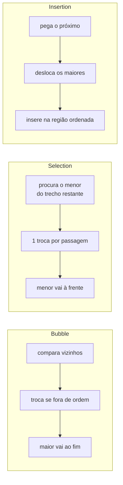

<!--META
{
  "title": "Métodos Básicos de Ordenação: Bubble, Selection e Insertion Sort",
  "header": "Métodos Básicos de Ordenação",
  "tema": "Três algoritmos de ordenação O(n²) em Python (Bubble, Selection e Insertion Sort), contagem de comparações e movimentações, efeito do estado inicial dos dados e o método sort() (Timsort) do Python.",
  "typing": ["BUBBLE: compare vizinhos", "SELECTION: encontre o menor", "INSERTION: insira no lugar certo", "sort() ordena in-place; sorted() devolve nova lista"],
  "tecnologias": "Python 3",
  "tipo": "Aula prática com atividade e desafio",
  "badges": [["Linguagem", "Python", "FF781F", "python"], ["Tópico", "Ordenação O(n²)", "FF4500"]],
  "icons": "py",
  "icons_alt": "Python",
  "files": {
    "Aula_Metodos_Basicos_de_Ordenacao_DSA.pdf": "Roteiro “Aula rápida — Métodos básicos de ordenação” (Python): conceito de ordenação, Bubble, Selection e Insertion Sort com código, comparação, complexidade, atividade prática, desafio e complemento sobre sort()/sorted()/Timsort."
  }
}
META-->

<br />

<h2 id="visao-geral">Visão geral</h2>

O segundo semestre de DSA começa em **Python** com uma pergunta simples: como transformar `[8, 3, 5, 1, 9, 4]` em `[1, 3, 4, 5, 8, 9]` **sem usar `sort()`**?

A motivação vem da busca: a **busca binária** é O(log n), mas **depende de dados ordenados**. Ordenar é, portanto, uma etapa fundamental para buscar com eficiência.

A aula apresenta três algoritmos básicos que chegam ao mesmo resultado com **estratégias diferentes**:

| Algoritmo | Ideia principal | Pior caso |
| :--- | :--- | :---: |
| **Bubble Sort** | Trocar vizinhos | O(n²) |
| **Selection Sort** | Selecionar o menor | O(n²) |
| **Insertion Sort** | Inserir na posição correta | O(n²) |

A atividade prática mede **comparações** e **movimentações**, e mostra que algoritmos da mesma classe assintótica podem se comportar de forma bem diferente na prática. O complemento explica o `sort()` do Python e por que, mesmo existindo, vale estudar os algoritmos.

<br />

<h2 id="objetivos">Objetivos de aprendizagem</h2>

- Definir ordenação e seus critérios (crescente, decrescente, alfabético).
- Implementar e rastrear Bubble, Selection e Insertion Sort.
- Explicar por que os três são O(n²) no pior caso.
- Instrumentar algoritmos para contar comparações e trocas.
- Analisar o efeito do estado inicial dos dados (ordenado, invertido, quase ordenado).
- Usar `sort()` e `sorted()`, com `reverse` e `key`, sabendo a diferença entre eles.

<br />

<h2 id="pre-requisitos">Pré-requisitos</h2>

- Vetores, troca com variável auxiliar e a ordenação por troca vista em JavaScript na [aula 04](../aula04-30-03-26/README.md#4-o-desafio-da-ordenação).
- Big-O, em especial O(n²), da [aula 02](../aula02-21-03-26/README.md).
- Python: listas, `for`, `while`, `range` e funções.

<br />

<h2 id="fundamentacao-teorica">Fundamentação teórica</h2>

### 1. O que é ordenar

**Ordenar** é reorganizar elementos segundo um critério: crescente (1, 3, 5, 7, 9), decrescente (9, 7, 5, 3, 1) ou alfabético (Ana, Bruno, Carlos, João).

### 2. Bubble Sort — "compare vizinhos"

Compara elementos **vizinhos** e troca quando estão fora de ordem. A cada passagem, o maior elemento restante "borbulha" até o fim.

Primeira passagem em `[5, 3, 8, 2]`:

| Comparação | Resultado |
| :--- | :--- |
| 5 e 3 → troca | `[3, 5, 8, 2]` |
| 5 e 8 → mantém | `[3, 5, 8, 2]` |
| 8 e 2 → troca | `[3, 5, 2, 8]`, e o 8 chegou ao final |

```python
def bubble_sort(lista):
    n = len(lista)

    for i in range(n):
        for j in range(n - 1 - i):
            if lista[j] > lista[j + 1]:
                lista[j], lista[j + 1] = lista[j + 1], lista[j]

    return lista

numeros = [5, 3, 8, 2]
print(bubble_sort(numeros))
```

Saída esperada:

```text
[2, 3, 5, 8]
```

O trecho fundamental compara vizinhos: `lista[j] > lista[j + 1]`. O limite `n - 1 - i` evita revisitar o final, que já está ordenado depois de `i` passagens.

### 3. Selection Sort — "encontre o menor"

Procura o **menor** elemento da região ainda não ordenada e o coloca na próxima **posição definitiva**: `[5, 3, 8, 2]` → menor = 2 → `[2, 3, 8, 5]`.

```python
def selection_sort(lista):
    n = len(lista)

    for i in range(n):
        menor = i

        for j in range(i + 1, n):
            if lista[j] < lista[menor]:
                menor = j

        lista[i], lista[menor] = lista[menor], lista[i]

    return lista

print(selection_sort([5, 3, 8, 2]))
```

Saída esperada:

```text
[2, 3, 5, 8]
```

> [!IMPORTANT]
> A variável `menor` guarda o **índice** do menor valor encontrado, e não o valor. É o índice que permite fazer a troca no final.

### 4. Insertion Sort — "insira no lugar certo"

Funciona como **organizar cartas na mão**: mantém uma região já ordenada à esquerda e insere cada novo elemento na posição apropriada, deslocando os maiores para a direita.

```text
8
3 8
3 5 8
2 3 5 8          [3, 5, 8 | 2]  → o 2 é inserido antes do 3
```

```python
def insertion_sort(lista):
    for i in range(1, len(lista)):
        atual = lista[i]
        j = i - 1

        while j >= 0 and lista[j] > atual:
            lista[j + 1] = lista[j]
            j -= 1

        lista[j + 1] = atual

    return lista

print(insertion_sort([8, 3, 5, 2]))
```

Saída esperada:

```text
[2, 3, 5, 8]
```



*Figura 1 — Três estratégias, o mesmo resultado.*

### 5. Complexidade

Nos três, aparece no pior caso um comportamento proporcional a $n \times n$, ou seja, **O(n²)**:

| $n$ | $n^2$ |
| ---: | ---: |
| 10 | 100 |
| 100 | 10 000 |
| 1 000 | 1 000 000 |
| 10 000 | 100 000 000 |

Dobrando $n$, o trabalho cresce cerca de **quatro vezes**. Algoritmos como **Merge Sort** e **Quick Sort** chegam a O(n log n), tema das próximas aulas.

Mesmo na mesma classe, os detalhes diferem:

| Algoritmo | Comparações | Trocas e movimentos | Melhor caso (lista já ordenada) |
| :--- | :--- | :--- | :--- |
| Bubble (versão da aula) | Sempre $n(n-1)/2$ | Uma troca por inversão | O(n²) comparações; O(n) com a otimização "parar se não houve troca" |
| Selection | Sempre $n(n-1)/2$ | No máximo $n - 1$ trocas | O(n²): continua procurando o menor |
| Insertion | Depende dos dados | Um deslocamento por inversão | **O(n)**: cada elemento já está no lugar |

### 6. O `sort()` do Python

- `lista.sort()` ordena **a própria lista** (*in-place*) e **devolve `None`**.
- `sorted(lista)` devolve **uma nova lista** ordenada e preserva a original.
- `reverse=True` ordena em ordem decrescente.
- `key=funcao` define o critério de comparação, por exemplo `key=len` para ordenar strings pelo tamanho.

| Recurso | Modifica a original? | Retorna lista ordenada? |
| :--- | :---: | :---: |
| `lista.sort()` | Sim | Não (`None`) |
| `sorted(lista)` | Não | Sim |

`sort()` **não é um algoritmo**, e sim uma interface. Internamente, o Python usa o **Timsort**, construído a partir de ideias do Merge Sort e do Insertion Sort, com várias otimizações. Ele é O(n log n) no pior caso e pode chegar perto de O(n) em entradas já parcialmente ordenadas.

**Então por que estudar os algoritmos?** Em programas reais, prefira `sort()`. Em DSA, implementar os métodos mostra como a ordenação ocorre, quantas comparações e movimentações custa e por que O(n²) se torna um problema. É "como aprender multiplicação antes de usar uma calculadora".

<br />

<h2 id="exemplos-praticos">Exemplos práticos</h2>

### Exemplo básico — `sort()` × `sorted()` e a pegadinha do `None`

```python
numeros = [5, 2, 8, 1]
ordenados = sorted(numeros)
print(numeros, ordenados)

resultado = numeros.sort()
print(resultado, numeros)

numeros.sort(reverse=True)
print(numeros)
```

Saída esperada:

```text
[5, 2, 8, 1] [1, 2, 5, 8]
None [1, 2, 5, 8]
[8, 5, 2, 1]
```

### Exemplo intermediário — ordenar com `key`

```python
nomes = ["Ana", "Alexandre", "João", "Lu"]
nomes.sort(key=len)
print(nomes)

alunos = [("Carla", 7.5), ("Bruno", 9.0), ("Ana", 7.5)]
print(sorted(alunos, key=lambda a: (-a[1], a[0])))
```

Saída esperada:

```text
['Lu', 'Ana', 'João', 'Alexandre']
[('Bruno', 9.0), ('Ana', 7.5), ('Carla', 7.5)]
```

Na segunda linha, a chave `(-nota, nome)` ordena pela nota decrescente e, em caso de empate, pelo nome. É um padrão muito usado em *rankings*.

### Exemplo aplicado — estabilidade na prática

Um algoritmo é **estável** quando preserva a ordem original de elementos com chaves iguais. O Timsort (e o Insertion Sort) são estáveis, o que permite ordenar em etapas:

```python
pedidos = [("p1", "SP", 300), ("p2", "RJ", 150), ("p3", "SP", 150), ("p4", "RJ", 300)]
pedidos.sort(key=lambda p: p[2])          # 1º: por valor
pedidos.sort(key=lambda p: p[1])          # 2º: por estado (preserva a ordem por valor)
for p in pedidos:
    print(p)
```

Saída esperada:

```text
('p2', 'RJ', 150)
('p4', 'RJ', 300)
('p3', 'SP', 150)
('p1', 'SP', 300)
```

Dentro de cada estado, os pedidos continuam ordenados por valor, graças à estabilidade.

<br />

<h2 id="exercicios-resolvidos">Exercícios e resoluções comentadas</h2>

> [!NOTE]
> As implementações instrumentadas são **propostas para estudo**, derivadas dos algoritmos do material. Os números de comparações e trocas foram obtidos ao executá-las.

### Atividade prática — comparando os algoritmos

**Enunciado (resumo):** executar os três algoritmos em `[38, 12, 45, 7, 29, 18, 41, 3, 25, 10]`. Todos devem produzir `[3, 7, 10, 12, 18, 25, 29, 38, 41, 45]`. Depois, contar **comparações** e **trocas/movimentações**.

**Objetivo (material):** perceber que algoritmos da mesma classe assintótica podem ter comportamentos concretos diferentes.

**Raciocínio:** incrementar `comparacoes` a cada comparação entre elementos e `trocas` a cada troca efetiva (ou a cada deslocamento, no Insertion). Para que as três funções recebam a mesma entrada, cada uma trabalha sobre uma **cópia** (`lista[:]`).

```python
{{include:ord/ativ.py}}
```

Saída esperada:

```text
bubble_sort     comparações=45 trocas/movimentos=28
selection_sort  comparações=45 trocas/movimentos= 6
insertion_sort  comparações=34 trocas/movimentos=28
resultado: [3, 7, 10, 12, 18, 25, 29, 38, 41, 45]
```

**Leitura dos resultados:**

- Bubble e Selection fazem **sempre** $\frac{10 \cdot 9}{2} = 45$ comparações.
- O Selection faz **muito menos trocas** (6), no máximo uma por posição. Ele é vantajoso quando escrever na memória é caro.
- O Insertion compara menos (34). Seus deslocamentos são iguais às trocas do Bubble (28), porque ambos são iguais ao número de **inversões** da lista: os pares fora de ordem.

### Desafio rápido — o estado inicial importa?

**Enunciado (resumo):** executar os três algoritmos em uma lista ordenada, uma invertida e uma quase ordenada (8 elementos) e comparar as operações.

<!-- norun -->
```python
{{include:ord/desafio2.py}}
```

Saída obtida (executando junto com as funções da atividade), no formato comparações/trocas:

```text
caso               bubble   selection   insertion
ordenada             28/0        28/0         7/0
invertida           28/28        28/4       28/28
quase_ordenada       28/1        28/1         8/1
```

**Resposta à questão do material ("o estado inicial interfere igualmente nos três?"): não.**

- O **Insertion Sort é adaptativo**: em lista ordenada, faz só $n - 1 = 7$ comparações, um comportamento O(n). Em lista quase ordenada, 8. Em lista invertida, atinge o pior caso: 28 comparações e 28 deslocamentos.
- O **Selection Sort** faz 28 comparações **em qualquer caso**: não aproveita a ordem existente.
- O **Bubble Sort** da aula também faz 28 comparações sempre, mas o número de trocas acompanha o número de inversões. Com a otimização de parar quando uma passagem não troca nada, ele passaria a ser adaptativo.

A discussão introduz os conceitos de **melhor, médio e pior caso**, **adaptabilidade**, **estabilidade** e **custo de comparações × movimentações**.

**Erro comum:** contar a troca do Selection Sort mesmo quando `menor == i` (trocar um elemento com ele mesmo). Isso infla a contagem sem mudar nada.

<br />

<h2 id="aplicacoes">Aplicações no mercado de trabalho</h2>

- **Dados:** ordenar é pré-requisito para busca binária, deduplicação, *merge* de bases e geração de relatórios.
- **Bancos de dados:** `ORDER BY` e índices dependem de algoritmos de ordenação eficientes.
- **Sistemas embarcados:** com poucos elementos e memória escassa, o Insertion Sort, simples e *in-place*, é uma escolha comum. Implementações como o Timsort também o usam em trechos pequenos.
- **Entrevistas técnicas:** implementar e analisar esses algoritmos é uma pergunta clássica.

<br />

<h2 id="boas-praticas">Boas práticas e erros comuns</h2>

| Problemático | Recomendado | Motivo |
| :--- | :--- | :--- |
| Implementar ordenação própria em produção | Usar `sort()`/`sorted()` | Timsort é O(n log n), estável e muito testado |
| `x = lista.sort()` | `lista.sort()` ou `x = sorted(lista)` | `sort()` devolve `None` |
| Guardar o **valor** mínimo no Selection Sort | Guardar o **índice** | O índice é necessário para a troca |
| Medir algoritmos em uma única entrada | Testar ordenada, invertida e aleatória | O desempenho depende do estado inicial |
| Ordenar a lista original sem querer | Trabalhar em uma cópia (`lista[:]`) quando a original precisa ser preservada | Evita efeitos colaterais |

<br />

<h2 id="resumo">Resumo para revisão</h2>

- **Bubble:** compara vizinhos e leva o maior ao fim, O(n²).
- **Selection:** encontra o menor e o coloca na posição definitiva; poucas trocas, O(n²) sempre.
- **Insertion:** insere na região ordenada; adaptativo, O(n) no melhor caso e O(n²) no pior.
- **Mesma classe ≠ mesmo comportamento:** compare comparações e movimentações.
- **Python:** `sort()` (*in-place*, `None`) × `sorted()` (nova lista); `reverse`, `key`; Timsort O(n log n), estável.
- **Próximo passo:** divisão e conquista → Merge Sort e Quick Sort (O(n log n)).

<br />

<h2 id="questoes">Questões de fixação</h2>

1. Depois da primeira passagem do Bubble Sort em `[4, 1, 3, 2]`, qual é a lista?
2. Quantas comparações o Selection Sort faz em uma lista de 20 elementos?
3. Por que o Insertion Sort é rápido em listas quase ordenadas?
4. Qual a diferença de resultado entre `sorted(nomes, key=len)` e `sorted(nomes)`?

<details>
<summary><strong>Respostas comentadas</strong></summary>

1. 4 e 1 trocam → `[1, 4, 3, 2]`; 4 e 3 trocam → `[1, 3, 4, 2]`; 4 e 2 trocam → **`[1, 3, 2, 4]`**. O 4 chegou ao final.
2. $\frac{20 \cdot 19}{2} = 190$ comparações, independentemente dos dados.
3. Porque cada novo elemento precisa ser deslocado só por poucas posições, ou nenhuma: o laço `while` termina quase imediatamente. O custo fica próximo de $n$ comparações.
4. `key=len` ordena pelo **comprimento** da string. Sem `key`, a ordenação é **lexicográfica** (alfabética, pelo código dos caracteres).

</details>

<br />

<h2 id="referencias">Referências e materiais complementares</h2>

- [Python — HOWTO de ordenação (`sort`, `sorted`, `key`, estabilidade)](https://docs.python.org/pt-br/3/howto/sorting.html)
- [Python — `list.sort`](https://docs.python.org/pt-br/3/library/stdtypes.html#list.sort)
- Material da pasta: [roteiro de métodos básicos de ordenação](Aula_Metodos_Basicos_de_Ordenacao_DSA.pdf)
