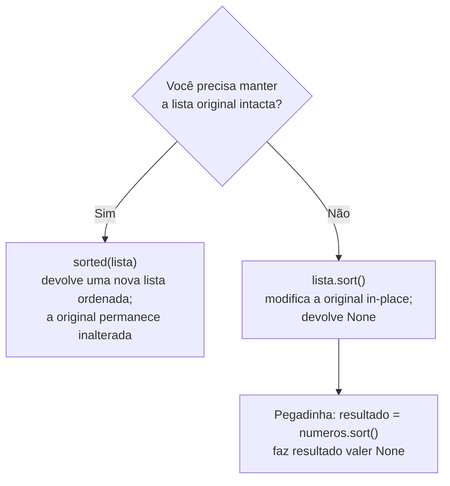

<!--META
{
  "title": "Revisão de Ordenação: A Oficina da Ordenação",
  "header": "Revisão: Ordenação",
  "tema": "Revisão visual dos métodos básicos de ordenação (Bubble, Selection e Insertion Sort), da parede de escalabilidade O(n²), do efeito das condições iniciais e das ferramentas nativas do Python (sort, sorted, Timsort).",
  "typing": ["O peso sobe à superfície (Bubble)", "O caçador de mínimos (Selection)", "Organizando o baralho (Insertion)", "Código de aula × código de produção"],
  "tecnologias": "Python 3",
  "tipo": "Revisão ilustrada",
  "professor": "Prof. Álvaro Gonçalves",
  "badges": [["Linguagem", "Python", "FF781F", "python"], ["Tipo", "Revisão", "FF4500"]],
  "icons": "py",
  "icons_alt": "Python",
  "limitacoes": "Os slides são ilustrações; o conteúdo foi lido visualmente. Os mostradores do slide “O fator das condições iniciais” (por exemplo, 7 900 comparações) não indicam o tamanho da lista usada e não puderam ser reproduzidos; esta documentação apresenta, em vez disso, contagens calculadas e verificáveis. O material não traz exercícios.",
  "files": {
    "DSA_E7_Revisão_Ordenação.pdf": "Slides ilustrados “A Oficina da Ordenação”: pré-requisito da busca binária, critérios de ordenação, os três algoritmos passo a passo e no código, diagnóstico, parede da escalabilidade, armadilha quadrática, condições iniciais, sort() × sorted(), parâmetros reverse e key, Timsort e código de aula × produção."
  }
}
META-->

<br />

<h2 id="visao-geral">Visão geral</h2>

Esta aula revisa, em formato visual, o conteúdo da [aula 09](../aula09-20-08-26/README.md). O subtítulo do material resume a proposta: **"dos algoritmos básicos às estratégias de ordenação eficientes; a mecânica oculta de como o Python organiza o caos em escala"**.

O roteiro da revisão é:

1. **Por que ordenar:** a busca binária é ultrarrápida (O(log n)), mas exige dados ordenados.
2. **Três caminhos para o mesmo destino:** Bubble, Selection e Insertion Sort.
3. **A parede da escalabilidade:** os três são O(n²).
4. **O fator das condições iniciais:** ordenada, invertida e quase ordenada custam diferente.
5. **O padrão-ouro do Python:** `sort()`, `sorted()` e o Timsort.

Use esta página como **material de revisão rápida**. As explicações completas e os exercícios estão na aula 09.

<br />

<h2 id="objetivos">Objetivos de aprendizagem</h2>

- Rastrear, passagem a passagem, os três algoritmos básicos.
- Comparar ação principal, mecânica física e pior caso de cada um.
- Explicar por que O(n²) é inviável para milhões de registros.
- Escolher entre `sort()` e `sorted()` conforme a necessidade de preservar os dados originais.
- Diferenciar algoritmos de aula (aprendizado) de ferramentas de produção (Timsort).

<br />

<h2 id="pre-requisitos">Pré-requisitos</h2>

- Métodos básicos de ordenação, da [aula 09](../aula09-20-08-26/README.md).
- Big-O, da [aula 02](../aula02-21-03-26/README.md).

<br />

<h2 id="fundamentacao-teorica">Fundamentação teórica</h2>

### 1. As metáforas do material

| Algoritmo | Metáfora | Ação principal | Mecânica | Pior caso |
| :--- | :--- | :--- | :--- | :---: |
| **Bubble Sort** | "O peso sobe à superfície" | Trocar vizinhos | Empurra os maiores para o fim | O(n²) |
| **Selection Sort** | "O caçador de mínimos" | Achar o menor | Constrói a parte ordenada desde o início | O(n²) |
| **Insertion Sort** | "Organizando o baralho" | Inserir no lugar certo | Desloca para abrir espaço | O(n²) |

Detalhes destacados nas "anatomias" dos slides:

- **Bubble:** `range(n - 1 - i)` limita a varredura e ignora a "zona verde" já ordenada no final.
- **Selection:** assume temporariamente que o primeiro elemento da área não ordenada é o menor; `menor` guarda o **índice**; faz **apenas uma troca por ciclo**.
- **Insertion:** "não há trocas puras aqui, mas sim deslocamentos": os valores maiores dão um passo à direita até surgir o espaço correto.

### 2. A parede da escalabilidade

| $n$ | Trabalho máximo ($n^2$) |
| ---: | ---: |
| 10 | 100 |
| 100 | 10 000 |
| 1 000 | 1 000 000 |
| 10 000 | 100 000 000 |

> [!NOTE]
> O slide afirma que, dobrando a entrada, o trabalho "cresce **exponencialmente**". O termo correto é **quadraticamente**: dobrar $n$ multiplica $n^2$ por 4. Crescimento exponencial ($2^n$) é muito mais rápido. Com $n = 30$, $n^2 = 900$, mas $2^n \approx$ 1,07 bilhão. A conclusão do slide continua válida: para milhões de registros, O(n²) é "catastrófico".

**A armadilha quadrática:** por isso Bubble Sort não é usado em bancos de dados de grande escala. Os algoritmos de produção são O(n log n).

### 3. O fator das condições iniciais

Algoritmos da mesma classe O(n²) têm custos práticos diferentes conforme o estado inicial. O material lembra que **comparações custam CPU e movimentações custam memória**. Uma lista quase ordenada pode exigir apenas **uma** movimentação, enquanto a lista invertida é o pior caso. As contagens exatas para listas de 8 elementos estão no [desafio da aula 09](../aula09-20-08-26/README.md#desafio-rápido--o-estado-inicial-importa).

### 4. Escolhendo entre `sort()` e `sorted()`



*Figura 1 — Reprodução do fluxograma de decisão do material.*

**Flexibilidade em uma linha:** `reverse=True` inverte a ordem; `key=len` ordena pelo comprimento.

### 5. O motor oculto: Timsort

Ao chamar `.sort()`, o Python usa o **Timsort**, um algoritmo **híbrido**:

- **Merge Sort** para dividir e combinar;
- **Insertion Sort** para trechos pequenos e já quase ordenados.

Ele atinge **O(n log n)** no pior caso e **aproveita trechos já ordenados**, aproximando-se de O(n) em entradas favoráveis.

| | Complexidade (pior caso) | Motor | Objetivo de uso |
| :--- | :---: | :--- | :--- |
| Algoritmos manuais (Bubble/Selection/Insertion) | O(n²) | Código manual (trocas simples) | Aprendizado e lógica |
| Python nativo (`sort()`) | O(n log n) | Timsort (híbrido otimizado) | Produção e escalabilidade |

> **"Por que aprender a criar o motor?"** Estudar movimentações e comparações ensina a construir o motor ("engenharia"); `sort()` é o carro pronto ("velocidade"). É como aprender multiplicação antes de usar uma calculadora.

<br />

<h2 id="exemplos-praticos">Exemplos práticos</h2>

### Exemplo básico — Bubble Sort passagem a passagem

```python
def bubble_trace(lista):
    lista = lista[:]
    n = len(lista)
    for i in range(n):
        for j in range(n - 1 - i):
            if lista[j] > lista[j + 1]:
                lista[j], lista[j + 1] = lista[j + 1], lista[j]
        print(f"após passagem {i + 1}: {lista}")

bubble_trace([5, 3, 8, 2])
```

Saída esperada:

```text
após passagem 1: [3, 5, 2, 8]
após passagem 2: [3, 2, 5, 8]
após passagem 3: [2, 3, 5, 8]
após passagem 4: [2, 3, 5, 8]
```

A 4ª passagem não muda nada. Com uma verificação "houve troca?", o algoritmo poderia parar na 3ª.

### Exemplo intermediário — Selection e Insertion lado a lado

```python
def selection_trace(lista):
    lista = lista[:]
    for i in range(len(lista) - 1):
        menor = i
        for j in range(i + 1, len(lista)):
            if lista[j] < lista[menor]:
                menor = j
        lista[i], lista[menor] = lista[menor], lista[i]
        print(f"selection i={i}: {lista}")

def insertion_trace(lista):
    lista = lista[:]
    for i in range(1, len(lista)):
        atual, j = lista[i], i - 1
        while j >= 0 and lista[j] > atual:
            lista[j + 1] = lista[j]
            j -= 1
        lista[j + 1] = atual
        print(f"insertion insere {atual}: {lista}")

selection_trace([5, 3, 8, 2])
insertion_trace([8, 3, 5, 2])
```

Saída esperada:

```text
selection i=0: [2, 3, 8, 5]
selection i=1: [2, 3, 8, 5]
selection i=2: [2, 3, 5, 8]
insertion insere 3: [3, 8, 5, 2]
insertion insere 5: [3, 5, 8, 2]
insertion insere 2: [2, 3, 5, 8]
```

Note que o Selection constrói a parte ordenada **à esquerda, com posições definitivas** (o 2 nunca mais sai da posição 0), enquanto o Insertion mantém a esquerda **ordenada entre si**, mas ainda sujeita a novas inserções.

### Exemplo aplicado — quadrático × exponencial

```python
for n in (10, 20, 30):
    print(f"n={n:2}: n² = {n**2:>4} | 2^n = {2**n:>13,}")
```

Saída esperada:

```text
n=10: n² =  100 | 2^n =         1,024
n=20: n² =  400 | 2^n =     1,048,576
n=30: n² =  900 | 2^n = 1,073,741,824
```

Isso ilustra a nota da seção 2: algoritmos de ordenação básicos são quadráticos, e não exponenciais.

<br />

<h2 id="aplicacoes">Aplicações no mercado de trabalho</h2>

- **Engenharia de dados:** saber que `sort()` é O(n log n) e estável permite ordenar milhões de registros com segurança, e saber quando ordenar em etapas (estabilidade).
- **Desempenho:** reconhecer um algoritmo quadrático escondido (laços aninhados sobre os mesmos dados) é uma habilidade central em revisão de código.
- **Ensino e entrevistas:** os três algoritmos clássicos são a base para discutir trade-offs entre comparações, movimentações e memória.

<br />

<h2 id="boas-praticas">Boas práticas e erros comuns</h2>

| Problemático | Recomendado | Motivo |
| :--- | :--- | :--- |
| Chamar O(n²) de "exponencial" | Usar "quadrático" | Precisão técnica: $n^2 \ll 2^n$ |
| `resultado = lista.sort()` | `resultado = sorted(lista)` | `sort()` devolve `None` |
| Bubble Sort em produção | `sort()`/`sorted()` | O(n²) não escala |
| Avaliar um algoritmo por uma única entrada | Testar ordenada, invertida e aleatória | As condições iniciais mudam o custo |

<br />

<h2 id="resumo">Resumo para revisão</h2>

- **Busca binária exige dados ordenados**, e por isso ordenar importa.
- **Bubble** (trocar vizinhos) · **Selection** (achar o menor, uma troca por ciclo) · **Insertion** (deslocar e inserir).
- **Todos O(n²)** no pior caso: dobrar $n$ quadruplica o trabalho (crescimento quadrático).
- **Condições iniciais:** comparações custam CPU e movimentações custam memória; o Insertion se beneficia de listas quase ordenadas.
- **Python:** `sorted()` preserva a original; `sort()` é *in-place* e devolve `None`; `reverse` e `key`; Timsort = Merge + Insertion, O(n log n).

<br />

<h2 id="questoes">Questões de fixação</h2>

1. Em qual passagem o Bubble Sort termina de ordenar `[5, 3, 8, 2]`? Por que ele ainda faz mais uma?
2. Por que o Selection Sort faz "apenas uma troca por ciclo"?
3. Um sistema precisa ordenar uma lista de 5 milhões de registros e também manter a ordem original para auditoria. O que usar?

<details>
<summary><strong>Respostas comentadas</strong></summary>

1. Na **3ª** passagem. A versão da aula executa sempre $n$ passagens, porque não verifica se houve trocas.
2. Porque ele percorre a área não ordenada apenas para **descobrir o índice** do menor e só troca no final do ciclo, colocando o menor em sua posição definitiva.
3. `sorted(registros)`: O(n log n) (Timsort) e devolve uma nova lista, preservando a original.

</details>

<br />

<h2 id="referencias">Referências e materiais complementares</h2>

- [Python — HOWTO de ordenação](https://docs.python.org/pt-br/3/howto/sorting.html)
- Material da pasta: [slides “A Oficina da Ordenação”](DSA_E7_Revis%C3%A3o_Ordena%C3%A7%C3%A3o.pdf)
