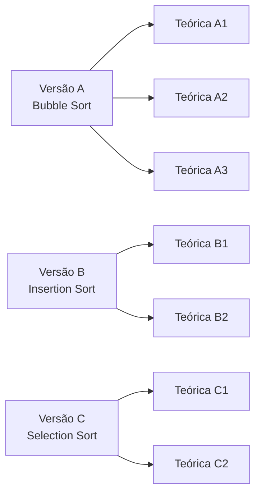

<!--META
{
  "title": "Avaliação: Central de Triagem Orbital — Busca e Ordenação",
  "header": "Central de Triagem Orbital",
  "tema": "Avaliação em duas partes: prática em pair programming (60 min, 6,0 pontos), com diagnóstico de carga, busca linear, ordenação instrumentada (Bubble, Insertion ou Selection Sort, conforme a versão), busca binária e relatório; e teórica individual (30 min, 4,0 pontos) sobre busca binária × linear, O(n) × O(log n), comportamento do algoritmo de ordenação e decisão entre buscar sem ordenar ou ordenar uma vez.",
  "typing": ["Driver + Navigator, troca a cada 15 min", "analisar → buscar → ordenar → buscar", "O(n) × O(log n)", "Ordenar uma vez compensa?"],
  "tecnologias": "Python 3",
  "tipo": "Avaliação (enunciados das partes prática e teórica)",
  "badges": [["Linguagem", "Python", "FF781F", "python"], ["Tópico", "Busca e ordenação", "FF4500"], ["Formato", "Prática 6,0 + teórica 4,0", "E60000"]],
  "icons": "py",
  "icons_alt": "Python",
  "limitacoes": "Os 17 arquivos .docx foram convertidos para texto e lidos integralmente. Os arquivos “- Copiar”, “Grupo 12” e “Copy…” têm o mesmo texto dos originais correspondentes, com diferenças só de formatação ou metadados, e não contêm respostas; DSA_Parte_Teorica_C1 - Copiar.docx é idêntico byte a byte ao original. A pasta não traz gabarito: as resoluções desta página são propostas para estudo, e a solução da Versão A foi executada. O material não informa o nome do docente nem se esta avaliação é um checkpoint.",
  "files": {
    "DSA_Parte_Pratica_A.docx": "Parte prática, Versão A (Bubble Sort): contexto, regras de pair programming, vetor containers_A (200 códigos), cinco missões com pontuação, modelo do relatório e regras de entrega do .py.",
    "DSA_Parte_Pratica_A - Copiar.docx": "Cópia da Versão A da parte prática, com o mesmo texto do original.",
    "DSA_Parte_Pratica_A Grupo 12.docx": "Outra cópia da Versão A da parte prática, com o mesmo texto do original (sem respostas do grupo).",
    "DSA_Parte_Pratica_B.docx": "Parte prática, Versão B (Insertion Sort), com o vetor containers_B e o critério de contagem de deslocamentos.",
    "DSA_Parte_Pratica_C.docx": "Parte prática, Versão C (Selection Sort), com o vetor containers_C e o critério de contagem de trocas efetivas.",
    "DSA_Parte_Pratica_C - Copiar.docx": "Cópia da Versão C da parte prática; difere do original apenas na grafia “continua” (o original traz “contínua”).",
    "DSA_Parte_Teorica_A1.docx": "Parte teórica individual, Versão A1 (Bubble Sort): quatro questões e regras de entrega do .txt.",
    "DSA_Parte_Teorica_A2.docx": "Parte teórica individual, Versão A2 (Bubble Sort), com outro trecho de busca binária e outro cenário de decisão.",
    "DSA_Parte_Teorica_A2 - Copiar.docx": "Cópia da Versão A2, com o mesmo texto do original.",
    "DSA_Parte_Teorica_A3.docx": "Parte teórica individual, Versão A3 (Bubble Sort): busca linear com break, crescimento ao duplicar a entrada, encerramento antecipado e cenário de 600.000 registros; sem a seção de entrega.",
    "DSA_Parte_Teorica_B1.docx": "Parte teórica individual, Versão B1 (Insertion Sort).",
    "DSA_Parte_Teorica_B1 - CopyBruno.docx": "Cópia da Versão B1, com o mesmo texto do original.",
    "DSA_Parte_Teorica_B2.docx": "Parte teórica individual, Versão B2 (Insertion Sort).",
    "DSA_Parte_Teorica_B2 - Copy-Bruno.docx": "Cópia da Versão B2, com o mesmo texto do original.",
    "DSA_Parte_Teorica_C1.docx": "Parte teórica individual, Versão C1 (Selection Sort).",
    "DSA_Parte_Teorica_C1 - Copiar.docx": "Cópia idêntica (mesmo hash MD5) da Versão C1.",
    "DSA_Parte_Teorica_C2.docx": "Parte teórica individual, Versão C2 (Selection Sort), com a turma 1CCPX preenchida no cabeçalho."
  }
}
META-->

<br />

<h2 id="visao-geral">Visão geral</h2>

A pasta reúne os enunciados de uma avaliação sobre **busca e ordenação**, ambientada numa estação espacial: a **Central de Triagem Orbital** recebe contêineres identificados por códigos numéricos e precisa analisá-los, localizá-los e ordená-los para buscar com eficiência.

A avaliação tem duas partes, feitas em sequência:

| Parte | Formato | Tempo | Valor | Entrega |
| :--- | :--- | :---: | :---: | :--- |
| Prática | Dupla ou trio, em *pair programming* | 60 min | 6,0 | um `.py` nomeado com os RMs (`<rm1>_<rm2>[_<rm3>].py`) |
| Teórica | Individual, sem comunicação | 30 min | 4,0 | um `.txt` só com as respostas (`<rm>.txt`) |

Há três versões da parte prática, uma por algoritmo, e duas ou três versões teóricas para cada uma:



*Figura 1 — Versões da avaliação. As teóricas "1" e "2" repetem as questões 1, 2 e 4 entre os algoritmos e mudam a questão 3, que trata do algoritmo da versão.*

Os três vetores (`containers_A`, `containers_B` e `containers_C`) são **permutações dos mesmos 200 códigos distintos**, de 14 a 999, o que foi verificado comparando os vetores ordenados. Assim, o diagnóstico da carga dá o mesmo resultado nas três versões, e só a ordem inicial muda.

<br />

<h2 id="objetivos">Objetivos de aprendizagem</h2>

- Implementar mínimo e máximo sem `min()`, `max()`, `sort()` ou `sorted()`.
- Implementar busca linear e busca binária que devolvem a posição e o número de comparações.
- Instrumentar um algoritmo de ordenação O(n²) seguindo um critério de contagem definido.
- Justificar por que a busca binária exige dados ordenados e por que é O(log n).
- Decidir, com Big-O, entre buscar sem ordenar e ordenar uma vez para fazer muitas buscas.
- Trabalhar em *pair programming*, alternando os papéis de *driver* e *navigator*.

<br />

<h2 id="pre-requisitos">Pré-requisitos</h2>

- Bubble, Selection e Insertion Sort, da [aula 09](../aula09-20-08-26/README.md).
- Contagem de comparações e movimentações, da [aula 11](../aula11-27-08-26/README.md).
- Big-O, O(n) e O(log n), da [aula 02](../aula02-21-03-26/README.md).

<br />

<h2 id="fundamentacao-teorica">Fundamentação teórica</h2>

### 1. Pair programming nas regras da prova

O **driver** opera teclado e mouse e escreve o código. O **navigator** acompanha a lógica, identifica erros e orienta, sem tocar no teclado. A troca de papéis é obrigatória **a cada 15 minutos** (0–15, 15–30, 30–45 e 45–60) e é sinalizada pelo professor. Não é preciso terminar uma função antes da troca: o novo *driver* continua de onde o colega parou.

### 2. As cinco missões da parte prática

| Missão | Função | Valor | Exigências |
| :--- | :--- | :---: | :--- |
| 1. Diagnóstico da carga | `analisar_carga(lista)` | 0,5 | quantidade, menor e maior código, sem `min`, `max`, `sort` ou `sorted` |
| 2. Localização de emergência | `busca_linear(lista, codigo)` | 1,0 | na lista **desordenada**; devolve `(posicao, comparacoes)` ou `(-1, comparacoes)`; testar código existente e inexistente |
| 3. Ordenação | `ordenar(lista)` | 2,5 | devolve `(lista_ordenada, comparacoes, movimentacoes)`; chamada com `containers[:]` para preservar o original |
| 4. Busca otimizada | `busca_binaria(lista, codigo)` | 1,5 | **somente** na lista ordenada; trata existente e inexistente; critério de contagem registrado em comentário |
| 5. Relatório | — | 0,5 | o **mesmo** código nas duas buscas, no formato de relatório do enunciado |

Os pontos das missões somam 6,0, o valor da parte prática.

### 3. O critério de contagem muda com o algoritmo

| Versão | Comparação | Movimentação |
| :--- | :--- | :--- |
| A — Bubble | cada comparação relevante entre valores | cada troca efetivamente realizada |
| B — Insertion | cada comparação entre o elemento em inserção e a região analisada | cada deslocamento para abrir espaço; a atribuição final **não** conta |
| C — Selection | cada comparação com o menor valor conhecido | só quando há troca efetiva no fim da passagem (`menor != i`) |

São os mesmos critérios do programa da [aula 11](../aula11-27-08-26/README.md).

### 4. Busca linear × busca binária

- A **busca linear** examina os elementos um a um. Funciona em qualquer vetor, ordenado ou não, e no pior caso faz $n$ comparações: **O(n)**.
- A **busca binária** compara o código com o elemento do **meio** e descarta a metade em que ele não pode estar. Isso só é válido se o vetor estiver **ordenado**. A cada passo o intervalo cai pela metade, então o pior caso tem cerca de $\lceil \log_2(n+1) \rceil$ passos: **O(log n)**. Para $n = 200$, são no máximo 8.

<br />

<h2 id="exemplos-praticos">Exemplos práticos</h2>

### Exemplo aplicado — a Versão A completa

**Solução proposta para estudo.** O código procurado no relatório é 733, que existe no vetor; o teste com um código inexistente usa 500.

```python
{{include:aval/central_a.py}}
```

Saída esperada:

```text
{{include:aval/central_a.out}}
```

O critério de contagem da busca binária, exigido pela Missão 4, está no comentário: cada elemento do meio examinado conta como **uma** comparação. Outro critério, como contar `==` e `<` separadamente, também é aceitável, desde que seja declarado.

### As versões B e C com as mesmas funções

Trocando `ordenar` pelo Insertion Sort (Versão B) ou pelo Selection Sort (Versão C), com os critérios do item 3 da teoria, a execução nos vetores de cada versão deu:

<!-- norun -->
```text
Versão  Algoritmo        Comparações  Movimentações  Posição do 733 (linear)
A       Bubble Sort            19900           9843  37
B       Insertion Sort         10037           9844  86
C       Selection Sort         19900            196  49
```

Os números confirmam a [aula 11](../aula11-27-08-26/README.md): Bubble e Selection fazem sempre $\frac{200 \cdot 199}{2} = 19\,900$ comparações, e o Selection move muito menos. Como os vetores têm os mesmos códigos, a busca binária encontra 733 na mesma posição (147) da lista ordenada nas três versões.

<br />

<h2 id="exercicios-resolvidos">Exercícios e resoluções comentadas</h2>

As questões abaixo são as da parte teórica. O material não traz gabarito: as respostas são **soluções propostas para estudo**.

### Questão 1 — Busca e estrutura dos dados (0,75)

**Enunciado (resumo).** Nas versões 1 e 2, um trecho com `meio = (inicio + fim) // 2` e o intervalo reduzido para `meio + 1` ou `meio - 1`. Pede-se: identificar a estratégia, explicar por que não pode ser aplicada ao vetor original (ou qual propriedade a lista precisa ter) e dar o Big-O. Na A3, o trecho é um `for` com `break` que procura o elemento.

<details>
<summary><strong>Solução proposta para estudo</strong></summary>

- Versões 1 e 2: é a **busca binária**. O vetor original da atividade está **desordenado**, e descartar metade do intervalo só é correto se a lista estiver **ordenada**: se `lista[meio] < procurado`, todos os elementos à esquerda também são menores. Pior caso **O(log n)**.
- Versão A3: é a **busca linear**. Funciona em vetor desordenado porque não supõe nada sobre a posição dos valores: examina um a um até achar ou acabar. Pior caso **O(n)**.

</details>

### Questão 2 — Linear × binária (0,75)

<details>
<summary><strong>Solução proposta para estudo</strong></summary>

A busca linear é **O(n)**: no pior caso examina todos os elementos, e o trabalho cresce na mesma proporção da entrada. A busca binária é **O(log n)**: cada comparação elimina cerca de metade do que resta, então dobrar a entrada acrescenta só **um** passo. Com 1.000 elementos, a linear pode precisar de 1.000 comparações e a binária de cerca de 10; com 1.000.000, de 1.000.000 contra cerca de 20. A condição para usar a binária é a lista estar ordenada (versão A3).

</details>

### Questão 3 — Ordenação (1,0)

<details>
<summary><strong>Solução proposta para estudo</strong></summary>

- **A1 (Bubble, ordem inversa):** todo par está invertido. O Bubble faz as $\frac{n(n-1)}{2}$ comparações e **troca em todas**, levando o maior ao fim a cada passagem. É o pior caso, O(n²) em comparações e trocas.
- **A2 (Bubble sem parada antecipada):** num vetor já ordenado, faz as mesmas $\frac{n(n-1)}{2}$ comparações, mas **nenhuma** troca; na ordem inversa, o mesmo número de comparações e $\frac{n(n-1)}{2}$ trocas. O custo em comparações é sempre O(n²).
- **A3 (passagem sem trocas):** se uma passagem completa não troca nada, nenhum par vizinho está fora de ordem, então **o vetor está ordenado**. Com encerramento antecipado, um vetor já ordenado custa uma passagem, O(n), no melhor caso; o pior caso continua O(n²).
- **B1 e B2 (Insertion):** num vetor quase ordenado, cada elemento desloca-se poucas posições e o `while` para logo: melhor caso **O(n)**. Na ordem inversa, cada elemento percorre toda a região ordenada: $\frac{n(n-1)}{2}$ comparações e deslocamentos, **O(n²)**.
- **C1 e C2 (Selection):** fazer poucas trocas (no máximo $n - 1$) **não** reduz as comparações: em cada passagem, o algoritmo precisa examinar toda a região não ordenada para ter certeza de qual é o menor. São sempre $\frac{n(n-1)}{2}$ comparações, **O(n²)**, em qualquer caso.

</details>

### Questão 4 — Decisão algorítmica (1,5)

**Enunciado (resumo).** Muitos registros carregados uma vez e muitas buscas sobre eles: 1.000.000 e 50.000 (versões 1), 800.000 e 40.000 (versões 2) ou 600.000 e 70.000 (A3). Comparar (A) buscas lineares sem ordenar e (B) ordenar uma vez e usar buscas binárias.

A estimativa abaixo conta operações no pior caso, só para comparar ordens de grandeza:

```python
{{include:aval/decisao.py}}
```

Saída esperada:

```text
{{include:aval/decisao.out}}
```

<details>
<summary><strong>Solução proposta para estudo</strong></summary>

a) **Estratégia B**: ordenar uma vez e fazer buscas binárias.

b) A estratégia A custa cerca de $b \cdot n$ operações ($b$ buscas O(n)), da ordem de $10^{10}$. A estratégia B custa a ordenação mais $b \cdot \log n$, e as buscas somam só cerca de $10^6$.

c) O custo da ordenação **não pode ser ignorado**: ele entra na conta e precisa ser **amortizado** pelas buscas. Com um algoritmo O(n log n), como Merge Sort ou Timsort, ele é da ordem de $2 \times 10^7$ e a estratégia B vence com folga. Com um algoritmo O(n²), como os da parte prática, só a ordenação custaria cerca de $5 \times 10^{11}$ operações, **mais** do que as 50.000 buscas lineares. A escolha do algoritmo de ordenação decide se B compensa. Se fossem feitas poucas buscas, A poderia ser melhor.

d) O tempo de uma execução depende do processador, da linguagem, da carga da máquina e da entrada usada. A complexidade descreve como o custo **cresce** com $n$, independentemente do computador, e permite prever o comportamento para entradas maiores do que as testadas.

</details>

<br />

<h2 id="aplicacoes">Aplicações no mercado de trabalho</h2>

- **Bancos de dados:** criar um índice é o "ordenar uma vez" da Questão 4. O custo de construí-lo é pago para tornar as consultas O(log n).
- **Logística e estoque:** localizar itens por código é rotina em centros de distribuição, e a escolha entre varredura e índice depende do volume de consultas.
- ***Pair programming*:** prática comum em equipes ágeis para revisar código em tempo real e espalhar conhecimento.
- **Entrevistas técnicas:** implementar busca binária sem erros de limite e justificar a complexidade é uma pergunta clássica.

<br />

<h2 id="boas-praticas">Boas práticas e erros comuns</h2>

| Problemático | Recomendado | Motivo |
| :--- | :--- | :--- |
| Aplicar a busca binária no vetor original | Aplicá-la só sobre a lista ordenada | A eliminação de metades depende da ordem |
| `ordenar(containers_A)` | `ordenar(containers_A[:])` | Preserva o vetor original para a busca linear |
| Começar o mínimo e o máximo com 0 ou 1000 | Começar com o primeiro elemento | Não depende de supor a faixa de valores |
| Não declarar como as comparações da binária foram contadas | Registrar o critério em comentário | É exigência da Missão 4 e evita ambiguidade |
| Usar códigos diferentes nas duas buscas do relatório | Usar o mesmo código | A comparação entre as buscas só faz sentido assim |
| Responder só "O(log n)" na parte teórica | Justificar com o raciocínio | O enunciado avisa que respostas sem justificativa não recebem nota integral |

<br />

<h2 id="resumo">Resumo para revisão</h2>

- Prática (6,0): analisar a carga, busca linear, ordenação instrumentada, busca binária e relatório, em *pair programming*.
- Teórica (4,0): busca binária exige ordem; O(n) × O(log n); comportamento do algoritmo da versão; decisão algorítmica.
- Bubble e Selection: sempre $\frac{n(n-1)}{2}$ comparações; Insertion: O(n) no melhor caso; Selection: poucas trocas.
- Ordenar uma vez compensa quando há muitas buscas **e** a ordenação é eficiente, O(n log n).
- Complexidade descreve crescimento; tempo de uma execução depende da máquina.

<br />

<h2 id="questoes">Questões de fixação</h2>

1. No máximo, quantas comparações a busca binária da solução faz num vetor de 200 elementos?
2. Por que a busca linear da Missão 2 deve ser feita na lista desordenada, e não na ordenada?
3. Na Versão C, por que a movimentação só é contada quando `menor != i`?
4. Em que situação manter os dados desordenados (estratégia A) seria a melhor escolha?

<details>
<summary><strong>Respostas comentadas</strong></summary>

1. 8, pois $2^7 = 128 < 200 < 256 = 2^8$. Na execução, o código inexistente 500 exigiu exatamente 8.
2. Porque a missão simula a localização de emergência **antes** da ordenação, e o relatório compara o custo da busca linear no vetor original com o da binária no vetor ordenado.
3. Porque, se o menor já está na posição `i`, a "troca" não move nada. Contá-la inflaria as movimentações.
4. Quando há **poucas** buscas, ou os dados mudam com frequência: o custo de ordenar (ou de manter a ordem) não seria compensado.

</details>

<br />

<h2 id="referencias">Referências e materiais complementares</h2>

- [Python — módulo `bisect` (busca binária em listas ordenadas)](https://docs.python.org/pt-br/3/library/bisect.html)
- [Python — HOWTO de ordenação](https://docs.python.org/pt-br/3/howto/sorting.html)
- Materiais da pasta: parte prática [Versão A](DSA_Parte_Pratica_A.docx), [Versão B](DSA_Parte_Pratica_B.docx) e [Versão C](DSA_Parte_Pratica_C.docx); parte teórica [A1](DSA_Parte_Teorica_A1.docx), [A2](DSA_Parte_Teorica_A2.docx), [A3](DSA_Parte_Teorica_A3.docx), [B1](DSA_Parte_Teorica_B1.docx), [B2](DSA_Parte_Teorica_B2.docx), [C1](DSA_Parte_Teorica_C1.docx) e [C2](DSA_Parte_Teorica_C2.docx)
