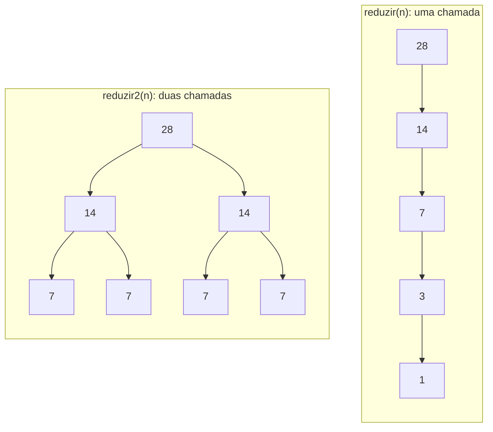

<!--META
{
  "title": "CP2 — Avaliação de Recursividade, Merge Sort e Quick Sort",
  "header": "CP2: Recursão e Ordenação",
  "tema": "Checkpoint 2 com nove questões sobre recursão simples e dupla, divisão do Merge Sort, merge e sua pré-condição, particionamento do Quick Sort, escolha do pivô e validação de hipóteses sugeridas por IA, acompanhado de um guia de estudos com as resoluções.",
  "typing": ["reduzir(28): 28, 14, 7, 3, 1", "merge pressupõe listas ordenadas", "pivô 5: partição (3, 4); pivô 8: (5, 2)", "IA como hipótese, não como resposta"],
  "tecnologias": "Python 3",
  "tipo": "Avaliação (checkpoint) com guia de estudos",
  "badges": [["Linguagem", "Python", "FF781F", "python"], ["Tipo", "Checkpoint CP2", "FF4500"], ["Valor", "10 pontos", "E60000"]],
  "icons": "py",
  "icons_alt": "Python",
  "limitacoes": "A prova é composta de imagens com texto; os enunciados foram lidos visualmente. O guia de estudos da pasta declara ter sido criado “a partir da prova e das respostas discutidas em chat”; não é material do professor. Todas as respostas do guia foram conferidas executando os códigos da prova em Python 3.",
  "files": {
    "CP2_DSA_1CCPX.pdf": "Prova “DSA — Avaliação: Recursividade, Merge Sort e Quick Sort” (turma 4, 10 pontos, 60 minutos): orientações sobre uso de IA, resumo de slicing e 9 questões com código.",
    "Guia de Estudos - Recursividade, Merge Sort e Quick Sort.pdf": "Guia de estudos comentado com a resolução passo a passo das 9 questões, diagramas e tabelas de rastreamento; segundo o próprio texto, gerado a partir da prova e de uma conversa de resolução em chat."
  }
}
META-->

<br />

<h2 id="visao-geral">Visão geral</h2>

O CP2 avalia, em 9 questões práticas, a sequência estudada nas [aulas 13 a 15](../aula15-16-09-26/README.md): recursão, Merge Sort e Quick Sort. Cada questão traz um trecho de código para **executar, rastrear e interpretar**.

Dois aspectos do enunciado merecem destaque:

- **Uso adequado de IA:** a prova **permite** ferramentas de IA como apoio, desde que auxiliem a aprendizagem, a execução e a conferência, sem substituir a leitura, a interpretação e o raciocínio. A orientação é **conferir qualquer resposta produzida por IA** com os vetores, códigos e estados do enunciado. A questão 8 transforma essa orientação em exercício: testar uma sugestão de IA com dados.
- **Resumo de slicing:** a prova inclui uma tabela de fatiamento de listas em Python (`vetor[inicio:fim:passo]`), base da divisão do Merge Sort.

A pasta também contém um **guia de estudos** com as resoluções comentadas. Esta página organiza os conceitos avaliados, mostra como **verificar** cada resposta executando código e registra o resultado dessa verificação.

<br />

<h2 id="objetivos">Objetivos de aprendizagem</h2>

- Diferenciar recursão com **uma** chamada (cadeia) de recursão com **duas** chamadas (árvore binária).
- Executar a fase de divisão do Merge Sort e saber que ela usa **posições**, e não valores.
- Rastrear o `merge()` com dois cursores e identificar sua **pré-condição**.
- Particionar com um pivô e prever o tamanho dos subproblemas.
- Comparar estratégias de pivô e relacioná-las ao formato da recursão.
- Tratar sugestões de IA como **hipóteses** a serem testadas.

<br />

<h2 id="pre-requisitos">Pré-requisitos</h2>

- Recursividade, das [aulas 13](../aula13-08-09-26/README.md) e [14](../aula14-14-09-26/README.md).
- Merge Sort e Quick Sort, da [aula 15](../aula15-16-09-26/README.md).
- Slicing em Python (resumido abaixo).

<br />

<h2 id="fundamentacao-teorica">Fundamentação teórica</h2>

### 1. Slicing em Python (resumo da prova)

| Expressão | Significado |
| :--- | :--- |
| `vetor[2]` | Elemento do índice 2 |
| `vetor[-1]` | Último elemento |
| `vetor[2:5]` | Índices 2, 3 e 4 (o fim não é incluído) |
| `vetor[:4]` | Do início até o índice 3 |
| `vetor[4:]` | Do índice 4 até o final |
| `vetor[:]` | Cópia superficial da lista inteira |
| `vetor[::2]` | Do início ao fim, com passo 2 |
| `vetor[::-1]` | Lista em ordem inversa |
| `vetor[-3:]` | Os três últimos elementos |
| `vetor[:-3]` | Todos, exceto os três últimos |
| `vetor[6:2:-1]` | Percurso regressivo do índice 6 até antes do 2 |

O Merge Sort usa `lista[:meio]` e `lista[meio:]`. Cada fatia é uma **nova lista**, e `vetor[:]` é uma cópia, e não outro nome para o mesmo objeto.

### 2. Uma chamada × duas chamadas



*Figura 1 — Uma chamada por nível forma uma cadeia (cerca de $\log_2 n$ chamadas); duas chamadas formam uma árvore binária, a estrutura do Merge Sort. O diagrama mostra só os primeiros níveis de `reduzir2`.*

### 3. As pré-condições que a prova testa

| Componente | Pré-condição | O que acontece se for quebrada |
| :--- | :--- | :--- |
| `merge(esquerda, direita)` | As duas listas **já ordenadas** | Resultado errado, sem nenhum erro de execução (questão 5) |
| Quick Sort com pivô = último | Valores bem distribuídos em relação ao pivô | Em lista ordenada, vira a cadeia $n \to n-1 \to \dots$ (questão 9) |

<br />

<h2 id="exemplos-praticos">Exemplos práticos</h2>

### Exemplo básico — contando chamadas

```python
chamadas = {"reduzir": 0, "reduzir2": 0}

def reduzir(n):
    chamadas["reduzir"] += 1
    print(n, end=" ")
    if n <= 1:
        return
    reduzir(n // 2)

def reduzir2(n):
    chamadas["reduzir2"] += 1
    if n <= 1:
        return
    reduzir2(n // 2)
    reduzir2(n // 2)

reduzir(28)
print()
reduzir2(28)
print(chamadas)
```

Saída esperada:

```text
28 14 7 3 1 
{'reduzir': 5, 'reduzir2': 31}
```

A cadeia faz 5 chamadas. A árvore faz 31: $1 + 2 + 4 + 8 + 16$, dobrando a cada nível.

### Exemplo intermediário — a pré-condição do merge em ação

```python
def merge(esquerda, direita):
    resultado = []
    i = j = 0
    while i < len(esquerda) and j < len(direita):
        if esquerda[i] <= direita[j]:
            resultado.append(esquerda[i])
            i += 1
        else:
            resultado.append(direita[j])
            j += 1
    resultado.extend(esquerda[i:])
    resultado.extend(direita[j:])
    return resultado

print(merge([1, 6], [3, 5]))     # pré-condição respeitada
print(merge([6, 1], [3, 5]))     # esquerda desordenada
```

Saída esperada:

```text
[1, 3, 5, 6]
[3, 5, 6, 1]
```

O segundo resultado está errado, e o Python não acusa nada. É um *bug* silencioso, causado por uma pré-condição não satisfeita, e não por um erro no código.

### Exemplo aplicado — testando a hipótese da IA (questão 8)

```python
def particionar(lista, pivo):
    menores = [e for e in lista if e < pivo]
    iguais = [e for e in lista if e == pivo]
    maiores = [e for e in lista if e > pivo]
    return menores, iguais, maiores

V = [10, 4, 8, 2, 9, 3, 7, 5]
for pivo in (5, 8):
    me, ig, ma = particionar(V, pivo)
    print(f"pivô {pivo}: tamanhos ({len(me)}, {len(ma)}) -> diferença {abs(len(me) - len(ma))}")
```

Saída esperada:

```text
pivô 5: tamanhos (3, 4) -> diferença 1
pivô 8: tamanhos (5, 2) -> diferença 3
```

A sugestão "use 8 para uma divisão mais equilibrada" **não se confirma**: os dados mostram o contrário. Esse é o hábito que a questão quer formar: **verificar antes de aceitar**.

<br />

<h2 id="exercicios-resolvidos">Exercícios e resoluções comentadas</h2>

> [!NOTE]
> As resoluções completas e comentadas estão no [guia de estudos da pasta](Guia%20de%20Estudos%20-%20Recursividade%2C%20Merge%20Sort%20e%20Quick%20Sort.pdf), que **não é material oficial do professor**. A tabela abaixo é uma **verificação independente**: cada resposta foi obtida executando o código da prova em Python 3 e comparada com a do guia.

| Questão | Tema | Resposta obtida por execução | Coincide com o guia? |
| :---: | :--- | :--- | :---: |
| 1.A e 1.B | Sequência de `reduzir(28)` | 28, 14, 7, 3, 1; **5** chamadas | Sim |
| 1.C | Estrutura de `reduzir2` | **B**: árvore binária (31 chamadas) | Sim |
| 2.A a 2.F | Divisão de `[10,4,8,2,9,3,7,5]` | Nível 1: `[10,4,8,2]` e `[9,3,7,5]`; nível 2: `[10,4]`, `[8,2]`, `[9,3]`, `[7,5]` | Sim |
| 2.G | V ou F | a) **F** (divide pela posição); b) **V**; c) **V**; d) **F** (ainda há 2 elementos) | Sim |
| 3.A a 3.C | Merges | `[4,10]`; `[2,8]`; `[2,4,8,10]` | Sim |
| 3.D a 3.F | Associação | Retorno → **C** (merge); lista unitária → **B** (caso-base); descida → **A** (divisão) | Sim |
| 4 | Rastreio de `merge([1,6],[3,5])` | 1×3 → 1; 6×3 → 3; 6×5 → 5; a **direita** termina; resta **6**; `[1,3,5,6]` | Sim |
| 5 | `merge([6,1],[3,5])` | 6×3 → 3; 6×5 → 5; a direita termina; restam `[6,1]`; `[3,5,6,1]`; alternativa **B** | Sim |
| 6 | Quick Sort em V | Pivô **5**; menores `[4,2,3]`; iguais `[5]`; maiores `[10,8,9,7]`; tamanhos 3 e 4; alternativa **B** | Sim |
| 7 | Quick Sort em `P1 = [10,8,9,7]` | Pivô **7**; menores `[]`; iguais `[7]`; maiores `[10,8,9]`; trajetória 8 → 4 → 3; alternativa **B** | Sim |
| 8 | Hipótese da IA (pivô 8) | menores `[4,2,3,7,5]`; iguais `[8]`; maiores `[10,9]`; diferenças 3 (pivô 8) × 1 (pivô 5); alternativa **A** | Sim |
| 9 | Pivôs em `W` ordenado | A: pivô **24** → `([3..21], [24], [])`, cadeia $n \to n-1$ (alternativa **B**); B: pivô 15 → `[3,6,9,12]`, `[15]`, `[18,21,24]`; a **estratégia B** é mais equilibrada | Sim |

**Justificativas (síntese):**

- **Q3:** a **descida** só divide (fatias, sem comparações) até as listas unitárias. No **retorno**, cada chamada recebe as metades já ordenadas e as **intercala**. É ali que acontecem as comparações.
- **Q5:** o código do `merge` está correto. O resultado errado decorre da **pré-condição** quebrada: o `extend` copia o restante sem comparar, então a desordem de `[6, 1]` passa direto para o resultado.
- **Q7:** o tamanho dos subproblemas depende de **onde o pivô cai**: 8 → 4 (por acaso, a metade) e depois 4 → 3. Não há regra fixa de "metade", como no Merge Sort.
- **Q9:** em lista ordenada, o último elemento é sempre o maior. Cada chamada remove só o pivô, formando uma cadeia de profundidade proporcional a $n$. Um pivô próximo da mediana (15) gera partições (4, 3) e uma árvore baixa.

**Entrega exigida pela prova:** um arquivo `.txt` **apenas com as respostas**, cada questão identificada, nomeado no padrão `<rm_aluno>.txt`.

<br />

<h2 id="aplicacoes">Aplicações no mercado de trabalho</h2>

- **Uso responsável de IA:** a questão 8 reproduz uma situação real. Assistentes de código sugerem soluções plausíveis que precisam ser validadas com testes e dados antes de entrar em produção.
- **Pré-condições e contratos:** funções que confiam nas entradas sem verificar, como o `merge`, causam *bugs* silenciosos. Asserções (`assert`), validações e testes de propriedade protegem esses contratos.
- **Escolha de pivô:** bibliotecas reais usam pivô aleatório, mediana de três ou algoritmos híbridos (como o *introsort*) para evitar o pior caso O(n²).

<br />

<h2 id="boas-praticas">Boas práticas e erros comuns</h2>

| Problemático | Recomendado | Motivo |
| :--- | :--- | :--- |
| Aceitar a resposta de uma IA sem testar | Executar o código e comparar com os dados | A Q8 mostra uma sugestão plausível e errada |
| Responder "de cabeça" questões de rastreamento | Rastrear em tabela (i, j, comparação, resultado) | Evita pular passos |
| Supor que o merge "conserta" listas | Garantir que as entradas estejam ordenadas | `extend` não compara |
| Usar sempre o último elemento como pivô | Pivô aleatório ou mediana | Evita a cadeia degenerada em dados ordenados |

<br />

<h2 id="resumo">Resumo para revisão</h2>

- **Uma chamada por nível** forma uma cadeia (cerca de $\log_2 n$ chamadas); **duas chamadas** formam uma árvore binária.
- **Merge Sort:** divide pela **posição**; a descida só divide; o retorno faz os merges.
- **Merge:** dois cursores; copia o menor; `extend` do restante; **pré-condição: entradas ordenadas**.
- **Quick Sort:** o tamanho das partições depende do **pivô**; um pivô extremo em lista ordenada gera a cadeia $n \to n-1$ (pior caso).
- **IA:** hipótese a ser testada, nunca resposta automática.

<br />

<h2 id="questoes">Questões de fixação</h2>

1. Quantas chamadas `reduzir2(16)` realiza?
2. Qual o resultado de `merge([2, 5], [9, 1])`? Por quê?
3. Em `[50, 10, 40, 20, 30]`, qual pivô dá a partição mais equilibrada: 30 (último) ou 50 (primeiro)?

<details>
<summary><strong>Respostas comentadas</strong></summary>

1. Os níveis são 16, 8, 4, 2 e 1, com $1 + 2 + 4 + 8 + 16 = 31$ chamadas.
2. `[2, 5, 9, 1]`. A direita `[9, 1]` não está ordenada: depois que a esquerda termina (2 e 5 são copiados por serem menores que 9), o restante `[9, 1]` é anexado sem comparação.
3. **30**: menores `[10, 20]` e maiores `[50, 40]`, ou seja, (2, 2). Com 50: menores com 4 elementos e maiores vazio, (4, 0).

</details>

<br />

<h2 id="referencias">Referências e materiais complementares</h2>

- [Python — sequências e fatiamento (*slicing*)](https://docs.python.org/pt-br/3/library/stdtypes.html#common-sequence-operations)
- Materiais da pasta: [prova CP2](CP2_DSA_1CCPX.pdf) · [guia de estudos](Guia%20de%20Estudos%20-%20Recursividade%2C%20Merge%20Sort%20e%20Quick%20Sort.pdf)
