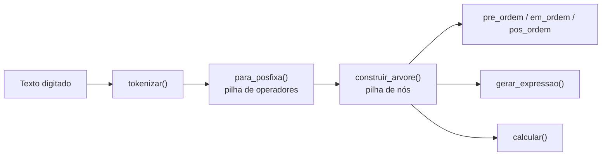
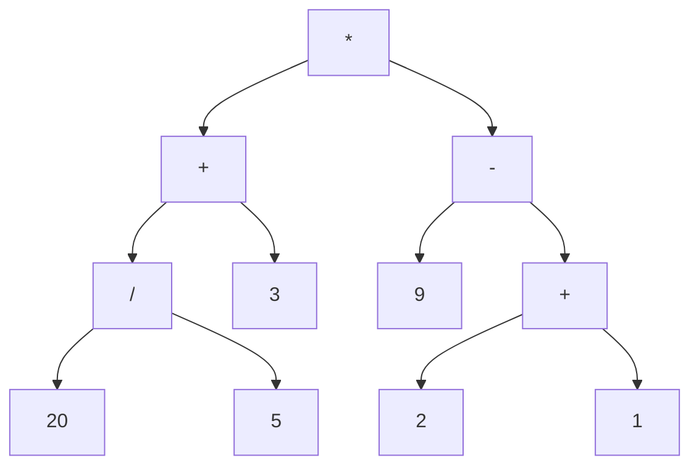

<!--META
{
  "title": "Árvore Binária de Expressões — Calculadora com Pilhas e Recursão",
  "header": "Árvore Binária de Expressões",
  "tema": "Calculadora que transforma texto em tokens, converte a expressão infixa em pós-fixa com uma pilha, monta uma árvore binária de expressão e a percorre recursivamente (pré-ordem, em ordem e pós-ordem) para reconstruir e calcular o resultado.",
  "typing": ["texto -> tokens -> pós-fixa -> árvore", "1º pop = filho direito", "pós-ordem = notação pós-fixa", "((20 / 5) + 3) * (9 - (2 + 1)) = 42"],
  "tecnologias": "Python 3",
  "tipo": "Atividade prática (enunciado em PDF e código comentado)",
  "badges": [["Linguagem", "Python", "FF781F", "python"], ["Estrutura", "Árvore binária", "FF4500"], ["Técnicas", "Pilha e recursão", "E60000"]],
  "icons": "py",
  "icons_alt": "Python",
  "limitacoes": "O enunciado em PDF (5 páginas) foi acrescentado à pasta depois da primeira versão desta página e foi lido integralmente; ele confirma a numeração de seções usada nos comentários do código. O programa foi executado em Python 3 com as entradas indicadas nesta página. O PDF não informa o nome do docente nem a forma exata de identificação do arquivo entregue (diz apenas “conforme orientação do professor”).",
  "files": {
    "Atividade_Arvore_Expressoes_Matematicas_DSA.pdf": "Enunciado da atividade (5 páginas): problema e regra principal (cálculo pela árvore, sem eval/exec), expressões aceitas, fluxo geral, estrutura do nó, tokenização, precedência, conversão infixa → pós-fixa, construção da árvore, percursos, reconstrução, cálculo, saída esperada, 5 testes obrigatórios, validação mínima, 6 questões de análise, desafio opcional, critérios de avaliação (10,0 pontos) e entrega.",
    "arvore_binaria.py": "Calculadora de expressões com árvore binária: tokenização, conversão infixa → pós-fixa, construção da árvore, percursos, reconstrução, cálculo, exibição da árvore no terminal, testes e respostas às questões de análise (em comentários)."
  }
}
META-->

<br />

<h2 id="visao-geral">Visão geral</h2>

Esta aula reúne as ideias da disciplina num único programa: **pilhas** (aulas 3 a 5), **recursão** (aulas 13 e 14) e uma estrutura nova, a **árvore binária**. O arquivo `arvore_binaria.py` é uma calculadora que recebe um texto como `(8 + 4) * 2` e o processa em etapas:



*Figura 1 — Pipeline da calculadora, conforme o comentário de abertura do arquivo e a seção 3 do enunciado. As três últimas etapas são recursivas e percorrem a mesma árvore.*

O código segue a numeração de seções do enunciado [`Atividade_Arvore_Expressoes_Matematicas_DSA.pdf`](Atividade_Arvore_Expressoes_Matematicas_DSA.pdf) (seções 4 a 15) e termina com as seis **questões de análise** do enunciado, respondidas em comentários. A **regra principal** do enunciado é que o resultado venha **da árvore construída**: `eval()`, `exec()` e mecanismos equivalentes são proibidos.

### O enunciado em números

| Item do PDF | Conteúdo |
| :--- | :--- |
| Expressões aceitas | inteiros e decimais positivos, `+ - * /`, parênteses e espaços opcionais; potência, raiz, funções, variáveis e menos unário são opcionais |
| Testes obrigatórios | `8+4*2` = 16; `(8 + 4) * 2` = 24; `((15 - 3) / 4) + (2 * 5)` = 13; `((20 / 5) + 3) * (9 - (2 + 1))` = 42; `12.5 + 2.5 * 4` = 22,5 |
| Validação mínima | divisão por zero, parênteses incompatíveis, expressão vazia e caractere não aceito |
| Desafio opcional | números negativos, potência (`^`), árvore hierárquica no terminal, contagem de nós, folhas e altura, novas expressões sem reiniciar |
| Entrega | um único `.py` com programa, testes e respostas da análise em comentários |

| Critério de avaliação | Valor |
| :--- | ---: |
| Tokenização e entrada | 1,5 |
| Infixa → pós-fixa | 2,0 |
| Construção da árvore | 2,0 |
| Percursos | 1,0 |
| Reconstrução da expressão | 1,0 |
| Cálculo recursivo | 1,5 |
| Organização, validação e análise | 1,0 |
| **Total** | **10,0** |

Do desafio opcional, o código da pasta implementa a exibição hierárquica (`mostrar_arvore()`) e o laço que aceita novas expressões sem reiniciar.

<br />

<h2 id="objetivos">Objetivos de aprendizagem</h2>

- Representar uma expressão aritmética como **árvore binária**: operadores nos nós internos e números nas folhas.
- Separar um texto em **tokens** (números de vários dígitos, decimais, operadores e parênteses).
- Converter a notação **infixa** em **pós-fixa** com uma pilha e regras de precedência.
- Construir a árvore a partir da pós-fixa, respeitando a **ordem dos filhos**.
- Implementar os três **percursos recursivos** e relacioná-los às notações prefixa, infixa e pós-fixa.
- Avaliar a árvore recursivamente e tratar **erros de entrada**.

<br />

<h2 id="pre-requisitos">Pré-requisitos</h2>

- Pilhas (LIFO) com `append` e `pop`, da [aula 3](../aula03-21-03-26/README.md) em diante.
- Recursão e caso-base, das [aulas 13](../aula13-08-09-26/README.md) e [14](../aula14-14-09-26/README.md).
- Classes simples em Python (`__init__`, atributos).
- Tratamento de exceções com `try`/`except` e `raise`.

<br />

<h2 id="fundamentacao-teorica">Fundamentação teórica</h2>

### 1. Árvore binária

Uma **árvore binária** é formada por **nós**. Cada nó guarda um valor e duas referências: o filho **esquerdo** e o **direito**, que podem ser `None`. O nó do topo é a **raiz**, e os nós sem filhos são **folhas**. A **altura** é o número de arestas do caminho mais longo da raiz até uma folha.

Numa **árvore de expressão**:

- toda **folha** é um número;
- todo **nó interno** é um operador binário com exatamente dois filhos, ou seja, os operandos.

A precedência fica embutida na **forma** da árvore: o que precisa ser calculado primeiro fica mais **fundo**. Por isso a árvore dispensa parênteses.



*Figura 2 — Árvore de `((20 / 5) + 3) * (9 - (2 + 1))`, um dos casos de teste do arquivo (resultado 42). Em cada nó, o primeiro filho desenhado é o esquerdo.*

### 2. Notações e percursos

| Percurso | Ordem de visita | Notação produzida | Exemplo (`8 + 4 * 2`) |
| :--- | :--- | :--- | :--- |
| Pré-ordem | raiz, esquerda, direita | Prefixa | `+ 8 * 4 2` |
| Em ordem | esquerda, raiz, direita | Infixa (sem parênteses) | `8 + 4 * 2` |
| Pós-ordem | esquerda, direita, raiz | Pós-fixa | `8 4 2 * +` |

Na notação **pós-fixa**, também chamada de notação polonesa reversa, o operador vem **depois** dos operandos. Assim, ela não precisa de parênteses nem de regras de precedência para ser avaliada. O percurso **em ordem** reproduz a ordem dos símbolos, mas perde a hierarquia: `(8 + 4) * 2` e `8 + 4 * 2` produzem a mesma sequência. Por isso, `gerar_expressao()` coloca parênteses em **todo** nó interno.

### 3. Infixa → pós-fixa com pilha (as 5 regras do arquivo)

1. **Número:** vai direto para a saída.
2. **`(`:** é empilhado.
3. **`)`:** desempilha operadores para a saída até encontrar o `(`, que é descartado.
4. **Operador:** antes de empilhá-lo, desempilha os operadores do topo com prioridade **maior ou igual** (`*` e `/` valem 2; `+` e `-` valem 1).
5. **Fim dos tokens:** desempilha tudo o que sobrou.

O "**ou igual**" da regra 4 garante a associatividade à esquerda: `8 - 4 - 2` vira `8 4 - 2 -`, isto é, `(8 - 4) - 2 = 2`, e não `8 - (4 - 2) = 6`.

### 4. Pós-fixa → árvore com pilha de nós

Os tokens da pós-fixa são lidos da esquerda para a direita:

- **número:** cria uma folha e a empilha;
- **operador:** desempilha **dois** nós. O **primeiro** `pop` é o filho **direito**; o **segundo**, o **esquerdo**. O nó do operador liga os dois filhos e volta para a pilha.

No final, deve sobrar **exatamente um** nó, a raiz. Se sobrar mais de um, faltou operador (`8 4`); se faltarem nós para um operador, faltou operando (`8 +`).

### 5. Cálculo recursivo e custo

`calcular(no)` tem como **caso-base** a folha, que converte o texto em `float`. Para um operador, calcula a esquerda, calcula a direita e aplica a operação. Cada nó é visitado uma vez, portanto o custo é **O(n)**. A profundidade máxima da pilha de chamadas é a **altura** da árvore: cerca de $\log_2 n$ se ela for balanceada, e cerca de $n$ numa expressão "em fila", como `1 + (2 + (3 + ...))`.

<br />

<h2 id="exemplos-praticos">Exemplos práticos</h2>

### Exemplo básico — os três percursos

```python
{{include:arv/ex1.py}}
```

Saída esperada:

```text
{{include:arv/ex1.out}}
```

### Exemplo intermediário — rastreando a conversão para pós-fixa

Versão reduzida de `para_posfixa()`, sem as validações de erro, que imprime a saída e a pilha a cada token:

```python
{{include:arv/ex2.py}}
```

Saída esperada:

```text
{{include:arv/ex2.out}}
```

Ao chegar o `-`, o `*` do topo tem prioridade maior e vai para a saída antes. Por isso, `2 * (3 + 4)` é calculado antes de subtrair 5, com resultado 9.

### Exemplo aplicado — por que o primeiro `pop` é o filho direito

```python
{{include:arv/ex3.py}}
```

Saída esperada:

```text
{{include:arv/ex3.out}}
```

As duas pós-fixas têm os mesmos símbolos, mas representam árvores diferentes. Trocar a ordem dos `pop` inverteria `a - b` para `b - a`.

### Executando o programa original

O programa é interativo: aceita expressões, `testes` ou `sair`. Uma execução real com a entrada `(8 + 4) * 2`:

<!-- norun -->
```text
Digite uma expressão: (8 + 4) * 2
Tokens:            ['(', '8', '+', '4', ')', '*', '2']
Pós-fixa:          8 4 + 2 *
Pré-ordem:         * + 8 4 2
Em ordem:          8 + 4 * 2
Pós-ordem:         8 4 + 2 *
Expr. reconstruída: ((8 + 4) * 2)
Árvore:
    2
*
        4
    +
        8
Resultado:         24
```

A função `mostrar_arvore()` desenha a árvore "deitada": a raiz fica à esquerda, o filho **direito** aparece acima e o **esquerdo** abaixo. Inclinando a cabeça para a esquerda, a figura vira a árvore usual.

O comando `testes` executa os 5 casos válidos e os 9 inválidos de `executar_testes()`. Na execução feita para esta documentação, **todos os 14 resultaram em `[OK]`**: entre eles, `((15 - 3) / 4) + (2 * 5) = 13`, `12.5 + 2.5 * 4 = 22.5`, divisão por zero, parênteses incompatíveis, expressão vazia, caractere inválido (`8 + a`), operador sem operandos (`8 +`), operandos sem operador (`8 4`) e número malformado (`1.2.3`).

<br />

<h2 id="exercicios-resolvidos">Exercícios e resoluções comentadas</h2>

### Questões de análise (seção 15 do arquivo)

O próprio arquivo traz respostas em comentários, com a observação "revise e reescreva com suas palavras antes de entregar". A síntese abaixo é a **solução do material original**:

| Questão | Resposta do arquivo (síntese) |
| :--- | :--- |
| 1. Por que tokenizar? | Agrupa caracteres em unidades com significado (`"15"` em vez de `'1'` e `'5'`), descarta espaços e detecta caracteres inválidos. |
| 2. Por que uma pilha para operadores e parênteses? | Ela é LIFO: o último `(` aberto é o primeiro fechado, e o operador mais recente é o primeiro comparado. Isso reproduz o aninhamento e a precedência. |
| 3. Por que o primeiro `pop` é o filho direito? | Em `a b op`, `b` foi empilhado por último e sai primeiro. Inverter trocaria `a - b` por `b - a`. |
| 4. Relação entre pós-ordem e pós-fixa | A pós-ordem visita esquerda, direita e raiz: operando, operando, operador, exatamente a notação pós-fixa. |
| 5. Complexidade de calcular uma árvore de n nós | O(n): cada nó é visitado uma vez, com trabalho constante. |
| 6. O que limita as chamadas recursivas simultâneas? | A altura h: no máximo h + 1 chamadas ativas. Balanceada: h ≈ log n; "em fila": h ≈ n, com risco de estourar o limite de recursão do Python (cerca de 1000). |

> [!TIP]
> A resposta 6 foi confirmada por execução: `calcular_texto()` aplicado a uma expressão encadeada `1199 + (... + (2 + (1)))` com 1.199 números lançou `RecursionError: maximum recursion depth exceeded`.

### Exercícios propostos para estudo

1. Converta `7 - 2 * 3` para pós-fixa e calcule o resultado.
2. Desenhe a árvore de `(15 - 3) / 4` e escreva seus três percursos.
3. Por que a calculadora rejeita `-3 + 5`? Que mudança seria necessária para aceitá-la?
4. Qual a altura da árvore de `((20 / 5) + 3) * (9 - (2 + 1))`?

<details>
<summary><strong>Solução proposta para estudo</strong></summary>

1. Pós-fixa `7 2 3 * -`; resultado `7 - 6 = 1`. O programa original retorna `1.0` em `calcular_texto("7 - 2 * 3")`.
2. Raiz `/`, com filho esquerdo `-` (folhas 15 e 3) e filho direito 4. Pré-ordem: `/ - 15 3 4`; em ordem: `15 - 3 / 4`; pós-ordem: `15 3 - 4 /`.
3. O tokenizador trata todo `-` como operador **binário**. A pós-fixa fica `3 - 5 +`, e o `-` não encontra dois operandos, gerando o erro "operador sem operandos" (verificado). Para aceitar o menos unário, seria preciso reconhecê-lo na tokenização (um `-` no início ou logo após `(` ou de outro operador) e tratá-lo como um operador de **um** filho, ou incorporá-lo ao número.
4. **3**. O caminho mais longo é `*` → `-` → `+` → `2` (ou `1`), conforme a Figura 2.

</details>

<br />

<h2 id="aplicacoes">Aplicações no mercado de trabalho</h2>

- **Compiladores e interpretadores:** a análise sintática de linguagens de programação gera **árvores sintáticas abstratas** (*AST*) do mesmo tipo. O módulo `ast` do Python expõe a árvore do próprio código-fonte.
- **Planilhas e calculadoras:** fórmulas digitadas pelo usuário passam por tokenização, análise e avaliação, como nesta calculadora.
- **Bancos de dados:** consultas SQL viram árvores de operadores (filtros, junções, projeções) que o otimizador reorganiza antes de executar.
- **Validação de entrada:** os testes de expressões inválidas ilustram como tratar dados do usuário sem derrubar o programa.

<br />

<h2 id="boas-praticas">Boas práticas e erros comuns</h2>

| Problemático | Recomendado | Motivo |
| :--- | :--- | :--- |
| Ler a expressão caractere por caractere direto na árvore | Tokenizar primeiro | Números de vários dígitos e decimais viram um único token |
| Usar só "maior" na regra 4 | Desempilhar operadores de prioridade **maior ou igual** | Mantém a associatividade à esquerda (`8 - 4 - 2 = 2`) |
| Ligar o primeiro `pop` como filho esquerdo | Primeiro `pop` = **direito** | Evita inverter subtrações e divisões |
| Converter os valores para número ao criar os nós | Guardar texto e converter só em `calcular()` | Mantém a árvore fiel à entrada para percursos e reconstrução |
| Deixar o programa encerrar com exceção | `try`/`except` no laço principal | O usuário pode corrigir a expressão e continuar |
| Recursão sem considerar a altura | Saber que a profundidade da pilha de chamadas = altura | Expressões muito encadeadas estouram o limite de recursão |

<br />

<h2 id="resumo">Resumo para revisão</h2>

- Árvore de expressão: **folhas = números**, **nós internos = operadores**; a forma da árvore codifica a precedência.
- Pipeline: `tokenizar` → `para_posfixa` (pilha de operadores) → `construir_arvore` (pilha de nós) → percursos e cálculo.
- Pré-ordem = prefixa; em ordem = infixa sem parênteses; **pós-ordem = pós-fixa**.
- Na construção, **o primeiro `pop` é o filho direito**.
- `calcular` é O(n) em tempo; a profundidade da recursão é a **altura** da árvore.

<br />

<h2 id="questoes">Questões de fixação</h2>

1. Qual é a pós-fixa de `(8 + 4) * 2`?
2. Ao construir a árvore a partir de `9 3 /`, qual nó vira filho esquerdo de `/`?
3. Qual percurso, sozinho, não basta para reconstruir a expressão sem ambiguidade? Por quê?
4. Por que `8 4` é inválida, se não contém nenhum caractere proibido?

<details>
<summary><strong>Respostas comentadas</strong></summary>

1. `8 4 + 2 *`, a mesma sequência impressa pelo programa.
2. O nó `9`. O `3` sai primeiro da pilha e vira o filho direito, então a expressão é `9 / 3`.
3. O percurso **em ordem**: `(8 + 4) * 2` e `8 + 4 * 2` produzem a mesma sequência `8 + 4 * 2`. Por isso `gerar_expressao()` acrescenta parênteses.
4. Ao final da construção, sobram **dois** nós na pilha. Falta um operador para uni-los, e o programa acusa "operandos sem operador".

</details>

<br />

<h2 id="referencias">Referências e materiais complementares</h2>

- [Python — módulo `ast` (árvores sintáticas abstratas)](https://docs.python.org/pt-br/3/library/ast.html)
- [Python — `sys.getrecursionlimit`](https://docs.python.org/pt-br/3/library/sys.html#sys.getrecursionlimit)
- Materiais da pasta: [enunciado da atividade (PDF)](Atividade_Arvore_Expressoes_Matematicas_DSA.pdf) · [`arvore_binaria.py`](arvore_binaria.py)
