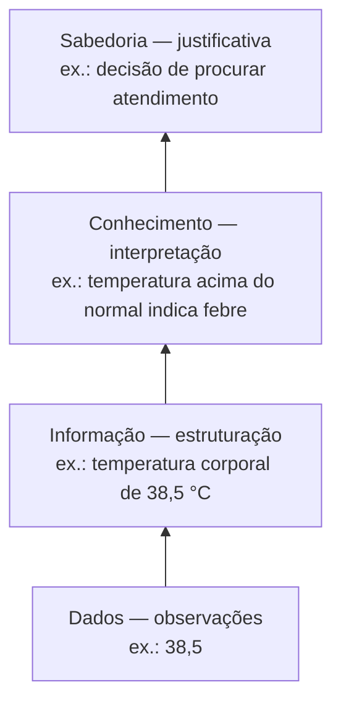

<!--META
{
  "title": "Apresentação da Disciplina e Introdução à Estatística",
  "header": "Introdução à Estatística",
  "tema": "Contrato pedagógico, objetivos, conteúdo programático anual, critérios de avaliação e bibliografia; origem da Matemática e da Estatística, definição atual de Estatística e hierarquia DIKW.",
  "typing": ["Estatística: decidir na presença de variabilidade", "Dados -> Informação -> Conhecimento -> Sabedoria", "Média Final = 40% S1 + 60% S2", "Aprovação: média >= 60 e frequência >= 75%"],
  "tipo": "Aula inaugural (apresentação e fundamentos)",
  "professor": "Prof. Me. Eng. Rodolfo Magliari de Paiva",
  "badges": [["Conteúdo", "Apresentação", "FF781F"], ["Área", "Estatística", "FF4500"], ["Nível", "Introdutório", "E60000"]],
  "icons": "py",
  "icons_alt": "Python",
  "limitacoes": "Os slides trazem aviso de direitos autorais; o conteúdo é explicado com redação própria. Imagens ilustrativas (pirâmide DIKW, linha do tempo) foram descritas, não reproduzidas.",
  "files": {
    "Aula 01-1 - Modelagem Linear para Aprendizado de Máquina.pptx(2).pdf": "Slides da aula 01 do 1º semestre (44 páginas): contrato pedagógico, objetivos, conteúdo programático dos dois semestres, avaliação, bibliografia, breve história da Matemática e da Estatística e hierarquia DIKW."
  }
}
META-->

<br />

<h2 id="visao-geral">Visão geral</h2>

Apesar do nome, **Modelagem Linear para Aprendizado de Máquina** é, conforme o conteúdo programático apresentado nesta aula, uma disciplina de **Estatística aplicada com Python**. No 1º semestre, ela percorre pesquisa e coleta de dados, introdução ao Python e estatística descritiva. No 2º, cobre probabilidade, inferência e análises bivariada e multivariada, culminando nos modelos de **regressão linear**, que dão nome à disciplina e são a base de muitos algoritmos de aprendizado de máquina.

A aula se divide em duas partes:

1. **Apresentação da disciplina:** contrato pedagógico, objetivos, conteúdo, avaliação e bibliografia.
2. **Introdução à Estatística:** etimologia, história e definição atual, e o papel dos dados na tomada de decisão (hierarquia DIKW).

<br />

<h2 id="objetivos">Objetivos de aprendizagem</h2>

Objetivos da disciplina, conforme os slides. Ao final, o aluno deve ser capaz de:

- identificar problemas que podem ser resolvidos por métodos estatísticos;
- compreender os fundamentos da programação em Python e conhecer o ambiente PyCharm;
- montar e interpretar tabelas e gráficos estatísticos em Python;
- desenvolver análises estatísticas e gráficas em Python;
- aplicar ferramentas estatísticas na elaboração de **relatórios de inteligência**;
- identificar *insights* relevantes em grandes volumes de dados.

<br />

<h2 id="pre-requisitos">Pré-requisitos</h2>

Nenhum pré-requisito formal. Ajudam a familiaridade com as operações aritméticas e com porcentagens e a curiosidade sobre como dados apoiam decisões.

<br />

<h2 id="fundamentacao-teorica">Fundamentação teórica</h2>

### 1. Organização da disciplina

**Conteúdo programático:**

| 1º semestre | 2º semestre |
| :--- | :--- |
| Introdução à Estatística (história, etapas de um estudo, população e amostra, relação com IA) | Probabilidade (visões clássica e frequentista, axiomas, variáveis aleatórias, distribuição normal, TCL) |
| Pesquisa e construção de base de dados (métodos, técnicas, questionários) | Inferência estatística (amostragem, estimadores, testes de hipótese, inferência bayesiana) |
| Introdução ao Python (calculadora, estruturas de controle, funções, objetos, bibliotecas, leitura e escrita de dados) | Análise bivariada (dispersão, covariância, correlação de Pearson, regressão linear simples, R², teste F) |
| Computação estatística (tipos de variáveis, tabelas de frequência, gráficos) | Análise multivariada (matrizes de covariância e correlação, regressão linear múltipla, R² múltiplo, teste F) |
| Estatística descritiva (tendência central, dispersão, separatrizes, boxplot) | |

**Avaliação, conforme os slides:**

- **Média semestral:** os *checkpoints* e a *Challenge Sprint* compõem uma média com peso de **40%**; a **Global Solution** tem peso de **60%**. Todas as notas vão de 0 a 100.
- **Média final:** $MF = 0{,}4 \cdot M_{1^\circ\,sem} + 0{,}6 \cdot M_{2^\circ\,sem}$.
- **Aprovação:** $MF \geq 60$ **e** frequência mínima de **75%**. Caso contrário, o aluno fica em dependência (DP).
- *Checkpoints* não têm prova substitutiva. A da Global Solution exige atestado e taxa.

**Contrato pedagógico (destaques):**

- tolerância de 15 minutos para entrada;
- entregas exclusivamente pelo Microsoft Teams ou pelo Portal, com desconto em caso de atraso;
- calculadora científica nas avaliações, quando aplicável, sem uso de celular;
- cópia ou plágio anula a avaliação de todos os envolvidos;
- uso **ético e crítico** de inteligência artificial: o aluno responde pelas consequências do uso inadequado.

**Bibliografia básica indicada:**

- QUINSLER, A. P. *Probabilidade e Estatística*. 1. ed. Curitiba: InterSaberes, 2022.
- MENEZES, N. N. C. *Introdução à Programação com Python: algoritmos e lógica de programação para iniciantes*. 4. ed. São Paulo: Novatec, 2024.

### 2. Matemática e Estatística: origem dos termos

| Termo | Origem apresentada | Ideia |
| :--- | :--- | :--- |
| Matemática | grego *máthema* | "decodificar" a natureza (*phýsis*): padrões e formas têm uma razão de ser |
| Estatística | latim *statisticum* | ligada ao **estadista**, que coletava informações censitárias para o Estado |

### 3. Breve história

- A Matemática nasce com os primeiros registros feitos por nossos ancestrais. Os slides destacam que ela avançou sobretudo onde havia **agricultura** (povos sedentários), apoiada em quatro alicerces: **clima, agricultura, comércio e registro**.
- A chamada "ciência estatal" (censos) existiu entre hebreus, chineses, egípcios, maias, romanos, hindus, persas e babilônios.
- Os slides marcam o surgimento da Estatística em **1858**, com o trabalho de **Florence Nightingale** (1820–1910) sobre saúde e administração hospitalar do exército britânico.
- Huygens, Fermat, Pascal, Graunt, Jacques Bernoulli, Bayes, Poisson e Mary Somerville contribuíram para o seu desenvolvimento. No fim do século XIX, Galton, Edgeworth, Karl Pearson e Yule deram à Estatística sua forma operacional moderna.
- Hoje a Estatística é um **campo científico autônomo**, com objeto e métodos próprios, embora mantenha forte interseção com a Matemática.

**Definição adotada (Montgomery e Runger, 2016):** a Estatística é a ciência que ajuda a **tomar decisões e tirar conclusões na presença de variabilidade**.

### 4. Hierarquia DIKW

A **pirâmide do conhecimento** (*Data, Information, Knowledge, Wisdom*) mostra como dados brutos se transformam em decisões:



*Figura 1 — Hierarquia DIKW. Os papéis de cada nível (observações, estruturação, interpretação, justificativa) seguem o slide, que indica o nível de abstração crescendo da base para o topo; o exemplo de temperatura corporal é próprio.*

A Estatística atua em todas as passagens da pirâmide: **organiza** os dados (informação), **identifica padrões** (conhecimento) e **quantifica a incerteza** das decisões (sabedoria).

<br />

<h2 id="exemplos-praticos">Exemplos práticos</h2>

### Exemplo básico — critério de aprovação da disciplina

A regra de avaliação apresentada nos slides, traduzida para Python:

```python
{{include:ml/notas.py}}
```

Saída esperada:

```text
{{include:ml/notas.out}}
```

O terceiro caso mostra que a média não basta: com frequência abaixo de 75%, o aluno fica em DP mesmo com média 72. Como o 2º semestre pesa 60%, um bom desempenho nele compensa mais do que no 1º.

### Exemplo aplicado — decidindo na presença de variabilidade

Dois fornecedores entregam peças com a mesma média de atraso, 2 dias, mas um varia entre 1 e 3 dias e o outro entre 0 e 6. Olhar só a média esconderia a diferença. É exatamente a "variabilidade" da definição de Montgomery e Runger. As medidas que quantificam essa diferença (amplitude, variância, desvio padrão) são estudadas na [aula 07](../aula07-06-05-26/README.md).

<br />

<h2 id="exercicios-resolvidos">Exercícios e resoluções comentadas</h2>

O material desta aula não traz exercícios. Abaixo, exercícios **propostos para estudo**.

1. Classifique em dado, informação, conhecimento ou sabedoria: (a) "R$ 4.299,90"; (b) "o preço do notebook X na loja Y é R$ 4.299,90"; (c) "os preços de notebooks caem em média 15% em novembro"; (d) "vamos adiar a compra para novembro".
2. Um aluno tem média 55 no 1º semestre. Qual a média mínima no 2º semestre para ser aprovado?

<details>
<summary><strong>Solução proposta para estudo</strong></summary>

1. (a) Dado: um número sem contexto. (b) Informação: o dado ganha contexto. (c) Conhecimento: um padrão extraído de muitas informações. (d) Sabedoria: a decisão tomada com base no conhecimento.
2. $0{,}4 \cdot 55 + 0{,}6 \cdot x \geq 60 \Rightarrow 0{,}6x \geq 38 \Rightarrow x \geq 63{,}\overline{3}$. É preciso pelo menos **63,4** no 2º semestre (e frequência de 75%).

</details>

<br />

<h2 id="aplicacoes">Aplicações no mercado de trabalho</h2>

- **Decisão baseada em dados:** empresas transformam registros operacionais em indicadores, previsões e decisões, o mesmo caminho da pirâmide DIKW.
- **Saúde pública:** o trabalho de Florence Nightingale é o exemplo histórico de como dados bem organizados e visualizados mudam políticas, uma prática que continua em epidemiologia e gestão hospitalar.
- **Relatórios de inteligência:** um dos objetivos da disciplina é produzir relatórios que resumam dados para gestores, tarefa central de analistas de dados e de BI.

<br />

<h2 id="boas-praticas">Boas práticas e erros comuns</h2>

| Problemático | Recomendado |
| :--- | :--- |
| Usar IA para gerar respostas sem entendê-las | Usar IA de forma ética e crítica, conferindo o resultado (contrato pedagógico) |
| Estudar só pelos slides | Manter anotações próprias; os materiais complementam a aula |
| Decidir olhando apenas uma média | Considerar também a variabilidade dos dados |
| Ignorar a frequência mínima | Lembrar que 75% de presença é requisito de aprovação, independentemente da nota |

<br />

<h2 id="resumo">Resumo para revisão</h2>

- A disciplina é de **Estatística com Python**: descritiva no 1º semestre; probabilidade, inferência e regressão no 2º.
- $MF = 0{,}4 \cdot S_1 + 0{,}6 \cdot S_2$; aprovação com $MF \geq 60$ e frequência $\geq 75\%$.
- Estatística: decidir e concluir **na presença de variabilidade**.
- Origem do termo: *statisticum*, o estadista que coletava informações censitárias.
- DIKW: dados → informação → conhecimento → sabedoria.

<br />

<h2 id="questoes">Questões de fixação</h2>

1. Qual é a definição de Estatística adotada na aula?
2. Quais os quatro alicerces da Matemática primitiva citados nos slides?
3. Qual o peso de cada semestre na média final?

<details>
<summary><strong>Respostas comentadas</strong></summary>

1. A ciência que ajuda a tomar decisões e tirar conclusões na presença de variabilidade (Montgomery e Runger, 2016).
2. Clima, agricultura, comércio e registro.
3. 40% para o 1º semestre e 60% para o 2º.

</details>

<br />

<h2 id="referencias">Referências e materiais complementares</h2>

- QUINSLER, A. P. *Probabilidade e Estatística*. Curitiba: InterSaberes, 2022 (bibliografia da disciplina).
- MENEZES, N. N. C. *Introdução à Programação com Python*. 4. ed. São Paulo: Novatec, 2024 (bibliografia da disciplina).
- MONTGOMERY, D. C.; RUNGER, G. C. Citados nos slides (2016) para a definição de Estatística.
- Materiais complementares indicados nos slides: [história da Matemática (IFC)](https://licenciatura-matematica.concordia.ifc.edu.br/wp-content/uploads/sites/24/2023/09/texto-e-cruzada-hist%C3%B3ria-da-matem%C3%A1tica.pdf) · [memória da história da Estatística (IME-USP)](https://www.ime.usp.br/~rvicente/JMPMemoria_Historia_Estatistica.pdf) · [pirâmide DIKW (Ontotext)](https://www.ontotext.com/knowledgehub/fundamentals/dikw-pyramid/)
