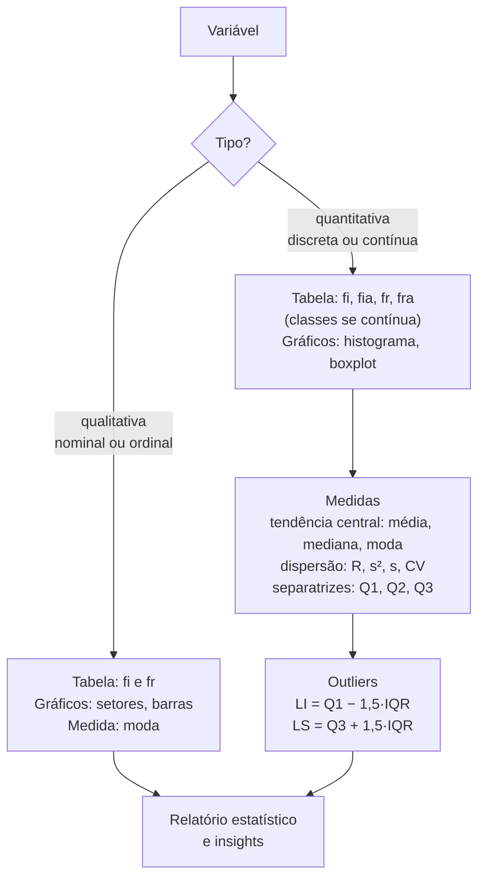

<!--META
{
  "title": "Roteiro de Estudos da Global Solution 1 (GS 1)",
  "header": "Roteiro de Estudos GS 1",
  "tema": "Roteiro de estudos da Global Solution 1: período de 25/05/2026 a 09/06/2026 e conteúdo das aulas 06, 07 e 08 do Portal (tabelas de frequência, gráficos e estatística descritiva), com revisão integrada.",
  "typing": ["GS 1: 25/05/2026 a 09/06/2026", "Frequências -> gráficos -> medidas", "AED completa de uma variável", "Revisão das aulas 05, 06 e 07 deste repositório"],
  "tecnologias": "Python 3, pandas (revisão)",
  "tipo": "Roteiro de estudos para avaliação (Global Solution)",
  "professor": "Prof. Me. Eng. Rodolfo Magliari de Paiva",
  "badges": [["Avaliação", "Global Solution 1", "FF781F"], ["Período", "25-05 a 09-06-2026", "FF4500"], ["Tipo", "Revisão", "E60000"]],
  "icons": "py",
  "icons_alt": "Python",
  "limitacoes": "O material da pasta tem 5 páginas e informa apenas o período e o conteúdo da avaliação; não traz questões. A seção de revisão desta página é uma síntese das aulas citadas, e o exercício integrador usa dados ilustrativos (não pertencentes ao material).",
  "files": {
    "GS 1 - Roteiro de Estudos.pptx(1).pdf": "Roteiro de estudos da Global Solution 1 (5 páginas): data (25/05/2026 a 09/06/2026) e conteúdo (aulas 06, 07 e 08 postadas no Portal)."
  }
}
META-->

<br />

<h2 id="visao-geral">Visão geral</h2>

O roteiro informa duas coisas:

| Item | Conteúdo do roteiro |
| :--- | :--- |
| **Data** | 25/05/2026 a 09/06/2026 |
| **Conteúdo** | Aulas 06, 07 e 08 postadas no Portal |

A numeração do Portal (arquivos "Aula 06-1", "Aula 07-1" e "Aula 08-1") difere da numeração das pastas deste repositório. A correspondência é:

| Aula do Portal | Pasta neste repositório | Assunto |
| :---: | :--- | :--- |
| 06 | [aula05-22-04-26](../aula05-22-04-26/README.md) | Tipos de variáveis e tabelas de frequência |
| 07 | [aula06-27-04-26](../aula06-27-04-26/README.md) | Gráficos estatísticos |
| 08 | [aula07-06-05-26](../aula07-06-05-26/README.md) | Estatística descritiva (AED) |

<br />

<h2 id="objetivos">Objetivos de aprendizagem</h2>

- Revisar, de forma integrada, os conteúdos cobrados na GS 1.
- Executar uma análise exploratória completa de uma variável quantitativa.
- Interpretar os resultados e redigir *insights*.

<br />

<h2 id="pre-requisitos">Pré-requisitos</h2>

- [Aula 05](../aula05-22-04-26/README.md), [aula 06](../aula06-27-04-26/README.md) e [aula 07](../aula07-06-05-26/README.md).

<br />

<h2 id="fundamentacao-teorica">Fundamentação teórica</h2>

### Mapa da revisão



*Figura 1 — Roteiro de uma análise exploratória, que sintetiza as três aulas cobradas.*

### Checklist de estudo

| Tópico | Saber fazer | Onde revisar |
| :--- | :--- | :--- |
| Classificação de variáveis | Nominal × ordinal; discreta × contínua | [Aula 05](../aula05-22-04-26/README.md#fundamentacao-teorica) |
| Tabela de frequências | $f_i$, $f_{ia}$, $f_r$, $f_{ra}$; classes com `pd.cut(right=False)` | [Aula 05](../aula05-22-04-26/README.md#exemplos-praticos) |
| Gráficos | Escolher pelo tipo de variável; `plt.pie`, `plt.bar`, `plt.hist`, `plt.boxplot` | [Aula 06](../aula06-27-04-26/README.md#fundamentacao-teorica) |
| Tendência central | Média, mediana (rol), moda (amodal, uni, bi, multimodal) | [Aula 07](../aula07-06-05-26/README.md#fundamentacao-teorica) |
| Dispersão | $R$, $s^2$ (divide por $n-1$), $s$, CV e sua classificação | [Aula 07](../aula07-06-05-26/README.md#fundamentacao-teorica) |
| Separatrizes e boxplot | Quartis, IQR, limites e *outliers* | [Aula 07](../aula07-06-05-26/README.md#exemplos-praticos) |

<br />

<h2 id="exemplos-praticos">Exemplos práticos</h2>

### Exemplo integrador — AED de uma variável contínua

Tempos de deslocamento, em minutos, de 20 alunos (**dados ilustrativos**):

```python
{{include:ml/gs1.py}}
```

Saída esperada:

```text
{{include:ml/gs1.out}}
```

O filtro `tabela["fi"] > 0` apenas oculta as classes vazias entre 50 e 90 minutos para encurtar a saída. Numa tabela formal, elas aparecem com frequência zero.

<br />

<h2 id="exercicios-resolvidos">Exercícios e resoluções comentadas</h2>

O roteiro não traz exercícios. A atividade abaixo é **proposta para estudo**, a partir do exemplo integrador.

> Interprete a saída do exemplo integrador: (a) qual a classe modal? (b) a média representa bem o tempo típico? (c) classifique a variabilidade; (d) escreva três *insights*.

<details>
<summary><strong>Solução proposta para estudo</strong></summary>

- (a) **[20, 30)**, com 8 alunos (40%).
- (b) Não tão bem: a média (30,35 min) está acima da mediana (27,5 min) porque o *outlier* de 90 minutos a puxa para cima. A mediana representa melhor o tempo típico.
- (c) CV = 53,9%, variabilidade **muito alta** (≥ 30%), inflada pelo *outlier*.
- (d) *Insights*:
  1. 60% dos alunos levam menos de 30 minutos.
  2. 85% levam menos de 40 minutos.
  3. Um aluno leva 90 minutos, muito acima do limite superior de 51,5 min. Vale verificar se é erro de registro ou um caso real que merece atenção (por exemplo, apoio de transporte).

</details>

<br />

<h2 id="aplicacoes">Aplicações no mercado de trabalho</h2>

A sequência revisada (classificar → tabular → visualizar → medir → interpretar) é o roteiro de qualquer **análise exploratória** em projetos de dados. É a etapa que precede modelos preditivos e relatórios de BI.

<br />

<h2 id="boas-praticas">Boas práticas e erros comuns</h2>

| Problemático | Recomendado |
| :--- | :--- |
| Estudar pela numeração das pastas | Usar a correspondência Portal → repositório da visão geral |
| Decorar fórmulas sem interpretar | Treinar a redação de *insights* a partir dos números |
| Esquecer de verificar *outliers* | Calcular LI e LS sempre que houver medidas de posição |
| Ignorar o tipo de variável | Classificar a variável antes de escolher tabela, gráfico e medida |

<br />

<h2 id="resumo">Resumo para revisão</h2>

- GS 1: de **25/05/2026 a 09/06/2026**; conteúdo das aulas 06, 07 e 08 do Portal (pastas 05, 06 e 07).
- AED = tabelas + gráficos + tendência central + dispersão + separatrizes.
- Interpretar sempre: comparar média e mediana, classificar o CV, apontar *outliers*.

<br />

<h2 id="questoes">Questões de fixação</h2>

1. Quais pastas deste repositório correspondem ao conteúdo da GS 1?
2. Que medida de tendência central é mais adequada quando há *outliers*?
3. Que gráfico mostra, ao mesmo tempo, a mediana, os quartis e os *outliers*?

<details>
<summary><strong>Respostas comentadas</strong></summary>

1. `aula05-22-04-26`, `aula06-27-04-26` e `aula07-06-05-26`.
2. A mediana, que não é afetada pela magnitude dos valores extremos.
3. O boxplot.

</details>

<br />

<h2 id="referencias">Referências e materiais complementares</h2>

- Material da pasta: [roteiro da GS 1](GS%201%20-%20Roteiro%20de%20Estudos.pptx%281%29.pdf)
- [pandas — guia do usuário](https://pandas.pydata.org/docs/user_guide/index.html)
- QUINSLER, A. P. *Probabilidade e Estatística*. Curitiba: InterSaberes, 2022 (bibliografia da disciplina).
