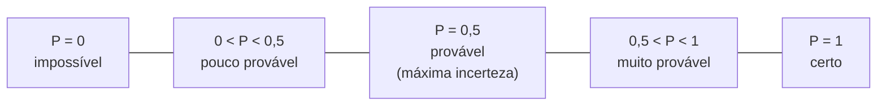

<!--META
{
  "title": "Probabilidade, Variáveis Aleatórias e Distribuição Normal",
  "header": "Probabilidade e Normal",
  "tema": "Experimento aleatório, espaço amostral e evento; visões clássica e frequentista; axiomas e teoremas da probabilidade; variáveis aleatórias discretas e contínuas; função e distribuição de probabilidade; distribuição normal, regra empírica, padronização Z e cálculo de probabilidades acumuladas e quantis em Python.",
  "typing": ["P(A) = casos favoráveis / casos possíveis", "0 <= P(E) <= 1 e P(Ω) = 1", "X ~ N(μ, σ²)", "Z = (x − μ) / σ"],
  "tecnologias": "Python 3, scipy.stats (nos slides), statistics.NormalDist (verificação)",
  "tipo": "Aula teórica e prática com exemplos e exercícios resolvidos",
  "professor": "Prof. Me. Eng. Rodolfo Magliari de Paiva",
  "badges": [["Linguagem", "Python", "FF781F", "python"], ["Tema", "Probabilidade", "FF4500"], ["Distribuição", "Normal", "E60000"]],
  "icons": "py",
  "icons_alt": "Python",
  "limitacoes": "Os slides usam scipy.stats.norm; o SciPy não está instalado no ambiente usado nesta documentação e não foi instalado. Todos os resultados numéricos do material foram conferidos com statistics.NormalDist, da biblioteca padrão, que implementa as mesmas funções (cdf, inv_cdf). Fórmulas e diagramas presentes como imagem foram lidos visualmente. Os slides trazem aviso de direitos autorais.",
  "files": {
    "Aula 01-2 - Modelagem Linear para Aprendizado de Máquina.pptx.pdf": "Slides da aula 01 do 2º semestre (90 páginas): probabilidade, espaço amostral, interpretações clássica e frequentista, axiomas e teoremas, variáveis aleatórias, funções e distribuições de probabilidade, distribuição normal e normal padrão, com exemplos e exercícios resolvidos.",
    "assets/normal-alturas.svg": "Figura original desta documentação: curva normal N(175, 10) com as áreas do exemplo das alturas.",
    "assets/regra-empirica.svg": "Figura original desta documentação: regra empírica 68–95–99,7 da distribuição normal."
  }
}
META-->

<br />

<h2 id="visao-geral">Visão geral</h2>

O 2º semestre começa pela **Probabilidade**, a parte da Matemática e da Estatística que estuda a chance de um evento acontecer. Ela trata apenas de eventos **probabilísticos**, de resultado incerto, e não dos **determinísticos**, de resultado certo. Se a variabilidade dá origem à aleatoriedade, a Probabilidade dá as ferramentas para **quantificar a incerteza**, estimar riscos e escolher alternativas com menor chance de prejuízo.

Os slides citam como aplicações: meteorologia, análise de risco, jogos de azar, sexagem, genética, sucesso × fracasso e inteligência artificial.

A aula culmina na **distribuição normal**, base de grande parte da inferência estatística das próximas aulas.

<br />

<h2 id="objetivos">Objetivos de aprendizagem</h2>

- Definir experimento aleatório, espaço amostral e evento.
- Calcular probabilidades pelas visões clássica e frequentista e classificar eventos.
- Aplicar os três axiomas e os quatro teoremas básicos.
- Definir variável aleatória (v.a.) e diferenciar v.a. discreta de contínua.
- Montar a distribuição de probabilidade de uma v.a. discreta.
- Calcular probabilidades e quantis na distribuição normal, inclusive pela padronização Z.

<br />

<h2 id="pre-requisitos">Pré-requisitos</h2>

- [Aula 07](../aula07-06-05-26/README.md): média, desvio padrão, quartis e boxplot.
- Noções de conjuntos (união, interseção, complemento).

<br />

<h2 id="fundamentacao-teorica">Fundamentação teórica</h2>

### 1. Espaço amostral e eventos

- **Experimento aleatório:** produz resultados incertos.
- **Espaço amostral** ($S$ ou $\Omega$): conjunto de **todos** os resultados possíveis.
- **Evento:** subconjunto do espaço amostral, ou seja, os resultados de interesse.

Espaços amostrais pequenos podem ser listados à mão, por **tabela de dupla entrada** ou **diagrama de árvore**. Os grandes exigem **análise combinatória**: princípio fundamental da contagem, permutações, arranjos e combinações.

### 2. Interpretações de probabilidade

$$P(A) = \frac{n^\circ \text{ de casos favoráveis}}{n^\circ \text{ de casos possíveis}}$$

| Visão | Condição | Cálculo |
| :--- | :--- | :--- |
| **Clássica** | $n(S)$ finito e conhecido, resultados **equiprováveis** | $P(A) = \dfrac{n(A)}{n(S)}$ |
| **Frequentista** | Número de tentativas **muito grande** | $P(A) \approx \dfrac{n(A)}{n(\text{tentativas})}$ (frequência relativa) |

**Classificação de eventos**, conforme a escala do slide do 1º axioma:



*Figura 1 — Escala de classificação usada nas respostas dos exercícios.*

### 3. Axiomas e teoremas

| Axiomas (aceitos sem demonstração) | Teoremas (demonstrados a partir dos axiomas) |
| :--- | :--- |
| 1º) $0 \leq P(E) \leq 1$ | 1º) $P(\varnothing) = 0$ |
| 2º) $P(\Omega) = 1$ | 2º) $P(A^c) = 1 - P(A)$ (complemento) |
| 3º) $P(A \cup B) = P(A) + P(B)$, se $A$ e $B$ são **mutuamente exclusivos** (disjuntos) | 3º) Se $A \subset B$, então $P(A) \leq P(B)$ |
| | 4º) $P(A \cup B) = P(A) + P(B) - P(A \cap B)$, para eventos **não** mutuamente exclusivos |

O 4º teorema subtrai a interseção porque ela seria contada **duas vezes**.

### 4. Variável aleatória

Uma **variável aleatória** $X$ é uma **função** que associa um número real a cada resultado do espaço amostral. A letra maiúscula ($X$) denota a variável; a minúscula ($x = 70$ cm), o valor observado.

| Tipo | Natureza | Exemplos dos slides |
| :--- | :--- | :--- |
| **Discreta** | Contagem; valores enumeráveis | Nº de pessoas com doença celíaca; nº de ligações por dia (0, 1, 2, …) |
| **Contínua** | Medição; intervalo de números reais | Tempo de espera no hospital; duração de uma ligação, $y \in [0; 120]$ min |

**Distribuição de probabilidade** é a função que atribui a cada valor $x_i$ sua probabilidade. Ela exige que cada probabilidade esteja entre 0 e 1 e que **todas somem 1**.

| v.a. discreta | v.a. contínua |
| :--- | :--- |
| Função massa de probabilidade: $f(x) = P(X = x)$ | Função densidade: $P(a \leq X \leq b) = \int_a^b f(x)\,dx$ |
| Acumulada: $F(x) = \sum_{x_i \leq x} f(x_i)$ | Acumulada: $F(x) = \int_{-\infty}^{x} f(u)\,du$ |
| Exemplos: uniforme discreta, binomial, geométrica, hipergeométrica, Poisson | Exemplos: uniforme contínua, **normal**, exponencial, gama, Weibull, lognormal |

Numa v.a. contínua, a probabilidade é a **área** sob a curva de densidade.

### 5. Distribuição normal

A **distribuição normal** (gaussiana, ou "curva de sino") é simétrica em torno da média e descreve bem fenômenos como altura, peso, pressão arterial e tempos de reação. Notação: $X \sim N(\mu, \sigma^2)$.

$$f(x) = \frac{1}{\sigma\sqrt{2\pi}}\, e^{-\frac{1}{2}\left(\frac{x-\mu}{\sigma}\right)^2}$$

- $\mu$ desloca a curva no eixo horizontal; $\sigma$ a alarga ou estreita.
- Média, mediana e moda coincidem em $\mu$.

<p align="center">
  
</p>

*Figura 2 — Regra empírica, apresentada nos slides (SVG original; percentuais calculados com `statistics.NormalDist`).*

Os slides destacam ainda a ligação com o **boxplot** da [aula 07](../aula07-06-05-26/README.md). Em dados normais, Q1 e Q3 ficam a cerca de $\pm 0{,}6745\sigma$ da média, e os limites de *outliers* a $\pm 2{,}698\sigma$. Assim, o boxplot ajuda a avaliar simetria e desvios da normalidade.

**Padronização:** $Z = \dfrac{x - \mu}{\sigma}$ transforma qualquer normal na **normal padrão** $N(0, 1)$. Isso facilita os cálculos manuais (com tabela) e permite comparar variáveis de unidades diferentes.

<br />

<h2 id="exemplos-praticos">Exemplos práticos</h2>

### Exemplo básico — probabilidade clássica e variável aleatória

O exercício de genética dos slides (homem Ab/ab × mulher aB/ab) e a v.a. "número de caras em 3 lançamentos de moeda":

```python
{{include:ml/prob_classica.py}}
```

Saída esperada:

```text
{{include:ml/prob_classica.out}}
```

Só `aabb` é homozigoto nos dois genes, e por isso a probabilidade é $1/4$, como na resposta do material.

### Exemplo intermediário — distribuição de probabilidade do nível de estresse (exemplo dos slides)

150 funcionários classificados de 1 (muito calmo) a 5 (muito irritado):

```python
{{include:ml/estresse.py}}
```

Saída esperada:

```text
{{include:ml/estresse.out}}
```

As probabilidades coincidem com a tabela do slide (0,16; 0,22; 0,28; 0,20; 0,14) e somam 1.

### Exemplo aplicado — normal: probabilidades acumuladas e quantis

Os slides usam `scipy.stats.norm`. O código abaixo usa `statistics.NormalDist`, da biblioteca padrão, que tem as mesmas operações. A correspondência é `norm.cdf(x, μ, σ)` → `NormalDist(μ, σ).cdf(x)`, `norm.sf` → `1 − cdf` e `norm.ppf(p, μ, σ)` → `NormalDist(μ, σ).inv_cdf(p)`.

```python
{{include:ml/normal.py}}
```

Saída esperada:

```text
{{include:ml/normal.out}}
```

<p align="center">
  
</p>

*Figura 3 — As três probabilidades do exemplo das alturas como áreas sob a curva (SVG original).*

<br />

<h2 id="exercicios-resolvidos">Exercícios e resoluções comentadas</h2>

### Probabilidade clássica e variáveis aleatórias

| Exercício | Solução do material original |
| :--- | :--- |
| Pulso corrompido (2 em 10 pulsos) | $P = 2/10 = 0{,}2$, pouco provável |
| Clima: chuvoso e sem sol (12 dias) | $P = 5/12 \approx 0{,}42$, pouco provável |
| Genética: criança homozigótica | $P = 1/4 = 0{,}25$, pouco provável (conferido acima) |
| Discreta ou contínua: a) tempo de retorno de um projétil; b) mudanças de estado de um transistor; c) volume de gasolina evaporado; d) diâmetro de um eixo | a) contínua; b) **discreta**; c) contínua; d) contínua |

### Distribuição normal

Todas as respostas do material foram **recalculadas** com `statistics.NormalDist`:

| Exercício | Solução do material original | Conferência |
| :--- | :--- | :--- |
| Alturas N(175, 10): a) $P(X \leq 164)$; b) $P(X \geq 164)$; c) $P(164 \leq X \leq 174)$ | a) ≈ 0,1356, pouco provável; b) ≈ 0,8643, muito provável; c) ≈ 0,3245, pouco provável | 0,13567; 0,86433; 0,32451 ✔ (o material trunca a 4ª casa em a) |
| Arruelas N(11,15; 2,238): a) $< 8{,}70$; b) $< 14{,}70$; c) entre os dois | a) ≈ 0,1368; b) ≈ 0,9436; c) ≈ 0,8068 | 0,13682; 0,94366; 0,80684 ✔ |
| Alturas com variância 64 cm²: $P(X > 180)$ | $\sigma = \sqrt{64} = 8$; ≈ 0,2266, pouco provável | 0,22663 ✔ |
| Porcos N(64, 15), 800 animais: entre 42 e 73 kg | ≈ 0,6545; ≈ 524 porcos | 0,65451; 523,6 ✔ |
| Poluente N(8; 1,5): $P(X > 10)$ ppm | ≈ 0,0912 (9,12%), pouco provável | 0,09121 ✔ |
| Teste de aptidão N(45, 400), 50 candidatos: $X > 50$ ou $X < 30$ | $\sigma = 20$; ≈ 0,6279; "≈ 32 candidatos" | 0,62792; $50 \times 0{,}6279 = 31{,}4$ ⚠ |
| Produção N(120, 15): a) $< 100$ min; b) quantil de 95%; c) 80% centrais | a) ≈ 0,0912; b) ≈ 144,67 min; c) 100,77 a 139,22 min | 0,09121; 144,67; 100,78 e 139,22 ✔ |

> [!NOTE]
> No teste de aptidão, $50 \times 0{,}6279 \approx 31{,}4$: o arredondamento usual daria **31** candidatos. O material indica 32. A diferença é apenas de arredondamento; a probabilidade está correta.

**Por que somar no exercício do teste de aptidão?** "Mais de 50" e "menos de 30" são eventos **mutuamente exclusivos** (não há tempo nas duas faixas ao mesmo tempo). Pelo 3º axioma, $P(A \cup B) = P(A) + P(B)$.

**Exercício proposto para estudo:** em um dado honesto, sejam $A$ = "número par" e $B$ = "número maior que 3". Calcule $P(A \cup B)$.

<details>
<summary><strong>Solução proposta para estudo</strong></summary>

$A = \{2, 4, 6\}$, $B = \{4, 5, 6\}$ e $A \cap B = \{4, 6\}$. Os eventos **não** são mutuamente exclusivos, então pelo 4º teorema:

$$P(A \cup B) = \tfrac{3}{6} + \tfrac{3}{6} - \tfrac{2}{6} = \tfrac{4}{6} \approx 0{,}67$$

Conferência direta: $A \cup B = \{2, 4, 5, 6\}$, com 4 de 6 casos, um evento muito provável.

</details>

<br />

<h2 id="aplicacoes">Aplicações no mercado de trabalho</h2>

- **Controle de qualidade:** a probabilidade de uma peça sair da especificação (como as arruelas) define taxas de refugo e limites de tolerância.
- **Meio ambiente e conformidade:** estimar a chance de exceder limites regulatórios (exercício do poluente).
- **Planejamento de produção:** quantis (`inv_cdf`/`ppf`) definem prazos que atendem, por exemplo, 95% dos pedidos.
- **Aprendizado de máquina:** modelos probabilísticos, padronização de atributos (*z-score*) e detecção de anomalias usam diretamente estes conceitos.

<br />

<h2 id="boas-praticas">Boas práticas e erros comuns</h2>

| Problemático | Recomendado | Motivo |
| :--- | :--- | :--- |
| Passar a **variância** como desvio em `norm.cdf` ou `NormalDist` | Converter: $\sigma = \sqrt{\sigma^2}$ | Os exercícios 2 e 5 dão a variância de propósito |
| Somar probabilidades de eventos com interseção | Subtrair $P(A \cap B)$ (4º teorema) | Evita contar a interseção duas vezes |
| Calcular $P(X > x)$ com `cdf(x)` | Usar `1 - cdf(x)` (ou `norm.sf`) | `cdf` é a área **à esquerda** |
| Resolver sem esboçar a curva | Esboçar e sombrear a área pedida (recomendação dos slides) | Evita confundir cauda esquerda e direita |
| Esperar $P(X = x) > 0$ em v.a. contínua | Trabalhar com intervalos | A área sobre um ponto é zero |

<br />

<h2 id="resumo">Resumo para revisão</h2>

- $P(A) = n(A)/n(S)$ (clássica) ou frequência relativa em muitas tentativas (frequentista).
- Axiomas: $0 \leq P \leq 1$; $P(\Omega) = 1$; aditividade para eventos disjuntos.
- Teoremas: $P(\varnothing) = 0$; $P(A^c) = 1 - P(A)$; $A \subset B \Rightarrow P(A) \leq P(B)$; $P(A \cup B) = P(A) + P(B) - P(A \cap B)$.
- v.a.: função que associa números aos resultados; discreta (contagem) ou contínua (medição).
- Normal $N(\mu, \sigma^2)$: simétrica; 68–95–99,7; $Z = (x - \mu)/\sigma$.
- Python: `cdf` (área à esquerda), `1 - cdf` (à direita), diferença de `cdf` (intervalo), `inv_cdf`/`ppf` (quantil).

<br />

<h2 id="questoes">Questões de fixação</h2>

1. Se $P(A) = 0{,}7$, quanto vale $P(A^c)$?
2. Uma v.a. normal tem $\mu = 100$ e $\sigma = 15$. Qual o valor de $z$ para $x = 130$?
3. Aproximadamente que porcentagem dos valores de uma normal fica entre $\mu - 2\sigma$ e $\mu + 2\sigma$?
4. O número de e-mails recebidos por hora é uma v.a. discreta ou contínua?

<details>
<summary><strong>Respostas comentadas</strong></summary>

1. $1 - 0{,}7 = 0{,}3$ (2º teorema).
2. $z = (130 - 100)/15 = 2$.
3. Cerca de 95% (95,45%).
4. Discreta, porque é uma contagem.

</details>

<br />

<h2 id="referencias">Referências e materiais complementares</h2>

- [Python — `statistics.NormalDist`](https://docs.python.org/pt-br/3/library/statistics.html#statistics.NormalDist)
- [SciPy — `scipy.stats.norm`](https://docs.scipy.org/doc/scipy/reference/generated/scipy.stats.norm.html), usado nos slides.
- QUINSLER, A. P. *Probabilidade e Estatística*. Curitiba: InterSaberes, 2022 (bibliografia da disciplina).
- Materiais complementares indicados nos slides: [variáveis aleatórias (UFSC)](https://www.inf.ufsc.br/~andre.zibetti/probabilidade/variaveis_aleatorias.html) · [distribuições de probabilidade (UFMG)](https://www.est.ufmg.br/~monitoria/Material/ApostilaR/DistribuicoesProbabilidade.html) · [distribuição normal (UFSC)](https://www.inf.ufsc.br/~andre.zibetti/probabilidade/normal.html)
