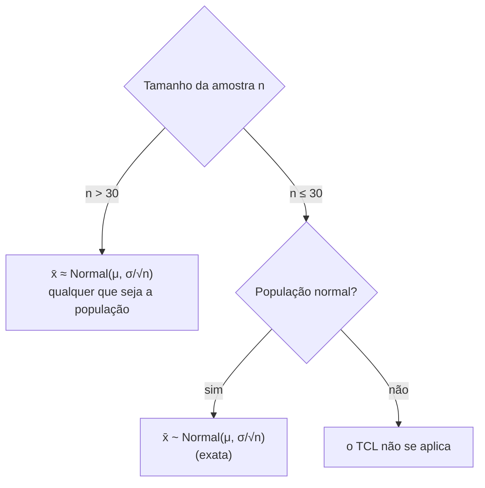

<!--META
{
  "title": "Distribuições Amostrais e o Teorema Central do Limite",
  "header": "Distribuições Amostrais e TCL",
  "tema": "Distribuição amostral, ponto de inflexão da normal, Teorema Central do Limite (TCL) e suas condições, distribuição amostral da média, erro padrão σ/√n e cálculo de probabilidades para médias amostrais em Python.",
  "typing": ["x̄ ~ N(μ, σ²/n)", "erro padrão = σ / √n", "n > 30: o TCL garante normalidade aproximada", "4² = 16 amostras de tamanho 2"],
  "tecnologias": "Python 3, NumPy e scipy.stats (nos slides), statistics (verificação)",
  "tipo": "Aula teórica e prática com exemplos e exercícios resolvidos",
  "professor": "Prof. Me. Eng. Rodolfo Magliari de Paiva",
  "badges": [["Linguagem", "Python", "FF781F", "python"], ["Teorema", "Central do Limite", "FF4500"], ["Conceito", "Erro padrão", "E60000"]],
  "icons": "py",
  "icons_alt": "Python",
  "limitacoes": "O SciPy não está instalado no ambiente usado nesta documentação; todos os resultados do material foram conferidos com statistics.NormalDist (biblioteca padrão). Os simuladores on-line citados nos slides não foram acessados. Fórmulas apresentadas como imagem foram lidas visualmente. Os slides trazem aviso de direitos autorais.",
  "files": {
    "Aula 02-2 - Modelagem Linear para Aprendizado de Máquina.pptx.pdf": "Slides da aula 02 do 2º semestre (46 páginas): distribuições amostrais, ponto de inflexão, Teorema Central do Limite, distribuição amostral da média, erro padrão e seis exercícios resolvidos.",
    "assets/tcl-simulacao.svg": "Figura original desta documentação: simulação do TCL com população exponencial e médias de amostras de tamanho 2 e 30."
  }
}
META-->

<br />

<h2 id="visao-geral">Visão geral</h2>

Até aqui, as probabilidades descreviam **um indivíduo**: a altura de uma pessoa, a espessura de uma arruela. Nesta aula a pergunta muda para o que se pode dizer da **média de uma amostra**. Se sorteássemos muitas amostras da mesma população, suas médias formariam uma **distribuição amostral**.

O resultado central é o **Teorema Central do Limite (TCL)**: para amostras suficientemente grandes, a média amostral segue aproximadamente uma distribuição normal, **qualquer que seja** a forma da população. É ele que justifica boa parte da inferência estatística das próximas aulas.

<br />

<h2 id="objetivos">Objetivos de aprendizagem</h2>

- Definir distribuição amostral e listar seus tipos principais.
- Enunciar o TCL e suas condições de aplicação.
- Construir a distribuição amostral da média para uma população pequena.
- Calcular o **erro padrão** $\sigma/\sqrt{n}$.
- Calcular probabilidades para a média amostral em Python.

<br />

<h2 id="pre-requisitos">Pré-requisitos</h2>

- [Aula 09](../aula09-03-08-26/README.md): distribuição normal e cálculo com `cdf`.
- [Aula 07](../aula07-06-05-26/README.md): média, variância e desvio padrão.

<br />

<h2 id="fundamentacao-teorica">Fundamentação teórica</h2>

### 1. Distribuição amostral

É a distribuição de uma **estatística** (média, proporção, variância…) calculada em diferentes amostras da mesma população. Os slides citam as distribuições amostrais:

- da média;
- da diferença de médias;
- da proporção;
- da diferença de proporções;
- da variância.

Esta aula trata da **média**.

**Ponto de inflexão:** é onde a curva muda de concavidade, ou seja, onde a segunda derivada troca de sinal. Na curva normal, os pontos de inflexão ficam em $\mu - \sigma$ e $\mu + \sigma$: o desvio padrão mede a distância do centro até onde o "sino" muda de curvatura.

### 2. Teorema Central do Limite

Para amostras aleatórias de uma população com média $\mu$ e desvio padrão $\sigma$, os slides estabelecem três casos:



*Figura 1 — Condições do TCL conforme os slides.*

O tamanho necessário depende da forma da população: quanto mais assimétrica, maior o $n$ exigido. O critério $n > 30$ é a regra prática adotada.

<p align="center">
  
</p>

*Figura 2 — Simulação própria do TCL (semente 42). A população é fortemente assimétrica; ainda assim, as médias de amostras de tamanho 30 têm forma de sino em torno de 10. Valores além das faixas exibidas (caudas) foram omitidos.*

### 3. Distribuição amostral da média e erro padrão

Se $X_1, \dots, X_n$ é uma amostra com reposição de uma população com média $\mu$ e variância $\sigma^2$:

$$E(\bar{X}) = \mu \qquad \text{Var}(\bar{X}) = \frac{\sigma^2}{n} \qquad \bar{X} \approx N\!\left(\mu, \frac{\sigma^2}{n}\right)$$

Se a própria população for normal, o resultado deixa de ser aproximado e passa a ser **exato**. O desvio padrão da média amostral recebe o nome de **erro padrão**:

$$\sigma_{\bar{X}} = \frac{\sigma}{\sqrt{n}}$$

Como $n$ está no denominador, **amostras maiores produzem médias mais concentradas** em torno de $\mu$. A média amostral também pode ser padronizada: $Z = \dfrac{\bar{x} - \mu}{\sigma/\sqrt{n}}$.

<br />

<h2 id="exemplos-praticos">Exemplos práticos</h2>

### Exemplo básico — todas as amostras de {2, 4, 6, 8} (exemplo dos slides)

Amostras de tamanho $n = 2$ com reposição: $4^2 = 16$ possibilidades.

```python
{{include:ml/amostral.py}}
```

Saída esperada:

```text
{{include:ml/amostral.out}}
```

A distribuição das médias tem forma **triangular**, já concentrada no centro, enquanto a população é uniforme. Além disso, a média das médias é igual a $\mu$, e a variância das médias é igual a $\sigma^2/n$, exatamente como prevê a teoria.

### Exemplo intermediário — simulando o TCL

```python
{{include:ml/tcl.py}}
```

Saída esperada:

```text
{{include:ml/tcl.out}}
```

O desvio padrão observado das médias acompanha $\sigma/\sqrt{n}$, e com $n = 100$ ele cai para cerca de 1 minuto. A Figura 2 mostra a forma dessas distribuições.

### Exemplo aplicado — probabilidade para a média amostral

```python
{{include:ml/erro_padrao.py}}
```

Saída esperada:

```text
{{include:ml/erro_padrao.out}}
```

A segunda parte ilustra o erro mais comum desta aula: para "**maior que**", usa-se a área à **direita**, `1 - cdf` (ou `norm.sf`).

<br />

<h2 id="exercicios-resolvidos">Exercícios e resoluções comentadas</h2>

Todas as respostas do material foram **recalculadas** com `statistics.NormalDist`:

| Exercício | Dados | Solução do material original | Conferência |
| :--- | :--- | :--- | :--- |
| Resistores | $\mu = 100$, $\sigma = 10$, $n = 25$; $P(\bar{x} < 95)$ | ≈ 0,0062, pouco provável | 0,00621 ✔ |
| 1. Água | $\mu = 2$ L, $\sigma = 0{,}7$, $n = 50$, 110 L ($\bar{x} = 2{,}2$); $P(\bar{x} > 2{,}2)$ | ≈ 0,0216, pouco provável | 0,02168 ✔ |
| 2. Peças | $\mu = 172$, $\sigma = 5$, $n = 16$; $P(169 \leq \bar{x} \leq 175)$ | ≈ 0,9836, muito provável | 0,98360 ✔ |
| 3. Alturas | $\mu = 170$, $\sigma = 5$, $n = 40$ | a) $P(\bar{x} > 172) \approx 0{,}0057$; b) ≈ 0,8812; c) $P(\bar{x} \leq 168{,}7) \approx 0{,}0500$ | 0,00571 ✔ ⚠; 0,88128 ✔; 0,05005 ✔ |
| 4. Sensores | $\mu = 200$, $\sigma = 15$, $n = 30$; $P(\bar{x} < 190)$ | ≈ 0,0001, pouco provável | 0,00013 ✔ |
| 5. Pacotes | $\mu = 120$ ms, $\sigma^2 = 400$, $n = 36$; $P(\bar{x} > 110)$ | ≈ 0,9986, muito provável | 0,99865 ✔ ⚠ |
| 6. Treinamento | $\mu = 120$, CV = 16,66% ($\sigma = 19{,}992$), $n = 144$; $P(115 \leq \bar{x} \leq 122)$ | ≈ 0,8836, muito provável | 0,88368 ✔ |

> [!WARNING]
> **Inconsistência nos exercícios 3a e 5 do material.** As respostas numéricas estão corretas, mas o código mostrado chama `norm.cdf(172, 170, dp)` e `norm.cdf(110, 120, dp)`, que calculam a área à **esquerda** e retornam 0,9943 e 0,0013. Para "maior que", o correto é `norm.sf(...)` ou `1 - norm.cdf(...)`, como no exercício 1. Os valores foram verificados por execução, e o material original não foi alterado.

**Comentários:**

- **Exercício 1:** o truque é converter a quantidade total em **média por pessoa** ($110/50 = 2{,}2$ L). Ficar sem água equivale a cada um beber, em média, mais de 2,2 L.
- **Exercícios 5 e 6:** o desvio vem disfarçado, como variância ($\sqrt{400} = 20$) ou como CV ($\sigma = CV \cdot \mu$).

**Exercício proposto para estudo:** com $\sigma = 10$, qual o tamanho mínimo de amostra para que o erro padrão seja no máximo 1?

<details>
<summary><strong>Solução proposta para estudo</strong></summary>

$\dfrac{10}{\sqrt{n}} \leq 1 \Rightarrow \sqrt{n} \geq 10 \Rightarrow n \geq 100$. Para **dividir o erro padrão por 2**, é preciso **quadruplicar** a amostra, porque o erro cai com a raiz de $n$.

</details>

<br />

<h2 id="aplicacoes">Aplicações no mercado de trabalho</h2>

- **Controle estatístico de processos:** gráficos de controle monitoram **médias de subgrupos** de peças, cuja variabilidade é o erro padrão.
- **Testes A/B:** comparar a média de conversão de duas versões de um site depende da distribuição amostral da média ou da proporção.
- **Monitoramento de sistemas e de IA:** latência média de lotes de requisições e tempo médio de treinamento (exercícios 5 e 6).
- **Dimensionamento de pesquisas:** a relação $\sigma/\sqrt{n}$ orienta o tamanho de amostra necessário para uma precisão desejada.

<br />

<h2 id="boas-praticas">Boas práticas e erros comuns</h2>

| Problemático | Recomendado | Motivo |
| :--- | :--- | :--- |
| Usar $\sigma$ no lugar de $\sigma/\sqrt{n}$ | Calcular o erro padrão primeiro | A média amostral varia menos que os indivíduos |
| `cdf` para "maior que" | `sf` ou `1 - cdf` | `cdf` é a área à esquerda (erro presente nos exercícios 3a e 5 do material) |
| Aplicar o TCL com $n$ pequeno e população assimétrica | Verificar as condições (Figura 1) | Com $n \leq 30$ e população não normal, o TCL não se aplica |
| Esquecer de converter variância ou CV | $\sigma = \sqrt{\sigma^2}$; $\sigma = CV \cdot \mu$ | Os enunciados escondem o desvio de propósito |

<br />

<h2 id="resumo">Resumo para revisão</h2>

- **Distribuição amostral:** distribuição de uma estatística entre amostras.
- **TCL:** com $n > 30$, $\bar{X} \approx N(\mu, \sigma^2/n)$ para qualquer população; com população normal, vale para qualquer $n$.
- **Erro padrão:** $\sigma/\sqrt{n}$; quadruplicar $n$ reduz o erro pela metade.
- **Python:** `NormalDist(μ, σ/√n).cdf(x)` ou `norm.cdf(x, μ, σ/√n)`; para "maior que", `1 - cdf` ou `sf`.

<br />

<h2 id="questoes">Questões de fixação</h2>

1. Uma população tem $\sigma = 12$. Qual o erro padrão para $n = 36$?
2. Uma população fortemente assimétrica é amostrada com $n = 10$. O TCL garante normalidade da média?
3. No exemplo {2, 4, 6, 8}, qual a média amostral mais provável e qual sua probabilidade?

<details>
<summary><strong>Respostas comentadas</strong></summary>

1. $12/\sqrt{36} = 2$.
2. Não. Com $n \leq 30$, só há garantia se a população for normal.
3. $\bar{x} = 5$, com probabilidade $4/16 = 0{,}25$.

</details>

<br />

<h2 id="referencias">Referências e materiais complementares</h2>

- [Python — `statistics.NormalDist`](https://docs.python.org/pt-br/3/library/statistics.html#statistics.NormalDist)
- [SciPy — `scipy.stats.norm`](https://docs.scipy.org/doc/scipy/reference/generated/scipy.stats.norm.html), usado nos slides.
- Materiais complementares indicados nos slides: [distribuição amostral (UFSC)](https://www.inf.ufsc.br/~andre.zibetti/probabilidade/distribuicao_amostral.html) · [distribuição amostral (UFPR)](https://docs.ufpr.br/~soniaisoldi/TP707/Aula4.pdf) · [distribuição amostral da média (Khan Academy)](https://pt.khanacademy.org/math/ap-statistics/sampling-distribution-ap/what-is-sampling-distribution/v/sampling-distribution-of-the-sample-mean)
