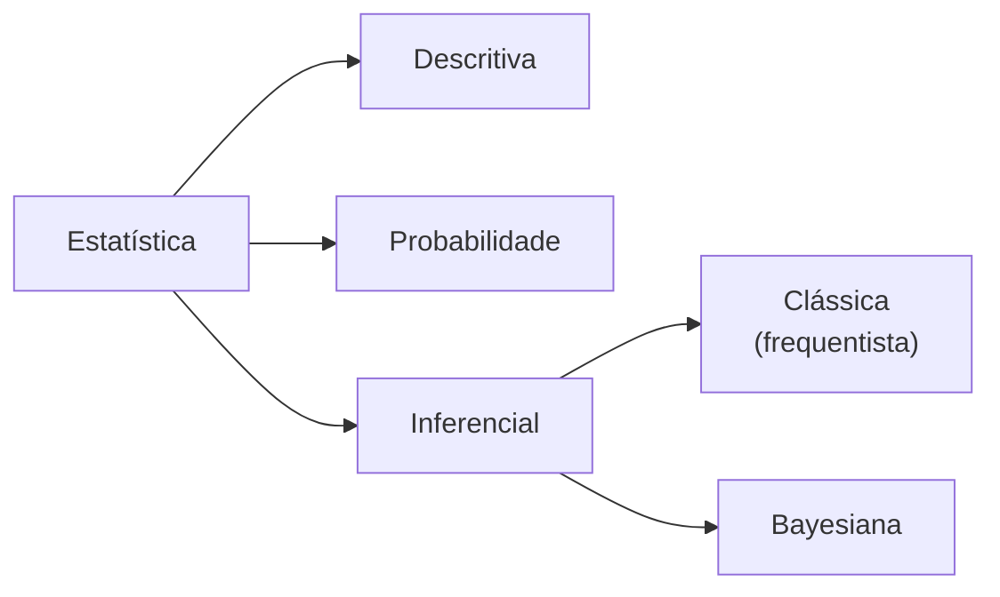

<!--META
{
  "title": "Inferência Bayesiana e o Teorema de Bayes",
  "header": "Inferência Bayesiana",
  "tema": "Áreas da Estatística, inferência clássica (frequentista) e bayesiana, informação a priori, probabilidade condicional e Teorema de Bayes, e as aplicações apresentadas: problema de Monty Hall, teste ELISA e a busca do voo AF 447.",
  "typing": ["P(A|B) = P(A) P(B|A) / P(B)", "priori + evidência = posteriori", "Monty Hall: trocar dobra a chance", "Frequência × grau de incerteza"],
  "tecnologias": "Python 3 (simulação e cálculo bayesiano)",
  "tipo": "Aula conceitual com exemplos de aplicação",
  "professor": "Prof. Me. Eng. Rodolfo Magliari de Paiva",
  "badges": [["Linguagem", "Python", "FF781F", "python"], ["Tema", "Teorema de Bayes", "FF4500"], ["Visão", "Bayesiana", "E60000"]],
  "icons": "py",
  "icons_alt": "Python",
  "limitacoes": "Os slides apresentam os exemplos (Monty Hall, ELISA, AF 447) de forma conceitual, sem valores numéricos para o teste ELISA; os números usados no exemplo de diagnóstico desta página são ilustrativos e estão sinalizados. Vídeos e simuladores citados não foram acessados. Fórmulas apresentadas como imagem foram lidas visualmente. Os slides trazem aviso de direitos autorais.",
  "files": {
    "Aula 05-2 - Modelagem Linear para Aprendizado de Máquina.pptx.pdf": "Slides da aula 05 do 2º semestre (29 páginas): inferência bayesiana, áreas da Estatística, Teorema de Bayes, problema de Monty Hall, teste ELISA, acidente do voo AF 447 e as visões frequentista e bayesiana de probabilidade."
  }
}
META-->

<br />

<h2 id="visao-geral">Visão geral</h2>

A [aula 13](../aula13-11-09-26/README.md) apresentou a inferência **clássica (frequentista)**: as conclusões vêm exclusivamente dos dados coletados. Esta aula apresenta a alternativa **bayesiana**, que combina os dados com **informações a priori**, ou seja, com o conhecimento prévio que os dados sozinhos não capturam. A ponte matemática entre as duas é o **Teorema de Bayes**, que mostra como **atualizar** uma probabilidade à medida que surgem novas evidências.

<br />

<h2 id="objetivos">Objetivos de aprendizagem</h2>

- Situar a inferência bayesiana entre as áreas da Estatística.
- Diferenciar as visões frequentista e bayesiana de probabilidade.
- Aplicar a probabilidade condicional e o Teorema de Bayes.
- Explicar o problema de Monty Hall e a atualização de diagnósticos.

<br />

<h2 id="pre-requisitos">Pré-requisitos</h2>

- [Aula 10](../aula10-03-08-26/README.md): axiomas, interseção e complemento de eventos.
- [Aula 13](../aula13-11-09-26/README.md): inferência e testes de hipótese.

<br />

<h2 id="fundamentacao-teorica">Fundamentação teórica</h2>

### 1. Onde está a inferência bayesiana



*Figura 1 — As três grandes áreas da Estatística e os dois ramos da inferência, conforme os slides.*

| | Inferência clássica (frequentista) | Inferência bayesiana |
| :--- | :--- | :--- |
| Fonte das conclusões | Apenas os dados da amostra ou população | Dados **+ informação a priori** (subjetiva) |
| O que é probabilidade | Frequência de eventos repetidos | Grau de **incerteza** sobre um evento |
| Dinâmica | Análise de um conjunto de dados | A probabilidade é **atualizada** a cada nova evidência |
| Indicada quando | Há muitos dados | A informação é limitada ou há conhecimento prévio relevante |

O nome homenageia o pastor e matemático inglês **Thomas Bayes** (1701–1761).

### 2. Teorema de Bayes

A base é a **probabilidade condicional**, a probabilidade de $A$ **sabendo que** $B$ ocorreu:

$$P(A \mid B) = \frac{P(A \cap B)}{P(B)} = \frac{P(A)\,P(B \mid A)}{P(B)}$$

Para eventos $E_1, \dots, E_k$ que dividem o espaço amostral, o teorema se generaliza:

$$P(E_1 \mid B) = \frac{P(B \mid E_1)\,P(E_1)}{P(B \mid E_1)\,P(E_1) + \dots + P(B \mid E_k)\,P(E_k)}$$

| Termo | Nome |
| :--- | :--- |
| $P(E_1)$ | Probabilidade **a priori**: antes de conhecer $B$ |
| $P(B \mid E_1)$ | **Verossimilhança**: chance da evidência se $E_1$ for verdade |
| Denominador | Probabilidade total de $B$ |
| $P(E_1 \mid B)$ | Probabilidade **a posteriori**: depois de conhecer $B$ |

### 3. Aplicações apresentadas nos slides

- **Problema de Monty Hall:** no programa *Let's Make a Deal* (1963), o participante escolhe uma de três portas e uma delas esconde o prêmio. O apresentador, **que sabe onde está o prêmio**, abre outra porta vazia e oferece a troca. **Trocar dobra a chance de ganhar**: de 1/3 para 2/3.
- **Teste ELISA:** teste sorológico imunoenzimático. A probabilidade a priori de doença é a **prevalência** na população, e ela é atualizada com cada resultado conforme a **sensibilidade** e a **especificidade** do teste, o que permite estimar falsos positivos e falsos negativos.
- **Voo AF 447 (2009):** o Airbus A330 da Air France caiu no Atlântico após decolar do Galeão. Os slides perguntam como foi possível localizá-lo em uma área tão vasta e indicam um vídeo sobre o caso. Essas buscas costumam usar métodos bayesianos, em que um mapa de probabilidades é atualizado a cada área vasculhada sem sucesso.

<br />

<h2 id="exemplos-praticos">Exemplos práticos</h2>

### Exemplo básico — Monty Hall pelo Teorema de Bayes

Suponha que o jogador escolheu a porta 1 e o apresentador abriu a porta 3. Seja $C_i$ = "o carro está na porta $i$" e $A_3$ = "o apresentador abre a 3".

- $P(A_3 \mid C_1) = 1/2$: ele pode abrir a 2 ou a 3.
- $P(A_3 \mid C_2) = 1$: ele é **obrigado** a abrir a 3.
- $P(A_3 \mid C_3) = 0$: ele não abre a porta do carro.

$$P(C_2 \mid A_3) = \frac{1 \cdot \frac{1}{3}}{\frac{1}{2} \cdot \frac{1}{3} + 1 \cdot \frac{1}{3} + 0 \cdot \frac{1}{3}} = \frac{1/3}{1/2} = \frac{2}{3}$$

Portanto, permanecer na porta 1 acerta com probabilidade $1/3$, e trocar para a 2, com $2/3$. A informação nova vem do **conhecimento do apresentador**.

### Exemplo intermediário — simulação frequentista do mesmo problema

```python
{{include:ml/monty.py}}
```

Saída esperada:

```text
{{include:ml/monty.out}}
```

As duas visões concordam: a frequência observada em 100 mil jogos reproduz a probabilidade calculada por Bayes.

### Exemplo aplicado — atualização de um diagnóstico

Os slides descrevem a atualização sem números. Os valores abaixo são **ilustrativos**: prevalência de 1%, sensibilidade de 99% e especificidade de 95%.

```python
{{include:ml/bayes_teste.py}}
```

Saída esperada:

```text
{{include:ml/bayes_teste.out}}
```

Mesmo com um teste "99% sensível", **um único positivo** leva a apenas cerca de 17% de chance de doença, porque a doença é rara e os falsos positivos dos 99% sadios superam os verdadeiros positivos. Cada novo positivo usa a posteriori anterior como nova priori, e a certeza cresce rapidamente.

<br />

<h2 id="exercicios-resolvidos">Exercícios e resoluções comentadas</h2>

O material desta aula não traz exercícios. Abaixo, exercícios **propostos para estudo**.

1. Uma fábrica tem duas máquinas: M1 produz 60% das peças, com 2% de defeito, e M2 produz 40%, com 5% de defeito. Uma peça sorteada é defeituosa. Qual a probabilidade de ter vindo de M2?
2. No exemplo do diagnóstico, se a prevalência fosse de 20%, qual seria a probabilidade de doença após um positivo?

<details>
<summary><strong>Solução proposta para estudo</strong></summary>

1. $P(D) = 0{,}6 \cdot 0{,}02 + 0{,}4 \cdot 0{,}05 = 0{,}012 + 0{,}020 = 0{,}032$. Então $P(M2 \mid D) = \dfrac{0{,}020}{0{,}032} = 0{,}625$. Embora M2 produza menos, ela responde por 62,5% dos defeitos.
2. $\dfrac{0{,}99 \cdot 0{,}2}{0{,}99 \cdot 0{,}2 + 0{,}05 \cdot 0{,}8} = \dfrac{0{,}198}{0{,}238} \approx 0{,}832$. A priori muda drasticamente a conclusão.

```python
print(round(0.4 * 0.05 / (0.6 * 0.02 + 0.4 * 0.05), 3))
print(round(0.99 * 0.2 / (0.99 * 0.2 + 0.05 * 0.8), 3))
```

Saída esperada:

```text
0.625
0.832
```

</details>

<br />

<h2 id="aplicacoes">Aplicações no mercado de trabalho</h2>

- **Filtros de spam e classificadores Naive Bayes:** calculam a probabilidade de uma mensagem ser spam dadas as palavras que contém.
- **Medicina diagnóstica:** valores preditivos de exames dependem da prevalência (a priori).
- **Busca e salvamento:** mapas de probabilidade atualizados a cada busca, como no caso de localização de destroços.
- **Aprendizado de máquina:** otimização bayesiana de hiperparâmetros e modelos probabilísticos que incorporam conhecimento prévio.

<br />

<h2 id="boas-praticas">Boas práticas e erros comuns</h2>

| Problemático | Recomendado | Motivo |
| :--- | :--- | :--- |
| Confundir $P(A \mid B)$ com $P(B \mid A)$ | Escrever explicitamente o que é condição | "Positivo dado doente" ≠ "doente dado positivo" |
| Ignorar a prevalência (a priori) | Incluir sempre $P(E)$ | É a "falácia da taxa-base" do exemplo do diagnóstico |
| Achar que, em Monty Hall, sobram duas portas com chance de 50% cada | Considerar que o apresentador **sabe** onde está o carro | A abertura não é aleatória: ela traz informação |
| Usar uma priori sem justificativa | Documentar a origem do conhecimento prévio | A priori subjetiva influencia a conclusão |

<br />

<h2 id="resumo">Resumo para revisão</h2>

- **Inferência frequentista:** só os dados. **Inferência bayesiana:** dados + a priori.
- $P(A \mid B) = P(A)\,P(B \mid A)/P(B)$, ou seja, posteriori ∝ verossimilhança × priori.
- A posteriori de hoje é a priori de amanhã.
- Monty Hall: trocar → 2/3. Diagnóstico: a prevalência pesa muito no resultado.

<br />

<h2 id="questoes">Questões de fixação</h2>

1. Qual a diferença entre as visões frequentista e bayesiana de probabilidade?
2. Em Monty Hall, qual a probabilidade de ganhar sem trocar de porta?
3. O que é probabilidade a priori?

<details>
<summary><strong>Respostas comentadas</strong></summary>

1. A frequentista entende probabilidade como frequência de eventos repetidos. A bayesiana a entende como grau de incerteza, atualizado com novas evidências.
2. $1/3$.
3. É a probabilidade de um evento antes de considerar a nova evidência, baseada em conhecimento prévio (por exemplo, a prevalência de uma doença).

</details>

<br />

<h2 id="referencias">Referências e materiais complementares</h2>

- Materiais complementares indicados nos slides: [Inferência Bayesiana (UFPR)](http://www.leg.ufpr.br/~paulojus/ce227/InferenciaBayesiana.pdf) · [econometria bayesiana (ENAP)](https://repositorio.enap.gov.br/bitstream/1/4765/2/Aulas%201%20a%203%20-%20Polli-bayesian-econometrics.pdf) · [Bayes (UFMG)](https://www.est.ufmg.br/~enricoc/pdf/confiabilidade/Bayes01.pdf)
- [Simulador de Monty Hall (Math Warehouse)](https://www.mathwarehouse.com/monty-hall-simulation-online/), citado nos slides.
- QUINSLER, A. P. *Probabilidade e Estatística*. Curitiba: InterSaberes, 2022 (bibliografia da disciplina).
