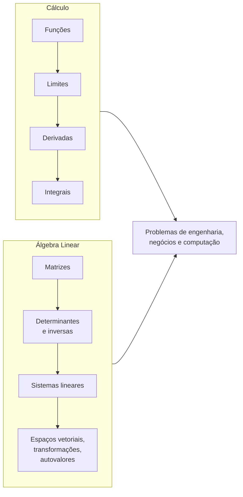

<!--META
{
  "title": "Plano de Ensino da Disciplina",
  "header": "Plano de Ensino MMC",
  "tema": "Ementa, objetivos, conteúdo programático (funções, limites, derivadas, integrais, matrizes, determinantes, sistemas lineares, espaços vetoriais e autovalores), metodologia, avaliação e bibliografia de Modelagem Matemática e Computacional.",
  "typing": ["Matemática + computação = modelagem", "Limites -> derivadas -> integrais", "Matrizes, determinantes e sistemas", "CP & Sprints 40% · Global Solution 60%"],
  "tipo": "Plano de ensino (documento institucional)",
  "professor": "Prof. Igor Gimenes Cesca",
  "badges": [["Conteúdo", "Plano de ensino", "FF781F"], ["Áreas", "Cálculo e Álgebra Linear", "FF4500"], ["Ferramenta", "Python", "E60000", "python"]],
  "icons": "py",
  "icons_alt": "Python",
  "limitacoes": "Documento de 5 páginas lido integralmente. No item de conteúdo sobre indeterminações aparece a grafia “00/00”, provavelmente uma falha de formatação do símbolo ∞/∞; ela foi mantida como no original e comentada.",
  "files": {
    "Plano de Ensino.pdf": "Plano de ensino (5 páginas): professor, ementa, cinco objetivos, doze tópicos de conteúdo, metodologia, critérios de avaliação e bibliografias básica e complementar."
  }
}
META-->

<br />

<h2 id="visao-geral">Visão geral</h2>

**Modelagem Matemática e Computacional (MMC)** explora a interseção entre matemática e computação. Ferramentas computacionais, em especial a linguagem **Python**, são usadas para modelar e resolver problemas. O plano de ensino organiza a disciplina em dois grandes blocos:



*Figura 1 — Os dois blocos do conteúdo programático e sua finalidade aplicada.*

<br />

<h2 id="objetivos">Objetivos de aprendizagem</h2>

Objetivos da disciplina, conforme o plano:

1. Aplicar os conceitos de **limites**, por meio de linguagem de programação, para analisar o comportamento de uma função.
2. Calcular a **taxa de variação** de funções, identificando e aplicando as regras de derivação.
3. Resolver problemas de engenharia e de negócios com o **cálculo diferencial**.
4. Efetuar **operações com matrizes**, aplicando suas propriedades.
5. Resolver **sistemas lineares** por equações matriciais, com métodos computacionais.

<br />

<h2 id="pre-requisitos">Pré-requisitos</h2>

Matemática do ensino médio: funções, equações de 1º e 2º grau, potências e frações. A [aula 03](../aula03-13-03-26/README.md) faz a revisão de funções.

<br />

<h2 id="fundamentacao-teorica">Fundamentação teórica</h2>

### Conteúdo programático

| # | Tópico | Principais itens |
| :---: | :--- | :--- |
| 1 | Funções | Definição, propriedades, aplicações |
| 2 | Limites | Limites laterais, assíntotas, limites infinitos e no infinito, indeterminações |
| 3 | Derivada em um ponto | Definição, derivadas de polinômios, reta tangente |
| 4 | Regras de derivação | Soma, produto, quociente, exponencial, logarítmica, trigonométrica, regra da cadeia, máximos e mínimos, concavidade, L'Hôpital |
| 5 | Primitivas e integrais | Relação derivada–integral, Teorema Fundamental do Cálculo, integrais imediatas |
| 6 | Matrizes | Operações, tipos especiais (transposta, simétrica, triangular…), base e projeção ortogonais, posto |
| 7 | Determinantes | Sarrus, Laplace, propriedades, matriz inversa |
| 8 | Sistemas lineares | Classificação das soluções, forma matricial |
| 9 | Resolução de sistemas | Gauss, Gauss-Jordan e regra de Cramer (o plano grafa "Gauss-Jordan, Gauss-Jordan") |
| 10 | Espaços vetoriais | Dependência linear, combinação linear, subespaços |
| 11 | Base e dimensão | Transformações lineares, núcleo, imagem |
| 12 | Autovalores e autovetores | Polinômio característico, autoespaços |

> [!NOTE]
> Nos itens 2 e 4, o plano menciona indeterminações "do tipo 00/00". Pelo contexto (limites no infinito e regra de L'Hôpital), trata-se provavelmente de $\infty/\infty$, com o símbolo perdido na formatação do documento.

### Metodologia

1. Aulas expositivas com resolução de exercícios.
2. **Aprendizagem ativa** com planilhas, linguagem de programação e aplicativos (o plano cita **Wolfram Alpha** e **Symbolab**) para construir funções, visualizar gráficos e testar parâmetros.
3. Aulas de exercícios, plantões de dúvidas, revisões e correção das avaliações.

### Avaliação

| Componente | Peso | Composição |
| :--- | :---: | :--- |
| *Checkpoints* & *Challenge Sprints* | 40% | 3 *checkpoints* individuais em aula e 2 *sprints* em grupo; vale a média das **quatro maiores** notas |
| Global Solutions | 60% | Atividade envolvendo uma *big tech* escolhida pela FIAP |

### Bibliografia

| Tipo | Referências |
| :--- | :--- |
| Básica | STEWART, J. *Cálculo*, v. 1, 8. ed., Cengage, 2016 · FLEMMING, D. M.; GONÇALVES, M. B. *Cálculo A*, Pearson, 2007 · STEINBRUCH, W. *Álgebra Linear*, Saraiva, 2006 |
| Complementar | GUIDORIZZI, L. H. *Um Curso de Cálculo*, v. 1, LTC, 2002 · LARSON, R. *Cálculo Aplicado*, Cengage, 2016 · HOFFMANN et al. *Cálculo: um curso moderno e suas aplicações*, LTC, 2015 · STRANG, G. *Álgebra Linear e suas Aplicações*, Pearson, 2016 · BOLDRINI, J. L. et al. *Álgebra Linear*, Harbra |

<br />

<h2 id="exemplos-praticos">Exemplos práticos</h2>

### Exemplo — a nota final pela regra do plano

```python
def nota_semestre(cps_e_sprints, global_solution):
    quatro_maiores = sorted(cps_e_sprints, reverse=True)[:4]
    return 0.4 * sum(quatro_maiores) / 4 + 0.6 * global_solution

# 3 checkpoints + 2 sprints (notas ilustrativas)
print(round(nota_semestre([6.0, 8.5, 7.0, 9.0, 4.0], 8.0), 2))
```

Saída esperada:

```text
7.85
```

A menor nota (4,0) é descartada. A média das quatro maiores é 7,625, que contribui com 3,05; a Global Solution, com 4,80.

<br />

<h2 id="exercicios-resolvidos">Exercícios e resoluções comentadas</h2>

O documento não traz exercícios. **Exercício proposto para estudo:** um aluno tirou 5, 5, 5, 10 e 10 em CPs e sprints. Qual nota mínima na Global Solution garante média 6?

<details>
<summary><strong>Solução proposta para estudo</strong></summary>

As quatro maiores notas são 10, 10, 5 e 5, com média 7,5, o que contribui com $0{,}4 \times 7{,}5 = 3{,}0$. É preciso então $0{,}6 \cdot GS \geq 3{,}0$, ou seja, $GS \geq 5{,}0$.

</details>

<br />

<h2 id="aplicacoes">Aplicações no mercado de trabalho</h2>

- **Cálculo:** taxas de variação, otimização de lucro e custo, e modelos de crescimento em finanças e engenharia.
- **Álgebra linear:** é a linguagem do aprendizado de máquina (dados como matrizes), da computação gráfica e dos sistemas de recomendação.
- **Ferramentas computacionais:** Python, Wolfram Alpha e Symbolab aceleram a verificação de cálculos e a visualização.

<br />

<h2 id="boas-praticas">Boas práticas e erros comuns</h2>

| Problemático | Recomendado |
| :--- | :--- |
| Usar as ferramentas (Symbolab, Wolfram) para obter respostas prontas | Usá-las para **conferir** e visualizar o que foi resolvido à mão |
| Estudar só na véspera dos *checkpoints* | Aproveitar plantões e listas semanais |
| Ignorar a regra das quatro maiores notas | Planejar: uma nota baixa pode ser descartada, duas não |

<br />

<h2 id="resumo">Resumo para revisão</h2>

- MMC = matemática + computação para modelar problemas.
- Cálculo (funções → limites → derivadas → integrais) e Álgebra Linear (matrizes → determinantes → sistemas → espaços vetoriais).
- Avaliação: 40% CPs e sprints (média das 4 maiores) e 60% Global Solution.
- Bibliografia central: Stewart (Cálculo) e Steinbruch (Álgebra Linear).

<br />

<h2 id="questoes">Questões de fixação</h2>

1. Quantos *checkpoints* e quantos *sprints* compõem a parcela de 40%?
2. Quais softwares de apoio o plano cita?
3. Quais métodos de resolução de sistemas lineares estão previstos?

<details>
<summary><strong>Respostas comentadas</strong></summary>

1. Três *checkpoints* individuais e dois *sprints* em grupo, contando a média das quatro maiores notas.
2. Planilhas, linguagem de programação, Wolfram Alpha e Symbolab.
3. Gauss, Gauss-Jordan e regra de Cramer.

</details>

<br />

<h2 id="referencias">Referências e materiais complementares</h2>

- Material da pasta: [Plano de Ensino](Plano%20de%20Ensino.pdf)
- Livros-texto disponíveis no repositório: [aula 02](../aula02-04-03-26/README.md)
- [Wolfram Alpha](https://www.wolframalpha.com/) · [Symbolab](https://www.symbolab.com/), citados no plano.
