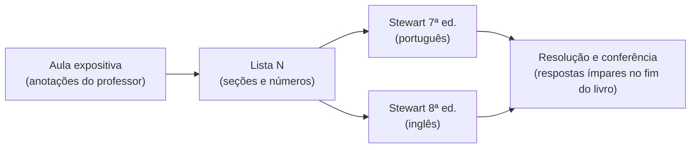

<!--META
{
  "title": "Livros-Texto de Cálculo (James Stewart)",
  "header": "Livros-Texto: Stewart",
  "tema": "Os dois livros-texto de Cálculo de James Stewart disponibilizados na pasta (7ª edição em português, volume 1, e 8ª edição em inglês, Early Transcendentals), seu papel na bibliografia da disciplina e o mapeamento das seções usadas nas listas de exercícios.",
  "typing": ["Bibliografia básica: Stewart, Cálculo", "Cap. 2: Limites e Derivadas", "Listas 2 a 6 apontam seções 2.2 a 2.7", "Estudo ativo: ler, resolver, conferir"],
  "tipo": "Material de referência (livros-texto)",
  "badges": [["Conteúdo", "Livros-texto", "FF781F"], ["Autor", "James Stewart", "FF4500"], ["Uso", "Listas de exercícios", "E60000"]],
  "limitacoes": "Os dois arquivos são livros completos (661 e 1.397 páginas); não foram lidos integralmente nem resumidos. Foram consultados apenas metadados, folhas de rosto e sumários, para identificar edição e seções citadas nas listas. O PDF em inglês traz o aviso “Copyright 2016 Cengage Learning. All Rights Reserved. May not be copied, scanned, or duplicated”; por isso esta página apenas descreve os livros, sem reproduzir conteúdo.",
  "files": {
    "Cálculo 7 Edição - Volume 1.pdf": "STEWART, James. Cálculo, volume 1 — tradução da 7ª edição norte-americana (661 páginas, cerca de 51 MB).",
    "James Stewart-Calculus_ Early transcendentals-Brooks Cole (2016).pdf": "STEWART, James. Calculus: Early Transcendentals, 8ª edição, Cengage/Brooks Cole, 2016, em inglês (1.397 páginas, cerca de 34 MB)."
  }
}
META-->

<br />

<h2 id="visao-geral">Visão geral</h2>

A pasta desta data contém os **livros-texto** que fundamentam a parte de Cálculo da disciplina. O *Cálculo* de James Stewart é a primeira referência da bibliografia básica do [plano de ensino](../aula01-03-03-26/README.md), e as listas de exercícios das aulas seguintes indicam seções e exercícios desses livros, tanto na 7ª quanto na 8ª edição.

| Arquivo | Edição | Idioma | Páginas |
| :--- | :--- | :--- | :---: |
| `Cálculo 7 Edição - Volume 1.pdf` | 7ª edição norte-americana, volume 1 (tradução) | Português | 661 |
| `James Stewart-Calculus_ Early transcendentals-Brooks Cole (2016).pdf` | 8ª edição, *Early Transcendentals* | Inglês | 1.397 |

> [!IMPORTANT]
> O livro em inglês traz, em todas as páginas, um aviso de direitos autorais da Cengage Learning que proíbe cópia ou duplicação. Se este repositório for público, convém avaliar a permanência desses arquivos. Esta documentação não os alterou nem removeu.

<br />

<h2 id="objetivos">Objetivos de aprendizagem</h2>

- Localizar no livro-texto as seções correspondentes a cada tema da disciplina.
- Usar as listas de exercícios em conjunto com o livro, em qualquer das duas edições.
- Desenvolver o hábito de estudo ativo com um livro de referência.

<br />

<h2 id="pre-requisitos">Pré-requisitos</h2>

- [Plano de ensino](../aula01-03-03-26/README.md) da disciplina.
- Leitura técnica em inglês, para a 8ª edição.

<br />

<h2 id="fundamentacao-teorica">Fundamentação teórica</h2>

### Capítulo 2 — Limites e Derivadas

O sumário dos dois livros mostra a **mesma estrutura** no capítulo usado no 1º semestre:

| Seção | 7ª edição (português) | 8ª edição (inglês) | Tema na disciplina |
| :---: | :--- | :--- | :--- |
| 2.1 | Os Problemas da Tangente e da Velocidade | The Tangent and Velocity Problems | Motivação (aula 03) |
| 2.2 | O Limite de uma Função | The Limit of a Function | [Aula 04](../aula04-20-03-26/README.md) e [aula 05](../aula05-30-03-26/README.md) |
| 2.3 | Cálculos Usando Propriedades dos Limites | Calculating Limits Using the Limit Laws | Aulas 04 a 06 |
| 2.4 | A Definição Precisa de um Limite | The Precise Definition of a Limit | — |
| 2.5 | Continuidade | Continuity | [Aula 07](../aula07-15-04-26/README.md) |
| 2.6 | Limites no Infinito; Assíntotas Horizontais | Limits at Infinity; Horizontal Asymptotes | [Aula 06](../aula06-02-04-26/README.md) |
| 2.7 | Derivadas e Taxas de Variação | Derivatives and Rates of Change | [Aula 08](../aula08-22-04-26/README.md) |
| 2.8 | A Derivada como uma Função | The Derivative as a Function | [Aula 09](../aula09-11-05-26/README.md) |

### Como as listas usam os livros

As **Listas 2, 3, 4 e 6** não trazem enunciados próprios. Elas indicam **exercícios do Stewart** por seção, com uma coluna para a 8ª e outra para a 7ª edição, porque a numeração dos exercícios difere entre as edições. A Lista 2, por exemplo, pede na seção 2.3 os exercícios 3–9, 11, 12, 15–27, 29–32, 59, 64 e 65 da 8ª edição, ou 3–9, 11, 12, 15–32, 57, 58, 62 e 63 da 7ª.



*Figura 1 — Fluxo de estudo sugerido pela organização das listas.*

<br />

<h2 id="exemplos-praticos">Exemplos práticos</h2>

### Exemplo — localizando a seção no PDF pelo terminal

Com o utilitário `pdftotext` (pacote poppler), é possível buscar o sumário sem abrir o arquivo inteiro. Este comando foi usado para montar a tabela acima:

<!-- norun -->
```text
pdftotext -f 1 -l 20 "Cálculo 7 Edição - Volume 1.pdf" - | grep -A 12 "Limites e Derivadas"
```

### Exemplo — conferindo um exercício com Python

Ao resolver um limite da seção 2.3, é possível conferir a resposta numericamente:

```python
f = lambda x: (x**2 - 4) / (x - 2)
print([round(f(2 + h), 6) for h in (0.1, 0.001, -0.001, -0.1)])
```

Saída esperada:

```text
[4.1, 4.001, 3.999, 3.9]
```

Os valores se aproximam de 4 pelos dois lados, o que confirma $\lim_{x \to 2} \frac{x^2 - 4}{x - 2} = 4$.

<br />

<h2 id="exercicios-resolvidos">Exercícios e resoluções comentadas</h2>

A pasta não contém exercícios. As soluções dos exercícios indicados nas listas estão nos próprios livros (respostas dos exercícios ímpares) e não são reproduzidas aqui, por direitos autorais.

**Exercício proposto para estudo:** usando o sumário acima, em que seção do livro você estudaria a reta tangente a $y = x^2$ no ponto $(1, 1)$?

<details>
<summary><strong>Solução proposta para estudo</strong></summary>

Na seção **2.7 (Derivadas e Taxas de Variação)**, que define a derivada como inclinação da reta tangente; a motivação aparece na 2.1. Resposta do exercício: $f'(1) = 2$, logo a reta é $y = 2x - 1$.

</details>

<br />

<h2 id="aplicacoes">Aplicações no mercado de trabalho</h2>

Saber consultar referências técnicas (livros, documentação, artigos) e localizar rapidamente o trecho necessário é uma competência central em engenharia e ciência de dados. Grande parte dessa documentação está em inglês.

<br />

<h2 id="boas-praticas">Boas práticas e erros comuns</h2>

| Problemático | Recomendado |
| :--- | :--- |
| Usar a numeração de exercícios de uma edição na outra | Seguir a coluna correta da lista (7ª ou 8ª edição) |
| Olhar a resposta antes de tentar | Resolver, depois conferir com o livro ou com Python |
| Redistribuir os PDFs dos livros | Respeitar os direitos autorais; preferir a biblioteca da instituição |

<br />

<h2 id="resumo">Resumo para revisão</h2>

- Dois livros de Stewart: 7ª edição (português, v. 1) e 8ª edição (inglês, *Early Transcendentals*).
- O capítulo 2 (Limites e Derivadas) cobre o 1º semestre, das seções 2.2 a 2.8.
- As listas indicam exercícios por seção, com numeração própria de cada edição.

<br />

<h2 id="questoes">Questões de fixação</h2>

1. Qual seção trata de limites no infinito e assíntotas horizontais?
2. Por que as listas trazem duas colunas de exercícios?

<details>
<summary><strong>Respostas comentadas</strong></summary>

1. A seção 2.6.
2. Porque a numeração dos exercícios muda entre a 7ª e a 8ª edição.

</details>

<br />

<h2 id="referencias">Referências e materiais complementares</h2>

- STEWART, J. *Cálculo*, v. 1. Tradução da 7. ed. norte-americana. São Paulo: Cengage Learning (arquivo da pasta).
- STEWART, J. *Calculus: Early Transcendentals*. 8. ed. Boston: Cengage Learning, 2016 (arquivo da pasta).
