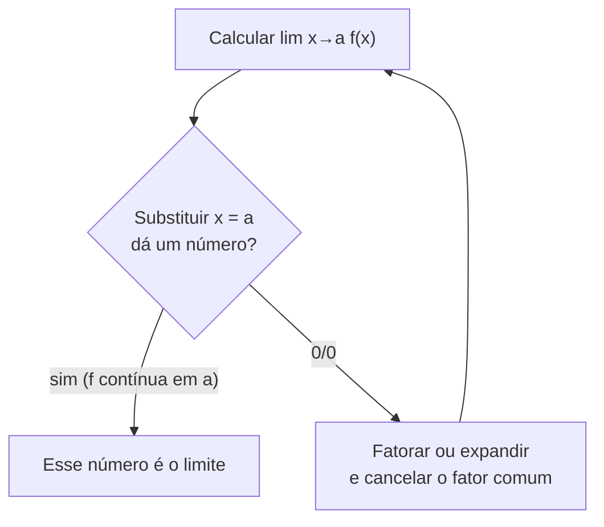

<!--META
{
  "title": "Limite de uma Função e Substituição Direta",
  "header": "Limite de uma Função",
  "tema": "Ideia intuitiva de limite por tabelas de aproximação, definição e notação, diferença entre limite e valor da função, regra da substituição direta para funções contínuas e simplificação algébrica (fatoração) para indeterminações 0/0, com exemplos do Stewart e a Lista 2.",
  "typing": ["lim x→1 (x² − 1)/(x − 1) = 2", "Perto de a, mas sem ser igual a a", "Contínua: lim x→a f(x) = f(a)", "0/0: simplifique e substitua"],
  "tecnologias": "Python 3 (aproximações numéricas)",
  "tipo": "Anotações de aula e lista de exercícios (referências ao Stewart)",
  "professor": "Prof. Igor Gimenes Cesca",
  "badges": [["Tema", "Limites", "FF781F"], ["Técnica", "Substituição direta", "FF4500"], ["Lista", "Lista 2", "E60000"]],
  "icons": "py",
  "icons_alt": "Python",
  "limitacoes": "As anotações de aula contêm trechos manuscritos, lidos visualmente. A Lista 2 apenas indica exercícios do livro de Stewart (seções 2.2 e 2.3), cujos enunciados não estão na pasta e não são reproduzidos. Os limites resolvidos nas anotações foram conferidos numericamente.",
  "files": {
    "Aula 3 - Turma X.pdf": "Anotações da aula 3 (6 páginas): tabela de aproximação de (x² − 1)/(x − 1), definição e notação de limite, exemplos gráficos, regra da substituição direta e exemplos resolvidos das páginas 83 e 88 do Stewart.",
    "Lista 2.pdf": "Lista 2 (1 página): exercícios das seções 2.2 e 2.3 do Stewart, 7ª e 8ª edições.",
    "assets/limite-buraco.svg": "Figura original desta documentação: gráfico de (x² − 1)/(x − 1) com o “buraco” em (1, 2) e valores de aproximação."
  }
}
META-->

<br />

<h2 id="visao-geral">Visão geral</h2>

O **limite** é a primeira ferramenta nova do Cálculo. A pergunta da aula é: o que acontece com $f(x) = \dfrac{x^2 - 1}{x - 1}$ quando $x$ fica **muito próximo** de 1, sem nunca ser igual a 1? Em $x = 1$ a função não existe, porque há divisão por zero. Mesmo assim, os valores ao redor se aproximam de **2**. O limite descreve esse comportamento **na vizinhança** de um ponto, independentemente do que acontece exatamente nele.

<br />

<h2 id="objetivos">Objetivos de aprendizagem</h2>

- Estimar limites por tabelas de valores à esquerda e à direita.
- Usar corretamente a notação $\lim_{x \to a} f(x) = L$.
- Diferenciar o **limite** em $a$ do **valor** $f(a)$.
- Aplicar a substituição direta em funções contínuas.
- Resolver indeterminações $0/0$ por fatoração e simplificação.

<br />

<h2 id="pre-requisitos">Pré-requisitos</h2>

- [Aula 03](../aula03-13-03-26/README.md): funções e domínio.
- Fatoração: diferença de quadrados, trinômio e evidência.

<br />

<h2 id="fundamentacao-teorica">Fundamentação teórica</h2>

### 1. Definição e notação

O **limite** de $f(x)$ quando $x$ tende a $a$ é o valor $L$ do qual a função se aproxima à medida que $x$ se aproxima de $a$, **sem ser igual** a $a$:

$$\lim_{x \to a} f(x) = L \quad \text{(lê-se: "o limite de } f(x) \text{ quando } x \text{ tende a } a \text{ é } L\text{")}$$

<p align="center">
  
</p>

*Figura 1 — O exemplo de abertura da aula (SVG original).*

### 2. Limite × valor da função

As anotações mostram três gráficos com o mesmo limite, $\lim_{x \to 3} f(x) = 6$:

| Situação | $f(3)$ | $\lim_{x \to 3} f(x)$ |
| :--- | :---: | :---: |
| $3 \notin D$ (buraco no gráfico) | Não existe | 6 |
| $3 \in D$, mas $f(3) = 8$ (ponto deslocado) | 8 | 6 |
| Função contínua, como $y = 2x$ | 6 | 6 |

**O limite analisa o que acontece perto de $a$, e não em $a$.**

### 3. Regra da substituição direta

Se $f$ é **contínua** em $a$, então $\lim_{x \to a} f(x) = f(a)$: basta substituir. Exemplo: $\lim_{x \to 2} x^2 = 2^2 = 4$.

### 4. Quando a substituição dá $0/0$

A orientação das anotações é **simplificar ao máximo** a função até que a substituição seja possível:

$$\lim_{x \to 1} \frac{x^2 - 1}{x - 1} = \lim_{x \to 1} \frac{(x + 1)(x - 1)}{x - 1} = \lim_{x \to 1} (x + 1) = 2$$

A simplificação é válida porque, no limite, $x \neq 1$, então $x - 1 \neq 0$ pode ser cancelado.



*Figura 2 — Estratégia da aula para calcular limites.*

<br />

<h2 id="exemplos-praticos">Exemplos práticos</h2>

### Exemplo básico — a tabela de aproximação da aula

```python
{{include:mm/limite_tabela.py}}
```

Saída esperada:

```text
{{include:mm/limite_tabela.out}}
```

### Exemplo intermediário — os limites resolvidos nas anotações

| Limite (fonte nas anotações) | Técnica | Resultado |
| :--- | :--- | :---: |
| $\lim_{x \to 5} (2x^2 - 3x + 4)$ (p. 83, ex. 2a) | Substituição direta | 39 |
| $\lim_{x \to -2} \dfrac{x^3 + 2x^2 - 1}{5 - 3x}$ (p. 83, ex. 2b) | Substituição direta ($5 - 3x \neq 0$) | $-1/11$ |
| $\lim_{h \to 0} \dfrac{(3 + h)^2 - 9}{h}$ (p. 83, ex. 5) | Expandir: $\dfrac{6h + h^2}{h} = 6 + h$ | 6 |
| $\lim_{x \to 2} \dfrac{x^2 + x - 6}{x - 2}$ (p. 88, ex. 11) | Fatorar: $(x + 3)(x - 2)$ | 5 |
| $\lim_{x \to -3} \dfrac{x^2 + 3x}{x^2 - x - 12}$ (p. 88, ex. 12) | Fatorar: $\dfrac{x(x + 3)}{(x - 4)(x + 3)}$ | $3/7$ |

### Exemplo aplicado — conferência numérica

```python
{{include:mm/limites_exemplos.py}}
```

Saída esperada:

```text
{{include:mm/limites_exemplos.out}}
```

<br />

<h2 id="exercicios-resolvidos">Exercícios e resoluções comentadas</h2>

A **Lista 2** indica exercícios do Stewart:

| Edição | Seção 2.2 | Seção 2.3 |
| :--- | :--- | :--- |
| 8ª | 1, 19–24, 26 | 3–9, 11, 12, 15–27, 29–32, 59, 64, 65 |
| 7ª | 1, 19–23, 25, 26 | 3–9, 11, 12, 15–32, 57, 58, 62, 63 |

Os livros estão na [aula 02](../aula02-04-03-26/README.md). As anotações deixam **sem resolução** o limite $\lim_{t \to -3} \dfrac{t^2 - 9}{2t^2 + 7t + 3}$ (ex. 15).

<details>
<summary><strong>Solução proposta para estudo</strong></summary>

Em $t = -3$, a substituição dá $\dfrac{0}{18 - 21 + 3} = \dfrac{0}{0}$. Fatorando:

$$\frac{t^2 - 9}{2t^2 + 7t + 3} = \frac{(t - 3)(t + 3)}{(2t + 1)(t + 3)} = \frac{t - 3}{2t + 1} \;\xrightarrow{t \to -3}\; \frac{-6}{-5} = \frac{6}{5}$$

```python
f = lambda t: (t**2 - 9) / (2*t**2 + 7*t + 3)
print(round(f(-3 - 1e-6), 4), round(f(-3 + 1e-6), 4))
```

Saída esperada:

```text
1.2 1.2
```

</details>

<br />

<h2 id="aplicacoes">Aplicações no mercado de trabalho</h2>

- **Fundamento da derivada:** a taxa de variação instantânea ([aula 08](../aula08-22-04-26/README.md)) é um limite do tipo $0/0$, como o exemplo com $h \to 0$.
- **Computação numérica:** algoritmos aproximam valores por sequências que convergem (limites) e precisam lidar com divisões por números muito pequenos.
- **Engenharia:** analisar o comportamento de um sistema perto de um ponto crítico, onde a fórmula "quebra".

<br />

<h2 id="boas-praticas">Boas práticas e erros comuns</h2>

| Problemático | Recomendado | Motivo |
| :--- | :--- | :--- |
| Concluir "não existe" ao obter $0/0$ | Tratar $0/0$ como **indeterminação** e simplificar | $0/0$ indica que é preciso mais trabalho |
| Achar que $\lim_{x \to a} f(x)$ é sempre $f(a)$ | Só vale para funções **contínuas** em $a$ | Ver a tabela da seção 2 |
| Usar só valores de um lado na tabela | Aproximar pela esquerda **e** pela direita | Os lados podem diferir ([aula 05](../aula05-30-03-26/README.md)) |
| Confiar apenas na tabela numérica | Confirmar algebricamente | Arredondamentos podem enganar |

<br />

<h2 id="resumo">Resumo para revisão</h2>

- $\lim_{x \to a} f(x) = L$: valores de $f$ próximos de $L$ para $x$ próximo de $a$ (com $x \neq a$).
- Limite ≠ valor da função.
- Função contínua em $a$: **substituição direta**.
- $0/0$: fatorar ou expandir, cancelar e substituir.

<br />

<h2 id="questoes">Questões de fixação</h2>

1. Calcule $\lim_{x \to 4} \dfrac{x^2 - 16}{x - 4}$.
2. Se $f(2) = 7$ e $\lim_{x \to 2} f(x) = 3$, a função é contínua em 2?
3. Calcule $\lim_{x \to 0} (3x^2 - x + 5)$.

<details>
<summary><strong>Respostas comentadas</strong></summary>

1. $\dfrac{(x + 4)(x - 4)}{x - 4} = x + 4 \to 8$.
2. Não, porque o limite (3) é diferente do valor da função (7).
3. Por substituição direta: 5.

</details>

<br />

<h2 id="referencias">Referências e materiais complementares</h2>

- STEWART, J. *Cálculo*, v. 1, seções 2.2 e 2.3 (arquivos na [aula 02](../aula02-04-03-26/README.md)).
- Materiais da pasta: [Aula 3](Aula%203%20-%20Turma%20X.pdf) · [Lista 2](Lista%202.pdf)
