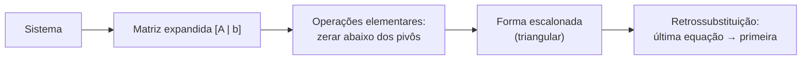

<!--META
{
  "title": "Resolução do Gini, Vetores, Matrizes e Sistemas Lineares",
  "header": "Vetores e Matrizes",
  "tema": "Resolução da atividade do Índice de Gini; vetores (visões da física, computação e matemática), soma, multiplicação por escalar, produto escalar (receita de vendas, perpendicularidade) e produto vetorial; matrizes (tipos, transposta, soma, multiplicação, identidade, inversa); sistemas lineares na forma Ax = b e escalonamento de Gauss.",
  "typing": ["v · u = v₁u₁ + v₂u₂ + v₃u₃", "Receita = preços · quantidades", "(m×n)(n×p) = (m×p); AB ≠ BA", "Gauss: troca, multiplica, soma linhas"],
  "tecnologias": "Python 3, NumPy (verificações)",
  "tipo": "Anotações de aula",
  "professor": "Prof. Igor Gimenes Cesca",
  "badges": [["Tema", "Álgebra linear", "FF781F"], ["Operação", "Produto escalar", "FF4500"], ["Método", "Eliminação de Gauss", "E60000"]],
  "icons": "py",
  "icons_alt": "Python",
  "limitacoes": "As anotações combinam texto digitado e resoluções manuscritas, lidas visualmente. Todos os cálculos foram conferidos com NumPy e frações exatas; um deslize manuscrito no produto QP está comentado.",
  "files": {
    "Aula 4 - Turma X.pdf": "Anotações da aula 4 (8 páginas): resolução da atividade do Índice de Gini (L = x² e ajuste da Tabela 1) e introdução a vetores: notação, representação geométrica, soma, multiplicação por escalar, produto escalar (aplicação em receita) e produto vetorial.",
    "Aula 5 - Turma X.pdf": "Anotações da aula 5 (6 páginas): matrizes (definição, classificação, transposta, soma, multiplicação, identidade, inversa), sistemas lineares em forma matricial e escalonamento de Gauss com exemplo e exercício."
  }
}
META-->

<br />

<h2 id="visao-geral">Visão geral</h2>

A aula 4 fecha a atividade do Índice de Gini da [aula 10](../aula10-20-08-26/README.md) (Gini = 1/3 para $L = x^2$ e ≈ 0,508 para o ajuste brasileiro, "alta concentração") e inicia a **Álgebra Linear**. A aula 5 avança para **matrizes** e **sistemas lineares**.

O que é um **vetor**, segundo as anotações:

| Área | Definição |
| :--- | :--- |
| Física | Seta com **direção**, **sentido** e **módulo** |
| Computação | Estrutura com dados gravados **em ordem** |
| Matemática | Seta que parte da origem até um ponto, com coordenadas ordenadas |

<br />

<h2 id="objetivos">Objetivos de aprendizagem</h2>

- Somar vetores, multiplicá-los por escalar e calcular produtos escalar e vetorial.
- Interpretar o produto escalar (receita, perpendicularidade).
- Classificar matrizes e operar com elas, incluindo a condição de multiplicação.
- Escrever sistemas lineares na forma $Ax = b$ e resolvê-los por escalonamento.

<br />

<h2 id="pre-requisitos">Pré-requisitos</h2>

- Plano cartesiano e coordenadas.
- Sistemas de equações do ensino médio (substituição e adição).

<br />

<h2 id="fundamentacao-teorica">Fundamentação teórica</h2>

### 1. Vetores

**Notação:** $\vec{v} = \langle x, y \rangle = (x\ \ y) = \begin{pmatrix} x \\ y \end{pmatrix}$.

| Operação | Definição | Resultado |
| :--- | :--- | :--- |
| Soma | $\langle a, b \rangle + \langle x, y \rangle = \langle a + x, b + y \rangle$ | Vetor |
| Multiplicação por constante | $k\langle x, y \rangle = \langle kx, ky \rangle$ | Vetor |
| **Produto escalar** | $\vec{v} \cdot \vec{u} = v_1u_1 + v_2u_2 + v_3u_3 = \lvert\vec{v}\rvert\,\lvert\vec{u}\rvert \cos\theta$ | **Número** |
| **Produto vetorial** | $\vec{v} \times \vec{u} = \det\begin{pmatrix} \vec{i} & \vec{j} & \vec{k} \\ v_1 & v_2 & v_3 \\ u_1 & u_2 & u_3 \end{pmatrix}$ | Vetor **perpendicular** a ambos |

Pela forma com $\cos\theta$, vetores **perpendiculares** ($\theta = 90°$) têm produto escalar **zero**. As anotações mostram isso com $\langle 2, 0 \rangle \cdot \langle 0, 3 \rangle = 0$.

**Grandezas** (tabela das anotações): vetoriais, como velocidade e gravidade, × escalares, como massa e tempo.

### 2. Matrizes

Uma matriz $A = (a_{ij})_{m \times n}$ é uma tabela cujos elementos são identificados por linha $i$ e coluna $j$.

| Tipo | Característica |
| :--- | :--- |
| Quadrada | Nº de linhas = nº de colunas |
| Linha / coluna | Uma só linha ou coluna; também é um vetor |
| Identidade $I$ | Diagonal de 1, demais elementos 0; elemento neutro: $AI = IA = A$ |
| Transposta $A^T$ | Linhas viram colunas: $(a_{ij}) \to (a_{ji})$ |
| Inversa $A^{-1}$ | $AA^{-1} = I$; exige matriz **quadrada** com **determinante ≠ 0** |

**Multiplicação:** $(A_{m \times n})(B_{n \times p}) = C_{m \times p}$. O número de colunas da primeira deve ser igual ao número de linhas da segunda. Ela **não é comutativa**: em geral $AB \neq BA$, e às vezes só um dos produtos existe.

### 3. Sistemas lineares e escalonamento

Um sistema com $m$ equações e $n$ variáveis (todas com expoente 1) escreve-se como $A_{m \times n}\,X_{n \times 1} = b_{m \times 1}$, com $A$ a matriz dos coeficientes, $X$ a das variáveis e $b$ a dos termos independentes.

**Escalonamento (eliminação de Gauss):** aplica **operações elementares** à **matriz expandida** $[A \mid b]$:

1. trocar linhas;
2. multiplicar uma linha por uma constante (não nula);
3. somar a uma linha um múltiplo de outra.



*Figura 1 — Etapas do método de Gauss.*

<br />

<h2 id="exemplos-praticos">Exemplos práticos</h2>

### Exemplo básico — vetores das anotações

```python
{{include:mm/vetores.py}}
```

Saída esperada:

```text
{{include:mm/vetores.out}}
```

A **receita** é o produto escalar do vetor de preços (\$ 4, \$ 2, \$ 5) pelo vetor de quantidades (5, 10, 6): $20 + 20 + 30 = 70$.

### Exemplo intermediário — matrizes das anotações

```python
{{include:mm/matrizes.py}}
```

Saída esperada:

```text
{{include:mm/matrizes.out}}
```

> [!NOTE]
> Nas anotações, $QP$ aparece como $\begin{pmatrix} 5 & 11 & 0 \\ -1 & 5 & 0 \end{pmatrix}$. O elemento da 2ª linha e 3ª coluna é $(-1)(1) + (0)(1) + (1)(-1) = -2$, e não 0, como confirma a execução acima.

### Exemplo aplicado — escalonamento passo a passo

Implementação própria com frações exatas, aplicada ao exemplo e ao exercício das anotações:

```python
{{include:mm/gauss.py}}
```

Saída esperada:

```text
{{include:mm/gauss.out}}
```

As anotações resolvem o primeiro sistema trocando as linhas antes de eliminar e chegam ao mesmo resultado: $y = -9$ e $x = 5$. O exercício dá $x = 2$ e $y = 3$, conferindo com as anotações.

<br />

<h2 id="exercicios-resolvidos">Exercícios e resoluções comentadas</h2>

| Exercício das anotações | Solução do material original | Conferência |
| :--- | :--- | :--- |
| Gini com $L = x^2$ | $2\left(\frac{3 - 2}{6}\right) = \frac{1}{3} \approx 0{,}333$ | ✔ |
| Gini com $L = 0{,}7604x^{2{,}0926}$ | $2(0{,}2541227) = 0{,}50824$, "alta concentração" | ✔ (≈ 0,50825) |
| $\vec{a} \cdot \vec{b}$ com $\langle 1, -2, 0 \rangle$ e $\langle -2, 4, -3 \rangle$ | $-10$ | ✔ |
| $\langle 1, -1, 2 \rangle \times \langle 2, -1, 3 \rangle$ | $\langle -1, 1, 1 \rangle$ | ✔ |
| $AB$, $CA$, $AC$ | $(7)$; impossível; $(4\ \ 0)$, logo $AC \neq CA$ | ✔ |
| $QP$ | ver a nota acima | ⚠ elemento (2,3) |
| $2x + y = 7$; $x + y = 5$ | $y = 3$, $x = 2$ | ✔ |

**Exercício proposto para estudo:** resolva por escalonamento $x + y + z = 6$, $2x - y + z = 3$, $x + 2y - z = 3$ (o mesmo sistema resolvido com NumPy no notebook da [aula 13](../aula13-09-09-26/README.md)).

<details>
<summary><strong>Solução proposta para estudo</strong></summary>

```python
import numpy as np
from fractions import Fraction

A = np.array([[1, 1, 1], [2, -1, 1], [1, 2, -1]])
b = np.array([6, 3, 3])
x = np.linalg.solve(A, b)
print([str(Fraction(v).limit_denominator(100)) for v in x])
```

Saída esperada:

```text
['9/7', '15/7', '18/7']
```

$L_2 \leftarrow L_2 - 2L_1$ e $L_3 \leftarrow L_3 - L_1$ geram $-3y - z = -9$ e $y - 2z = -3$. Daí $y = 2z - 3$; substituindo, $-3(2z - 3) - z = -9 \Rightarrow z = 18/7$, $y = 15/7$ e $x = 6 - y - z = 9/7$.

</details>

<br />

<h2 id="aplicacoes">Aplicações no mercado de trabalho</h2>

- **Sistemas de recomendação:** usuários e itens viram vetores, e a similaridade é medida pelo produto escalar ([aula 13](../aula13-09-09-26/README.md)).
- **Machine learning:** dados em matrizes; a previsão de uma rede neural é uma sequência de multiplicações matriciais.
- **Computação gráfica e física:** o produto vetorial dá normais de superfícies e torques.
- **Imagens médicas:** tomografia e ressonância reconstroem imagens resolvendo grandes sistemas lineares, aplicação citada na aula 1 do semestre.

<br />

<h2 id="boas-praticas">Boas práticas e erros comuns</h2>

| Problemático | Recomendado | Motivo |
| :--- | :--- | :--- |
| Multiplicar matrizes sem checar dimensões | Conferir colunas da 1ª = linhas da 2ª | Senão o produto não existe |
| Supor $AB = BA$ | Calcular os dois produtos | A multiplicação não é comutativa |
| Usar `*` do NumPy para produto matricial | Usar `@` ou `np.matmul` | `*` multiplica elemento a elemento |
| Escalonar com decimais arredondados | Usar frações | Evita acúmulo de erros |

<br />

<h2 id="resumo">Resumo para revisão</h2>

- Produto escalar → número (zero se perpendiculares); produto vetorial → vetor perpendicular.
- $(m \times n)(n \times p) = m \times p$; $AB \neq BA$; $AI = A$.
- Inversa: só para matriz quadrada com $\det \neq 0$.
- Sistema $Ax = b$; Gauss: operações elementares na matriz expandida + retrossubstituição.

<br />

<h2 id="questoes">Questões de fixação</h2>

1. Calcule $\langle 3, -1, 2 \rangle \cdot \langle 1, 4, 0 \rangle$.
2. Uma matriz $2 \times 3$ pode ser multiplicada por uma $2 \times 3$?
3. Quais são as três operações elementares do escalonamento?

<details>
<summary><strong>Respostas comentadas</strong></summary>

1. $3 - 4 + 0 = -1$.
2. Não: a primeira tem 3 colunas e a segunda, 2 linhas. Com a transposta da segunda ($3 \times 2$), sim.
3. Trocar linhas, multiplicar uma linha por constante não nula e somar a uma linha um múltiplo de outra.

</details>

<br />

<h2 id="referencias">Referências e materiais complementares</h2>

- STEINBRUCH, W. *Álgebra Linear*. Saraiva, 2006 (bibliografia básica do [plano de ensino](../aula01-03-03-26/README.md)).
- [NumPy — `cross`](https://numpy.org/doc/stable/reference/generated/numpy.cross.html) · [`linalg.solve`](https://numpy.org/doc/stable/reference/generated/numpy.linalg.solve.html)
- Materiais da pasta: [Aula 4](Aula%204%20-%20Turma%20X.pdf) · [Aula 5](Aula%205%20-%20Turma%20X.pdf)
