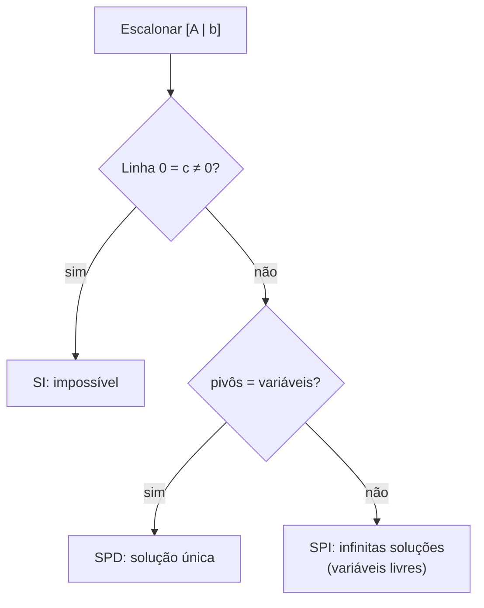

<!--META
{
  "title": "Sistemas de Recomendação, Classificação de Sistemas Lineares e NumPy",
  "header": "Recomendação e Sistemas",
  "tema": "Atividade de sistemas de recomendação com matriz de avaliações e produto escalar; pivôs e classificação de sistemas lineares (SPD e SPI) por escalonamento; notebook com vetores, matrizes e resolução de sistemas em NumPy.",
  "typing": ["Usuários × filmes: matriz de avaliações", "Mais parecido: maior produto escalar", "pivôs = variáveis → SPD", "pivôs < variáveis → SPI"],
  "tecnologias": "Python 3, Jupyter, NumPy, Matplotlib",
  "tipo": "Anotações de aula, atividade em grupo e notebook Jupyter",
  "professor": "Prof. Igor Gimenes Cesca",
  "badges": [["Aplicação", "Recomendação", "FF781F"], ["Tema", "SPD e SPI", "FF4500"], ["Ferramenta", "NumPy", "E60000", "numpy"]],
  "icons": "py",
  "icons_alt": "Python",
  "limitacoes": "As anotações combinam texto digitado e escalonamentos manuscritos, lidos visualmente. A atividade de recomendação exigia entrega manuscrita e computacional; as respostas desta página são propostas e foram calculadas por execução. O notebook foi lido integralmente e suas células NumPy reexecutadas; a célula de gráfico (Matplotlib, não instalado no ambiente) só foi verificada estaticamente.",
  "files": {
    "Aula 6 - Turma X.pdf": "Anotações da aula 6 (4 páginas): atividade “Sistemas de Recomendação e Álgebra Linear” (matriz de avaliações de cinco filmes brasileiros) e sistemas lineares: pivôs, SPD e SPI com exemplos e exercícios escalonados.",
    "Aula 6.ipynb": "Notebook (37 células): vetores em NumPy (indexação, gráfico com quiver, operações, produto escalar com dot, @ e vecdot), matrizes (shape, identidade, soma, escalar, matmul) e resolução de sistema com np.linalg.solve."
  }
}
META-->

<br />

<h2 id="visao-geral">Visão geral</h2>

A aula liga a álgebra linear a uma aplicação conhecida, os **sistemas de recomendação** de plataformas de *streaming*, e aprofunda a resolução de sistemas lineares, **classificando-os** pelo número de pivôs. O notebook da pasta traduz para **NumPy** as operações de vetores, matrizes e sistemas vistas na [aula 12](../aula12-04-09-26/README.md).

<br />

<h2 id="objetivos">Objetivos de aprendizagem</h2>

- Representar preferências como matriz e perfis como vetores.
- Usar o produto escalar como medida simples de similaridade e reconhecer suas limitações.
- Identificar pivôs e classificar sistemas em SPD e SPI.
- Operar vetores e matrizes e resolver sistemas com NumPy.

<br />

<h2 id="pre-requisitos">Pré-requisitos</h2>

- [Aula 12](../aula12-04-09-26/README.md): produto escalar, matrizes e escalonamento.

<br />

<h2 id="fundamentacao-teorica">Fundamentação teórica</h2>

### 1. Recomendação com álgebra linear

Cada **linha** da matriz $M$ é um usuário e cada **coluna**, um filme ($F_1$ *Cidade de Deus*, $F_2$ *A Vida Invisível*, $F_3$ *Agente Secreto*, $F_4$ *Santiago*, $F_5$ *São Paulo: Sociedade Anônima*). As avaliações, de 0 a 5, são fictícias:

$$M = \begin{pmatrix} 5 & 1 & 4 & 1 & 5 \\ 4 & 1 & 5 & 1 & 4 \\ 1 & 5 & 2 & 5 & 1 \\ 1 & 4 & 1 & 5 & 2 \\ 4 & 2 & 3 & ? & ? \end{pmatrix}$$

$U_5$ ainda não avaliou $F_4$ e $F_5$. A ideia é encontrar os usuários **mais parecidos** com $U_5$ nos filmes que todos avaliaram e usar as notas deles para prever as que faltam.

### 2. Pivôs e classificação de sistemas

**Pivô:** numa matriz escalonada, é o primeiro elemento não nulo de cada linha, com zeros abaixo e à esquerda.

| Classificação | Condição (anotações) | Soluções |
| :--- | :--- | :--- |
| **SPD**, possível e determinado | nº de pivôs = nº de variáveis | Única |
| **SPI**, possível e indeterminado | nº de pivôs < nº de variáveis | Infinitas: variáveis sem pivô são **livres** |
| SI, impossível | linha do tipo $[0\ 0\ \cdots\ 0 \mid c]$ com $c \neq 0$ | Nenhuma (tratado no notebook da [aula 14](../aula14-07-10-26/README.md)) |



*Figura 1 — Classificação de um sistema após o escalonamento.*

<br />

<h2 id="exemplos-praticos">Exemplos práticos</h2>

### Exemplo básico — exemplos das anotações classificados por posto

O **posto** de uma matriz (`np.linalg.matrix_rank`) é o número de pivôs após o escalonamento:

```python
{{include:mm/classifica.py}}
```

Saída esperada:

```text
{{include:mm/classifica.out}}
```

Soluções das anotações (**material original**, conferidas):

| Sistema | Solução |
| :--- | :--- |
| Ex. 1: $x + y = 2$, $x - y = 0$, $2x = 2$ | $(1, 1)$, SPD com 3 equações e 2 variáveis |
| Exercício 1: $x + y + z = 6$, $x - y + z = 2$, $2x + y - z = 7$ | $x = 3$, $y = 2$, $z = 1$, SPD |
| Ex. 2: $x + y + z = 1$, $x - y + z = 2$ | $y = -\frac{1}{2}$, $x = \frac{3}{2} - z$; $z$ livre. Ex.: $z = 0 \to (\frac{3}{2}, -\frac{1}{2}, 0)$ |
| Exercício 2 (4 equações, 3 variáveis) | $y = 2$, $x = 4 - z$; $z$ livre, SPI |

### Exemplo intermediário — o notebook `Aula 6.ipynb`

Trechos do notebook com as saídas **salvas no arquivo**, reproduzidas na reexecução com NumPy 2.5:

```python
import numpy as np

v, w = np.array([2, 3]), np.array([1, -1])
print(2 * v, w / 2, v + w, v - w)
print(np.dot(v, w), v @ w, np.linalg.vecdot(v, w))   # três formas do produto escalar

E = np.array([[1, 2], [3, 4]])
F = np.array([[5, 6], [7, 8]])
print(np.matmul(E, F).tolist(), np.matmul(F, E).tolist())  # EF ≠ FE

A = np.array([[1, 1, 1], [2, -1, 1], [1, 2, -1]])
b = np.array([6, 3, 3])
print(np.linalg.solve(A, b))
```

Saída esperada:

```text
[4 6] [ 0.5 -0.5] [3 2] [1 4]
-1 -1 -1
[[19, 22], [43, 50]] [[23, 34], [31, 46]]
[1.28571429 2.14285714 2.57142857]
```

O notebook também mostra que `w[2]` gera `IndexError` (o vetor tem só os índices 0 e 1) e desenha os vetores com `plt.quiver`.

### Exemplo aplicado — a atividade de recomendação

```python
{{include:mm/recomendacao.py}}
```

Saída esperada:

```text
{{include:mm/recomendacao.out}}
```

<br />

<h2 id="exercicios-resolvidos">Exercícios e resoluções comentadas</h2>

A atividade não traz gabarito no material. As respostas abaixo são uma **solução proposta para estudo**.

<details>
<summary><strong>Solução proposta para estudo</strong> — atividade "Sistemas de Recomendação e Álgebra Linear"</summary>

1. **A matriz precisa ser quadrada?** Não. O número de linhas (usuários) e o de colunas (filmes) são independentes; uma plataforma real tem milhões de usuários e milhares de títulos.
2. **Produtos escalares:** $u_5 \cdot u_1 = 34$, $u_5 \cdot u_2 = 33$, $u_5 \cdot u_3 = 20$, $u_5 \cdot u_4 = 15$.
3. **Mais semelhantes a $U_5$:** $U_1$ e $U_2$. Seus gostos (notas altas para $F_1$ e $F_3$) podem sugerir as notas de $U_5$ para $F_4$ e $F_5$. Por exemplo, a média de $U_1$ e $U_2$ dá 1 para *Santiago* e 4,5 para *São Paulo: S.A.*, sugerindo recomendar o segundo.
4. **Por que funciona:** o produto escalar soma $a_i b_i$ e é grande quando as notas altas de um usuário coincidem com as notas altas do outro.
5. **Limitação:** o produto escalar depende da **escala** das notas. Um usuário exigente com o mesmo padrão de gosto, como (2; 1; 1,5), tem produto 14,5, o menor de todos, embora o gosto seja idêntico (cosseno = 1). A **similaridade de cosseno** normaliza pelos módulos e corrige isso. Também não há tratamento de notas faltantes.

</details>

<br />

<h2 id="aplicacoes">Aplicações no mercado de trabalho</h2>

- **Streaming e e-commerce:** a filtragem colaborativa compara vetores de usuários (similaridade de cosseno, fatoração de matrizes) para recomendar.
- **Busca semântica e IA generativa:** textos viram vetores (*embeddings*), e a similaridade é um produto escalar normalizado.
- **Engenharia:** classificar um sistema (SPD/SPI/SI) diz se um modelo tem solução única, infinitas ou nenhuma, como em circuitos e balanços de massa.

<br />

<h2 id="boas-praticas">Boas práticas e erros comuns</h2>

| Problemático | Recomendado | Motivo |
| :--- | :--- | :--- |
| Comparar perfis só pelo produto escalar | Usar similaridade de cosseno | Remove o efeito da escala das notas |
| Preencher notas faltantes com zero | Usar só itens avaliados por ambos (vetores reduzidos) | Zero seria interpretado como "detestou" |
| Achar que mais equações que variáveis garante SPD | Contar pivôs | O exercício 2 tem 4 equações e é SPI |
| `np.linalg.solve` em sistema SPI ou SI | Verificar o posto antes | `solve` exige matriz quadrada e invertível |

<br />

<h2 id="resumo">Resumo para revisão</h2>

- Matriz usuários × itens; perfis são vetores; similaridade ≈ produto escalar (melhor: cosseno).
- Pivôs = variáveis → SPD; pivôs < variáveis → SPI (variáveis livres); linha $0 = c$ → SI.
- NumPy: `@`, `np.dot`, `np.matmul`, `np.linalg.solve`, `np.linalg.matrix_rank`.

<br />

<h2 id="questoes">Questões de fixação</h2>

1. Um sistema escalonado tem 3 variáveis e 3 pivôs. Como se classifica?
2. Por que a matriz de avaliações não precisa ser quadrada?
3. Qual a vantagem da similaridade de cosseno sobre o produto escalar?

<details>
<summary><strong>Respostas comentadas</strong></summary>

1. SPD (solução única).
2. Porque o número de usuários e o de itens são independentes.
3. Ela compara só a **direção** dos vetores (o padrão de gosto), sem ser afetada pela escala das notas.

</details>

<br />

<h2 id="referencias">Referências e materiais complementares</h2>

- [NumPy — `linalg.matrix_rank`](https://numpy.org/doc/stable/reference/generated/numpy.linalg.matrix_rank.html) · [`linalg.norm`](https://numpy.org/doc/stable/reference/generated/numpy.linalg.norm.html)
- STRANG, G. *Álgebra Linear e suas Aplicações*. Pearson, 2016 (bibliografia complementar).
- Materiais da pasta: [Aula 6](Aula%206%20-%20Turma%20X.pdf) · [notebook](Aula%206.ipynb)
