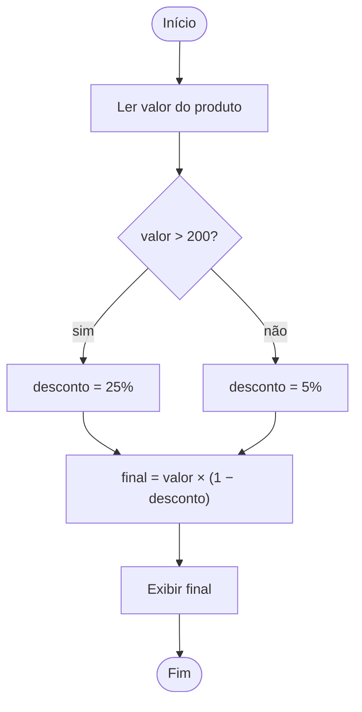

<!--META
{
  "title": "Conceitos Básicos de Programação: Lógica, Algoritmos e Tabela Verdade",
  "header": "Lógica de Programação",
  "tema": "Áreas de atuação, programação e lógica, algoritmos e refinamento (omelete), algoritmo × linguagem (pseudocódigo), desafios de lógica, fluxogramas, memória RAM e variáveis, tipos de dados, operadores aritméticos, tabela verdade (NÃO, E, OU) e teste de mesa, com exercícios.",
  "typing": ["Algoritmo: sequência finita de passos", "O computador faz EXATAMENTE o que você diz", "P && Q: verdadeiro só se ambos forem", "Teste de mesa: execute o código no papel"],
  "tecnologias": "Pseudocódigo, fluxogramas (diagrams.net), Python 3 (verificação)",
  "tipo": "Aula teórica com atividades e exercícios",
  "professor": "Prof. Alexandre Russi Junior",
  "badges": [["Tema", "Lógica", "FF781F"], ["Ferramenta", "Fluxograma", "FF4500"], ["Prática", "Teste de mesa", "E60000"]],
  "icons": "py",
  "icons_alt": "Python",
  "limitacoes": "Os slides trazem aviso de direitos autorais; o conteúdo é explicado com redação própria. Os exercícios não têm gabarito no material: as respostas desta página são propostas e foram obtidas executando os algoritmos traduzidos para Python. As planilhas de teste de mesa e tabela verdade citadas (links encurtados) não foram acessadas.",
  "files": {
    "PCP - Aula 01 - Conceitos Básicos de Programação.pdf": "Slides (46 páginas): áreas de atuação, programação, lógica, algoritmos (omelete), pseudocódigo, quatro desafios de lógica, atividades de algoritmos e fluxograma, memória e variáveis, tipos de dados, operadores, tabela verdade, teste de mesa e sete exercícios."
  }
}
META-->

<br />

<h2 id="visao-geral">Visão geral</h2>

Antes de qualquer linguagem vem a **lógica**. A aula define programação como dizer ao computador, passo a passo, como fazer uma tarefa. A máquina faz **exatamente** o que se manda, nem mais nem menos. O conceito central é o **algoritmo**, refinado até o nível de detalhe necessário e representado por pseudocódigo ou fluxograma. A aula termina com as ferramentas para verificar a lógica **sem computador**: a **tabela verdade** e o **teste de mesa**.

<br />

<h2 id="objetivos">Objetivos de aprendizagem</h2>

- Definir programação, lógica, algoritmo, programa, código-fonte e linguagem de programação.
- Escrever e refinar algoritmos em linguagem natural e em pseudocódigo.
- Representar algoritmos com fluxogramas.
- Relacionar variáveis à memória RAM e reconhecer os tipos de dados.
- Construir tabelas verdade com NÃO, E e OU.
- Executar testes de mesa.

<br />

<h2 id="pre-requisitos">Pré-requisitos</h2>

- [Aula 01](../aula01-08-03-26/README.md): apresentação da disciplina.

<br />

<h2 id="fundamentacao-teorica">Fundamentação teórica</h2>

### 1. Conceitos

| Conceito | Definição (em síntese) |
| :--- | :--- |
| Lógica | Formas de pensamento (dedução, indução, hipótese) para determinar o que é verdadeiro |
| Lógica de programação | Organização coesa de instruções para resolver um problema |
| Algoritmo | Sequência **lógica e finita** de ações que resolve um problema |
| Programa | Conjunto de instruções escrito numa linguagem de programação |
| Código-fonte | O algoritmo escrito numa linguagem; é **compilado** ou **interpretado** para executar |

**Refinamento:** o algoritmo do omelete parte de 8 passos e é detalhado em subpassos (abrir a geladeira, pegar 2 ovos…). Depois ganha **lógica**: "se for para 1 pessoa, separar 2 ovos; senão, 2 ovos por pessoa adicionada".

**Algoritmo → linguagem:** o mesmo algoritmo (pedir o nome, guardar, exibir) é escrito primeiro em passos e depois em pseudocódigo do tipo Portugol (`cadeia nome`, `escreva`, `leia`).

### 2. Fluxograma

| Símbolo | Significado |
| :--- | :--- |
| Terminação (oval) | Início e fim |
| Ação (retângulo) | Processo, ação ou função |
| Decisão (losango) | Pergunta sim/não que divide o fluxo |



*Figura 1 — Fluxograma da Atividade 2 (solução proposta), com os três símbolos apresentados.*

### 3. Memória, variáveis e tipos

A **RAM** guarda dados de curto prazo durante a execução; o **HD/SSD**, de longo prazo. **Variáveis** são porções da RAM reservadas pelo programa.

| Tipo | Exemplos |
| :--- | :--- |
| Inteiro | 0, 1, 40, 135 |
| Real | 1.36, 3.1415, 2.0 |
| Caractere | A, d, F |
| Palavra (cadeia) | Maria, garrafa |
| Booleano | Verdadeiro / Falso |

Operadores aritméticos: `+ - * /` e `%` (resto da divisão).

### 4. Tabela verdade

| $P$ | $Q$ | $P$ && $Q$ (E) | $P \lvert\lvert Q$ (OU) | !$P$ (NÃO) |
| :---: | :---: | :---: | :---: | :---: |
| V | V | V | V | F |
| V | F | F | V | F |
| F | V | F | V | V |
| F | F | F | F | V |

Exemplos dos slides: login exige LOGIN **E** SENHA corretos; o churrasco acontece se houver jogo do Brasil **OU** sol no domingo.

### 5. Teste de mesa

Executar o algoritmo **à mão**, linha a linha, registrando o valor de cada variável numa tabela. Exemplo dos slides: `a = 3; b = 4; a = b` → `a = 4`, `b = 4`.

<br />

<h2 id="exemplos-praticos">Exemplos práticos</h2>

### Exemplo básico — as atividades 1 a 3 em Python

As atividades pedem algoritmos. Aqui eles estão traduzidos para Python, com entradas fixas para que a saída seja reproduzível:

```python
{{include:pcp/algoritmos.py}}
```

Saída esperada:

```text
{{include:pcp/algoritmos.out}}
```

O slide "Tomem cuidado!" alerta para ler o enunciado com atenção: se o problema diz "números inteiros", uma sequência com 3.14 e 10.8 não é uma entrada válida.

### Exemplo intermediário — testes de mesa (exercícios 1 a 3)

```python
{{include:pcp/teste_mesa.py}}
```

Saída esperada:

```text
{{include:pcp/teste_mesa.out}}
```

### Exemplo aplicado — tabelas verdade (exercícios 4 a 7)

```python
{{include:pcp/tabela_verdade.py}}
```

Saída esperada:

```text
{{include:pcp/tabela_verdade.out}}
```

<br />

<h2 id="exercicios-resolvidos">Exercícios e resoluções comentadas</h2>

O material não traz gabarito. As respostas abaixo são **soluções propostas para estudo**, conferidas pelas execuções acima.

<details>
<summary><strong>Solução proposta para estudo</strong> — exercícios 1 a 7</summary>

| Exercício | Resposta | Comentário |
| :--- | :--- | :--- |
| 1 | `x = 6`, `y = 0.5`, `z = 6.5` | `z = 5 / y` usa o **y antigo** (10) |
| 2 | `a = 7`, `b = 1`, `c = 4` | `a` passa por 4 → 5 → 6 → 7; `b = 7 % 2 = 1`. `a++` é pseudocódigo (não existe em Python) |
| 3 | `0` | `Resultado` e `resultado` são variáveis **diferentes**: maiúsculas importam |
| 4 | $P \wedge \neg Q$: V só em (V, F) | |
| 5 | $(P \vee Q) \wedge (P \wedge Q)$ = $P \wedge Q$ | Se ambos são V, o OU também é |
| 6 | $(P \vee R) \vee (\neg Q \wedge R)$: F só em (F, V, F) e (F, F, F) | Equivale a $P \vee R$, porque $\neg Q \wedge R$ já implica $R$ |
| 7 | Mesma coluna do exercício 6 | O primeiro bloco só é V quando $P$ é V, caso já coberto por $P \vee R$ |

</details>

<details>
<summary><strong>Solução proposta para estudo</strong> — desafios de lógica</summary>

1. **Desafio matemático:** bola = 6, relógio = 3, ventilador = 3 (3 × 3 − 3 = 6). Logo, relógio × bola − ventilador = 3 × 6 − 3 = **15**, supondo que as figuras da última linha sejam iguais às anteriores.
2. **Avião na fronteira:** sobreviventes não são enterrados.
3. **Casar com a irmã da viúva:** se ele tem uma viúva, ele morreu.
4. **Dia da semana:** "há cinco dias foi um dia antes de sábado" (sexta), então hoje é quarta, e depois de amanhã será **sexta-feira**.

</details>

<br />

<h2 id="aplicacoes">Aplicações no mercado de trabalho</h2>

- **Áreas citadas:** desenvolvimento *front-end*, *back-end* e *full stack* e análise de banco de dados.
- **Especificação de software:** algoritmos e fluxogramas documentam regras de negócio antes da implementação.
- **Depuração:** o teste de mesa é a base do uso de *debuggers* (executar passo a passo e inspecionar variáveis).
- **Lógica booleana:** regras de acesso (login E senha), filtros de busca e condições de negócio.

<br />

<h2 id="boas-praticas">Boas práticas e erros comuns</h2>

| Problemático | Recomendado | Motivo |
| :--- | :--- | :--- |
| Começar pelo código | Escrever o algoritmo e refiná-lo primeiro | Separa o problema da sintaxe |
| Ignorar restrições do enunciado | Ler com atenção ("somente inteiros") | O slide "Tomem cuidado!" |
| Nomes de variáveis parecidos | Nomes distintos e descritivos | `Resultado` × `resultado` (exercício 3) |
| Supor que o computador "entende a intenção" | Lembrar que ele faz exatamente o que foi escrito | Origem de muitos *bugs* |

<br />

<h2 id="resumo">Resumo para revisão</h2>

- Algoritmo = passos finitos e ordenados; refina-se até o detalhe necessário.
- Fluxograma: oval (início e fim), retângulo (ação), losango (decisão).
- Variáveis ocupam a RAM; tipos: inteiro, real, caractere, cadeia, booleano.
- E: V só se ambos forem V; OU: F só se ambos forem F; NÃO inverte.
- Teste de mesa: rastrear valores linha a linha.

<br />

<h2 id="questoes">Questões de fixação</h2>

1. Qual a diferença entre algoritmo e programa?
2. Qual o valor de `V && !V`?
3. Após `a = 3; b = 4; a = b; b = a`, quanto valem `a` e `b`?

<details>
<summary><strong>Respostas comentadas</strong></summary>

1. O algoritmo é a sequência lógica de passos; o programa é esse algoritmo escrito numa linguagem e executável pelo computador.
2. Falso, porque $!V = F$ e $V \wedge F = F$.
3. Ambos valem 4: `a = b` copia o 4, e `b = a` copia de volta o 4. Para trocar valores, seria preciso uma variável auxiliar ou `a, b = b, a`.

</details>

<br />

<h2 id="referencias">Referências e materiais complementares</h2>

- [diagrams.net](https://diagrams.net/), ferramenta de fluxogramas indicada nos slides.
- [Pesquisa Código Fonte TV 2025](https://pesquisa.codigofonte.com.br/2025), citada nos slides sobre o mercado.
- Material da pasta: [slides](PCP%20-%20Aula%2001%20-%20Conceitos%20B%C3%A1sicos%20de%20Programa%C3%A7%C3%A3o.pdf)
