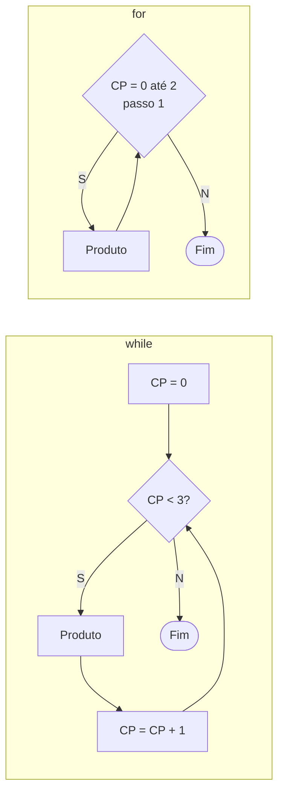

<!--META
{
  "title": "Estruturas de Repetição: while, for, break e continue",
  "header": "Estruturas de Repetição",
  "tema": "Laço while com contador e condição, iteração, controle de fluxo com continue e break, validação de entrada com repetição, laço for com range, laços aninhados e rastreio de variáveis, com atividades e nove exercícios (contagens, tabuada, soma, maior, pares, divisores e números primos).",
  "typing": ["while condicao: repete enquanto for verdadeira", "for i in range(inicio, fim, passo)", "continue pula; break sai", "Primos de 2 a 2000: laços aninhados"],
  "tecnologias": "Python 3",
  "tipo": "Aula prática com atividades e exercícios",
  "professor": "Prof. Alexandre Russi Junior",
  "badges": [["Linguagem", "Python", "FF781F", "python"], ["Tema", "Laços", "FF4500"], ["Prática", "9 exercícios", "E60000"]],
  "icons": "py",
  "icons_alt": "Python",
  "limitacoes": "Os slides trazem aviso de direitos autorais; o conteúdo é explicado com redação própria. Os exemplos de código e fluxogramas aparecem como imagens, lidos visualmente. Os exercícios não têm gabarito: as soluções são propostas e executadas com entradas fixas (input() substituído por valores ou por um iterador).",
  "files": {
    "PCP - Aula 04 - Estruturas de repetição.pdf": "Slides (21 páginas): while (fluxograma do contador), continue e break, atividades de contagem e validação, for (comparação de fluxogramas), laços aninhados com tabela de rastreio e nove exercícios."
  }
}
META-->

<br />

<h2 id="visao-geral">Visão geral</h2>

As **estruturas de repetição** (laços) executam o mesmo bloco várias vezes. Cada execução é uma **iteração**. Com elas, um programa pode, por exemplo, insistir até receber uma entrada válida, em vez de apenas exibir um erro e encerrar.

| Laço | Quando usar |
| :--- | :--- |
| `while` | Enquanto uma condição for verdadeira; o número de repetições pode ser desconhecido |
| `for` | Para percorrer uma sequência ou um intervalo conhecido (`range`) |

<br />

<h2 id="objetivos">Objetivos de aprendizagem</h2>

- Escrever laços `while` com contador e condição de parada.
- Usar `for` com `range(inicio, fim, passo)`.
- Controlar o fluxo com `continue` e `break`.
- Validar entradas com repetição.
- Construir laços aninhados e rastrear suas variáveis.

<br />

<h2 id="pre-requisitos">Pré-requisitos</h2>

- [Aula 04](../aula04-30-03-26/README.md): condicionais e funções.

<br />

<h2 id="fundamentacao-teorica">Fundamentação teórica</h2>

### 1. `while` e `for`



*Figura 1 — Os dois fluxogramas dos slides: no `for`, a inicialização, o teste e o incremento ficam na própria estrutura.*

`range(inicio, fim, passo)` gera os inteiros de `inicio` até `fim - 1`, avançando de `passo` em `passo`.

### 2. `continue` e `break`

| Comando | Efeito |
| :--- | :--- |
| `continue` | Ignora o restante do bloco e vai para a **próxima iteração** |
| `break` | **Sai** do laço imediatamente |

### 3. Laços aninhados

Um laço dentro de outro: para **cada** iteração do externo, o interno executa **inteiro**. Os slides rastreiam `I` de 0 a 3 (passo 1) com `J` de 0 a 2 (passo 2), gerando os pares (0,0), (0,2), (1,0), (1,2)… até (3,2).

<br />

<h2 id="exemplos-praticos">Exemplos práticos</h2>

### Exemplo básico — contador, `continue`, `break` e laço aninhado

```python
{{include:pcp/repeticao.py}}
```

Saída esperada:

```text
{{include:pcp/repeticao.out}}
```

### Exemplo aplicado — exercícios 2 a 9

```python
{{include:pcp/exercicios05.py}}
```

Saída esperada:

```text
{{include:pcp/exercicios05.out}}
```

No exercício 7, `iter([...])` simula três digitações do usuário (−3, 0 e 10). O `while` rejeita as duas primeiras, como pede o enunciado, e o `for` soma de 1 a 10, resultando em 55 (o valor do slide).

<br />

<h2 id="exercicios-resolvidos">Exercícios e resoluções comentadas</h2>

O material não traz gabarito. As soluções acima são **propostas para estudo**. Os exercícios que dependem de interação seguem abaixo:

<details>
<summary><strong>Solução proposta para estudo</strong> — exercício 1 e atividades interativas</summary>

<!-- norun -->
```python
# Exercício 1: repetir até o usuário recusar
while True:
    print("Olá, Mundo")
    if input("Exibir novamente? (s/n) ").strip().lower() != "s":
        break
print("Fim")

# Atividade 2: validar duas notas de 0 a 10
def ler_nota(rotulo):
    nota = float(input(f"{rotulo}: "))
    while nota < 0 or nota > 10:
        nota = float(input(f"Inválida! {rotulo} (0 a 10): "))
    return nota

n1, n2 = ler_nota("Nota 1"), ler_nota("Nota 2")
print("Média:", (n1 + n2) / 2)

# Atividade 3: exibir "Produto" a quantidade de vezes pedida
for _ in range(int(input("Quantidade: "))):
    print("Produto")
```

</details>

**Comentários:**

- **Exercício 9 (primos):** basta testar divisores até $\sqrt{x}$. Se $x = a \cdot b$ com $a \leq b$, então $a \leq \sqrt{x}$. São 303 primos entre 2 e 2000.
- **Exercício 5 (maior):** inicialize o maior com o **primeiro valor**, e não com 0, porque todos poderiam ser negativos.

<br />

<h2 id="aplicacoes">Aplicações no mercado de trabalho</h2>

- **Processamento em lote:** percorrer registros de um banco, linhas de um arquivo ou pedidos de um dia.
- **Validação de dados:** repetir a solicitação até a entrada estar correta (formulários, CLIs).
- **Laços de servidor e de jogos:** `while True` com `break` controla programas que rodam continuamente ([jogo da adivinhação](../aula12-23-09-26/README.md)).

<br />

<h2 id="boas-praticas">Boas práticas e erros comuns</h2>

| Problemático | Recomendado | Motivo |
| :--- | :--- | :--- |
| Esquecer de atualizar a variável do `while` | Garantir que a condição mude a cada iteração | Evita laço infinito |
| `range(1, n)` para incluir `n` | `range(1, n + 1)` | O fim é exclusivo |
| Iniciar o "maior" com 0 | Iniciar com o primeiro elemento | Funciona com negativos |
| Testar divisores até `x - 1` | Até `int(x ** 0.5)` | Muito mais rápido |

<br />

<h2 id="resumo">Resumo para revisão</h2>

- `while`: repete enquanto a condição for verdadeira; `for`: percorre sequências ou `range`.
- `range(inicio, fim, passo)`: o fim é exclusivo.
- `continue` pula para a próxima iteração; `break` sai do laço.
- Laços aninhados: o interno roda completo para cada iteração do externo.

<br />

<h2 id="questoes">Questões de fixação</h2>

1. Quantas vezes `for i in range(2, 11, 3)` executa? Com que valores?
2. Qual a saída de `for i in range(5): if i == 3: break; print(i)` (em linhas separadas)?
3. Quantas linhas imprime um laço de 4 iterações com outro de 3 dentro, com um `print` no interno?

<details>
<summary><strong>Respostas comentadas</strong></summary>

1. 3 vezes: 2, 5 e 8.
2. 0, 1 e 2: no 3, o `break` sai antes do `print`.
3. $4 \times 3 = 12$.

</details>

<br />

<h2 id="referencias">Referências e materiais complementares</h2>

- [Python — `for`, `range`, `break` e `continue`](https://docs.python.org/pt-br/3/tutorial/controlflow.html)
- Material da pasta: [slides](PCP%20-%20Aula%2004%20-%20Estruturas%20de%20repeti%C3%A7%C3%A3o.pdf)
