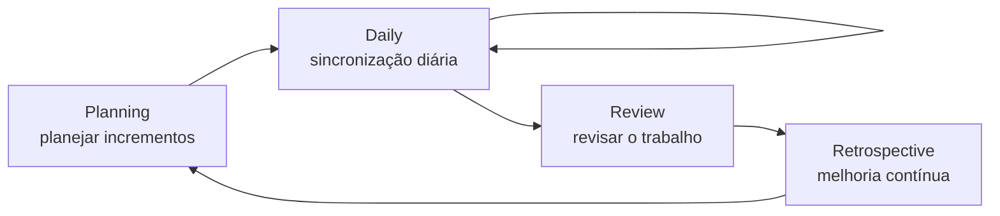

<!--META
{
  "title": "Extra: Metodologia Ágil para as Equipes do Challenge",
  "header": "Metodologia Ágil",
  "tema": "Material extra com dois infográficos sobre agilidade (Manifesto Ágil, pilares do Scrum, papéis, cerimônias, Kanban, Scrumban e Daily Scrum) e a orientação de formação das equipes do Challenge GoodWe, com o líder acumulando os papéis de Product Owner e Scrum Master.",
  "typing": ["Indivíduos e interações > processos", "Scrum: sprints, PO, Scrum Master, squad", "Kanban: fluxo contínuo e limite de WIP", "Daily: 15 minutos, três perguntas"],
  "tecnologias": "Scrum, Kanban (conceitos); Python 3 (simulação ilustrativa)",
  "tipo": "Material extra (infográficos e orientação do Challenge)",
  "professor": "Prof. Alexandre Russi Junior",
  "badges": [["Tema", "Agilidade", "FF781F"], ["Frameworks", "Scrum · Kanban", "FF4500"], ["Contexto", "Challenge GoodWe", "E60000"]],
  "icons": "py",
  "icons_alt": "Python",
  "limitacoes": "O PDF tem 3 páginas, essencialmente imagens: dois infográficos (com a marca do NotebookLM) e uma captura de planilha de equipes. O conteúdo foi lido visualmente e é explicado com redação própria. O link da planilha compartilhada da instituição (SharePoint) não é reproduzido nesta página.",
  "files": {
    "PCP - Extra - Metodologia Ágil.pdf": "Material extra (3 páginas): infográfico sobre Scrum, Kanban e a Daily; infográfico sobre estrutura e papéis no Scrum; e instruções para cadastrar as equipes do Challenge GoodWe numa planilha compartilhada."
  }
}
META-->

<br />

<h2 id="visao-geral">Visão geral</h2>

Este material extra prepara as equipes para o **Challenge** (projeto com a empresa parceira GoodWe) com os fundamentos da **metodologia ágil**. Ele traz dois infográficos e uma orientação prática: na equipe, o **líder** assume os papéis de **Product Owner** e **Scrum Master**, e todos atuam como **squad** (desenvolvedores). Os nomes e RMs de cada equipe são registrados numa planilha compartilhada da turma.

<br />

<h2 id="objetivos">Objetivos de aprendizagem</h2>

- Reconhecer os valores do Manifesto Ágil e os pilares do Scrum.
- Diferenciar Scrum, Kanban e o modelo híbrido Scrumban.
- Identificar papéis e responsabilidades (PO, Scrum Master, squad, *stakeholders*).
- Conduzir uma Daily Scrum eficiente.

<br />

<h2 id="pre-requisitos">Pré-requisitos</h2>

Nenhum pré-requisito técnico. Ajuda ter formado a equipe do Challenge.

<br />

<h2 id="fundamentacao-teorica">Fundamentação teórica</h2>

### 1. Mentalidade ágil

- **Manifesto Ágil (quatro valores):** indivíduos e interações, *software* funcionando, colaboração com o cliente e resposta a mudanças, cada um valorizado **acima** de processos, documentação extensa, negociação de contratos e seguir um plano.
- **Três pilares do Scrum:** **transparência**, **inspeção** e **adaptação**.

### 2. Scrum × Kanban × Scrumban

| Característica | Scrum | Kanban |
| :--- | :--- | :--- |
| Cadência | *Sprints* regulares (1 a 4 semanas) | Fluxo contínuo |
| Funções | PO, Scrum Master, time | Sem papéis obrigatórios |
| Mudanças | Evitadas durante a *sprint* | Permitidas a qualquer momento |
| Controle | *Sprint backlog* | **Limites de WIP** (trabalho em andamento) |

O **Scrumban** combina a cadência do Scrum com o fluxo visual e os limites de WIP do Kanban.

### 3. Papéis e ciclo do Scrum



*Figura 1 — Ciclo de cerimônias do Scrum, conforme o infográfico. No centro do ciclo está a squad (time de desenvolvimento).*

| Ator | Responsabilidade principal | Foco |
| :--- | :--- | :--- |
| PO e Scrum Master (no Challenge, o líder) | Priorização e facilitação | O "quê" e o "processo" |
| Squad (devs e designers) | Execução e qualidade | O "como" técnico |
| *Stakeholders* | *Feedback* e visão | Necessidade do mercado |

### 4. A Daily Scrum ideal

Reunião de **15 minutos**, no mesmo horário e local, com três perguntas: *o que fiz ontem?*, *o que farei hoje?* e *existe algum impedimento?*. O infográfico enfatiza **colaboração acima de relatório de status**. Os desafios citados na implantação são resistência cultural, mudança de escopo constante e falta de clareza nos papéis.

<br />

<h2 id="exemplos-praticos">Exemplos práticos</h2>

### Exemplo — simulando um quadro Kanban com limite de WIP

Exemplo ilustrativo (não faz parte do material) que usa listas e dicionários em Python:

```python
{{include:pcp/kanban.py}}
```

Saída esperada:

```text
{{include:pcp/kanban.out}}
```

O limite de WIP força a equipe a **terminar** antes de **começar**: a terceira tarefa só entra quando "login" é concluída.

<br />

<h2 id="exercicios-resolvidos">Exercícios e resoluções comentadas</h2>

O material não traz exercícios. **Exercício proposto para estudo:** monte o *backlog* inicial do Challenge da sua equipe com cinco itens priorizados e defina a duração da *sprint*.

<details>
<summary><strong>Solução proposta para estudo</strong> (modelo)</summary>

| Prioridade | Item do *backlog* | Critério de pronto |
| :---: | :--- | :--- |
| 1 | Entender o problema da empresa parceira | Resumo validado pelo PO |
| 2 | Protótipo do menu do sistema | Menu navegável no terminal |
| 3 | Cadastro e consulta de dados | Operações funcionando com validação |
| 4 | Persistência em arquivo | Dados mantidos entre execuções |
| 5 | Documentação e apresentação | README e *pitch* revisados |

*Sprint* de 1 semana, com uma Daily curta (15 min) e uma Review ao final, alinhada às entregas de *sprint* da disciplina.

</details>

<br />

<h2 id="aplicacoes">Aplicações no mercado de trabalho</h2>

- Scrum e Kanban são os *frameworks* mais usados em times de software. Saber atuar em *sprints*, *dailies* e *reviews* é esperado de qualquer profissional de tecnologia.
- Ferramentas como Jira, Trello e GitHub Projects implementam quadros Kanban e *backlogs*.

<br />

<h2 id="boas-praticas">Boas práticas e erros comuns</h2>

| Problemático | Recomendado |
| :--- | :--- |
| Daily longa, virando reunião de solução | Manter 15 minutos; discutir impedimentos depois, com quem precisa |
| Começar muitas tarefas ao mesmo tempo | Respeitar o limite de WIP |
| Papéis indefinidos | Deixar claro quem prioriza (PO) e quem facilita (SM) |
| Mudar o escopo no meio da *sprint* | Levar a mudança ao próximo *planning* |

<br />

<h2 id="resumo">Resumo para revisão</h2>

- Manifesto Ágil: pessoas, *software* funcionando, colaboração e adaptação.
- Scrum: *sprints* e papéis (PO, SM, squad); Kanban: fluxo contínuo com limite de WIP; Scrumban: os dois juntos.
- Cerimônias: Planning → Daily → Review → Retrospective.
- No Challenge: o líder acumula PO e Scrum Master; todos desenvolvem.

<br />

<h2 id="questoes">Questões de fixação</h2>

1. Quais são os três pilares do Scrum?
2. Qual a principal diferença de cadência entre Scrum e Kanban?
3. Para que serve o limite de WIP?

<details>
<summary><strong>Respostas comentadas</strong></summary>

1. Transparência, inspeção e adaptação.
2. Scrum trabalha em *sprints* de duração fixa; Kanban, em fluxo contínuo.
3. Limitar o trabalho simultâneo, reduzir gargalos e incentivar a conclusão das tarefas.

</details>

<br />

<h2 id="referencias">Referências e materiais complementares</h2>

- [Manifesto Ágil (português)](https://agilemanifesto.org/iso/ptbr/manifesto.html)
- [Guia do Scrum](https://scrumguides.org/)
- Material da pasta: [infográficos](PCP%20-%20Extra%20-%20Metodologia%20%C3%81gil.pdf)
