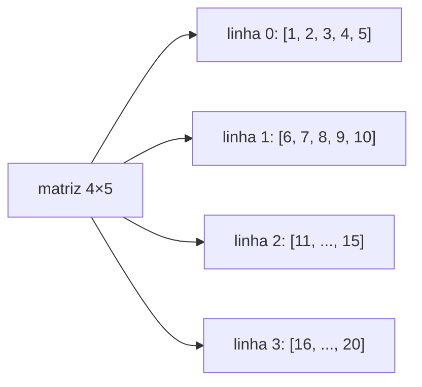

<!--META
{
  "title": "Strings, Vetores (Listas) e Matrizes",
  "header": "Vetores e Matrizes",
  "tema": "Variáveis compostas, vetores (arrays) e sua implementação com listas em Python, índices, percurso com for indexado e for each, combinações em duplas com laços aninhados, matrizes (aplicações, jogo da velha, matriz 4×5) e oito exercícios.",
  "typing": ["vetor[0] é a primeira posição", "for i in range(len(lista))", "matriz[linha][coluna]", "Jogo da velha: matriz 3×3"],
  "tecnologias": "Python 3",
  "tipo": "Aula prática com atividades e exercícios",
  "professor": "Prof. Alexandre Russi Junior",
  "badges": [["Linguagem", "Python", "FF781F", "python"], ["Estruturas", "Listas e matrizes", "FF4500"], ["Prática", "8 exercícios", "E60000"]],
  "icons": "py",
  "icons_alt": "Python",
  "limitacoes": "Os slides trazem aviso de direitos autorais; o conteúdo é explicado com redação própria. O código aparece em imagens, lidas visualmente. Alguns textos dos slides descrevem vetores como em Java (tamanho fixo, atributo length), enquanto os códigos usam listas Python; a diferença é comentada. Os exercícios não têm gabarito: as soluções são propostas, com entradas fixas e semente aleatória fixa.",
  "files": {
    "PCP - Aula 05 - Strings, arrays e matrizes.pdf": "Slides (22 páginas): motivação das variáveis compostas, vetores, percurso com for, atividade de duplas, matrizes (motivação e aplicações), jogo da velha, matriz 4×5, atividade de preenchimento e oito exercícios."
  }
}
META-->

<br />

<h2 id="visao-geral">Visão geral</h2>

Até aqui, cada variável guardava **um** valor. Para calcular a média de uma turma e depois comparar **cada** nota com ela, é preciso guardar todas as notas. Entram as **variáveis compostas**:

- **vetores** (arrays), com uma dimensão, um índice;
- **matrizes**, com duas dimensões, linha e coluna.

Em Python, ambos são representados por **listas** (e listas de listas).

<br />

<h2 id="objetivos">Objetivos de aprendizagem</h2>

- Criar, preencher e percorrer listas com índice e com *for each*.
- Gerar combinações com laços aninhados.
- Criar e percorrer matrizes como listas de listas.
- Resolver problemas clássicos: média e comparação, inversão e soma de matrizes.

<br />

<h2 id="pre-requisitos">Pré-requisitos</h2>

- [Aula 05](../aula05-04-04-26/README.md): laços `for` e `while`, laços aninhados.

<br />

<h2 id="fundamentacao-teorica">Fundamentação teórica</h2>

### 1. Vetores

Um **vetor** é uma estrutura **indexada**: cada elemento é acessado por um índice que começa em **0**. Num vetor de 10 posições, `v[0]` é o primeiro e `v[9]`, o último.

| Índice | 0 | 1 | 2 | 3 | 4 | 5 | 6 | 7 | 8 | 9 |
| :--- | :---: | :---: | :---: | :---: | :---: | :---: | :---: | :---: | :---: | :---: |
| Valor | 10 | 1999 | 0 | 0 | 0 | 0 | 0 | 0 | 0 | 0 |

> [!NOTE]
> **Vetor clássico × lista Python.** Parte do texto dos slides descreve o vetor "clássico" de linguagens como Java e C: tamanho **fixo**, um único tipo e capacidade dada pelo atributo `length`. Os códigos dos slides, porém, usam **listas Python**, que **crescem** com `append`, aceitam tipos diferentes e têm o tamanho dado por `len(lista)`. Além disso, o código do slide (lista vazia com dois `append`) gera uma lista de **2** posições, e não as 10 do desenho. Para reproduzir um vetor de tamanho fixo, use `[0] * 10`.

**Percurso:**

<!-- norun -->
```python
for i in range(len(numeros)):        # FOR indexado: posição e valor
    print(f"Pos: {i} -- Valor: {numeros[i]}")

for num in numeros:                  # FOR EACH: percorre diretamente os valores
    print(f"Valor: {num}")
```

### 2. Matrizes

Estruturas com **linhas e colunas**: planilhas (células), telas (pixels), tabuleiros (casas) e tabelas de banco de dados (registros). Outras aplicações citadas são visão computacional (imagens, rotação), criptografia (chaves) e o **jogo da velha**.

Em Python, uma matriz $m \times n$ é uma lista com $m$ listas de $n$ elementos. O acesso é `matriz[linha][coluna]`.



*Figura 1 — Uma matriz como lista de listas (Atividade 2): o elemento `[i][j]` vale `5·i + j + 1`.*

<br />

<h2 id="exemplos-praticos">Exemplos práticos</h2>

### Exemplo básico — listas, duplas, matriz 4×5 e tabuleiro

```python
{{include:pcp/vetores_listas.py}}
```

Saída esperada:

```text
{{include:pcp/vetores_listas.out}}
```

Na Atividade 1, com 4 nomes, há $\binom{4}{2} = 6$ duplas. O laço interno começa em `i + 1` para não repetir pares nem formar dupla de alguém consigo mesmo.

### Exemplo aplicado — exercícios 1 a 8

```python
{{include:pcp/exercicios07.py}}
```

Saída esperada:

```text
{{include:pcp/exercicios07.out}}
```

<br />

<h2 id="exercicios-resolvidos">Exercícios e resoluções comentadas</h2>

As soluções acima são **propostas para estudo** (o material não traz gabarito). Versão interativa do exercício 5, em que a lista termina com um Enter vazio:

<details>
<summary><strong>Solução proposta para estudo</strong> — leitura até Enter vazio</summary>

<!-- norun -->
```python
nomes = []
while True:
    nome = input("Nome (Enter para terminar): ")
    if nome == "":
        break
    nomes.append(nome)
for nome in reversed(nomes):
    print(nome)
```

</details>

**Comentários:**

- **Exercício 2:** a média só pode ser comparada depois que todas as notas estão guardadas. É exatamente a motivação das variáveis compostas.
- **Exercício 6:** basta percorrer até a metade (`len(v) // 2`), trocando `v[i]` com `v[-1 - i]`. Ir até o fim desfaria as trocas.
- **Exercício 8:** a soma de matrizes exige **mesmas dimensões** e é feita elemento a elemento.

<br />

<h2 id="aplicacoes">Aplicações no mercado de trabalho</h2>

- **Imagens:** uma foto em tons de cinza é uma matriz de pixels; filtros e rotações são operações matriciais.
- **Dados tabulares:** listas de registros e matrizes são a base de planilhas e do pandas.
- **Jogos:** tabuleiros (velha, xadrez, batalha naval) são matrizes.

<br />

<h2 id="boas-praticas">Boas práticas e erros comuns</h2>

| Problemático | Recomendado | Motivo |
| :--- | :--- | :--- |
| `[[0] * 3] * 3` para criar matriz | `[[0] * 3 for _ in range(3)]` | O primeiro repete a **mesma** lista 3 vezes; alterar uma linha altera todas |
| Acessar `v[len(v)]` | O último índice é `len(v) - 1` (ou `v[-1]`) | Evita `IndexError` |
| Inverter trocando até o fim | Trocar só até a metade | Senão o vetor volta ao original |
| Tratar lista Python como vetor de tamanho fixo | Usar `append` ou `[valor] * n` conforme o caso | São estruturas diferentes |

<br />

<h2 id="resumo">Resumo para revisão</h2>

- Vetor: estrutura indexada a partir de 0; em Python, `list`.
- `len(lista)`, `append`, `lista[i]`, `lista[-1]`, `lista[::-1]`.
- Matriz: lista de listas; `m[linha][coluna]`.
- Laços aninhados percorrem matrizes e geram combinações.

<br />

<h2 id="questoes">Questões de fixação</h2>

1. Em `v = [4, 8, 15, 16]`, quanto valem `v[1]` e `v[-1]`?
2. Como acessar o elemento da 3ª linha e 2ª coluna de `m`?
3. Quantas duplas podem ser formadas com 5 pessoas?

<details>
<summary><strong>Respostas comentadas</strong></summary>

1. `8` e `16`.
2. `m[2][1]`, porque os índices começam em 0.
3. $\binom{5}{2} = 10$.

</details>

<br />

<h2 id="referencias">Referências e materiais complementares</h2>

- [Python — listas](https://docs.python.org/pt-br/3/tutorial/datastructures.html#more-on-lists)
- Material da pasta: [slides](PCP%20-%20Aula%2005%20-%20Strings%2C%20arrays%20e%20matrizes.pdf)
