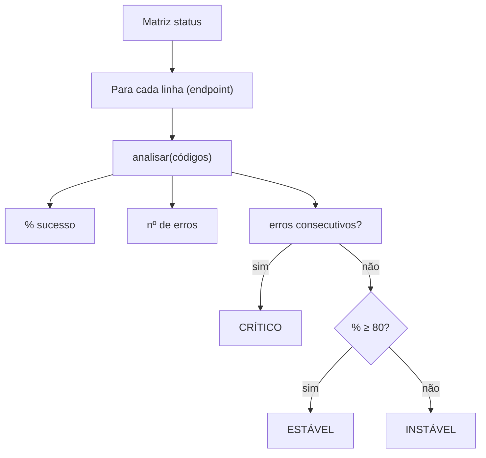

<!--META
{
  "title": "Retomada do 2º Semestre: Avisos do Challenge, Desafio API em Alerta e Revisão",
  "header": "Revisão: API em Alerta",
  "tema": "Avisos do Challenge GoodWe (mentorias, bancas, NEXT), calendário de checkpoints, sprints e Global Solution do 2º semestre; desafio de revisão “API em Alerta” com matriz de códigos HTTP; exercícios de revisão do 1º semestre.",
  "typing": ["Linha = endpoint; coluna = requisição", "Sucesso: código HTTP entre 200 e 299", "ESTÁVEL ≥ 80% · INSTÁVEL · CRÍTICO", "Revisão: while, for, listas e matrizes"],
  "tecnologias": "Python 3",
  "tipo": "Avisos, desafio de revisão e exercícios",
  "professor": "Prof. Alexandre Russi Junior",
  "badges": [["Linguagem", "Python", "FF781F", "python"], ["Desafio", "API em Alerta", "FF4500"], ["Contexto", "Challenge GoodWe", "E60000"]],
  "icons": "py",
  "icons_alt": "Python",
  "limitacoes": "Os slides trazem aviso de direitos autorais; o conteúdo é explicado com redação própria. Datas do calendário são as informadas nos slides, que alertam estarem sujeitas a modificação. O desafio não tem gabarito: a solução é proposta e foi executada. Os exercícios 1 a 8 repetem enunciados das aulas 05 e 07 e remetem às soluções dessas páginas.",
  "files": {
    "PCP - Aula 06 - GoodWe avisos, Matrizes e Exercícios.pdf": "Slides (21 páginas): avisos do Challenge GoodWe (mentorias, bancas, NEXT), calendário de CPs, sprints e GS do 2º semestre, sugestão de estudo de APIs, desafio “API em Alerta” e oito exercícios de revisão."
  }
}
META-->

<br />

<h2 id="visao-geral">Visão geral</h2>

A primeira aula do 2º semestre combina **organização** e **revisão**: os avisos do Challenge GoodWe e o calendário de avaliações, um desafio integrador sobre **matrizes**, o **"API em Alerta"**, e exercícios que retomam os laços e as listas do 1º semestre.

**Calendário informado nos slides** (todas as datas sujeitas a modificação):

| Item | Data |
| :--- | :--- |
| Vídeo *pitch*/técnico (3 min), entregue como CP1 | até 28/08 |
| CP2 | semana de 31/08 e 01/09 |
| Sprint 3 | 05/09 a 30/09 |
| Banca remota (classificação para o NEXT) | semana de 28/09 |
| Sprint 4 | 01/10 a 31/10 |
| CP3 | semana de 13/10 (19/10 para algumas turmas) |
| Banca presencial (TOP 3) | semana de 19/10 |
| NEXT (feira de projetos da FIAP) | 24/10 (sábado) |
| Global Solution | 04/11 a 19/11 |

<br />

<h2 id="objetivos">Objetivos de aprendizagem</h2>

- Organizar as entregas do 2º semestre.
- Processar uma matriz linha a linha com funções.
- Aplicar regras de classificação sobre dados (porcentagens, erros consecutivos).
- Revisar laços, listas e matrizes.

<br />

<h2 id="pre-requisitos">Pré-requisitos</h2>

- [Aula 05](../aula05-04-04-26/README.md) (laços) e [aula 07](../aula07-26-04-26/README.md) (listas e matrizes).
- Noção de códigos de status HTTP (2xx sucesso, 4xx erro do cliente, 5xx erro do servidor). Os slides sugerem pesquisar APIs como estudo extra.

<br />

<h2 id="fundamentacao-teorica">Fundamentação teórica</h2>

### O desafio "API em Alerta"

Uma API tem três *endpoints*. A matriz `status` registra os códigos HTTP das últimas requisições: **cada linha é um endpoint e cada coluna, uma requisição**.

| Endpoint | Req. 1 | Req. 2 | Req. 3 | Req. 4 | Req. 5 |
| :--- | :---: | :---: | :---: | :---: | :---: |
| `/login` | 200 | 200 | 401 | 200 | 500 |
| `/produtos` | 200 | 200 | 200 | 200 | 200 |
| `/pedidos` | 201 | 500 | 502 | 201 | 500 |

**O programa deve:**

1. calcular a porcentagem de sucesso de cada endpoint, considerando sucesso um código de 200 a 299;
2. identificar o endpoint com mais erros;
3. verificar se houve dois erros seguidos;
4. classificar cada endpoint como **ESTÁVEL** (≥ 80% de sucesso), **INSTÁVEL** (< 80%) ou **CRÍTICO** (dois erros consecutivos).

Requisitos: usar pelo menos uma **função** e funcionar com **novos endpoints ou requisições**, sem números fixos no código.



*Figura 1 — Estrutura da solução proposta. A regra CRÍTICO é testada primeiro, por ser a mais grave.*

<br />

<h2 id="exemplos-praticos">Exemplos práticos</h2>

### Exemplo — solução proposta para o desafio

```python
{{include:pcp/api_alerta.py}}
```

Saída esperada:

```text
{{include:pcp/api_alerta.out}}
```

**Pontos de projeto:**

- `zip(codigos, codigos[1:])` forma os pares de requisições **vizinhas**, o que torna fácil detectar dois erros seguidos.
- Nada depende do número de endpoints ou de colunas: novos dados funcionam sem alterar o código.
- Em `/login`, os erros (401 e 500) **não** são consecutivos, por isso o endpoint é INSTÁVEL, e não CRÍTICO.

<br />

<h2 id="exercicios-resolvidos">Exercícios e resoluções comentadas</h2>

Os oito exercícios de revisão repetem enunciados já resolvidos nesta documentação (**soluções propostas para estudo**):

| Exercício | Tema | Onde está a solução |
| :--- | :--- | :--- |
| 1 | `while` com pergunta ao usuário | [Aula 05](../aula05-04-04-26/README.md#exercicios-resolvidos) |
| 2 | Contagem de 0 a 100 de 10 em 10 | [Aula 05](../aula05-04-04-26/README.md#exemplos-praticos) |
| 3 | Soma de 1 a n com validação | [Aula 05](../aula05-04-04-26/README.md#exemplos-praticos) |
| 4 | Divisores de n | [Aula 05](../aula05-04-04-26/README.md#exemplos-praticos) |
| 5 | Primos de 2 a 2000 | [Aula 05](../aula05-04-04-26/README.md#exemplos-praticos) |
| 6 | Vetor de reais aleatórios | [Aula 07](../aula07-26-04-26/README.md#exemplos-praticos) |
| 7 | Inversão de vetor | [Aula 07](../aula07-26-04-26/README.md#exemplos-praticos) |
| 8 | Soma de matrizes | [Aula 07](../aula07-26-04-26/README.md#exemplos-praticos) |

**Exercício proposto para estudo:** estenda o desafio para informar, para cada endpoint, **qual requisição** (número da coluna) teve o primeiro erro.

<details>
<summary><strong>Solução proposta para estudo</strong></summary>

```python
status = {"/login": [200, 200, 401, 200, 500], "/produtos": [200] * 5, "/pedidos": [201, 500, 502, 201, 500]}
for ep, cods in status.items():
    primeiro = next((i + 1 for i, c in enumerate(cods) if not 200 <= c <= 299), None)
    print(ep, "-> primeiro erro na requisição", primeiro)
```

Saída esperada:

```text
/login -> primeiro erro na requisição 3
/produtos -> primeiro erro na requisição None
/pedidos -> primeiro erro na requisição 2
```

</details>

<br />

<h2 id="aplicacoes">Aplicações no mercado de trabalho</h2>

- **Observabilidade e SRE:** monitorar taxas de erro por endpoint e disparar alertas para padrões como erros consecutivos é rotina em equipes de operação (Grafana, Datadog, Prometheus).
- **Acordos de nível de serviço (SLA):** classificações como "estável ≥ 80%" se parecem com metas de disponibilidade.
- **Challenge e NEXT:** apresentar um projeto técnico em *pitch* curto é uma habilidade valorizada no mercado.

<br />

<h2 id="boas-praticas">Boas práticas e erros comuns</h2>

| Problemático | Recomendado | Motivo |
| :--- | :--- | :--- |
| Fixar `range(3)` e `range(5)` no código | Usar `len` e iteração direta | Requisito do desafio: aceitar novos dados |
| Testar só `== 200` | Faixa `200 <= c <= 299` | 201 também é sucesso |
| Classificar sem prioridade | Testar CRÍTICO antes de ESTÁVEL | Um endpoint com ≥ 80% ainda pode ter erros seguidos |

<br />

<h2 id="resumo">Resumo para revisão</h2>

- 2º semestre: CPs, Sprints 3 e 4, bancas, NEXT (24/10) e GS (04 a 19/11), com datas sujeitas a mudança.
- Matriz linha = entidade, coluna = observação; processe linha a linha com funções.
- Sucesso HTTP: 2xx; erros consecutivos com `zip(lista, lista[1:])`.

<br />

<h2 id="questoes">Questões de fixação</h2>

1. Qual a porcentagem de sucesso de `/pedidos`?
2. Por que `/login` não é CRÍTICO?
3. O que `zip([1, 2, 3], [2, 3])` produz?

<details>
<summary><strong>Respostas comentadas</strong></summary>

1. 40%: 2 sucessos (201 e 201) em 5 requisições.
2. Porque os erros, nas requisições 3 e 5, não são vizinhos.
3. Os pares `(1, 2)` e `(2, 3)`: os vizinhos consecutivos.

</details>

<br />

<h2 id="referencias">Referências e materiais complementares</h2>

- [MDN — códigos de status HTTP](https://developer.mozilla.org/pt-BR/docs/Web/HTTP/Status)
- [FIAP NEXT](https://www.fiap.com.br/next/), citado nos slides.
- Material da pasta: [slides](PCP%20-%20Aula%2006%20-%20GoodWe%20avisos%2C%20Matrizes%20e%20Exerc%C3%ADcios.pdf)
