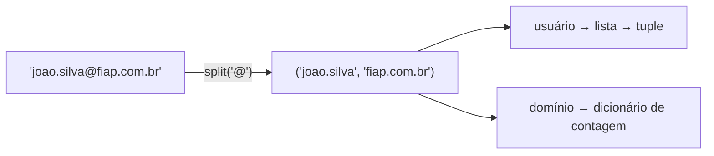

<!--META
{
  "title": "Dicionários e Tuplas",
  "header": "Dicionários e Tuplas",
  "tema": "Dicionários como mapeamentos chave-valor (dict(), inserção, operador in, values), dicionário como coleção de contadores (histograma de letras), tuplas como sequências imutáveis e atribuição de tupla, com o desafio “Analisador de e-mails da FIAP”.",
  "typing": ["eng2sp['one'] = 'uno'", "'uno' in eng2sp.values()", "contagem[c] = contagem.get(c, 0) + 1", "a, b = b, a (atribuição de tupla)"],
  "tecnologias": "Python 3",
  "tipo": "Aula prática com desafio",
  "professor": "Prof. Alexandre Russi Junior",
  "badges": [["Linguagem", "Python", "FF781F", "python"], ["Estruturas", "dict · tuple", "FF4500"], ["Desafio", "Analisador de e-mails", "E60000"]],
  "icons": "py",
  "icons_alt": "Python",
  "limitacoes": "Os slides trazem aviso de direitos autorais; o conteúdo é explicado com redação própria. O código aparece em imagens, lidas visualmente. O desafio não tem gabarito: a solução é proposta e executada; uma ambiguidade do enunciado é comentada.",
  "files": {
    "PCP - Aula 07 - Dicionários e Tuplas.pdf": "Slides (12 páginas): dicionários (criação, inserção, operador in, values), dicionário como coleção de contadores, tuplas imutáveis e o desafio “Analisador de e-mails da FIAP” com dicas."
  }
}
META-->

<br />

<h2 id="visao-geral">Visão geral</h2>

Duas novas estruturas completam as coleções básicas de Python:

| Estrutura | Índices | Mutável? | Uso típico |
| :--- | :--- | :---: | :--- |
| Lista | Inteiros (0, 1, 2…) | Sim | Sequência de itens |
| **Dicionário** | **Chaves** de (quase) qualquer tipo | Sim | Mapeamento chave → valor |
| **Tupla** | Inteiros | **Não** | Registro fixo, retorno múltiplo, troca de variáveis |

<br />

<h2 id="objetivos">Objetivos de aprendizagem</h2>

- Criar dicionários, inserir e consultar pares chave-valor.
- Usar `in` com chaves e com `values()`.
- Contar ocorrências com dicionários.
- Criar tuplas, entender a imutabilidade e usar a atribuição de tupla.

<br />

<h2 id="pre-requisitos">Pré-requisitos</h2>

- [Aula 07](../aula07-26-04-26/README.md): listas e índices.

<br />

<h2 id="fundamentacao-teorica">Fundamentação teórica</h2>

### 1. Dicionários

Um dicionário é um **mapeamento**: um conjunto de **chaves**, cada uma associada a um único **valor**. Cada associação é um **item** (par chave-valor).

| Operação | Código | Observação |
| :--- | :--- | :--- |
| Criar vazio | `dict()` ou `{}` | Evite usar `dict` como nome de variável |
| Inserir ou alterar | `d['one'] = 'uno'` | |
| Ler | `d['one']` ou `d.get('one', padrão)` | `get` não gera erro se a chave faltar |
| Testar chave | `'one' in d` | O `in` verifica **chaves**, e não valores |
| Testar valor | `'uno' in d.values()` | |

### 2. Três formas de contar letras (slides)

1. 26 variáveis, uma por letra, com condicionais encadeadas.
2. Uma lista de 26 posições, convertendo letras em índices com `ord`.
3. **Um dicionário** com as letras como chaves e os contadores como valores.

A terceira é a mais simples e só ocupa espaço com as letras que **realmente** aparecem. Mesmo cálculo, **implementações** diferentes, e algumas são melhores que outras.

### 3. Tuplas

Uma tupla é uma sequência de valores separados por vírgulas, indexada como uma lista, mas **imutável**. A **atribuição de tupla** permite trocar valores sem variável temporária: `a, b = b, a`.



*Figura 1 — O desafio combina `split`, tuplas e dicionários.*

<br />

<h2 id="exemplos-praticos">Exemplos práticos</h2>

### Exemplo básico — dicionários, histograma e tuplas

```python
{{include:pcp/dicionarios.py}}
```

Saída esperada:

```text
{{include:pcp/dicionarios.out}}
```

### Exemplo aplicado — "Analisador de e-mails da FIAP"

Solução proposta, com a entrada de exemplo do slide fixada no código:

```python
{{include:pcp/emails.py}}
```

Saída esperada:

```text
{{include:pcp/emails.out}}
```

<br />

<h2 id="exercicios-resolvidos">Exercícios e resoluções comentadas</h2>

A solução acima é **proposta para estudo**: o material traz a saída esperada, mas não o código.

> [!NOTE]
> **Dois detalhes do enunciado.**
>
> - O relatório de exemplo mostra os usuários em **ordem alfabética**, embora a entrada esteja em outra ordem. A solução ordena com `sorted` para reproduzir o exemplo.
> - O enunciado pede para "trocar a ordem do primeiro e do último" na **tupla**, mas tuplas são **imutáveis**: `t[0] = ...` gera `TypeError`. A troca é feita numa lista com atribuição de tupla (`lista[0], lista[-1] = lista[-1], lista[0]`), convertida depois em uma nova tupla.

**Exercício proposto para estudo:** conte quantas palavras de uma frase começam com cada letra.

<details>
<summary><strong>Solução proposta para estudo</strong></summary>

```python
frase = "Python para pessoas que programam pela primeira vez"
iniciais = {}
for palavra in frase.lower().split():
    iniciais[palavra[0]] = iniciais.get(palavra[0], 0) + 1
print(iniciais)
```

Saída esperada:

```text
{'p': 6, 'q': 1, 'v': 1}
```

</details>

<br />

<h2 id="aplicacoes">Aplicações no mercado de trabalho</h2>

- **JSON e APIs:** respostas de APIs viram dicionários em Python; o Mini CRM da [aula 11](../aula11-09-09-26/README.md) grava leads em JSON.
- **Contagens e agregações:** frequência de palavras, e-mails por domínio, vendas por produto.
- **Tuplas:** retorno de múltiplos valores por funções e chaves compostas em dicionários.

<br />

<h2 id="boas-praticas">Boas práticas e erros comuns</h2>

| Problemático | Recomendado | Motivo |
| :--- | :--- | :--- |
| `d[chave] += 1` sem a chave existir | `d.get(chave, 0) + 1` | Evita `KeyError` |
| `valor in d` para procurar um valor | `valor in d.values()` | `in` testa chaves |
| Nomear uma variável `dict` | Nomes como `contagem` ou `eng2sp` | Esconde a função integrada |
| Tentar alterar uma tupla | Criar uma nova tupla ou usar lista | Tuplas são imutáveis |
| Dividir e-mails sem `strip()` | `email.strip().split("@")` | A entrada separada por ", " deixa espaços |

<br />

<h2 id="resumo">Resumo para revisão</h2>

- `dict`: chave → valor; `in` testa chaves; `.get`, `.values()`, `.items()`.
- Contagem: `d[k] = d.get(k, 0) + 1`.
- `tuple`: sequência imutável; `a, b = b, a` troca valores.

<br />

<h2 id="questoes">Questões de fixação</h2>

1. O que `{"a": 1, "b": 2}.get("c", 0)` devolve?
2. `(1, 2, 3)[1] = 5` funciona?
3. Como percorrer chaves e valores de um dicionário ao mesmo tempo?

<details>
<summary><strong>Respostas comentadas</strong></summary>

1. `0`, o valor padrão, pois a chave `"c"` não existe.
2. Não: gera `TypeError`, porque tuplas são imutáveis.
3. `for chave, valor in d.items():`.

</details>

<br />

<h2 id="referencias">Referências e materiais complementares</h2>

- [Python — dicionários](https://docs.python.org/pt-br/3/tutorial/datastructures.html#dictionaries) · [tuplas](https://docs.python.org/pt-br/3/tutorial/datastructures.html#tuples-and-sequences)
- Material da pasta: [slides](PCP%20-%20Aula%2007%20-%20Dicion%C3%A1rios%20e%20Tuplas.pdf)
