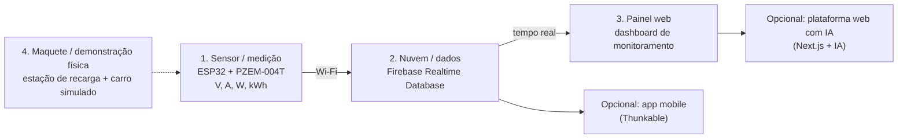

<!--META
{
  "title": "Extra: Dicas para o Challenge GoodWe",
  "header": "Challenge GoodWe: Dicas",
  "tema": "Material extra com o calendário do Challenge GoodWe, referências em vídeo (ESP32 e PZEM-004T para medição de energia, Firebase Realtime Database, Next.js com IA, Thunkable), o infográfico “Protótipo Inspirador — Arquitetura Possível do Projeto” com critérios de pontuação do pitch e o aviso de entrega do vídeo.",
  "typing": ["Sensor → nuvem → painel em tempo real", "ESP32 + PZEM-004T: V, A, W, kWh", "Pitch de até 3 minutos", "Atendimento ao desafio: 45 pontos"],
  "tecnologias": "ESP32, PZEM-004T, Firebase Realtime Database, Next.js, Thunkable (referências); Python 3 (simulação)",
  "tipo": "Material extra (orientações e referências para o Challenge)",
  "professor": "Prof. Alexandre Russi Junior",
  "badges": [["Projeto", "Challenge GoodWe", "FF781F"], ["Tema", "IoT e energia", "FF4500"], ["Entrega", "Vídeo pitch 3 min", "E60000"]],
  "icons": "py,firebase,nextjs",
  "icons_alt": "Python, Firebase, Next.js",
  "limitacoes": "O PDF (11 páginas) é composto de capturas de vídeos, um infográfico e links; foi lido visualmente. Os vídeos citados não foram assistidos. O link do formulário institucional de entrega não é reproduzido. O infográfico se declara “referência/possibilidade — não obrigatório”.",
  "files": {
    "PCP - Extra - Challenge GoodWe Dicas.pdf": "Material extra (11 páginas): calendário de mentorias e bancas, vídeos de referência (ESP32, PZEM-004T, Firebase, Next.js com IA, Thunkable), infográfico de arquitetura possível com critérios de pontuação do pitch e indicação do formulário da 1ª entrega."
  }
}
META-->

<br />

<h2 id="visao-geral">Visão geral</h2>

O **Challenge** do 2º semestre é um desafio proposto pela **GoodWe**, empresa de soluções de energia e carregadores de veículos elétricos. Este material reúne **inspirações técnicas** e as **regras do *pitch***.

| Marco (sujeito a modificação) | Data |
| :--- | :--- |
| Mentorias já realizadas | 13/05 (remota), 23 e 25/06 (presenciais) |
| Entrega do vídeo *pitch*/técnico (até 3 min) | 28/08, até 23h59 |
| Banca remota (classificação para o NEXT) | semana de 28/09 |
| Banca presencial (TOP 3) | semana de 19/10 |

<br />

<h2 id="objetivos">Objetivos de aprendizagem</h2>

- Entender uma arquitetura IoT típica: sensor, nuvem e painel.
- Relacionar grandezas elétricas (tensão, corrente, potência e energia) ao que o sensor mede.
- Conhecer os critérios de avaliação do *pitch* e planejar a apresentação.

<br />

<h2 id="pre-requisitos">Pré-requisitos</h2>

- [Aula 08](../aula08-03-08-26/README.md): avisos e calendário do 2º semestre.
- [Aula 06](../aula06-24-04-26/README.md): organização ágil da equipe.

<br />

<h2 id="fundamentacao-teorica">Fundamentação teórica</h2>

### 1. Arquitetura possível (infográfico "Protótipo Inspirador")

O infográfico se apresenta como **referência, não obrigatória**:



*Figura 1 — Arquitetura sugerida no infográfico. Também é opcional usar dados reais exportados do carregador GoodWe da FIAP.*

### 2. Grandezas medidas

O medidor PZEM-004T fornece **tensão** (V), **corrente** (A), **potência** (W) e **energia** (kWh):

$$P = V \cdot I \qquad E = P \cdot \Delta t$$

O painel do infográfico mostra 229 V, 32,3 A e 7,4 kW, valores coerentes entre si, porque $229 \times 32{,}3 \approx 7{,}4$ kW.

### 3. O que mais pontua no *pitch*

| Critério | Pontos |
| :--- | :---: |
| Atendimento ao desafio GoodWe (gerenciamento inteligente da demanda de potência; sistema de cobrança das recargas; gerenciamento da recarga + interface para o usuário, 15 pts cada) | 45 |
| Aplicabilidade da solução | 15 |
| Inovação e diferencial | 15 |
| Evolução e maturidade do projeto | 15 |
| Clareza e objetividade do *pitch* | 10 |
| **Total** | **100** |

**Dicas do infográfico:** mostre algo funcionando, simule o mundo real, explique o valor para a empresa e o usuário, use maquete, *dashboard* ou fluxo funcional e seja claro, objetivo e visual.

### 4. Referências em vídeo indicadas

Monitoramento de energia com ESP32; medidor de energia CA IoT com PZEM-004T e painel web; Firebase Realtime Database com ESP32 e HTML; *playlist* "Full Stack AI NextJs Project"; Thunkable (apps com blocos) e sua integração com o Firebase. Os links estão nos slides.

<br />

<h2 id="exemplos-praticos">Exemplos práticos</h2>

### Exemplo — simulando leituras do medidor em Python

Simulação ilustrativa, que não faz parte do material: leituras por minuto em torno dos valores do infográfico e acúmulo de energia.

```python
{{include:pcp/energia.py}}
```

Saída esperada:

```text
{{include:pcp/energia.out}}
```

Num protótipo real, as leituras viriam do ESP32 e seriam enviadas à nuvem. A lógica de cálculo (potência e energia acumulada) é a mesma.

<br />

<h2 id="exercicios-resolvidos">Exercícios e resoluções comentadas</h2>

O material não traz exercícios. **Exercício proposto para estudo:** quanto custa uma recarga de 40 kWh com tarifa de R$ 0,95/kWh? E quanto tempo leva a 7,4 kW?

<details>
<summary><strong>Solução proposta para estudo</strong></summary>

Custo: $40 \times 0{,}95 =$ **R$ 38,00**. Tempo: $40 / 7{,}4 \approx$ **5,4 h**, supondo potência constante. Esse tipo de cálculo sustenta o item "sistema de cobrança das recargas" do desafio.

</details>

<br />

<h2 id="aplicacoes">Aplicações no mercado de trabalho</h2>

- **IoT e energia:** medição inteligente, gestão de demanda e carregadores de veículos elétricos são áreas em expansão.
- **Arquiteturas em tempo real:** o padrão sensor → nuvem → painel aparece em indústria, *smart buildings* e cidades inteligentes.
- **Comunicação técnica:** *pitches* curtos e objetivos são usados em *startups*, *hackathons* e apresentações a investidores.

<br />

<h2 id="boas-praticas">Boas práticas e erros comuns</h2>

| Problemático | Recomendado |
| :--- | :--- |
| *Pitch* só com slides | Mostrar algo **funcionando** (demonstração, *dashboard*, maquete) |
| Ignorar os critérios | Distribuir o esforço conforme os pontos (45 no atendimento ao desafio) |
| Escopo grande demais | Começar pelo fluxo mínimo (medição → dados → painel) e evoluir |
| Passar dos 3 minutos | Ensaiar e cronometrar |

<br />

<h2 id="resumo">Resumo para revisão</h2>

- Arquitetura sugerida: ESP32 + PZEM-004T → Firebase → painel web; app e IA opcionais; maquete como diferencial.
- $P = V \cdot I$; $E = P \cdot \Delta t$.
- *Pitch* de até 3 min, entregue até 28/08; 100 pontos, 45 deles no atendimento ao desafio.

<br />

<h2 id="questoes">Questões de fixação</h2>

1. Quais grandezas o PZEM-004T mede?
2. Qual critério do *pitch* vale mais pontos?
3. Qual a potência para 220 V e 10 A?

<details>
<summary><strong>Respostas comentadas</strong></summary>

1. Tensão, corrente, potência e energia.
2. O atendimento ao desafio GoodWe (45 pontos).
3. $220 \times 10 = 2200$ W $= 2{,}2$ kW.

</details>

<br />

<h2 id="referencias">Referências e materiais complementares</h2>

- [Firebase Realtime Database](https://firebase.google.com/docs/database)
- [Thunkable](https://thunkable.com/)
- Material da pasta: [dicas do Challenge](PCP%20-%20Extra%20-%20Challenge%20GoodWe%20Dicas.pdf)
