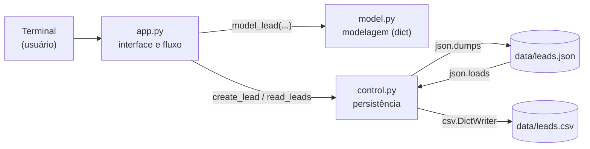

<!--META
{
  "title": "Modularização e Arquivos: Mini CRM de Leads",
  "header": "Mini CRM com Python",
  "tema": "Construção de um Mini CRM de leads em Python modular: separação em interface (app.py), modelagem (model.py) e persistência (control.py), menu com while True, dicionários como modelo de dados, JSON como formato de persistência, pathlib, tratamento de JSONDecodeError, busca e exportação para CSV.",
  "typing": ["app.py → model.py → control.py → leads.json", "json.dumps / json.loads", "Path(__file__).resolve().parent / 'data'", "CRUD: create, read, update, delete"],
  "tecnologias": "Python 3 (json, csv, pathlib, datetime)",
  "tipo": "Aula prática com projeto de código",
  "professor": "Prof. Alexandre Russi Junior",
  "badges": [["Linguagem", "Python", "FF781F", "python"], ["Arquitetura", "Modularização", "FF4500"], ["Persistência", "JSON e CSV", "E60000"]],
  "icons": "py",
  "icons_alt": "Python",
  "limitacoes": "Os slides são imagens (infográficos), lidos visualmente. O código da pasta foi lido integralmente e executado numa cópia temporária (o repositório não foi alterado), com entradas simuladas para listar, buscar e exportar. A opção de exportação falha por um erro no código original, documentado abaixo; os arquivos originais não foram corrigidos. A pasta __pycache__ (bytecode gerado) não é documentada.",
  "files": {
    "PCP - Aula 08 - Modularização e Arquivos - Mini CRM.pdf": "Slides (19 páginas): exemplo de CRM real, do código monolítico ao organizado, anatomia do sistema, imports, loop do menu, validação fail fast, dicionários, memória × disco, JSON, repositório, pathlib, tratamento de erros, listagem formatada e ciclo de vida do dado.",
    "app.py": "Interface do Mini CRM: menu em laço (adicionar, listar, buscar, exportar, sair) e funções que coletam dados e exibem resultados.",
    "control.py": "Persistência: caminho da pasta data com pathlib, leitura e gravação de leads.json (com tratamento de JSONDecodeError), busca por nome ou e-mail e exportação para CSV.",
    "model.py": "Modelagem: função model_lead que monta o dicionário do lead (nome, e-mail, status e data de criação).",
    "data/leads.json": "Base de dados em JSON com dois leads de teste gravados pelo programa.",
    "data/leads.csv": "Arquivo vazio (0 bytes): resultado da tentativa de exportação interrompida pelo erro descrito nesta página."
  }
}
META-->

<br />

<h2 id="visao-geral">Visão geral</h2>

A aula transforma *scripts* isolados num **sistema pequeno e organizado**: um **Mini CRM** (gestão de *leads*, isto é, potenciais clientes). A mensagem central dos slides é sair do **código monolítico**, um único arquivo que faz tudo, para o **código organizado**, em que cada arquivo tem **uma responsabilidade**.



*Figura 1 — Ciclo de vida do dado no Mini CRM. Nos slides, os módulos se chamam `stages.py` e `repo.py`, com a nota "ou: `model.py`" e "ou: `control.py`", os nomes usados no código da pasta.*

<br />

<h2 id="objetivos">Objetivos de aprendizagem</h2>

- Dividir um programa em módulos com responsabilidades claras.
- Modelar registros como dicionários.
- Persistir dados em JSON e exportar para CSV.
- Construir caminhos de arquivo robustos com `pathlib`.
- Tratar erros de leitura (arquivo ausente ou corrompido).

<br />

<h2 id="pre-requisitos">Pré-requisitos</h2>

- [Aula 09](../aula09-10-08-26/README.md): dicionários.
- [Aula 04](../aula04-30-03-26/README.md): funções e módulos; [aula 05](../aula05-04-04-26/README.md): laços.

<br />

<h2 id="fundamentacao-teorica">Fundamentação teórica</h2>

### 1. Conceitos dos slides

| Conceito | No Mini CRM |
| :--- | :--- |
| **Modularização** | `app.py` (interface), `model.py` (modelo), `control.py` (dados) |
| **Importar o próprio código** | `from model import model_lead` e `import control` |
| **`if __name__ == "__main__"`** | Evita que o menu rode ao importar `app.py` em outro módulo |
| **Loop de interação** | `while True` com `if`/`elif` por opção e `break` para sair |
| **Fail fast** | Validar a entrada logo no início; a busca vazia é rejeitada ("Consulta vazia") |
| **Memória × disco** | Na RAM, os dados somem ao fechar o programa; no disco, persistem |
| **JSON** | `json.dumps` serializa (dict → texto); `json.loads` desserializa |
| **Repositório** | `app.py` só pede "salve"; o **como** fica escondido em `control.py` |
| **`pathlib`** | `Path(__file__).resolve().parent / "data"` encontra a pasta independentemente de onde o terminal foi aberto |
| **Tratamento de erros** | `except json.JSONDecodeError: return []`: o sistema sobrevive a um arquivo corrompido |
| **CRUD** | *Create*, *Read*, *Update*, *Delete*; o projeto implementa *Create* e *Read* (com busca) |

### 2. O modelo de dados

```python
from datetime import date

def model_lead(name, email, status):
    return {"name": name, "email": email, "status": status,
            "created": date.today().isoformat()}
```

Exemplo de retorno (a data varia conforme o dia da execução):

<!-- norun -->
```text
{'name': 'Ana', 'email': 'ana@exemplo.com', 'status': 'novo', 'created': '2026-09-10'}
```

<br />

<h2 id="exemplos-praticos">Exemplos práticos</h2>

### Exemplo básico — executando o programa da pasta

Execução de uma **cópia** do código (`app.py`, `control.py`, `model.py` e `leads.json`) com as opções 2 (listar), 3 (buscar "ren") e 4 (exportar):

<!-- norun -->
```text
Escolha uma opção: ## | Nome       | E-mail
00 | Alexandre  | a@b.com
01 | renan      | e@e.com
...
Escolha uma opção: Buscar por: ## | Nome       | E-mail
01 | renan      | e@e.com
...
Escolha uma opção: Traceback (most recent call last):
  ...
  File ".../control.py", line 52, in export_csv
    writer = csv.DictWriter(file_csv, lead[0].keys())
NameError: name 'lead' is not defined. Did you mean: 'leads'?
```

> [!WARNING]
> **Erro na exportação (`control.py`, linha 52).** O código usa `lead[0].keys()`, mas a variável se chama `leads`. Como o arquivo CSV é aberto **antes** da linha com erro, ele é criado **vazio** e o programa termina com `NameError`, que não é capturado (só `PermissionError` é). Isso explica o `data/leads.csv` de 0 bytes da pasta. A correção sugerida é usar `leads[0].keys()` e tratar a lista vazia antes de abrir o arquivo. O código original **não foi alterado**.

> [!NOTE]
> **Compatibilidade.** `app.py` usa aspas duplas dentro de *f-strings* delimitadas por aspas duplas (`f"## | {"Nome":<10} | E-mail"`). Isso só é válido a partir do **Python 3.12** (PEP 701); em versões anteriores gera `SyntaxError`. A execução acima usou Python 3.13.

### Exemplo aplicado — a lógica de `control.py` com a exportação corrigida

Demonstração autocontida numa pasta temporária, com a mesma lógica do módulo original e a exportação corrigida:

```python
{{include:pcp/crm_demo.py}}
```

Saída esperada:

```text
{{include:pcp/crm_demo.out}}
```

<br />

<h2 id="exercicios-resolvidos">Exercícios e resoluções comentadas</h2>

O material não traz exercícios formais. **Exercício proposto para estudo:** complete o CRUD com uma função `update_status(indice, novo_status)` em `control.py`.

<details>
<summary><strong>Solução proposta para estudo</strong></summary>

<!-- norun -->
```python
# em control.py
def update_status(indice, novo_status):
    leads = read_leads()
    if not 0 <= indice < len(leads):
        return False                      # fail fast: índice inválido
    leads[indice]["status"] = novo_status
    DB_PATH.write_text(json.dumps(leads, ensure_ascii=False, indent=2), encoding="utf-8")
    return True
```

Em `app.py`, uma nova opção do menu pede o índice (mostrado na listagem) e o novo status, e informa se a atualização foi feita. O *Delete* segue o mesmo padrão, com `leads.pop(indice)`.

</details>

<br />

<h2 id="aplicacoes">Aplicações no mercado de trabalho</h2>

- **CRMs reais**, como o mostrado no primeiro slide, organizam *leads* em funis de vendas. O Mini CRM reproduz o núcleo: cadastrar, listar, buscar e exportar.
- **Arquitetura em camadas** (interface, regras e dados) é o padrão de sistemas *web* e de *back-end*, com *frameworks*, APIs e bancos de dados, como indica o slide final "O que realmente construímos hoje?".
- **JSON** é o formato usado por praticamente todas as APIs *web*.

<br />

<h2 id="boas-praticas">Boas práticas e erros comuns</h2>

| Problemático | Recomendado | Motivo |
| :--- | :--- | :--- |
| Um arquivo que faz tudo | Módulos com responsabilidade única | Manutenção e testes |
| Caminhos relativos ao terminal (`"data/leads.json"`) | `Path(__file__).resolve().parent` | Funciona de qualquer diretório |
| Capturar só alguns erros e deixar o programa cair | Tratar os erros previsíveis e testar as opções do menu | O erro da exportação passaria num teste simples |
| Abrir o arquivo de saída antes de validar os dados | Validar (lista vazia?) e só então abrir | Evita arquivos vazios ou corrompidos |
| `json.dumps` sem `ensure_ascii=False` | Manter `ensure_ascii=False` | Preserva acentos legíveis no arquivo |

<br />

<h2 id="resumo">Resumo para revisão</h2>

- Mini CRM: `app.py` (menu e interface) → `model.py` (dicionário do lead) → `control.py` (JSON e CSV).
- `json.dumps`/`json.loads`; `csv.DictWriter`; `pathlib.Path`.
- `if __name__ == "__main__"`; `while True` com `break`; *fail fast*; `try`/`except`.
- Erro conhecido: `lead[0]` → `leads[0]` na exportação.

<br />

<h2 id="questoes">Questões de fixação</h2>

1. Por que separar `control.py` de `app.py`?
2. O que acontece se `leads.json` estiver corrompido?
3. Para que serve `if __name__ == "__main__":`?

<details>
<summary><strong>Respostas comentadas</strong></summary>

1. Para que a interface não precise saber como os dados são salvos: trocar JSON por um banco de dados mudaria só `control.py`.
2. `json.loads` lança `JSONDecodeError`, que é capturado; `read_leads` devolve uma lista vazia e o sistema continua.
3. Para executar `main()` apenas quando o arquivo é rodado diretamente, e não quando é importado por outro módulo.

</details>

<br />

<h2 id="referencias">Referências e materiais complementares</h2>

- [Python — `json`](https://docs.python.org/pt-br/3/library/json.html) · [`csv`](https://docs.python.org/pt-br/3/library/csv.html) · [`pathlib`](https://docs.python.org/pt-br/3/library/pathlib.html)
- [PEP 701 — *f-strings* sintáticas](https://peps.python.org/pep-0701/)
- Materiais da pasta: [slides](PCP%20-%20Aula%2008%20-%20Modulariza%C3%A7%C3%A3o%20e%20Arquivos%20-%20Mini%20CRM.pdf) · [app.py](app.py) · [control.py](control.py) · [model.py](model.py)
