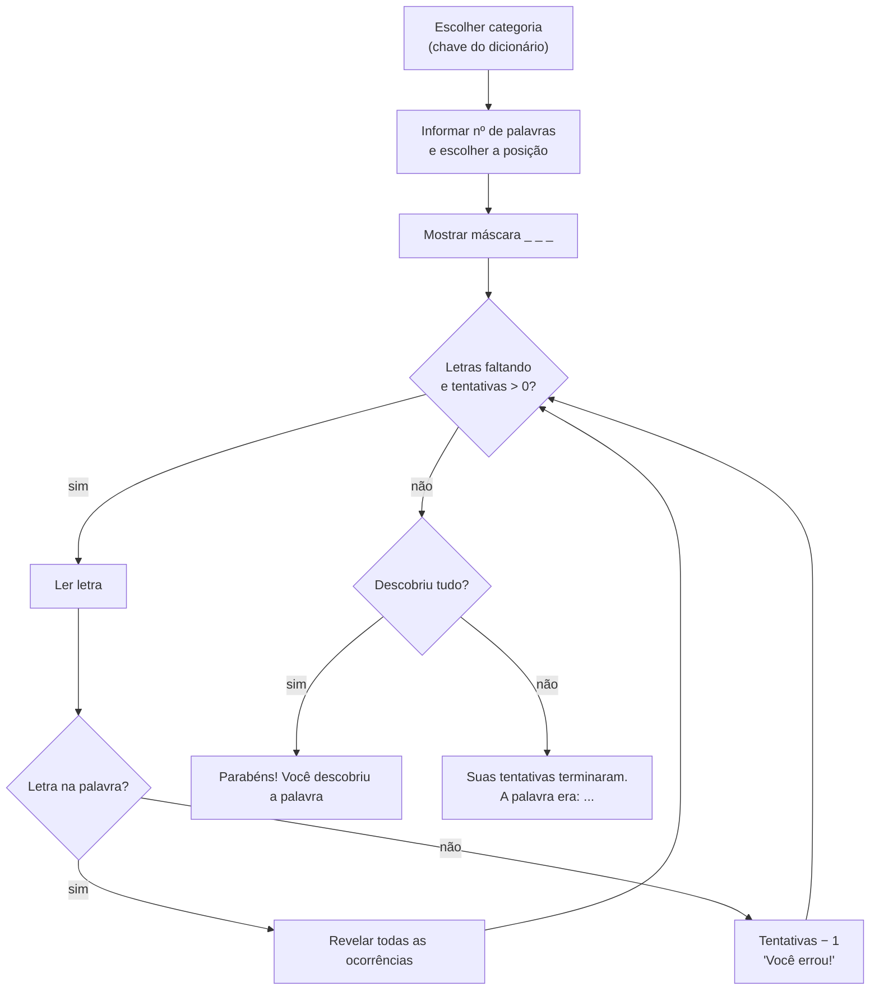

<!--META
{
  "title": "Exercício Extra: Jogo de Adivinhação de Palavras",
  "header": "Jogo de Adivinhação",
  "tema": "Exercício extra integrador: um jogo de adivinhação de palavras (estilo forca) com categorias em dicionário, listas de palavras, escolha por posição, máscara de letras, laço de tentativas e mensagens de vitória ou derrota.",
  "typing": ["palavras = {'frutas': [...], 'cores': [...]}", "Palavra: _ a _ a _ a", "6 tentativas", "Parabéns! Você descobriu a palavra"],
  "tecnologias": "Python 3",
  "tipo": "Exercício extra (enunciado)",
  "professor": "Prof. Alexandre Russi Junior",
  "badges": [["Linguagem", "Python", "FF781F", "python"], ["Integra", "dict · list · while", "FF4500"], ["Tipo", "Desafio prático", "E60000"]],
  "icons": "py",
  "icons_alt": "Python",
  "limitacoes": "O PDF (5 páginas) contém apenas o enunciado, em imagens, lido visualmente; não há código nem gabarito. A solução apresentada é proposta e foi executada com entradas simuladas. Uma inconsistência do exemplo do enunciado é comentada.",
  "files": {
    "PCP - Extra - Jogo da Adivinhação.pdf": "Enunciado do exercício extra (5 páginas): regras do jogo, dicionário de categorias, escolha de categoria e posição, máscara da palavra, seis tentativas e mensagens de vitória e derrota."
  }
}
META-->

<br />

<h2 id="visao-geral">Visão geral</h2>

O exercício extra integra quase tudo do curso até aqui: **dicionários** (categorias), **listas** (palavras), **strings** (máscara de letras), **laços** (rodadas) e **condicionais** (acerto ou erro). O jogo funciona como a forca: o usuário descobre uma palavra escolhendo letras, com **6 tentativas**.



*Figura 1 — Fluxo do jogo segundo o enunciado.*

<br />

<h2 id="objetivos">Objetivos de aprendizagem</h2>

- Organizar dados em um dicionário de listas.
- Controlar um jogo com laço, contador de tentativas e condição de vitória.
- Revelar todas as ocorrências de uma letra numa string.
- Estruturar o programa em função e torná-lo testável.

<br />

<h2 id="pre-requisitos">Pré-requisitos</h2>

- [Aula 09](../aula09-10-08-26/README.md) (dicionários), [aula 07](../aula07-26-04-26/README.md) (listas) e [aula 05](../aula05-04-04-26/README.md) (laços).

<br />

<h2 id="fundamentacao-teorica">Fundamentação teórica</h2>

### Requisitos do enunciado

1. Palavras num **dicionário**, em que a chave é a categoria e o valor, uma lista de palavras. Exemplo: `{"frutas": ["banana", "morango", "abacaxi", "melancia"], "cores": ["azul", "verde", "amarelo", "vermelho"]}`.
2. O usuário escolhe a **categoria**; o programa informa **quantas palavras** ela tem e o usuário escolhe a **posição** da palavra.
3. A palavra **não é exibida**: aparece só uma sequência de `_`, uma por letra.
4. Antes das tentativas: "Você terá 6 tentativas para descobrir a palavra."
5. A cada rodada: mostrar a palavra com as letras descobertas, as tentativas restantes, pedir uma letra e verificar se ela está na palavra.
6. Acerto: revelar **todas** as ocorrências (com "banana" e a letra `a`: `_ a _ a _ a`). Erro: descontar uma tentativa ("Você errou! Tentativas restantes: 5").
7. O jogo continua enquanto houver letras a descobrir e tentativas disponíveis. As mensagens finais são "Parabéns! Você descobriu a palavra: banana" ou "Suas 6 tentativas terminaram. A palavra era: banana".

### Ideia central: conjunto de letras descobertas

Guardar as letras certas num **conjunto** (`set`) facilita tudo:

- a máscara é `" ".join(c if c in descobertas else "_" for c in palavra)`;
- a vitória acontece quando `set(palavra) <= descobertas`, ou seja, todas as letras da palavra já foram descobertas.

<br />

<h2 id="exemplos-praticos">Exemplos práticos</h2>

### Exemplo — solução proposta, com partida simulada

Para que a execução seja reproduzível, `input` é substituído por uma função que devolve respostas pré-definidas (categoria 1, posição 1 = "banana"):

```python
{{include:pcp/adivinhacao.py}}
```

Saída esperada:

```text
{{include:pcp/adivinhacao.out}}
```

Para jogar de verdade, basta chamar `jogar()`, que usa `input` por padrão.

<br />

<h2 id="exercicios-resolvidos">Exercícios e resoluções comentadas</h2>

A solução acima é **proposta para estudo**: o enunciado não traz código.

> [!NOTE]
> **Inconsistências do enunciado.** O texto diz "para uma palavra com **sete** letras", mas o exemplo mostra **seis** traços (`_ _ _ _ _ _`). A mensagem final de derrota aparece como "Suas **6** tentativas terminaram", que só é exata se o número de tentativas não mudar. A solução usa "Suas tentativas terminaram". Além disso, o enunciado não diz se a posição começa em 0 ou em 1. A solução adota **1**, que é mais natural para o usuário, e converte com `- 1`.

**Melhorias propostas para estudo:**

1. Validar a categoria e a posição com laços (entradas fora do intervalo).
2. Não descontar tentativa ao repetir uma letra já tentada.
3. Aceitar apenas **uma** letra por jogada (`len(letra) == 1 and letra.isalpha()`).
4. Sortear a palavra com `random.choice(lista)`, em vez de pedir a posição, para que o próprio jogador não saiba qual é.

<br />

<h2 id="aplicacoes">Aplicações no mercado de trabalho</h2>

- **Lógica de jogos e de estado:** controlar estado (tentativas, letras), regras e condição de término é a base de jogos e sistemas interativos.
- **Testabilidade:** injetar a função de entrada (`ler=...`) é uma técnica de testes automatizados, que substitui dependências externas por versões controladas.

<br />

<h2 id="boas-praticas">Boas práticas e erros comuns</h2>

| Problemático | Recomendado | Motivo |
| :--- | :--- | :--- |
| Mostrar a palavra escolhida | Exibir só a máscara | Requisito do enunciado |
| Revelar só a primeira ocorrência | Revelar todas (`c in descobertas`) | "banana" tem três letras `a` |
| Comparar maiúsculas e minúsculas diretamente | `.lower()` na letra digitada | "A" e "a" são a mesma letra no jogo |
| `input` espalhado pelo código | Uma função de leitura injetável | Permite testar sem digitar |

<br />

<h2 id="resumo">Resumo para revisão</h2>

- Dicionário de listas para as categorias; escolha da posição na lista.
- Máscara com `_`, revelando todas as ocorrências.
- O laço continua enquanto houver letras faltando e tentativas.
- Vitória: `set(palavra) <= descobertas`.

<br />

<h2 id="questoes">Questões de fixação</h2>

1. Como obter as categorias do dicionário `palavras`?
2. Qual a máscara de "morango" após acertar `o`?
3. Por que usar um `set` para as letras descobertas?

<details>
<summary><strong>Respostas comentadas</strong></summary>

1. `list(palavras)` ou `palavras.keys()`.
2. `_ o _ _ _ _ o`.
3. Porque o teste de pertinência é rápido, as letras não se repetem e a comparação `set(palavra) <= descobertas` resolve a condição de vitória.

</details>

<br />

<h2 id="referencias">Referências e materiais complementares</h2>

- [Python — conjuntos (`set`)](https://docs.python.org/pt-br/3/tutorial/datastructures.html#sets)
- Material da pasta: [enunciado](PCP%20-%20Extra%20-%20Jogo%20da%20Adivinha%C3%A7%C3%A3o.pdf)
