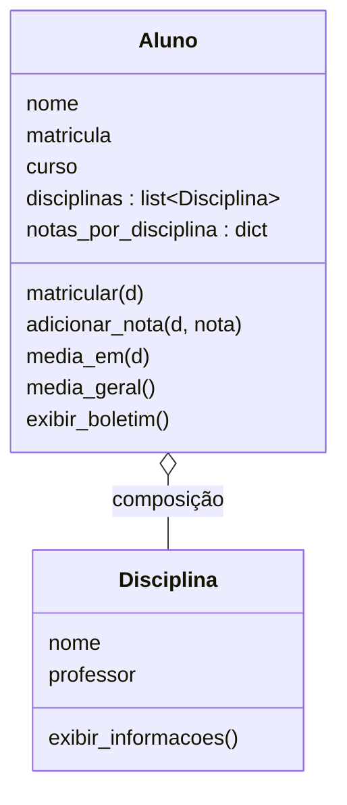

<!--META
{
  "title": "Orientação a Objetos: Aluno e Disciplina",
  "header": "Orientação a Objetos",
  "tema": "Introdução à orientação a objetos com o exemplo Aluno e Disciplina: classe, objeto, atributo, método e composição; matrícula, registro de notas por disciplina, médias por disciplina e geral e boletim; código desenvolvido em aula em três módulos.",
  "typing": ["Classe: molde; objeto: instância", "self.notas_por_disciplina = {}", "Aluno TEM Disciplinas (composição)", "aluno1.exibir_boletim()"],
  "tecnologias": "Python 3",
  "tipo": "Aula prática com código",
  "professor": "Prof. Alexandre Russi Junior",
  "badges": [["Linguagem", "Python", "FF781F", "python"], ["Paradigma", "Orientação a objetos", "FF4500"], ["Conceito", "Composição", "E60000"]],
  "icons": "py",
  "icons_alt": "Python",
  "limitacoes": "Os slides mostram o código como imagem, lido visualmente. Os arquivos da pasta são a versão desenvolvida em aula, mais simples que a dos slides; ambos foram analisados, e os arquivos foram executados numa cópia temporária (o repositório não foi alterado). As diferenças e dois comportamentos inesperados estão documentados. A pasta __pycache__ (bytecode) não é documentada.",
  "files": {
    "PCP - Aula 10 - Orientação a Objetos.pdf": "Slides (15 páginas): problema do mundo real, conceitos-chave, classes Disciplina e Aluno, métodos de matrícula e notas, cálculo de médias, composição, app de demonstração com boletim e mapa mental.",
    "aluno.py": "Classe Aluno (versão de aula): nome, RM, curso, lista de disciplinas, dicionário de notas por disciplina, matricular, adicionar_nota e calcular_media_d.",
    "disciplina.py": "Classe Disciplina (nome, professor, exibir_info) com um trecho de teste no nível do módulo marcado como “temporário”.",
    "app.py": "Demonstração: cria um aluno e duas disciplinas, matricula, adiciona notas e imprime a média em Modelagem Linear."
  }
}
META-->

<br />

<h2 id="visao-geral">Visão geral</h2>

A **orientação a objetos** (OO) organiza o programa em torno de **objetos** que reúnem **dados** (atributos) e **comportamentos** (métodos). O problema motivador é representar:

- **alunos**, com nome, matrícula e curso;
- **disciplinas**, com nome e professor;
- **notas**, que pertencem ao aluno em cada disciplina.



*Figura 1 — Diagrama de classes da versão dos slides. A disciplina não guarda notas: quem sabe o desempenho é o aluno.*

<br />

<h2 id="objetivos">Objetivos de aprendizagem</h2>

- Diferenciar classe e objeto, atributo e método.
- Escrever classes com `__init__` e métodos que usam `self`.
- Aplicar **composição**: um objeto que contém outros.
- Organizar classes em módulos e importá-las.

<br />

<h2 id="pre-requisitos">Pré-requisitos</h2>

- [Aula 09](../aula09-10-08-26/README.md) (dicionários) e [aula 11](../aula11-09-09-26/README.md) (módulos e `import`).

<br />

<h2 id="fundamentacao-teorica">Fundamentação teórica</h2>

### 1. Conceitos-chave

| Conceito | Significado | No exemplo |
| :--- | :--- | :--- |
| **Classe** | Molde | `Aluno`, `Disciplina` |
| **Objeto** | Instância concreta | `aluno1`, `mat` |
| **Atributo** | Estado (dados) do objeto | `nome`, `notas_por_disciplina` |
| **Método** | Comportamento (ação) | `adicionar_nota`, `media_em` |
| **Composição** | Objeto que contém outros | O aluno tem uma lista de `Disciplina` |

### 2. As duas estruturas do Aluno

- `disciplinas`: lista de **objetos** `Disciplina` (em quais está matriculado);
- `notas_por_disciplina`: **dicionário** do nome da disciplina para a lista de notas, por exemplo `{"Matemática": [8.0, 6.5], "Física": [9.0]}`.

`setdefault(nome, [])` cria a lista vazia **só se** a chave ainda não existir.

### 3. Versão dos slides × versão da pasta

| Recurso | Slides | Arquivos da pasta (aula) |
| :--- | :--- | :--- |
| Atributo de matrícula | `matricula` | `rm` |
| `adicionar_nota` em disciplina não matriculada | **Matricula automaticamente** | Gera `KeyError` |
| Médias | `media_em` e `media_geral` | Só `calcular_media_d` |
| Boletim | `exibir_boletim` | Não implementado |
| Método da disciplina | `exibir_informacoes` | `exibir_info` |

<br />

<h2 id="exemplos-praticos">Exemplos práticos</h2>

### Exemplo básico — executando os arquivos da pasta

`python3 app.py`, executado numa cópia dos arquivos, produziu:

<!-- norun -->
```text
Disciplina: Modelagem matemática | Professor: Igor
4.0
```

- **4.0** é a média de Modelagem Linear, $(5 + 3)/2$, o resultado esperado de `app.py`.
- A **primeira linha** não vem de `app.py`: `disciplina.py` tem, no nível do módulo, um trecho marcado como `# temporário` (`model_mat = Disciplina(...)` e `model_mat.exibir_info()`). Esse código executa sempre que o módulo é **importado**.

> [!NOTE]
> Na versão da pasta, `adicionar_nota` numa disciplina em que o aluno **não** foi matriculado gera `KeyError` (testado: `KeyError: 'Física'`). Isso acontece porque a lista de notas só é criada em `matricular`. A versão dos slides trata o caso matriculando antes. Os arquivos originais não foram alterados.

### Exemplo aplicado — a versão completa dos slides

Transcrição própria das classes mostradas nos slides, num único arquivo, com o app de demonstração:

```python
{{include:pcp/boletim.py}}
```

Saída esperada:

```text
{{include:pcp/boletim.out}}
```

<br />

<h2 id="exercicios-resolvidos">Exercícios e resoluções comentadas</h2>

O material não traz exercícios. **Exercício proposto para estudo:** adicione à classe `Aluno` um método `situacao(disciplina)` que devolva "Aprovado" (média ≥ 6) ou "Reprovado", e use-o no boletim.

<details>
<summary><strong>Solução proposta para estudo</strong></summary>

<!-- norun -->
```python
    def situacao(self, disciplina):
        return "Aprovado" if self.media_em(disciplina) >= 6 else "Reprovado"

    # em exibir_boletim, dentro do laço:
    print(f"  Situação: {self.situacao(d)}")
```

O método reutiliza `media_em`, sem duplicar o cálculo. A regra de aprovação fica num só lugar.

</details>

**Observação sobre `media_geral` (slides):** o código dos slides inclui na média geral apenas médias `> 0`, para considerar só disciplinas com notas. Um aluno que tirou **zero** de fato numa disciplina também seria excluído. A transcrição acima testa a existência de notas (`if self.notas_por_disciplina.get(d.nome)`), o que evita essa distorção.

<br />

<h2 id="aplicacoes">Aplicações no mercado de trabalho</h2>

- **Sistemas corporativos** modelam o domínio com classes (Cliente, Pedido, Produto) e suas relações de composição.
- ***Frameworks*** como Django e SQLAlchemy mapeiam classes Python para tabelas de banco de dados (ORM).
- **Testabilidade:** objetos com responsabilidades claras são mais fáceis de testar isoladamente.

<br />

<h2 id="boas-praticas">Boas práticas e erros comuns</h2>

| Problemático | Recomendado | Motivo |
| :--- | :--- | :--- |
| Código de teste solto no módulo (`# temporário`) | Proteger com `if __name__ == "__main__":` | Não executa ao importar |
| Acessar `dicionario[chave]` sem garantir a chave | `setdefault` ou verificar antes | Evita `KeyError` |
| Guardar notas dentro de `Disciplina` | Guardar no `Aluno` | Uma disciplina tem muitos alunos |
| Repetir cálculos em vários métodos | Reutilizar métodos (`media_em`) | Uma regra, um lugar |

<br />

<h2 id="resumo">Resumo para revisão</h2>

- Classe = molde; objeto = instância; atributos = estado; métodos = comportamento.
- `__init__` inicializa os atributos; `self` é o próprio objeto.
- Composição: `Aluno` contém objetos `Disciplina`; as notas ficam no aluno, por disciplina.
- Código de módulo fora de `if __name__ == "__main__"` executa na importação.

<br />

<h2 id="questoes">Questões de fixação</h2>

1. Qual a diferença entre classe e objeto?
2. Por que as notas ficam no `Aluno` e não na `Disciplina`?
3. O que faz `self.notas_por_disciplina.setdefault("Física", [])`?

<details>
<summary><strong>Respostas comentadas</strong></summary>

1. A classe é o molde, que define atributos e métodos; o objeto é uma instância concreta criada a partir dele.
2. Porque a nota é um dado do desempenho de um aluno específico, e uma disciplina é compartilhada por vários alunos.
3. Cria a chave "Física" com uma lista vazia **se ela não existir**; se existir, mantém a lista atual.

</details>

<br />

<h2 id="referencias">Referências e materiais complementares</h2>

- [Python — classes](https://docs.python.org/pt-br/3/tutorial/classes.html)
- Materiais da pasta: [slides](PCP%20-%20Aula%2010%20-%20Orienta%C3%A7%C3%A3o%20a%20Objetos.pdf) · [aluno.py](aluno.py) · [disciplina.py](disciplina.py) · [app.py](app.py)
