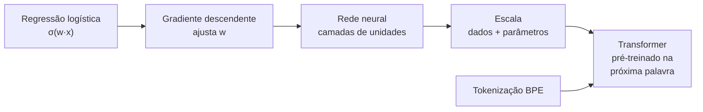

<!--META
{
  "title": "Large Language Models: da Regressão Logística aos Transformers",
  "header": "Large Language Models",
  "tema": "O caminho até os LLMs: regressão logística e a função sigmoide, treinamento por gradiente descendente, redes neurais (feedforward e backpropagation), escala de dados e parâmetros, pré-treinamento por previsão da próxima palavra, a arquitetura Transformer, tokenização por Byte Pair Encoding (BPE) e um playground de LLM.",
  "typing": ["σ(z) = 1 / (1 + e^(−z))", "Gradiente descendente: um passo morro abaixo", "Pré-treinamento: prever a próxima palavra", "BPE: A A C → A AC"],
  "tecnologias": "Conceitual (slides); Python 3 nos exemplos desta página",
  "tipo": "Aula expositiva",
  "professor": "José Maia Neto (nome registrado nos metadados do arquivo)",
  "badges": [["Tema", "LLMs", "FF781F"], ["Algoritmo", "Gradiente descendente", "FF4500"], ["Tokenização", "BPE", "E60000"]],
  "icons": "py",
  "icons_alt": "Python",
  "limitacoes": "O PDF (16 páginas) tem fórmulas, diagramas e a arquitetura Transformer em imagem, lidos visualmente. O notebook do “LLM Playground” é um link externo para o Google Colab, não está no repositório e não foi analisado. A tarefa do livro ISLP não é reproduzida. Os exemplos desta página são implementações próprias, sem bibliotecas de IA.",
  "files": {
    "Inteligencia_computacional_prompt_03 2.pdf": "Slides “Large Language Models” (16 páginas): regressão logística (sigmoide e gradiente descendente), redes neurais, a escala move a IA, GPT-4, LLMs e IA generativa, pré-treinamento, Transformers, tokenização BPE, LLM Playground e a tarefa de leitura."
  }
}
META-->

<br />

<h2 id="visao-geral">Visão geral</h2>

A aula liga o aprendizado estatístico da [aula 02](../aula02-20-03-26/README.md) aos **LLMs**. O percurso começa num classificador simples, a **regressão logística**, e passa pelo **gradiente descendente**, que a treina. Depois vêm as **redes neurais**, que empilham muitas unidades desse tipo, e a **escala**, ou seja, mais camadas, mais dados e mais parâmetros. O ponto de chegada são os **Transformers**, a arquitetura dos LLMs, que leem texto em **tokens**.



*Figura 1 — A progressão conceitual dos slides.*

<br />

<h2 id="objetivos">Objetivos de aprendizagem</h2>

- Interpretar a regressão logística como a estimativa de $p(y \mid X)$ com a função sigmoide.
- Descrever o gradiente descendente como minimização iterativa de uma perda.
- Relacionar as redes neurais (*feedforward* e *backpropagation*) à escala dos LLMs.
- Explicar o pré-treinamento por previsão da próxima palavra.
- Executar manualmente a tokenização por BPE.

<br />

<h2 id="pre-requisitos">Pré-requisitos</h2>

- [Aula 02](../aula02-20-03-26/README.md): $\hat{f}$, perda e MSE.
- [Aula 01](../aula01-06-03-26/README.md): a previsão da próxima palavra.

<br />

<h2 id="fundamentacao-teorica">Fundamentação teórica</h2>

### 1. Regressão logística e a sigmoide

Para **classificação**, o modelo estima uma probabilidade, $\hat{f}(X) = p(y \mid X)$. Primeiro combina as entradas linearmente; depois "espreme" o resultado entre 0 e 1:

$$z = w_0 + \sum_{i=1}^{n} w_i x_i \qquad \hat{y} = \sigma(z) = \frac{1}{1 + e^{-z}}$$

No diagrama do slide, as entradas $x_1 \dots x_n$ são ponderadas por $w_1 \dots w_n$, somadas e passadas pela função logística. O resultado é uma probabilidade, como 0,86.

### 2. Gradiente descendente

A perda (*loss*) mede o erro em função dos pesos. O gráfico do slide mostra uma curva em "U": no ponto atual, a **inclinação** (gradiente) indica para onde a perda aumenta. Por isso, dá-se **um passo no sentido oposto**:

$$w \leftarrow w - \eta \, \frac{\partial \text{Loss}}{\partial w}$$

Aqui, $\eta$ é a **taxa de aprendizado**. Os passos se repetem até chegar perto do mínimo ($w_{\min}$, a meta).

### 3. Redes neurais e escala

Uma rede neural conecta camadas de unidades: **entrada**, **ocultas** e **saída**.

- No **processo *feedforward***, a informação vai da entrada à saída e gera a previsão.
- No **processo *backward*** (*backpropagation*), o erro volta pela rede e ajusta os pesos.

Os slides retomam a ideia da escala:

- mais camadas permitem funções mais complexas, como as superfícies cada vez mais dobradas da figura;
- redes mais complexas exigem mais dados;
- o GPT-4 é citado com mais de 200 bilhões de parâmetros e 53 trilhões de palavras, números reproduzidos do slide.

### 4. Pré-treinamento e Transformers

- **Pré-treinamento:** a IA generativa aprende, de forma supervisionada, a **prever a próxima palavra**. Os pares vêm do próprio texto: "Eu adoro comer" → "bolo". Com centenas de bilhões de palavras, obtém-se o LLM que é a base do ChatGPT.
- **Transformer:** é a arquitetura mostrada no slide, com blocos de **atenção multi-cabeça** (*multi-head attention*), camadas *feed forward* e codificação de posição (*positional encoding*). A atenção permite que cada token considere os outros tokens do contexto.

### 5. Tokenização por BPE

LLMs não leem letras nem palavras inteiras, e sim **tokens**. O *Byte Pair Encoding* (BPE) constrói o vocabulário **fundindo o par vizinho mais frequente**, repetidamente. A figura do slide usa o corpus `AACGCACTATATA`:

| Iteração | Corpus | Vocabulário |
| :---: | :--- | :--- |
| 0 | A A C G C A C T A T A T A | {A, T, C, G} |
| 1 | A A C G C A C TA TA TA | {A, T, C, G, TA} |
| 2 | A AC G C AC TA TA TA | {A, T, C, G, TA, AC} |

Os slides indicam o *site* Tiktokenizer, que mostra como um texto é dividido em tokens, e um *notebook* "LLM Playground" no Colab.

<br />

<h2 id="exemplos-praticos">Exemplos práticos</h2>

### Exemplo básico — BPE reproduzindo a figura do slide

```python
{{include:pai/bpe.py}}
```

Saída esperada:

```text
{{include:pai/bpe.out}}
```

As iterações 1 e 2 coincidem com o slide. Na iteração 2 há empate: `AC` e o par `TA TA` aparecem duas vezes cada. A regra adotada aqui escolhe o par que aparece primeiro, o que reproduz a figura. A iteração 3, que no slide aparece como "......", funde `TA TA` em `TATA`.

### Exemplo aplicado — regressão logística treinada por gradiente descendente

Os dados de *churn* da [aula 01](../aula01-06-03-26/README.md) incluem compras e valor gasto em 3 meses. A perda usada é a **log-loss** (entropia cruzada), padrão para a regressão logística:

```python
{{include:pai/logistica.py}}
```

Saída esperada:

```text
{{include:pai/logistica.out}}
```

- A perda começa em $\ln 2 \approx 0{,}6931$, porque, com pesos zero, toda previsão é 0,5.
- A perda cai a cada época: é o "morro abaixo" do slide.
- No fim, as sete previsões coincidem com os rótulos. Com tão poucos dados, isso **não** garante bom desempenho em clientes novos.

<br />

<h2 id="exercicios-resolvidos">Exercícios e resoluções comentadas</h2>

**Tarefa do material:** ler o capítulo 1 do livro ISLP e fazer o *lab* de Python a partir da página 40. O conteúdo do *lab* está no livro e não no repositório.

**Exercícios propostos para estudo:**

1. Calcule $\sigma(0)$, $\sigma(2)$ e $\sigma(-2)$.
2. Aplique uma iteração de BPE ao corpus `abababc`.

<details>
<summary><strong>Solução proposta para estudo</strong></summary>

1. $\sigma(0) = 0{,}5$; $\sigma(2) = 1/(1+e^{-2}) \approx 0{,}881$; $\sigma(-2) \approx 0{,}119$. Note a simetria: $\sigma(-z) = 1 - \sigma(z)$.
2. Os pares são `ab` (3 vezes), `ba` (2) e `bc` (1). Funde-se `ab`, e o corpus fica `ab ab ab c`, com o vocabulário {a, b, c, ab}.

</details>

<br />

<h2 id="aplicacoes">Aplicações no mercado de trabalho</h2>

- **Regressão logística** segue muito usada em crédito, *churn* e risco, por ser simples e interpretável.
- **Tokens** são a unidade de **custo e limite de contexto** nas APIs de LLM. Saber estimar tokens ajuda a orçar e projetar aplicações.
- **Gradiente descendente** e suas variantes treinam praticamente todos os modelos de *deep learning*.

<br />

<h2 id="boas-praticas">Boas práticas e erros comuns</h2>

| Problemático | Recomendado | Motivo |
| :--- | :--- | :--- |
| Taxa de aprendizado grande demais | Ajustar $\eta$ e acompanhar a perda | A perda oscila ou diverge |
| Variáveis em escalas muito diferentes | Normalizar as entradas | Acelera a convergência (no exemplo, divisão por 100) |
| Supor que 1 palavra = 1 token | Medir com um tokenizador | Palavras raras viram vários tokens |
| Avaliar só no treino | Reservar dados de teste | Evita conclusões otimistas |

<br />

<h2 id="resumo">Resumo para revisão</h2>

- Regressão logística: $\hat{y} = \sigma(w_0 + \sum w_i x_i)$, uma probabilidade.
- Gradiente descendente: $w \leftarrow w - \eta \nabla \text{Loss}$, repetido.
- Redes neurais: camadas, *feedforward* e *backpropagation*; a escala exige dados.
- LLM: Transformer pré-treinado para prever a próxima palavra.
- BPE: funde repetidamente o par mais frequente para formar o vocabulário de tokens.

<br />

<h2 id="questoes">Questões de fixação</h2>

1. Por que usar a sigmoide na classificação?
2. O que acontece se a taxa de aprendizado for muito pequena?
3. Qual a diferença entre o *feedforward* e o *backward*?
4. Qual par o BPE funde primeiro em `AACGCACTATATA`, e por quê?

<details>
<summary><strong>Respostas comentadas</strong></summary>

1. Porque transforma qualquer número real numa probabilidade entre 0 e 1.
2. O treino converge, mas muito devagar; são necessárias muitas épocas.
3. O *feedforward* calcula a saída a partir da entrada; o *backward* propaga o erro para trás e calcula os gradientes que ajustam os pesos.
4. `TA`, que aparece três vezes, mais do que qualquer outro par vizinho.

</details>

<br />

<h2 id="referencias">Referências e materiais complementares</h2>

- [ISLP — *An Introduction to Statistical Learning with Applications in Python*](https://hastie.su.domains/ISLP/ISLP_website.pdf.download.html) (link indicado no material)
- [Tiktokenizer](https://tiktokenizer.vercel.app/) (link indicado no material)
- Material da pasta: [slides](Inteligencia_computacional_prompt_03%202.pdf)
