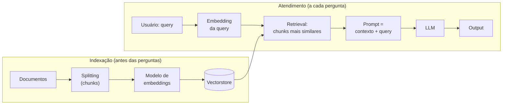

<!--META
{
  "title": "RAG na Prática: Pipeline, Splitting e Recuperação (parte 2)",
  "header": "RAG: Como Funciona",
  "tema": "Retomada de “Embeddings + Gen AI = RAG” com foco no funcionamento: indexação de documentos (splitting em chunks, modelo de embeddings, vectorstore), recuperação por similaridade, montagem do prompt com contexto e pergunta, geração pelo LLM e o efeito do tamanho e da sobreposição dos chunks.",
  "typing": ["Documentos → Embeddings → Vectorstore", "Query → Retrieval → Contexto + Pergunta", "Chunk size e overlap", "LLM → Output"],
  "tecnologias": "Conceitual (slides); Python 3 nos exemplos desta página",
  "tipo": "Aula expositiva com prática indicada",
  "professor": "José Maia Neto (nome registrado nos metadados do arquivo)",
  "badges": [["Arquitetura", "RAG", "FF781F"], ["Etapa", "Splitting", "FF4500"], ["Componente", "Vectorstore", "E60000"]],
  "icons": "py",
  "icons_alt": "Python",
  "limitacoes": "A apresentação desta pasta (generative_ai_05 3.pptx) tem o mesmo texto da apresentação da aula 04 (generative_ai_05 2.pptx); a comparação das páginas renderizadas mostrou apenas uma diferença na imagem de capa. Para não repetir conteúdo, esta página aprofunda o diagrama “RAG: Como funciona?” e o splitting, ferramenta indicada no slide de prática. O notebook do Colab não está no repositório e não foi analisado.",
  "files": {
    "generative_ai_05 3.pptx": "Apresentação “Embeddings + Gen AI = RAG” (8 slides), com o mesmo conteúdo da aula 04: representação de palavras, Embedding Projector, o que é RAG, casos de uso, diagrama do pipeline e links de prática (Colab e visualizador de splitting)."
  }
}
META-->

<br />

<h2 id="visao-geral">Visão geral</h2>

A [aula 04](../aula04-08-05-26/README.md) apresentou os embeddings e a ideia de RAG. Esta aula usa a **mesma apresentação** e se concentra no slide **"RAG: Como funciona?"**, que mostra dois fluxos: a **indexação** dos documentos, feita uma vez, e o **atendimento** de cada pergunta.



*Figura 1 — O diagrama do slide, com o *splitting* explicitado (indicado no slide de prática).*

<br />

<h2 id="objetivos">Objetivos de aprendizagem</h2>

- Descrever as etapas de indexação e de atendimento de um sistema RAG.
- Explicar o papel do *splitting*, do modelo de embeddings e do *vectorstore*.
- Avaliar o efeito do tamanho do *chunk* e da sobreposição.
- Montar um *prompt* aumentado com o contexto recuperado.

<br />

<h2 id="pre-requisitos">Pré-requisitos</h2>

- [Aula 04](../aula04-08-05-26/README.md): embeddings e similaridade de cosseno.

<br />

<h2 id="fundamentacao-teorica">Fundamentação teórica</h2>

### 1. Componentes do diagrama

| Componente | Função |
| :--- | :--- |
| **Documentos** | Base de conhecimento (manuais, FAQ, políticas) |
| **Modelo de embeddings** | Converte cada trecho, e depois a pergunta, em vetor |
| **Vectorstore** | Banco que guarda os vetores e busca os mais similares |
| **Query** | A pergunta do usuário |
| **Retrieval** | Devolve os *k* trechos mais parecidos com a pergunta |
| **Contexto + query (*prompt*)** | Junta os trechos recuperados e a pergunta numa instrução |
| **LLM** | Gera a resposta a partir desse *prompt* |

### 2. *Splitting*: por que fatiar

Documentos longos são divididos em ***chunks***, e o slide de prática indica uma ferramenta para visualizar esse corte. Há três motivos para fatiar:

- o embedding de um texto enorme "dilui" o significado;
- o contexto do LLM é limitado;
- só os trechos relevantes devem ir ao *prompt*.

| Parâmetro | Muito pequeno | Muito grande |
| :--- | :--- | :--- |
| **Tamanho do *chunk*** | Perde o contexto (frase cortada no meio) | Mistura assuntos e consome contexto |
| **Sobreposição (*overlap*)** | Ideias divididas entre dois *chunks* se perdem | Redundância e custo maiores |

### 3. O *prompt* aumentado

A etapa "contexto + query" é a **engenharia de *prompt*** da [aula 01](../aula01-06-03-26/README.md) aplicada:

- instrução clara ("responda usando apenas o contexto");
- delimitação do contexto;
- possibilidade de pedir que a resposta **cite a fonte**, como sugerido nos casos de uso.

<br />

<h2 id="exemplos-praticos">Exemplos práticos</h2>

### Exemplo básico — *chunks* de tamanho fixo, com e sem sobreposição

O texto fatiado é o próprio parágrafo do slide sobre as duas etapas do RAG:

```python
{{include:pai/chunking.py}}
```

Saída esperada:

```text
{{include:pai/chunking.out}}
```

- **Sem sobreposição:** a frase "o sistema vasculha os dados" é cortada entre os *chunks* 1 e 2.
- **Com sobreposição de 4 palavras:** o *chunk* 2 começa repetindo "o sistema vasculha os", e a frase fica inteira num único *chunk*. O custo é um *chunk* a mais.

### Exemplo aplicado — o *pipeline* completo, sem LLM

O exemplo aplicado da [aula 04](../aula04-08-05-26/README.md) percorre as quatro etapas: *splitting* por frase, vetorização, recuperação dos 2 melhores trechos e montagem do *prompt*. Para concluir o RAG, basta enviar o *prompt* final a um LLM. É o que o agente de FAQ da [aula 07](../aula07-11-09-26/README.md) faz com o `FileSearchTool`, que usa um *vector store* gerenciado pela OpenAI.

<br />

<h2 id="exercicios-resolvidos">Exercícios e resoluções comentadas</h2>

O material não traz exercícios; indica a prática num *notebook* do Colab e no visualizador de *splitting*. **Exercício proposto para estudo:** um texto tem 100 palavras. Quantos *chunks* são gerados com tamanho 30 e sobreposição 10, pela função `fatiar` do exemplo?

<details>
<summary><strong>Solução proposta para estudo</strong></summary>

O passo é $30 - 10 = 20$ palavras. Os *chunks* começam nas palavras 0, 20, 40 e 60:

- os três primeiros cobrem 30 palavras cada;
- o que começa em 60 cobre as palavras 60 a 89;
- o seguinte começa em 80 e chega à palavra 99, encerrando o laço.

São **5 *chunks***, com início em 0, 20, 40, 60 e 80. Para conferir, basta executar `len(fatiar(" ".join(["p"] * 100), 30, 10))`.

</details>

<br />

<h2 id="aplicacoes">Aplicações no mercado de trabalho</h2>

- **Atendimento e suporte:** assistentes que respondem com base em manuais e políticas atualizados, sem retreinar o modelo.
- **Jurídico e *compliance*:** perguntas sobre contratos e normas, com citação do trecho.
- **Engenharia de dados para IA:** escolher *chunking*, modelo de embeddings e *vectorstore* é parte do trabalho de quem constrói aplicações com LLM.

<br />

<h2 id="boas-praticas">Boas práticas e erros comuns</h2>

| Problemático | Recomendado | Motivo |
| :--- | :--- | :--- |
| Enviar o documento inteiro ao LLM | Recuperar só os *chunks* relevantes | Custo, limite de contexto e foco |
| *Chunks* sem sobreposição em texto corrido | Usar *overlap* moderado | Evita cortar ideias |
| Deixar o LLM responder sem contexto | Instruir: "use apenas o contexto; se não souber, diga" | Reduz respostas inventadas |
| Não reindexar após mudar documentos | Atualizar o *vectorstore* | Respostas desatualizadas |

<br />

<h2 id="resumo">Resumo para revisão</h2>

- Indexação: documentos → *chunks* → embeddings → *vectorstore*.
- Atendimento: *query* → embedding → *retrieval* → contexto + *query* → LLM → resposta.
- Tamanho e sobreposição dos *chunks* equilibram contexto e custo.
- O *prompt* aumentado aplica a engenharia de *prompt* ao contexto recuperado.

<br />

<h2 id="questoes">Questões de fixação</h2>

1. Quais etapas do RAG acontecem antes de qualquer pergunta?
2. Para que serve a sobreposição entre *chunks*?
3. Por que a pergunta também precisa virar embedding?

<details>
<summary><strong>Respostas comentadas</strong></summary>

1. A indexação: fatiar os documentos, gerar os embeddings e guardá-los no *vectorstore*.
2. Para que uma ideia cortada no limite de um *chunk* apareça inteira em pelo menos um deles.
3. Para que possa ser comparada, no mesmo espaço vetorial, com os embeddings dos *chunks*.

</details>

<br />

<h2 id="referencias">Referências e materiais complementares</h2>

- [ChunkViz](https://chunkviz.up.railway.app/) (visualizador de *splitting* indicado no material)
- [TensorFlow Embedding Projector](https://projector.tensorflow.org/) (link indicado no material)
- Material da pasta: [apresentação](generative_ai_05%203.pptx)
