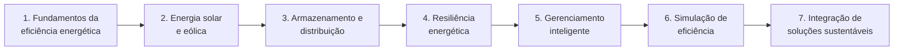

<!--META
{
  "title": "Apresentação da Disciplina e Critérios de Avaliação",
  "header": "Apresentação de SERS",
  "tema": "Aula inaugural: os sete eixos da disciplina (eficiência energética, solar e eólica, armazenamento e distribuição, resiliência, gerenciamento inteligente, simulação e integração), o Energy Innovation Lab, os critérios de avaliação (Checkpoint 20%, Challenge Sprint 20% e Global Solution 60%), a média final e a organização do Challenge.",
  "typing": ["7 eixos, da eficiência à integração", "CP 20% · Sprint 20% · GS 60%", "Média final = 0,4 × MS1 + 0,6 × MS2", "Aprovado com 6,0"],
  "tecnologias": "Conceitual (slides); Python 3 no exemplo desta página",
  "tipo": "Aula expositiva (apresentação da disciplina)",
  "professor": "Prof. André Tritiack (slides)",
  "badges": [["Tipo", "Aula inaugural", "FF781F"], ["Avaliação", "CP · Sprint · GS", "FF4500"], ["Média final", "0,4 MS1 + 0,6 MS2", "E60000"]],
  "icons": "py",
  "icons_alt": "Python",
  "limitacoes": "O PDF (21 páginas) foi lido integralmente, com as páginas renderizadas. Os slides “Portal do Aluno” e “Teams” trazem apenas o título. Os contatos do professor (e-mail e perfil profissional) não são reproduzidos. O PDF tem aviso de direitos autorais, por isso o conteúdo é explicado com redação própria. A forma de combinar os pesos na média semestral e o tratamento da nota exatamente igual a 6,0 são interpretações desta documentação, indicadas no texto.",
  "files": {
    "Aula_00_SERS_2026.pdf": "Slides da aula inaugural (21 páginas): capa, sumário com os sete eixos da disciplina, apresentação do professor, descrição de cada eixo, Energy Innovation Lab (FIAP Aclimação), critérios de avaliação (Checkpoint, Challenge Sprint e Global Solution), detalhes do Challenge, média final e aviso de direitos autorais."
  }
}
META-->

<br />

<h2 id="visao-geral">Visão geral</h2>

A primeira aula de **Soluções em Energias Renováveis e Sustentáveis (SERS)** apresenta a disciplina, o professor e as regras de avaliação. O arquivo se chama "Aula 00": é a aula de abertura, antes do conteúdo técnico.

A disciplina é organizada em **sete eixos**, que vão dos fundamentos de eletricidade até a integração de geração, armazenamento e controle com apoio de dados e *machine learning*:



*Figura 1 — Os sete eixos do sumário da disciplina.*

<br />

<h2 id="objetivos">Objetivos de aprendizagem</h2>

- Conhecer os sete eixos da disciplina e as ferramentas previstas para cada um.
- Entender a composição da nota: Checkpoint, Challenge Sprint e Global Solution.
- Calcular a média semestral e a média final e identificar a situação do aluno.
- Conhecer a organização do Challenge e os recursos do curso (Energy Innovation Lab, Portal do Aluno e Teams).

<br />

<h2 id="pre-requisitos">Pré-requisitos</h2>

- Nenhum. Para o exemplo, basta ler Python básico (funções, listas e `if`).

<br />

<h2 id="fundamentacao-teorica">Fundamentação teórica</h2>

### 1. Os sete eixos da disciplina

| Eixo | O que será feito, segundo os slides | Ferramentas citadas |
| :--- | :--- | :--- |
| 1. Fundamentos da eficiência energética | dominar energia, potência e consumo; medições, cálculo de kWh e análise de custo | planilhas e Python |
| 2. Energia solar e eólica | geração distribuída com dados reais de irradiação e vento; dimensionamento básico e comparação entre geração e demanda | simuladores solares e ferramentas *online* |
| 3. Armazenamento e distribuição | sistemas com baterias e controle de carga; autonomia, picos de consumo e estabilidade | simulações digitais |
| 4. Estratégias de resiliência energética | simular falhas e a reorganização de cargas críticas | planilhas e ambientes de simulação |
| 5. Gerenciamento inteligente de energia | lógicas de controle com sensores virtuais e automação | Python, Wokwi, Tinkercad, ESP32 e Arduino |
| 6. Simulação de eficiência energética | modelagem computacional e comparação de cenários com indicadores | Python e Data Science |
| 7. Integração de soluções sustentáveis | modelos completos de geração, armazenamento e controle; prever consumo | simulações, análise de dados e fundamentos de *machine learning* |

O professor é apresentado como mestre em Automação e Controle de Processos (IFSP), especialista em microcontroladores e Internet das Coisas, *Scrum Master* do 1º ano de Ciência da Computação e tutor do FIAP ON. Os slides também mostram o **Energy Innovation Lab**, laboratório da unidade Aclimação da FIAP.

### 2. Critérios de avaliação

| Componente | Peso na nota semestral | Como funciona |
| :--- | :---: | :--- |
| **Checkpoint** | 20% | três avaliações no semestre (provas, trabalhos, pesquisas ou projetos), individuais ou em grupo; **a menor nota é excluída** |
| **Challenge Sprint** | 20% | dois entregáveis do projeto do Challenge, em grupo; entrega pelo Portal do Aluno, feita só pelo representante |
| **Global Solution** | 60% | projeto individual, em dupla ou em trio, a partir de um desafio de empresas parceiras; no 1º semestre, de 25/05 a 09/06/2026 |

A **média final** combina as médias dos dois semestres:

$$\text{Média final} = 0{,}4 \times MS_1 + 0{,}6 \times MS_2$$

| Média final | Situação |
| :--- | :--- |
| acima de 6,0 | aprovado |
| entre 4,0 e 5,9 | exame |
| entre 0,0 e 3,9 | reprovado |

Como 5,9 já é exame, esta página trata a nota **exatamente 6,0** como aprovação.

### 3. O Challenge

Os professores responsáveis por conduzir o Challenge na turma do 1º ano (os *Scrum Masters*) são o Prof. Alexandre Russi e o Prof. André Tritiack. Durante o processo há **bancas** e **mentorias** com especialistas da empresa parceira, que seria divulgada nas semanas seguintes. Segundo os slides, os melhores grupos se classificam para o **NEXT 2026**, em 24/10/2026, com premiação para os três primeiros. A Global Solution também premia o melhor projeto do 1º ano.

<br />

<h2 id="exemplos-praticos">Exemplos práticos</h2>

### Exemplo aplicado — calculando a média final

O código aplica os pesos dos slides. A combinação "20% da média dos dois melhores *checkpoints* + 20% da média das *sprints* + 60% da Global Solution" é a leitura desta documentação para os percentuais apresentados:

```python
{{include:sers/media.py}}
```

Saída esperada:

```text
{{include:sers/media.out}}
```

No 1º semestre do exemplo, a nota 4,0 do segundo *checkpoint* é descartada. Mesmo com média 5,9 no 2º semestre, a média final é 6,38, porque o 2º semestre pesa 60% e o 1º, 40%.

<br />

<h2 id="exercicios-resolvidos">Exercícios e resoluções comentadas</h2>

O material não traz exercícios. **Exercícios propostos para estudo:**

1. Um aluno tem MS1 = 8,0. Qual é a menor MS2 que garante a aprovação direta?
2. Os *checkpoints* de um semestre foram 3,0, 9,0 e 7,0. Qual é a média de *checkpoint* considerada?
3. Em qual eixo da disciplina entram o ESP32 e o Wokwi, e para quê?

<details>
<summary><strong>Solução proposta para estudo</strong></summary>

1. $0{,}4 \times 8{,}0 + 0{,}6 \times MS_2 \ge 6{,}0 \Rightarrow MS_2 \ge \frac{6{,}0 - 3{,}2}{0{,}6} \approx 4{,}67$.
2. A menor nota (3,0) é excluída: $\frac{9{,}0 + 7{,}0}{2} = 8{,}0$.
3. No eixo 5, sistemas inteligentes de gerenciamento de energia: para desenvolver lógicas de controle com sensores virtuais e automação em simuladores de microcontroladores.

</details>

<br />

<h2 id="aplicacoes">Aplicações no mercado de trabalho</h2>

- **Eficiência energética:** auditorias de consumo, cálculo de kWh e análise de custo são serviços de engenharia e consultoria de energia.
- **Geração distribuída:** dimensionamento de sistemas solares e eólicos é uma das áreas que mais crescem no setor elétrico.
- **IoT e automação:** microcontroladores como ESP32 e Arduino controlam cargas, medem consumo e alimentam sistemas de gerenciamento de energia.
- **Dados e *machine learning*:** previsão de consumo e de geração apoia o planejamento de concessionárias e grandes consumidores.

<br />

<h2 id="boas-praticas">Boas práticas e erros comuns</h2>

| Problemático | Recomendado | Motivo |
| :--- | :--- | :--- |
| Ignorar um *checkpoint* contando com o descarte | Fazer os três | O descarte protege contra imprevistos, mas um zero já ocupa a vaga da menor nota |
| Somar as médias dos dois semestres com o mesmo peso | Aplicar 0,4 e 0,6 | O 2º semestre pesa mais na média final |
| Entregar a *sprint* por vários integrantes | Entregar só pelo representante, no Portal | É a regra apresentada para o Challenge |
| Deixar a Global Solution para o fim do prazo | Planejar o projeto desde a divulgação | Ela vale 60% da nota semestral |

<br />

<h2 id="resumo">Resumo para revisão</h2>

- Sete eixos: eficiência, solar e eólica, armazenamento, resiliência, gerenciamento inteligente, simulação e integração.
- Nota semestral: Checkpoint 20% (descarta a menor de três), Challenge Sprint 20%, Global Solution 60%.
- Média final = 0,4 × MS1 + 0,6 × MS2; aprovação a partir de 6,0, exame de 4,0 a 5,9.
- Ferramentas previstas: planilhas, Python, simuladores, Wokwi, Tinkercad, ESP32 e Arduino.

<br />

<h2 id="questoes">Questões de fixação</h2>

1. Quanto vale a Global Solution na nota semestral?
2. Quantos *checkpoints* entram na média e por quê?
3. Qual semestre pesa mais na média final?
4. Cite duas ferramentas previstas para o eixo de gerenciamento inteligente de energia.

<details>
<summary><strong>Respostas comentadas</strong></summary>

1. 60%.
2. Dois: são três avaliações, e a menor nota é excluída.
3. O 2º semestre, com peso 0,6.
4. Por exemplo: Python e Wokwi (também Tinkercad, ESP32 e Arduino).

</details>

<br />

<h2 id="referencias">Referências e materiais complementares</h2>

- [Wokwi — simulador de microcontroladores](https://wokwi.com/) (ferramenta citada no material)
- [Tinkercad](https://www.tinkercad.com/) (ferramenta citada no material)
- Material da pasta: [slides da aula inaugural](Aula_00_SERS_2026.pdf)
