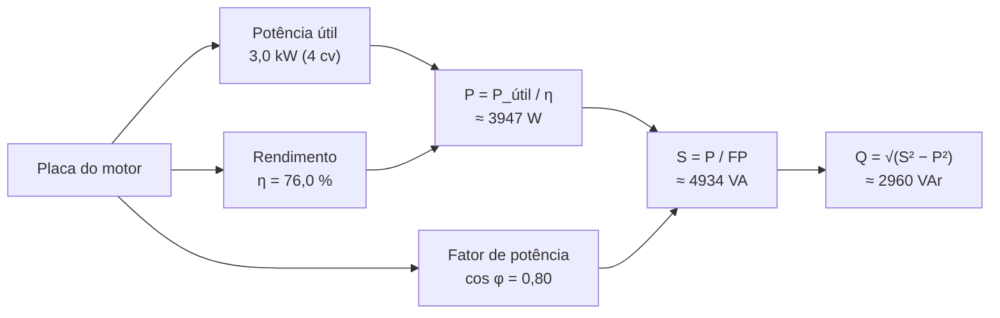

<!--META
{
  "title": "Placa de Identificação de um Motor de Indução Trifásico",
  "header": "Placa de Motor",
  "tema": "Leitura da placa de um motor WEG W22 de 3,0 kW (4 cv): potência, tensões e correntes nominais, rotação, frequência, fator de serviço, relação Ip/In, fator de potência, rendimento, classe de isolamento, grau de proteção, regime, ligações em triângulo e estrela, rolamentos e selos; uso dos dados para calcular as potências ativa, aparente e reativa.",
  "typing": ["3,0 kW (4 cv) · 220/380 V", "η = 76,0 % · cos φ = 0,80", "Δ em 220 V · Y em 380 V", "P = P_útil / η · S = P / FP"],
  "tecnologias": "Conceitual (imagem da placa); Python 3 no exemplo desta página",
  "tipo": "Material de apoio (imagem)",
  "badges": [["Tema", "Motores elétricos", "FF781F"], ["Leitura", "Placa de identificação", "FF4500"], ["Cálculo", "P, S e Q", "E60000"]],
  "icons": "py",
  "icons_alt": "Python",
  "limitacoes": "A pasta contém apenas uma fotografia (640 × 425 pixels), sem slides ou enunciado. Os valores foram lidos visualmente; campos pequenos ou desfocados (números de série, campo ΔT e alguns rótulos) não foram transcritos. A interpretação dos campos segue o uso comum em placas de motores de indução e não foi conferida em catálogo do fabricante. A relação com a atividade da aula seguinte vem do notebook daquela pasta, que usa os mesmos valores de potência, rendimento e fator de potência.",
  "files": {
    "Placa_Motor.jpg": "Fotografia da placa de identificação de um motor de indução trifásico WEG W22: 3,0 kW (4,0 cv), carcaça 90S, 220/380 V, 12,9/7,50 A, 1690 rpm, 60 Hz, FS 1,00, Ip/In 5,5, cos φ 0,80, rendimento 76,0%, classe de isolamento F, IP55, esquemas de ligação em triângulo (220 V) e estrela (380 V), rolamentos 6205-ZZ e 6204-ZZ e massa de 21 kg."
  }
}
META-->

<br />

<h2 id="visao-geral">Visão geral</h2>

O material desta data é uma **fotografia da placa de identificação** de um motor elétrico. A placa reúne, num espaço pequeno, os dados nominais que permitem instalar, proteger e analisar energeticamente o motor. É o ponto de partida da atividade de cálculo de potências da [aula 03](../aula03-16-03-26/README.md), cujo *notebook* usa exatamente os dados desta placa: 3000 W, rendimento de 0,76 e fator de potência de 0,80.



*Figura 1 — Do dado de placa às três potências.*

<br />

<h2 id="objetivos">Objetivos de aprendizagem</h2>

- Localizar e interpretar os principais campos da placa de um motor de indução trifásico.
- Distinguir potência útil (no eixo) de potência ativa absorvida da rede.
- Escolher a ligação (triângulo ou estrela) e a corrente nominal conforme a tensão da rede.
- Calcular P, S e Q a partir da placa e conferir o resultado com $\sqrt{3}\,V I$.

<br />

<h2 id="pre-requisitos">Pré-requisitos</h2>

- Potências ativa, reativa e aparente, fator de potência e rendimento. Os slides sobre esses conceitos estão nas pastas das aulas 03 e 04, e a explicação completa está na página da [aula 04](../aula04-19-03-26/README.md).
- Python básico: variáveis, operadores e `print`.

<br />

<h2 id="fundamentacao-teorica">Fundamentação teórica</h2>

### 1. Os campos da placa

| Campo | Valor na placa | Significado |
| :--- | :--- | :--- |
| Fabricante e linha | WEG W22 | linha de motores de indução trifásicos |
| `~ 3` | 3 | motor **trifásico** de corrente alternada |
| Tipo | Motor indução – gaiola | motor de indução com rotor em gaiola de esquilo |
| `kW (HP-cv)` | 3,0 (4,0) | potência **útil**, entregue no eixo |
| Carcaça | 90S | tamanho padronizado da carcaça |
| `V` | 220/380 | tensões nominais de ligação |
| `A` | 12,9/7,50 | correntes nominais em 220 V e em 380 V |
| `RPM` | 1690 | rotação nominal, com carga |
| `Hz` | 60 | frequência da rede |
| `FS` | 1,00 | fator de serviço: sem sobrecarga contínua admissível |
| `Ip/In` | 5,5 | a corrente de partida é cerca de 5,5 vezes a nominal |
| `F.P.` | 0,80 | fator de potência (cos φ) a plena carga |
| `REND.%` | 76,0 | rendimento a plena carga |
| `AMB.` | 40 °C | temperatura ambiente máxima de projeto |
| `ISOL.` | F | classe de isolamento térmico dos enrolamentos |
| `CAT` | N | categoria de conjugado de partida |
| `IP` | 55 | grau de proteção contra poeira e jatos de água |
| `REG.` | S2 1 MIN | regime de serviço indicado na placa |
| `ALT.` | 1000 m | altitude máxima de instalação sem redução de potência |
| Rolamentos | 6205-ZZ e 6204-ZZ | rolamentos dianteiro e traseiro |
| Lubrificante | Mobil Polyrex EM | graxa indicada |
| Massa | 21 kg | — |
| Selos | CE, Procel, Inmetro, NBR 17094-1 | conformidade e eficiência |

### 2. Potência útil, rendimento e perdas

A potência de placa (3,0 kW) é a potência **mecânica no eixo**. Para entregá-la, o motor absorve da rede uma potência ativa maior, porque parte vira perdas (calor, atrito, ventilação):

$$P = \frac{P_{\text{útil}}}{\eta} = \frac{3000}{0{,}76} \approx 3947 \text{ W}$$

As perdas são $3947 - 3000 \approx 947$ W, quase um quarto da potência absorvida. Um rendimento de 76% é baixo quando comparado com motores maiores ou de linhas de alto rendimento, como os da [aula 03](../aula03-16-03-26/README.md).

### 3. Ligação triângulo × estrela

Os desenhos da placa mostram os seis terminais (U1, V1, W1, U2, V2, W2) e duas ligações:

- **triângulo (Δ) em 220 V**, com corrente nominal de 12,9 A;
- **estrela (Y) em 380 V**, com corrente nominal de 7,50 A.

A potência é a mesma nas duas ligações. Como $S = \sqrt{3}\,V I$, a corrente cai na proporção em que a tensão sobe: $12{,}9 / 7{,}50 \approx 1{,}72 \approx \sqrt{3}$.

### 4. Conferência com a corrente de placa

Num motor trifásico, a potência aparente também pode ser obtida de $S = \sqrt{3}\,V I$. Se os dados da placa forem coerentes, esse valor deve ficar próximo de $P / \text{FP}$. O exemplo abaixo mostra que fica: a diferença é menor que 1%.

<br />

<h2 id="exemplos-praticos">Exemplos práticos</h2>

### Exemplo aplicado — as potências do motor da placa

```python
{{include:sers/placa_weg.py}}
```

Saída esperada:

```text
{{include:sers/placa_weg.out}}
```

- As três potências coincidem com a saída registrada no *notebook* da [aula 03](../aula03-16-03-26/README.md): 3947 W, 4934 VA e 2960 VAr.
- A potência aparente calculada pela corrente de placa ($\sqrt{3}\,V I$) confirma a coerência dos dados.
- Na partida direta, a corrente chega a cerca de 71 A em 220 V. Por isso o dimensionamento de cabos e proteções considera a relação Ip/In.

<br />

<h2 id="exercicios-resolvidos">Exercícios e resoluções comentadas</h2>

O material não traz exercícios. **Exercícios propostos para estudo:**

1. Se este motor trabalhar 8 horas por dia, 22 dias por mês, a plena carga, qual é o consumo mensal em kWh?
2. Uma rede trifásica de 380 V vai alimentar este motor. Qual ligação usar e qual corrente esperar?
3. Por que a placa informa 4,0 cv entre parênteses, ao lado de 3,0 kW?

<details>
<summary><strong>Solução proposta para estudo</strong></summary>

1. $E = P \times \Delta t = 3{,}947 \text{ kW} \times 8 \text{ h} \times 22 \approx 694{,}7$ kWh. Repare que se usa a potência **absorvida** (3,947 kW), e não a útil (3,0 kW).
2. Ligação em **estrela (Y)**, com corrente nominal de cerca de 7,5 A.
3. Porque a potência é informada nas duas unidades: $4 \times 735{,}5 \approx 2942$ W, que a placa arredonda para 3,0 kW.

</details>

<br />

<h2 id="aplicacoes">Aplicações no mercado de trabalho</h2>

- **Manutenção industrial:** a placa é a primeira fonte de dados para trocar um motor, especificar rolamentos e escolher a graxa.
- **Projetos elétricos:** corrente nominal, Ip/In e tensão definem cabos, disjuntores, contatores e o tipo de partida.
- **Eficiência energética:** rendimento e fator de potência de placa entram em diagnósticos energéticos e em estudos de troca por motores de alto rendimento.

<br />

<h2 id="boas-praticas">Boas práticas e erros comuns</h2>

| Problemático | Recomendado | Motivo |
| :--- | :--- | :--- |
| Usar a potência de placa como consumo | Dividir pelo rendimento: $P = P_{\text{útil}} / \eta$ | A placa informa a potência no eixo, não a absorvida |
| Ligar em triângulo numa rede de 380 V | Seguir o esquema da placa: Y em 380 V | Tensão acima da nominal no enrolamento o danifica |
| Dimensionar a proteção só pela corrente nominal | Considerar a corrente de partida (Ip/In) | A partida direta pode desarmar proteções subdimensionadas |
| Ignorar o regime de serviço | Conferir o campo `REG.` antes de usar o motor continuamente | O regime informa para que tipo de ciclo o motor foi especificado |

<br />

<h2 id="resumo">Resumo para revisão</h2>

- A placa informa potência **útil** (3,0 kW = 4 cv), tensões, correntes, rotação, rendimento e fator de potência.
- $P = P_{\text{útil}} / \eta \approx 3947$ W; $S = P / \text{FP} \approx 4934$ VA; $Q \approx 2960$ VAr.
- Triângulo em 220 V (12,9 A) e estrela em 380 V (7,50 A): mesma potência, correntes na razão $\sqrt{3}$.
- $S \approx \sqrt{3}\,V I$ serve para conferir a coerência dos dados.

<br />

<h2 id="questoes">Questões de fixação</h2>

1. Qual é a potência ativa absorvida pelo motor a plena carga?
2. O que significa `Ip/In = 5,5`?
3. Por que a corrente em 380 V é menor do que em 220 V?
4. Quanto o motor perde em calor e atrito a plena carga?

<details>
<summary><strong>Respostas comentadas</strong></summary>

1. $3000 / 0{,}76 \approx 3947$ W.
2. Que, na partida, a corrente é cerca de 5,5 vezes a nominal: cerca de 71 A em 220 V.
3. Porque a potência é a mesma e $S = \sqrt{3}\,V I$: com tensão $\sqrt{3}$ vezes maior, a corrente é $\sqrt{3}$ vezes menor.
4. Cerca de 947 W, a diferença entre a potência absorvida e a útil.

</details>

<br />

<h2 id="referencias">Referências e materiais complementares</h2>

- Material da pasta: [fotografia da placa](Placa_Motor.jpg)
- Teoria das potências: [aula 04](../aula04-19-03-26/README.md) · atividade de cálculo com placas: [aula 03](../aula03-16-03-26/README.md)
