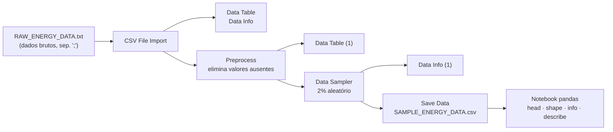

<!--META
{
  "title": "Dados de Consumo Residencial: Preparação no Orange e Análise Exploratória Preliminar",
  "header": "Orange + pandas",
  "tema": "Preparação do conjunto Individual Household Electric Power Consumption (UCI) no Orange Data Mining (importar, eliminar valores ausentes, amostrar 2% e salvar CSV) e primeira inspeção da amostra com pandas: head(), shape, info() e describe(); leitura das variáveis elétricas e problemas de qualidade na coluna Time.",
  "typing": ["Orange: importar → limpar → amostrar → salvar", "40.986 registros × 9 atributos", "head · shape · info · describe", "Potência ativa média ≈ 1,1 kW"],
  "tecnologias": "Orange Data Mining 3, Python 3, pandas (Google Colab)",
  "tipo": "Aula prática (workflow do Orange, notebook e dataset)",
  "badges": [["Ferramenta", "Orange", "FF781F"], ["Biblioteca", "pandas", "FF4500", "pandas"], ["Dataset", "UCI household power", "E60000"]],
  "icons": "py",
  "icons_alt": "Python",
  "limitacoes": "O notebook (7 células) foi lido com as saídas salvas, e o workflow do Orange (.ows) foi lido como XML; o Orange não está instalado neste ambiente e o workflow não foi aberto. O arquivo bruto RAW_ENERGY_DATA.txt, usado pelo workflow, não está no repositório (passa de 100 MB e está no .gitignore), por isso a etapa do Orange não foi reproduzida. Os cálculos complementares desta página foram executados sobre SAMPLE_ENERGY_DATA.csv. As unidades das variáveis e o tamanho do conjunto original vêm da descrição do dataset na UCI, não do material da aula. O workflow registra um caminho local de um computador do laboratório, que não é reproduzido.",
  "files": {
    "ANÁLISE_DADOS_ENERGIA.ipynb": "Notebook “Análise exploratória preliminar”: importa o pandas, lê SAMPLE_ENERGY_DATA.csv e mostra head(), shape (40.986 × 9), info() e describe(), com as saídas salvas.",
    "SAMPLE_ENERGY_DATA.csv": "Amostra de 40.986 registros e 9 colunas (Date, Time, Global_active_power, Global_reactive_power, Voltage, Global_intensity e Sub_metering_1 a 3) gerada pelo workflow do Orange; a coluna Time traz a data 2026-08-03 antes do horário em todos os registros.",
    "Workflow_Orange.ows": "Workflow do Orange Data Mining com 8 widgets: CSV File Import, Data Table e Data Info para os dados brutos; Preprocess para eliminar valores ausentes; Data Sampler com 2% dos registros; Data Table, Data Info e Save Data para a amostra, com anotações de cada etapa."
  }
}
META-->

<br />

<h2 id="visao-geral">Visão geral</h2>

O 2º semestre de SERS começa pela **análise de dados de energia**. A turma trabalha com um conjunto público de medições elétricas de uma residência, o ***Individual Household Electric Power Consumption***, da UCI. O arquivo original é grande demais para ser manipulado com conforto em sala, então o fluxo tem duas etapas:

1. no **Orange Data Mining**, uma ferramenta visual, os dados brutos são importados, limpos e reduzidos a uma **amostra aleatória de 2%**, salva em CSV;
2. no **Python com pandas**, a amostra é carregada e inspecionada.



*Figura 1 — O workflow `Workflow_Orange.ows` e a passagem para o notebook. As anotações do workflow dizem: "carregar dados brutos", "eliminar células com valores ausentes", "gerar uma amostra aleatória de 2% dos dados originais" e "salvar um arquivo .CSV da amostra".*

<br />

<h2 id="objetivos">Objetivos de aprendizagem</h2>

- Montar no Orange um fluxo de importação, limpeza, amostragem e exportação de dados.
- Explicar por que trabalhar com uma amostra aleatória antes de usar o conjunto completo.
- Carregar um CSV no pandas e inspecioná-lo com `head()`, `shape`, `info()` e `describe()`.
- Interpretar as variáveis elétricas do conjunto e suas estatísticas.
- Identificar problemas de qualidade, como a data inserida na coluna `Time`.

<br />

<h2 id="pre-requisitos">Pré-requisitos</h2>

- Potência ativa e reativa, tensão, corrente e fator de potência, da [aula 04](../aula04-19-03-26/README.md).
- Python básico e noções de tabelas (linhas e colunas).

<br />

<h2 id="fundamentacao-teorica">Fundamentação teórica</h2>

### 1. O conjunto de dados

Segundo a descrição da UCI, o conjunto reúne medições **a cada minuto** do consumo elétrico de **uma única residência**, de dezembro de 2006 a novembro de 2010, com cerca de 2 milhões de registros e uma pequena parcela de valores ausentes. As colunas são:

| Coluna | Significado | Unidade (UCI) |
| :--- | :--- | :--- |
| `Date`, `Time` | data e hora da medição | — |
| `Global_active_power` | potência ativa média no minuto | kW |
| `Global_reactive_power` | potência reativa média no minuto | kVAr |
| `Voltage` | tensão média | V |
| `Global_intensity` | corrente média | A |
| `Sub_metering_1` | energia da cozinha | Wh |
| `Sub_metering_2` | energia da lavanderia | Wh |
| `Sub_metering_3` | energia do aquecedor de água e do ar-condicionado | Wh |

### 2. Por que o Orange e por que uma amostra

O **Orange Data Mining** monta análises ligando *widgets* com o mouse, sem programar. Isso torna visível cada etapa da preparação. A **amostra aleatória** de 2% mantém o comportamento geral dos dados com uma fração do tamanho, o que agiliza a exploração. A amostra tem 40.986 registros, compatível com 2% dos registros completos do conjunto original.

### 3. Os quatro comandos de inspeção

| Comando | O que mostra | Resultado registrado no notebook |
| :--- | :--- | :--- |
| `dados.head()` | as 5 primeiras linhas | registros de datas variadas, em ordem aleatória |
| `dados.shape` | (linhas, colunas) | `(40986, 9)` |
| `dados.info()` | tipos e contagem de não nulos | 4 colunas `float64`, 3 `int64`, 2 `object`; **nenhum valor ausente** |
| `dados.describe()` | estatísticas das colunas numéricas | contagem, média, desvio padrão, mínimo, quartis e máximo |

### 4. Lendo o `describe()` da amostra

| Variável | Média | Mediana | Máximo |
| :--- | ---: | ---: | ---: |
| `Global_active_power` (kW) | 1,098 | 0,613 | 10,290 |
| `Global_reactive_power` (kVAr) | 0,125 | 0,102 | 1,000 |
| `Voltage` (V) | 240,84 | 241,02 | 253,32 |
| `Global_intensity` (A) | 4,65 | 2,60 | 44,60 |

- A potência ativa tem **média bem maior que a mediana** (1,098 × 0,613 kW): a distribuição é assimétrica à direita. Na maior parte do tempo o consumo é baixo, com picos ocasionais de até 10,29 kW.
- A tensão varia pouco (desvio padrão de 3,2 V em torno de 241 V), como se espera de uma rede de distribuição.
- Nas submedições, a mediana de `Sub_metering_1` e `Sub_metering_2` é 0: cozinha e lavanderia ficam desligadas na maior parte dos minutos.

<br />

<h2 id="exemplos-praticos">Exemplos práticos</h2>

### Exemplo básico — os comandos de inspeção em 5 linhas

As 5 linhas abaixo são as primeiras da amostra, as mesmas do `head()` registrado no notebook:

```python
{{include:sers/inspecao.py}}
```

Saída esperada:

```text
{{include:sers/inspecao.out}}
```

### Exemplo aplicado — conferências sobre a amostra completa

O código abaixo foi executado na pasta desta aula, onde está o CSV. O fator de potência é estimado em cada registro pelo triângulo das potências da [aula 04](../aula04-19-03-26/README.md):

<!-- norun -->
```python
{{include:sers/energia_amostra.py}}
```

Saída obtida:

```text
{{include:sers/energia_amostra.out}}
```

- Todos os registros têm a **mesma data** na coluna `Time`, 2026-08-03, que é a data desta aula. O horário original está correto, mas a data foi acrescentada na preparação dos dados, provavelmente quando o Orange interpretou o horário como data e hora. Para análises por horário, use só a parte da hora.
- A amostra cobre de dezembro de 2006 a novembro de 2010 e não tem valores ausentes, como esperado depois do Preprocess.
- O fator de potência da residência é alto (mediana 0,993): o consumo é predominantemente de cargas resistivas.

<br />

<h2 id="exercicios-resolvidos">Exercícios e resoluções comentadas</h2>

O material não traz exercícios. **Exercícios propostos para estudo:**

1. Pela saída de `info()`, é preciso tratar valores ausentes no pandas? Por quê?
2. A média de `Global_active_power` é 1,098 kW. Quanto essa residência consumiria, em média, num mês de 30 dias?
3. Por que a amostra deve ser **aleatória**, e não, por exemplo, os primeiros 2% do arquivo?

<details>
<summary><strong>Solução proposta para estudo</strong></summary>

1. Não: as 9 colunas têm 40.986 valores não nulos, porque o Preprocess do Orange já removeu os registros incompletos.
2. $E = P \times \Delta t \approx 1{,}098 \text{ kW} \times 24 \text{ h} \times 30 \approx 790$ kWh, supondo que a média da amostra represente o período todo.
3. Porque o arquivo está em ordem cronológica: os primeiros 2% cobririam só algumas semanas de dezembro de 2006 e não representariam as estações do ano nem os quatro anos de medição.

</details>

<br />

<h2 id="aplicacoes">Aplicações no mercado de trabalho</h2>

- **Medição inteligente:** concessionárias e empresas de eficiência analisam séries de medidores para entender perfis de consumo.
- **Preparação de dados:** importar, limpar, amostrar e exportar é o início de qualquer projeto de dados; ferramentas visuais como o Orange agilizam protótipos.
- **Gestão de energia residencial:** submedições por circuito (cozinha, lavanderia, climatização) mostram onde está o consumo.

<br />

<h2 id="boas-praticas">Boas práticas e erros comuns</h2>

| Problemático | Recomendado | Motivo |
| :--- | :--- | :--- |
| Analisar o arquivo bruto direto, sem inspeção | Começar por `head`, `shape`, `info` e `describe` | Revela tipos, ausentes e escalas antes de qualquer conta |
| Amostrar pegando as primeiras linhas | Amostra aleatória, com semente fixa para reprodutibilidade | Dados em ordem temporal geram amostras enviesadas |
| Confiar na coluna `Time` exportada | Conferir o conteúdo e extrair só a hora | A exportação inseriu a data da aula em todos os registros |
| Olhar só a média de variáveis assimétricas | Comparar média e mediana | Picos raros puxam a média para cima |
| Caminho absoluto no código (`/content/...`) | Caminho relativo ao notebook ou variável de configuração | O mesmo código roda no Colab e no computador |

<br />

<h2 id="resumo">Resumo para revisão</h2>

- Orange: CSV File Import → Preprocess (sem ausentes) → Data Sampler (2%) → Save Data.
- Amostra: 40.986 registros × 9 colunas, sem valores ausentes.
- `head()`, `shape`, `info()` e `describe()` são a primeira inspeção de qualquer DataFrame.
- Potência ativa: média 1,098 kW, mediana 0,613 kW, máximo 10,29 kW (assimétrica à direita).
- A coluna `Time` exportada tem a data 2026-08-03 em todos os registros.

<br />

<h2 id="questoes">Questões de fixação</h2>

1. Qual *widget* do Orange gerou a amostra de 2%?
2. O que `dados.shape` retorna e o que significa cada número?
3. Por que `Date` e `Time` aparecem como `object` no `info()`?
4. O que a diferença entre média e mediana da potência ativa indica?

<details>
<summary><strong>Respostas comentadas</strong></summary>

1. O **Data Sampler**, configurado com 2% e sem reposição.
2. `(40986, 9)`: 40.986 linhas (registros) e 9 colunas (atributos).
3. Porque o pandas as lê como texto; para usá-las como datas seria preciso convertê-las, por exemplo com `pd.to_datetime`.
4. Assimetria à direita: a maior parte dos minutos tem consumo baixo, e alguns picos elevam a média.

</details>

<br />

<h2 id="referencias">Referências e materiais complementares</h2>

- [UCI Machine Learning Repository — Individual Household Electric Power Consumption](https://archive.ics.uci.edu/dataset/235/individual+household+electric+power+consumption)
- [Orange Data Mining](https://orangedatamining.com/)
- [pandas — `DataFrame.describe`](https://pandas.pydata.org/docs/reference/api/pandas.DataFrame.describe.html)
- Materiais da pasta: [notebook](AN%C3%81LISE_DADOS_ENERGIA.ipynb) · [amostra CSV](SAMPLE_ENERGY_DATA.csv) · [workflow do Orange](Workflow_Orange.ows)
