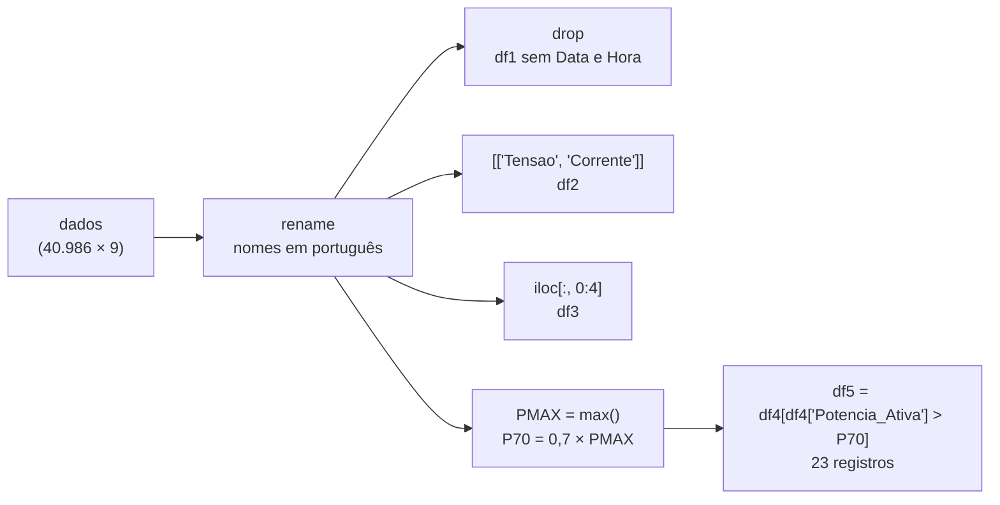

<!--META
{
  "title": "Manipulação de Dados de Energia com pandas: Renomear, Selecionar e Filtrar",
  "header": "pandas: Filtros e Demanda",
  "tema": "Continuação da análise da amostra de consumo residencial: Series × DataFrame, renomear colunas com dicionário, remover colunas com drop, selecionar colunas por nome e por posição (iloc), calcular a demanda máxima (PMAX = 10,29 kW) e o limiar de 70% (7,20 kW) e filtrar os 23 registros acima dele.",
  "typing": ["dados.rename({...}, axis=1)", "drop · [['col']] · iloc[:, 0:4]", "PMAX = 10,29 kW · P70 = 7,20 kW", "23 registros acima de 70%"],
  "tecnologias": "Python 3, pandas (Google Colab)",
  "tipo": "Aula prática (notebook)",
  "badges": [["Biblioteca", "pandas", "FF781F", "pandas"], ["Operação", "Filtro booleano", "FF4500"], ["Indicador", "Demanda máxima", "E60000"]],
  "icons": "py",
  "icons_alt": "Python",
  "limitacoes": "O notebook (30 células) foi lido com as saídas salvas; a célula que exibe a Series tensao não tem saída registrada e uma célula está vazia. O CSV que o notebook lê é o da aula 06 (SAMPLE_ENERGY_DATA.csv), que não está nesta pasta. O exemplo executável desta página usa seis linhas no formato da amostra: as cinco primeiras são reais, e a sexta reúne os valores elétricos do registro 3132 com data, hora e submedições fictícias.",
  "files": {
    "AULA_02_ANÁLISE_DADOS_ENERGIA.ipynb": "Notebook com a análise exploratória preliminar da amostra e a continuação da aula: type(), rename() com dicionário, drop(), seleção de uma e de várias colunas, iloc, demanda máxima (10,29 kW), limiar de 70% (7,20 kW) e o filtro que encontra 23 registros acima dele."
  }
}
META-->

<br />

<h2 id="visao-geral">Visão geral</h2>

O *notebook* desta aula, intitulado "Aula 02", começa repetindo a inspeção da [aula 06](../aula06-03-08-26/README.md) (`head`, `shape`, `info` e `describe`) sobre a mesma amostra de 40.986 registros e avança para a **manipulação** do DataFrame. A pergunta de negócio que fecha a aula é:

> Quantos registros de consumo estão com **demanda acima de 70% da demanda máxima**?



*Figura 1 — As operações do notebook, na ordem em que aparecem.*

<br />

<h2 id="objetivos">Objetivos de aprendizagem</h2>

- Diferenciar `Series` (uma coluna) de `DataFrame` (tabela).
- Renomear colunas com um dicionário em `rename()`.
- Criar DataFrames derivados removendo (`drop`) ou selecionando colunas por nome e por posição (`iloc`).
- Calcular a demanda máxima e um limiar relativo a ela.
- Filtrar registros com uma condição booleana e contá-los com `shape[0]`.

<br />

<h2 id="pre-requisitos">Pré-requisitos</h2>

- Inspeção da amostra com pandas, da [aula 06](../aula06-03-08-26/README.md).
- Demanda e potência ativa, da [aula 04](../aula04-19-03-26/README.md).
- Python: dicionários e listas.

<br />

<h2 id="fundamentacao-teorica">Fundamentação teórica</h2>

### 1. Series × DataFrame

`type(dados)` retorna `DataFrame`; `type(dados['Tensao'])` retorna `Series`. Um **DataFrame** é uma tabela com várias colunas; uma **Series** é uma única coluna, com índice. Selecionar com **um** nome (`dados['Tensao']`) dá uma Series; com uma **lista** de nomes (`dados[['Tensao', 'Corrente']]`), dá um DataFrame.

### 2. Renomear colunas

O *notebook* cria um dicionário em que as **chaves** são os nomes atuais e os **valores**, os desejados:

| Original | Novo nome |
| :--- | :--- |
| `Date`, `Time` | `Data`, `Hora` |
| `Global_active_power` | `Potencia_Ativa` |
| `Global_reactive_power` | `Potencia_Reativa` |
| `Voltage` | `Tensao` |
| `Global_intensity` | `Corrente` |
| `Sub_metering_1` a `3` | `Consumo_1` a `Consumo_3` |

A chamada é `dados.rename({...}, axis=1, inplace=True)`: `axis=1` indica que o dicionário se aplica às **colunas**, e `inplace=True` altera o próprio `dados`.

### 3. Criar DataFrames derivados

| DataFrame | Comando | Resultado |
| :--- | :--- | :--- |
| `df1` | `dados.drop(columns=['Data', 'Hora'])` | só as 7 colunas numéricas |
| `df2` | `dados[['Tensao', 'Corrente']]` | tensão e corrente |
| `df3` | `dados.iloc[:, 0:4]` | as colunas de posição 0 a 3 (o fim do intervalo não entra) |
| `df4` | `dados[['Tensao', 'Corrente', 'Potencia_Ativa', 'Potencia_Reativa']]` | grandezas elétricas |

`iloc` seleciona por **posição** (`[linhas, colunas]`); `:` significa "todas as linhas".

### 4. Demanda máxima e limiar de 70%

Como a potência ativa de cada registro é a média de um minuto, o maior valor da coluna é a maior **demanda** observada na amostra:

$$P_{\text{MAX}} = 10{,}29 \text{ kW} \qquad P_{70} = 0{,}7 \times P_{\text{MAX}} = 7{,}20 \text{ kW}$$

O filtro `df4[df4['Potencia_Ativa'] > P70]` cria uma **máscara booleana** (verdadeiro ou falso para cada linha) e mantém só as linhas verdadeiras. O resultado registrado foi `df5.shape[0] = 23`.

> [!NOTE]
> O *notebook* imprime "Foram encontrados 23 **consumidores** com demanda energética acima de 70% de PMAX". O conjunto, porém, é de **uma única residência**: cada linha é **uma medição de um minuto**, e não um consumidor. A leitura correta é "23 minutos (registros) com demanda acima de 70% do máximo", o equivalente a 0,056% da amostra.

<br />

<h2 id="exemplos-praticos">Exemplos práticos</h2>

### Exemplo aplicado — todas as operações do notebook, em pequena escala

Seis linhas no formato da amostra, as cinco primeiras iguais às do `head()` registrado:

```python
{{include:sers/energia_pandas.py}}
```

Saída esperada:

```text
{{include:sers/energia_pandas.out}}
```

Com só seis linhas, o máximo e o limiar são outros (8,54 kW e 5,98 kW), mas a sequência é a mesma do *notebook*. Na amostra completa, o primeiro dos 23 registros acima do limiar (índice 3132) tem exatamente os valores da sexta linha: 236,23 V, 36,0 A, 8,540 kW e 0,238 kVAr.

### Saída registrada no notebook

<!-- norun -->
```text
A demanda máxima de potência é 10.29 kW
O limiar de 70% da demanda máxima é 7.20 kW
Foram encontrados 23 consumidores com demanda energética acima de 70% de PMAX
```

<br />

<h2 id="exercicios-resolvidos">Exercícios e resoluções comentadas</h2>

O *notebook* propõe a pergunta "quantos consumidores estão com demanda acima de 70%?" e a responde nas células finais; essa resposta é a **solução do material original** (23 registros), com a ressalva de interpretação da teoria. **Exercícios propostos para estudo:**

1. Calcule o percentual que os 23 registros representam na amostra.
2. Escreva o filtro para registros com potência acima de 70% do máximo **e** tensão abaixo de 235 V.
3. Por que `df4 = dados[[...]]` seguido de alterações em `df4` pode gerar um aviso do pandas? Como evitá-lo?

<details>
<summary><strong>Solução proposta para estudo</strong></summary>

1. $23 / 40\,986 \times 100 \approx 0{,}056\%$.
2. `dados[(dados['Potencia_Ativa'] > P70) & (dados['Tensao'] < 235)]`. Cada condição fica entre parênteses e o "e" é `&`, e não `and`.
3. Porque `df4` pode ser uma "visão" de `dados`, e o pandas avisa que a alteração talvez não se propague como esperado. Usar `df4 = dados[[...]].copy()` deixa claro que se trata de uma cópia independente.

</details>

<br />

<h2 id="aplicacoes">Aplicações no mercado de trabalho</h2>

- **Gestão de demanda:** identificar os períodos em que o consumo se aproxima do pico orienta o deslocamento de cargas e a escolha da demanda contratada.
- **Alertas automáticos:** filtros como `Potencia_Ativa > P70` são a base de alarmes em sistemas de monitoramento de energia.
- **Padronização de dados:** renomear colunas para nomes claros e consistentes facilita o trabalho em equipe e a integração com outras bases.

<br />

<h2 id="boas-praticas">Boas práticas e erros comuns</h2>

| Problemático | Recomendado | Motivo |
| :--- | :--- | :--- |
| Chamar cada linha de "consumidor" | Descrever o que a linha representa (uma medição de 1 minuto) | Evita conclusões erradas sobre o conjunto |
| `rename({...})` sem `axis=1` ou `columns=` | `rename(columns={...})` | Sem isso, o dicionário é aplicado ao índice das linhas |
| `and`/`or` em filtros do pandas | `&`/`\|` com parênteses em cada condição | `and` não funciona elemento a elemento |
| Esquecer que o fim do intervalo do `iloc` não entra | Lembrar que `0:4` pega as posições 0, 1, 2 e 3 | Evita pegar uma coluna a menos |
| Modificar um recorte sem `.copy()` | Usar `.copy()` ao criar DataFrames derivados | Evita avisos e efeitos colaterais |

<br />

<h2 id="resumo">Resumo para revisão</h2>

- Uma coluna é `Series`; várias colunas são `DataFrame`.
- `rename(dicionário, axis=1)` renomeia colunas; `drop(columns=[...])` remove; `iloc[:, 0:4]` seleciona por posição.
- Demanda máxima da amostra: 10,29 kW; limiar de 70%: 7,20 kW.
- Filtro booleano: `df[df['col'] > valor]`; `shape[0]` conta as linhas.
- Os 23 registros acima do limiar são minutos de uma mesma residência, não consumidores.

<br />

<h2 id="questoes">Questões de fixação</h2>

1. Qual é o tipo de `dados['Tensao']`? E de `dados[['Tensao']]`?
2. Quais colunas `dados.iloc[:, 0:4]` seleciona depois da renomeação?
3. Qual é o limiar de 75% da demanda máxima da amostra?
4. Por que a frase "23 consumidores" não descreve corretamente o resultado?

<details>
<summary><strong>Respostas comentadas</strong></summary>

1. `Series` e `DataFrame` (com uma coluna), respectivamente.
2. `Data`, `Hora`, `Potencia_Ativa` e `Potencia_Reativa`.
3. $0{,}75 \times 10{,}29 \approx 7{,}72$ kW.
4. Porque o conjunto mede uma única residência; cada linha é um minuto de medição.

</details>

<br />

<h2 id="referencias">Referências e materiais complementares</h2>

- [pandas — `DataFrame.rename`](https://pandas.pydata.org/docs/reference/api/pandas.DataFrame.rename.html)
- [pandas — indexação e seleção (`loc`, `iloc`, máscaras booleanas)](https://pandas.pydata.org/docs/user_guide/indexing.html)
- Dataset e inspeção inicial: [aula 06](../aula06-03-08-26/README.md)
- Material da pasta: [notebook](AULA_02_AN%C3%81LISE_DADOS_ENERGIA.ipynb)
