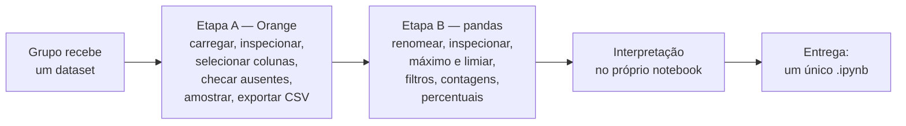

<!--META
{
  "title": "Atividade Prática com Datasets de Energia: Orange e pandas",
  "header": "Datasets de Energia",
  "tema": "Atividade em grupo com seis datasets públicos do setor de energia (Appliances, Steel Industry, Tetouan City, Solar Power Generation, Wind & Solar e Household Power): preparação no Orange (Select Columns, verificação de ausentes, Data Sampler, exportação) e análise no pandas com limiares relativos ao máximo, filtros com duas condições, contagens e percentuais; notebook-exemplo da turma com o Dataset 1 e guia rápido de pandas.",
  "typing": ["Orange: preparar · pandas: analisar", "limiar = 0,70 × máximo", "(cond1) & (cond2)", "Formule a pergunta antes do comando"],
  "tecnologias": "Orange Data Mining 3, Python 3, pandas (Google Colab)",
  "tipo": "Atividade prática em grupo (enunciado e notebook-exemplo)",
  "badges": [["Ferramenta", "Orange", "FF781F"], ["Biblioteca", "pandas", "FF4500", "pandas"], ["Datasets", "UCI e Kaggle", "E60000"]],
  "icons": "py",
  "icons_alt": "Python",
  "limitacoes": "O enunciado (.docx) foi convertido para texto e lido integralmente; o notebook (14 células) foi lido com as saídas salvas, e o diagrama do workflow embutido nele foi renderizado. Nenhum dos seis datasets está no repositório, nem a amostra energydata_SAMPLE.csv usada pelo notebook; por isso as análises não foram reproduzidas, e o exemplo desta página usa dados fictícios no formato do Dataset 1. No enunciado, o título do Dataset 1 aparece como “Dataset 1 — z (UCI)” e a Etapa A desse dataset está ausente (o texto mostra uma sequência de algarismos “3” no lugar), aparentemente por edição acidental; o nome correto consta do sumário e do notebook. O notebook resolve só os itens 1 e 2 da Etapa B; os demais têm solução proposta para estudo.",
  "files": {
    "EXERCICIOS_ANALISE_DE_DADOS_SERS_V1.docx": "Enunciado “Atividade prática com datasets de energia — Orange Data Mining, Python e Pandas”: objetivo, entrega em um único .ipynb, tabela dos seis datasets, organização geral, situação e etapas A (Orange) e B (pandas) de cada dataset, apêndice com 29 receitas de pandas e tabela de consulta rápida.",
    "EXEMPLO_1CCPX.ipynb": "Notebook-exemplo da turma 1CCPX para o Dataset 1 (Appliances Energy Prediction): situação, imagem do workflow do Orange (File, Data Table, Select Columns, Data Sampler, Save Data), leitura de energydata_SAMPLE.csv (1.974 × 8), head(), shape, info(), describe(), columns e a renomeação de Appliances e de T1 a T3."
  }
}
META-->

<br />

<h2 id="visao-geral">Visão geral</h2>

Depois de praticar com o conjunto de consumo residencial nas aulas [06](../aula06-03-08-26/README.md) e [07](../aula07-10-08-26/README.md), cada grupo recebe agora um **dataset diferente do setor de energia** e uma situação de negócio própria. O objetivo do enunciado é aplicar os procedimentos da aula para preparar, inspecionar e analisar os dados, **relacionando cada operação ao contexto** do dataset. Não é preciso usar *machine learning*: o foco é preparação, manipulação e interpretação inicial.



*Figura 1 — As duas etapas que se repetem nos seis datasets.*

<br />

<h2 id="objetivos">Objetivos de aprendizagem</h2>

- Preparar um dataset no Orange: selecionar atributos, verificar ausentes, amostrar e exportar.
- Calcular valores de referência (máximo, média, limiares percentuais) com pandas.
- Criar DataFrames com filtros de uma e de duas condições e comparar os resultados.
- Contar registros e calcular o percentual que um recorte representa.
- Interpretar resultados no contexto energético, sem tirar conclusões além do que o recorte permite.

<br />

<h2 id="pre-requisitos">Pré-requisitos</h2>

- Workflow do Orange e inspeção com pandas, da [aula 06](../aula06-03-08-26/README.md).
- `rename`, seleção de colunas, limiar de 70% e filtros, da [aula 07](../aula07-10-08-26/README.md).
- Potência ativa e reativa e fator de potência, da [aula 04](../aula04-19-03-26/README.md).

<br />

<h2 id="fundamentacao-teorica">Fundamentação teórica</h2>

### 1. Os seis datasets e suas situações

| Nº | Dataset (fonte) | Situação | Amostra no Orange | Critério principal da Etapa B |
| :---: | :--- | :--- | :---: | :--- |
| 1 | Appliances Energy Prediction (UCI) | residência de baixo consumo: períodos de consumo elevado e condições de temperatura e umidade | não informado* | consumo > 70% do máximo; depois, também T1 acima da média |
| 2 | Steel Industry Energy Consumption (UCI) | siderúrgica: consumo elevado, carga e fator de potência | 20% | consumo > 75% do máximo; quantos são *Maximum Load*; depois, também FP abaixo de um limite escolhido |
| 3 | Power Consumption of Tetouan City (UCI) | três zonas de distribuição: qual tem o maior pico e em que condições ambientais | 15% | zona de maior pico > 70% do máximo; depois, também temperatura acima da média |
| 4 | Solar Power Generation Data (Kaggle) | usina fotovoltaica: períodos de alta geração e inversores mais frequentes | 20% | potência CA > 70% do máximo; `value_counts()` em `SOURCE_KEY` |
| 5 | Wind & Solar Energy Production (Kaggle) | portfólio renovável: frequência de alta produção solar e eólica | 20% | cada fonte > 70% do **seu próprio** máximo |
| 6 | Individual Household Electric Power Consumption (UCI) | residência monitorada: demanda elevada com corrente acima da média | 10% | potência ativa > 75% do máximo; depois, também corrente acima da média |

\* A Etapa A do Dataset 1 está ausente no enunciado. O notebook-exemplo indica o caminho usado pela turma: File, Select Columns, Data Sampler e Save Data. A amostra resultante tem 1.974 registros.

No Dataset 6, o enunciado pede que se carregue de novo o arquivo **original**, e não a amostra das aulas anteriores, e que se aplique o tratamento de ausentes visto em aula.

### 2. Limiar relativo ao máximo

Um **limiar relativo** (70% ou 75% do máximo) se adapta à escala de cada variável. Por isso o Dataset 5 compara cada fonte com o seu próprio máximo: a geração solar e a eólica têm escalas diferentes, e um mesmo número em kW não significaria "produção alta" para as duas.

### 3. Duas condições e o efeito no recorte

Com duas condições ligadas por `&` (E), o segundo recorte é sempre **um subconjunto** do primeiro: só pode ter o mesmo número de registros ou menos. Comparar os dois mostra quanto do consumo elevado coincide com a segunda condição, como temperatura alta, corrente alta ou fator de potência baixo. Com `|` (OU), o recorte cresce.

### 4. O notebook-exemplo (Dataset 1)

O *notebook* `EXEMPLO_1CCPX.ipynb` resolve os primeiros passos para o Dataset 1:

- a imagem do workflow mostra **File → Select Columns → Data Sampler → Save Data**, com dois **Data Table** para conferir os dados antes e depois da seleção;
- a amostra `energydata_SAMPLE.csv` tem **1.974 registros e 8 colunas**: `Appliances`, `lights`, `T1`, `RH_1`, `T2`, `RH_2`, `T3` e `RH_3`, sem valores ausentes;
- `describe()` mostra consumo de eletrodomésticos com média de 93,0 Wh, mediana de 60 Wh e máximo de 770 Wh: poucos registros de consumo muito alto puxam a média para cima;
- o item 2 é resolvido renomeando `Appliances` para `Consumo_Eletrodomesticos` e `T1`, `T2` e `T3` para `Temperatura_1` a `Temperatura_3`. A última célula está vazia.

### 5. O apêndice de pandas

O enunciado traz 29 receitas curtas, de `import pandas as pd` a `to_csv()`, e uma tabela de consulta rápida. As novidades em relação às aulas anteriores são: `loc` por rótulos, `between()` para intervalos, `|` para "OU", `sort_values()`, `isnull().sum()` e `dropna()`, `unique()`, `value_counts()` e a criação de colunas calculadas. A regra prática final resume o espírito da atividade: **antes de escrever um comando, formule a pergunta que deseja responder**.

<br />

<h2 id="exemplos-praticos">Exemplos práticos</h2>

### Saída registrada no notebook — inspeção da amostra do Dataset 1

<!-- norun -->
```text
Total de registros: 1974
Total de colunas: 8
Index(['Consumo_Eletrodomesticos', 'lights', 'Temperatura_1', 'RH_1',
       'Temperatura_2', 'RH_2', 'Temperatura_3', 'RH_3'],
      dtype='object')
```

### Exemplo aplicado — itens 3 a 7 do Dataset 1

**Solução proposta para estudo**, com 8 linhas **fictícias** no formato da amostra, porque o arquivo não está no repositório. O mesmo código, com `pd.read_csv` no lugar do DataFrame manual, resolve os itens na amostra real.

```python
{{include:sers/appliances.py}}
```

Saída esperada:

```text
{{include:sers/appliances.out}}
```

O primeiro recorte tem 3 registros de consumo alto. Ao exigir também temperatura acima da média, sobram 2: o registro de 560 Wh sai, porque ocorreu com T1 de 21,10 °C, abaixo da média. A comparação mostra quantos picos de consumo coincidem com a cozinha (T1) mais quente, mas não prova que a temperatura **causa** o consumo.

<br />

<h2 id="exercicios-resolvidos">Exercícios e resoluções comentadas</h2>

### Dataset 1, itens 1 e 2 — solução do material original

O *notebook*-exemplo carrega a amostra, mostra `head()`, `shape`, `info()` e `describe()` e renomeia `Appliances` e as três temperaturas. A saída registrada está nos exemplos práticos.

### Exercícios propostos para estudo

1. Dataset 5: por que não usar "acima de 3000 kW" como critério de alta produção para as duas fontes?
2. Dataset 2: escreva o filtro para consumo acima de 75% do máximo **e** carga do tipo *Maximum Load*.
3. Dataset 4: o inversor que mais aparece nos registros de alta geração é o "melhor" inversor?

<details>
<summary><strong>Solução proposta para estudo</strong></summary>

1. Porque as fontes têm escalas próprias: um valor alto para uma pode ser baixo ou impossível para a outra. Comparar cada uma com o seu máximo (70% do máximo solar, 70% do máximo eólico) torna os critérios equivalentes.
2. `df[(df['Consumo_kWh'] > 0.75 * df['Consumo_kWh'].max()) & (df['Load_Type'] == 'Maximum_Load')]`, depois de renomear `Usage_kWh`. A grafia exata da categoria deve ser conferida com `df['Load_Type'].unique()`, como pede o item 3 da Etapa A.
3. Não necessariamente. O próprio enunciado pede para descrever o que o resultado permite observar "sem concluir desempenho ou falha apenas com esse recorte": a frequência depende também de quantos registros cada inversor tem na amostra, do período e da posição na usina.

</details>

<br />

<h2 id="aplicacoes">Aplicações no mercado de trabalho</h2>

- **Indústria:** cruzar consumo elevado com fator de potência baixo, como no Dataset 2, indica onde corrigir reativo e evitar multas.
- **Distribuição:** comparar picos entre zonas, como no Dataset 3, orienta o planejamento da rede.
- **Operação de usinas solares:** acompanhar inversores em alta geração ajuda a detectar desvios entre equipamentos.
- **Portfólios renováveis:** a complementaridade entre solar e eólica afeta contratos e o planejamento de armazenamento.

<br />

<h2 id="boas-praticas">Boas práticas e erros comuns</h2>

| Problemático | Recomendado | Motivo |
| :--- | :--- | :--- |
| Aplicar o mesmo limiar numérico a variáveis de escalas diferentes | Usar limiares relativos ao máximo de cada variável | Mantém o significado de "alto" em cada escala |
| Concluir causa a partir de um filtro | Descrever a coincidência observada | Um recorte mostra associação, não causalidade |
| Entregar só os códigos | Escrever as respostas interpretativas no notebook, em Markdown | O enunciado exige códigos, resultados e interpretação |
| Usar a amostra antiga no Dataset 6 | Recarregar o arquivo original, como pede o enunciado | A atividade inclui o tratamento de ausentes |
| Esquecer de conferir categorias antes de filtrar | `unique()` e `value_counts()` antes do filtro | Uma grafia errada devolve zero registros sem erro |

<br />

<h2 id="resumo">Resumo para revisão</h2>

- Seis datasets de energia, um por grupo; Etapa A no Orange e Etapa B no pandas; entrega em um único `.ipynb`.
- Limiar relativo: 70% ou 75% do máximo da própria variável.
- Duas condições com `&` geram um subconjunto; a comparação revela coincidências, não causas.
- Notebook-exemplo do Dataset 1: amostra de 1.974 × 8, inspeção e renomeação.
- Regra prática: formular a pergunta antes de escrever o comando.

<br />

<h2 id="questoes">Questões de fixação</h2>

1. Quais são as duas ferramentas usadas na atividade e qual é o papel de cada uma?
2. Por que o segundo DataFrame do item 6 (Dataset 1) nunca tem mais registros que o primeiro?
3. Qual comando conta quantos registros de cada inversor aparecem num DataFrame?
4. Qual é o tamanho da amostra usada no notebook-exemplo?

<details>
<summary><strong>Respostas comentadas</strong></summary>

1. O **Orange**, para carregar, inspecionar, selecionar atributos, verificar ausentes, amostrar e exportar; o **pandas**, para organizar os atributos, calcular referências, filtrar, contar e interpretar.
2. Porque ele exige a condição do primeiro (consumo acima do limiar) **e** mais uma; é um subconjunto.
3. `df['SOURCE_KEY'].value_counts()`.
4. 1.974 registros e 8 colunas.

</details>

<br />

<h2 id="referencias">Referências e materiais complementares</h2>

- [UCI Machine Learning Repository — Appliances Energy Prediction](https://archive.ics.uci.edu/dataset/374/appliances+energy+prediction)
- [UCI Machine Learning Repository — Individual Household Electric Power Consumption](https://archive.ics.uci.edu/dataset/235/individual+household+electric+power+consumption)
- [pandas — indexação e seleção](https://pandas.pydata.org/docs/user_guide/indexing.html) · [`Series.value_counts`](https://pandas.pydata.org/docs/reference/api/pandas.Series.value_counts.html)
- Materiais da pasta: [enunciado](EXERCICIOS_ANALISE_DE_DADOS_SERS_V1.docx) · [notebook-exemplo](EXEMPLO_1CCPX.ipynb)
