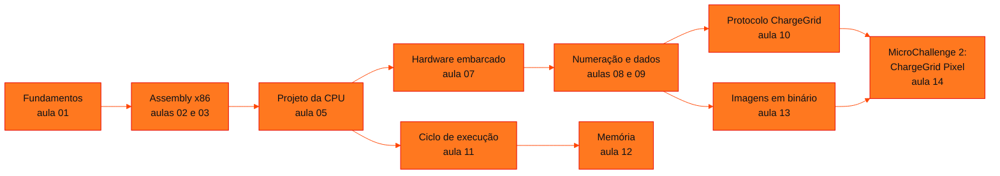

<!-- Índice da disciplina. Padrão visual: Knowledge Atelier (github.com/RenanMano). -->

  

  

<a href="#sobre">Sobre</a> &nbsp;·&nbsp; <a href="#aulas">Aulas</a> &nbsp;·&nbsp; <a href="#mapa">Mapa de conteúdos</a> &nbsp;·&nbsp; <a href="../README.md">Repositório</a>

  
  
  
  

  

 

<h2 id="sobre">Sobre a disciplina</h2>

**Ementa (conforme material da aula 01).** A disciplina introduz os princípios fundamentais da organização e arquitetura de computadores: sistemas numéricos, representação de dados, processadores, memória e sistemas de entrada e saída. Ela cobre o projeto e o funcionamento de arquiteturas clássicas e modernas, para que se compreenda como o hardware executa as instruções dos programas e qual é o papel do sistema operacional na interface entre hardware e software.

**Organização do ano.** O primeiro semestre trabalha com Assembly x86 (NASM) e com os componentes da CPU. O segundo semestre adota a metodologia baseada em projetos, com a Raspberry Pi Pico no simulador Wokwi, e tem três µChallenges alinhados ao *GoodWe Solar Intelligence Challenge*.

**Avaliação (conforme material).** $MS = 0{,}4 \cdot PCC\&F + 0{,}6 \cdot GS$ e $MA = 0{,}4 \cdot MS_1 + 0{,}6 \cdot MS_2$.

**Bibliografia básica indicada:** STALLINGS, *Organização e Arquitetura de Computadores* (11. ed., Pearson, 2019); PATTERSON e HENNESSY, *Organização e Projeto de Computadores* (5. ed., Pearson, 2014); TANENBAUM, *Arquitetura de Computadores* (Pearson, 2016).

> [!NOTE]
> A numeração das pastas segue a ordem cronológica das datas. Não há pastas `aula04` e `aula06`: o repositório não contém materiais dessas datas. Os títulos internos dos PDFs, como "Aula 03" ou "Aula 04", seguem a numeração do professor, que nem sempre coincide com a das pastas.

 

<h2 id="aulas">Aulas</h2>

  <table>
    <thead>
      <tr>
        <th align="center">Aula</th>
        <th align="center">Data</th>
        <th align="left">Título e tema</th>
      </tr>
    </thead>
    <tbody>
      <tr>
        <td align="center"><a href="aula01-13-03-26/README.md"><strong>01</strong></a></td>
        <td align="center">13/03/2026</td>
        <td align="left"><a href="aula01-13-03-26/README.md"><strong>Apresentação, Histórico e Evolução da Computação</strong></a> Apresentação da disciplina, hardware e software, história da computação e uma mini linguagem Assembly educacional.</td>
      </tr>
      <tr>
        <td align="center"><a href="aula02-20-03-26/README.md"><strong>02</strong></a></td>
        <td align="center">20/03/2026</td>
        <td align="left"><a href="aula02-20-03-26/README.md"><strong>Funcionamento de um Computador e Linguagem Assembly</strong></a> Níveis de linguagem (alto nível, montagem e máquina), montador e compilador, estrutura de um programa NASM e chamadas de sistema para exibir resultados.</td>
      </tr>
      <tr>
        <td align="center"><a href="aula03-27-03-26/README.md"><strong>03</strong></a></td>
        <td align="center">27/03/2026</td>
        <td align="left"><a href="aula03-27-03-26/README.md"><strong>Arquitetura x86-64, CPU e as instruções MUL e DIV</strong></a> O que uma arquitetura de processador define, registradores x86-64, componentes da CPU (unidade de controle, ULA e registradores) e o uso implícito de AX nas instruções MUL e DIV.</td>
      </tr>
      <tr>
        <td align="center"><a href="aula05-17-04-26/README.md"><strong>05</strong></a></td>
        <td align="center">17/04/2026</td>
        <td align="left"><a href="aula05-17-04-26/README.md"><strong>Aspectos Básicos do Projeto de uma CPU Simples</strong></a> Componentes de uma CPU (barramentos, unidade de controle, banco de registradores, ULA, PC e IR) e operações lógicas AND e OR em Assembly e Python.</td>
      </tr>
      <tr>
        <td align="center"><a href="aula07-07-08-26/README.md"><strong>07</strong></a></td>
        <td align="center">07/08/2026</td>
        <td align="left"><a href="aula07-07-08-26/README.md"><strong>Introdução ao 2º Semestre: Raspberry Pi, Pico e Blink LED em C</strong></a> Computadores de placa única (Raspberry Pi), microcontroladores (Raspberry Pi Pico / RP2040), arquitetura de hardware, GPIO e o primeiro programa embarcado em C: piscar um LED.</td>
      </tr>
      <tr>
        <td align="center"><a href="aula08-14-08-26/README.md"><strong>08</strong></a></td>
        <td align="center">14/08/2026</td>
        <td align="left"><a href="aula08-14-08-26/README.md"><strong>Sistemas de Numeração e Contador Binário com Raspberry Pi Pico</strong></a> Bases binária, octal, decimal e hexadecimal; conversões por notação posicional e por divisões sucessivas; representação de bits com LEDs em MicroPython.</td>
      </tr>
      <tr>
        <td align="center"><a href="aula09-21-08-26/README.md"><strong>09</strong></a></td>
        <td align="center">21/08/2026</td>
        <td align="left"><a href="aula09-21-08-26/README.md"><strong>Representação de Dados: Bits, Bytes e ASCII</strong></a> Como textos e valores são armazenados na memória: bits, bytes, tipos de dados, tabela ASCII e a conversão entre caracteres, códigos e binário em Python.</td>
      </tr>
      <tr>
        <td align="center"><a href="aula10-28-08-26/README.md"><strong>10</strong></a></td>
        <td align="center">28/08/2026</td>
        <td align="left"><a href="aula10-28-08-26/README.md"><strong>MicroChallenge 1 — ChargeGrid Protocol</strong></a> Projeto em equipe: um protocolo de comunicação de 4 bits para uma estação de recarga de veículos elétricos, implementado em MicroPython na Raspberry Pi Pico (Wokwi) com terminal serial e LEDs.</td>
      </tr>
      <tr>
        <td align="center"><a href="aula11-04-09-26/README.md"><strong>11</strong></a></td>
        <td align="center">04/09/2026</td>
        <td align="left"><a href="aula11-04-09-26/README.md"><strong>Processadores e Ciclo de Execução</strong></a> Componentes da CPU (unidade de controle, registradores, ULA e clock), o ciclo FETCH → DECODE → EXECUTE, o papel do Program Counter e um simulador didático de CPU em Python/MicroPython.</td>
      </tr>
      <tr>
        <td align="center"><a href="aula12-11-09-26/README.md"><strong>12</strong></a></td>
        <td align="center">11/09/2026</td>
        <td align="left"><a href="aula12-11-09-26/README.md"><strong>Organização da Memória em Sistemas Embarcados</strong></a> RAM × Flash, stack e heap, variáveis e objetos em memória, alocação e liberação, garbage collector e medição de memória com gc.mem_free() e gc.mem_alloc() no MicroPython.</td>
      </tr>
      <tr>
        <td align="center"><a href="aula13-02-10-26/README.md"><strong>13</strong></a></td>
        <td align="center">02/10/2026</td>
        <td align="left"><a href="aula13-02-10-26/README.md"><strong>Representação de Imagens: Binário, Hexadecimal e Saída Digital</strong></a> Pixels como números, imagens 8×8 em preto e branco como sequências de bits, conversão de PNG em binário e hexadecimal com Pillow e exibição em uma matriz de LEDs MAX7219 via SPI na Raspberry Pi Pico.</td>
      </tr>
      <tr>
        <td align="center"><a href="aula14-09-10-26/README.md"><strong>14</strong></a></td>
        <td align="center">09/10/2026</td>
        <td align="left"><a href="aula14-09-10-26/README.md"><strong>MicroChallenge 2 — ChargeGrid Pixel</strong></a> Projeto em equipe de 4 pessoas: representar o estado de uma estação de recarga ChargeGrid por um ícone monocromático 8×8, convertendo imagem → pixels → bits → bytes → hexadecimal em Python e reconstruindo o ícone numa matriz de LEDs 8×8 controlada pela Raspberry Pi Pico no Wokwi, a partir de um código de estado (01 a 05).</td>
      </tr>
    </tbody>
  </table>

 

<h2 id="mapa">Mapa de conteúdos</h2>

 

<a href="../README.md">← Voltar ao repositório</a>

